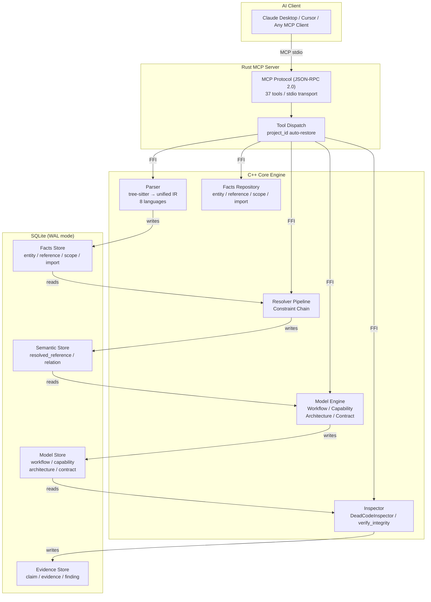
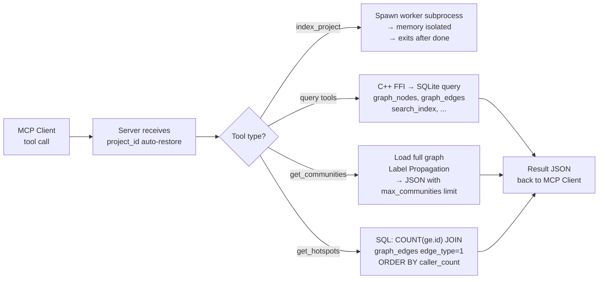
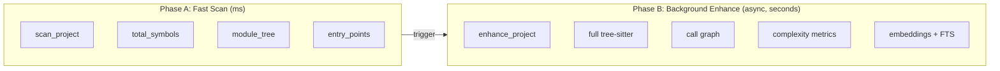

# CodeScope — Project Truth Engine

**CodeScope does not understand code. It verifies code.**

It transforms source code into verifiable facts, understandable models, and inspectable evidence — enabling AI to validate claims against reality instead of hallucinating.

**Version**: v0.2.1 | **License**: Apache 2.0

---

## 1. What Is CodeScope?

CodeScope is a **Project Truth Engine** that answers one question:

> **"Does the code actually do what you claim?"**

Not "what does this code mean", but "does the code actually do what you claim?"

It indexes source code into a structured code graph (call graph + reference graph + module knowledge), then exposes **37 MCP tools** that let AI agents locate symbols, trace call paths, verify claims, detect documentation drift, and analyze architecture — all with **~98.9% token savings** vs reading raw source files.

### Supported Languages (8)

| Language | Parser | IR Translator | Verified |
|----------|--------|---------------|----------|
| Python | ✅ | ✅ | ✅ |
| Go | ✅ | ✅ | ✅ |
| C | ✅ | ✅ | ✅ |
| C++ | ✅ | ✅ | ✅ |
| Rust | ✅ | ✅ | ✅ |
| JavaScript | ✅ | ✅ | ✅ |
| TypeScript | ✅ | ✅ | ✅ |
| Java | ✅ | ✅ | ✅ |

### Tech Stack

| Layer | Technology |
|-------|-----------|
| Parser | tree-sitter (unified AST IR, 8 languages) |
| Indexer | C++23 (Clang 17+), SQLite (WAL mode, FTS5) |
| Server | Rust 2024 Edition, MCP Protocol (JSON-RPC 2.0, stdio transport) |
| Graph Storage | SQLite (primary) + optional LadybugDB (Cypher queries) |
| Scheduler | Built-in multi-process parallel indexer (chunk-level work-stealing) |
| Build | CMake 3.30+ (C++), Cargo (Rust) |

---

## 2. Architecture



### Pipeline

```
Source Code
    |
    v
Parser ------------ entity / reference / scope / import
    |
    v
Resolver ---------- resolved_reference / relation
    |
    v
Model Engine ------ workflow / capability / architecture / contract
    |
    v
Inspector --------- evidence / finding
```

### Query Flow



### Two-Phase Indexing



---

## 3. Quick Start

### Prerequisites

| Platform | Dependencies |
|----------|-------------|
| **macOS** | Xcode CLT, cmake, Rust (1.85+) |
| **Linux** | build-essential, cmake, Rust (1.85+) |

### Install Pre-built Binary

```bash
curl -fsSL https://raw.githubusercontent.com/Timwood0x10/CodeScope/main/install.sh | bash
export PATH="$PATH:$HOME/.codescope/bin"
```

### Build from Source

```bash
git clone https://github.com/Timwood0x10/CodeScope.git
cd CodeScope

# macOS:
brew install llvm@21 cmake pkg-config
cargo build --release

# Linux (Ubuntu):
sudo apt-get install -y build-essential cmake llvm-dev libclang-dev
cargo build --release
```

### Index and Query

```bash
# Index a project
codescope cli index_project '{"project_path":"/path/to/your/project"}'

# Quick overview
codescope cli project_overview '{}'

# Start MCP server (for AI clients)
codescope
```

### Large Projects

For projects with thousands of files, use the built-in parallel scheduler:

```bash
codescope index-parallel /path/to/large/project
```

---

## 4. MCP Tools (37 Tools)

### Indexing

| Tool | Description | Parameters |
|------|-------------|------------|
| `index_project` | Index a project directory: parse all source files, build IR, and construct the code graph. | `{"project_path": "string (required)", "language_filter": "string (optional)"}` |
| `index_file` | Index a single source file. | `{"file_path": "string (required)"}` |
| `force_index_files` | Force-index files/dirs bypassing default skip rules (test/, docs/, node_modules/, .gitignore, etc.). | `{"paths": ["string (required)"], "language_filter": "string (optional)"}` |

### Project Overview

| Tool | Description | Parameters |
|------|-------------|------------|
| `project_overview` | **Primary** — comprehensive project overview: languages, modules, symbols, entry points, analysis progress. | `{}` |
| `get_graph_stats` | Quick statistics: nodes, edges, files. | `{}` |
| `get_module_tree` | Hierarchical module/directory tree. | `{}` |
| `get_entry_points` | Find entry points (main/init/setup/run/handler). | `{}` |
| `get_routes` | Get registered HTTP routes (Gin/Echo/Chi/net/http). | `{}` |
| `get_type_info` | Query type definitions (struct/enum/trait) with reference counts. | `{"type_name": "string (optional)"}` |

### Symbol Lookup

| Tool | Description | Parameters |
|------|-------------|------------|
| `find_symbol` | **Recommended** — find symbol by exact name (kind, file, line/col). | `{"symbol_name": "string (required)"}` |
| `find_references` | Find all locations referencing a symbol. | `{"symbol_name": "string (required)", "file_filter": "string (optional)"}` |
| `explain_symbol` | Get comprehensive symbol info: definition, callers, callees, dependencies. | `{"symbol_name": "string (required)"}` |
| `find_definition` | [DEPRECATED — use find_symbol] | `{"symbol_name": "string (required)"}` |

### Call Graph

| Tool | Description | Parameters |
|------|-------------|------------|
| `find_callers` | Find who calls a function. | `{"symbol_name": "string (required)", "file_filter": "string (optional)"}` |
| `find_callees` | Find what a function calls. | `{"symbol_name": "string (required)", "file_filter": "string (optional)"}` |
| `codescope_trace` | Interactive recursive call exploration (depth + direction) or shortest path. | `{"function_name": "string", "depth": "integer (default 1, max 5)", "direction": "callers|callees|both", "from": "string", "to": "string"}` |
| `trace_flow` | Recursive execution flow tracing (caller→callee chain). | `{"function_name": "string (required)", "depth": "integer (default 3, max 10)"}` |
| `shortest_path` | Shortest call path between two functions (BFS). | `{"from": "string", "to": "string", "from_id": "integer", "to_id": "integer"}` |
| `connected_components` | Connected components in the call graph. | `{}` |

### Graph Query

| Tool | Description | Parameters |
|------|-------------|------------|
| `graph_query` | Cypher-like DSL query: `MATCH (Function:main)-[Calls]->(Method)`. | `{"dsl": "string (required)"}` |
| `get_graph` | Retrieve the complete code graph in paginated pages. | `{"node_offset": "integer", "node_limit": "integer (max 50000)", "edge_offset": "integer", "edge_limit": "integer (max 200000)", "node_types": "string", "edge_types": "string"}` |
| `get_subgraph` | Fetch a local region centered on a node (1-hop). | `{"node_id": "integer (required)", "radius": "integer", "node_types": "string", "edge_types": "string"}` |
| `get_neighbors` | Fetch direct neighbors (callers + callees) of a graph node. | `{"node_id": "integer (required)", "edge_type": "integer (default -1)", "radius": "integer"}` |

### Search

| Tool | Description | Parameters |
|------|-------------|------------|
| `search` | **Recommended** — unified search (auto-selects FTS5 or semantic). | `{"query": "string (required)", "limit": "integer (default 20, max 100)"}` |
| `search_code` | [DEPRECATED — use search] | `{"query": "string (required)", "limit": "integer"}` |

### Verification

| Tool | Description | Parameters |
|------|-------------|------------|
| `verify_integrity` | Check README-promised features actually exist in code. | `{}` |
| `verify_claim` | Verify a single claim (capability_exists / contract_holds / architecture_follows). | `{"claim": "string (required)"}` |
| `verify_summary` | Parse natural-language summary and verify each claim. | `{"text": "string (required)"}` |
| `verify_review` | Verify code review comment claims. | `{"text": "string (required)"}` |
| `verify_reality` | Verify a single AI statement against code evidence. | `{"text": "string (required)"}` |

### Drift Detection

| Tool | Description | Parameters |
|------|-------------|------------|
| `detect_drift` | Scan all declared capabilities & contracts for doc-vs-code drift. | `{}` |
| `detect_documentation_drift` | Check README language claims vs actual code entities. | `{}` |
| `detect_capability_drift` | Check declared capabilities have implementing entities. | `{}` |
| `detect_architecture_drift` | Check call edges for layer violations (Repository→Controller). | `{}` |

### Change Impact & Module

| Tool | Description | Parameters |
|------|-------------|------------|
| `detect_changes` | Analyze impact of modified files: direct/indirect callers. | `{"modified_files": "string (required)"}` |
| `explain_module` | Build module knowledge card: entities, capabilities, integrity score. | `{"module_name": "string (required)"}` |

### Utilities

| Tool | Description | Parameters |
|------|-------------|------------|
| `detect_ffi_boundaries` | Detect FFI boundaries (extern/C, JNI, WASM, C ABI). | `{}` |
| `count_tokens` | Estimate token count (DeepSeek formula). | `{"text": "string (required)"}` |

### Quick Decision Guide

```
New project       → project_overview
Module structure  → get_module_tree
Entry points      → get_entry_points
Search code       → search
Call chain        → find_callers / find_callees
Deep dive symbol  → explain_symbol
HTTP routes       → get_routes
Type info         → get_type_info
Verify claim      → verify_claim
Detect drift      → detect_documentation_drift
Change impact     → detect_changes
```

---

## 5. Knowledge Graph

CodeScope builds a **module-level knowledge graph** as a side product of the verification pipeline. It learns structured metadata about how the project is organized, what's important, what's redundant, and what it promises:

| Layer | Table | What it tells you |
|-------|-------|-------------------|
| **Call graph** | `relation`, `architecture_edge` | Cross-module call dependencies; drives `detect_architecture_drift` |
| **Module health** | `module_summary` | Per-module `incoming_count` / `outgoing_count` / `dead_entities` / `utilization` / `role` |
| **Module dependency** | `architecture_edge`, `module_edge` | "Change module A → these modules depend on it" |
| **Documented capability** | `capability` + `document` | README-extracted capabilities; drives `detect_capability_drift` / `verify_claim` |

All knowledge-layer tables are directly queryable via `get_knowledge_graph`:

```jsonc
get_knowledge_graph {"table":"architecture_edge","limit":5}
// → {"table":"architecture_edge","rows":[...],"total":3351}

get_knowledge_graph {"table":"capability","limit":10}
// → {"table":"capability","rows":[...],"total":3}
```

Supported tables: `entity`, `relation`, `architecture_edge`, `module_edge`, `capability`, `document`, `module_summary`.

---

## 6. Benchmark

All benchmarks measured on **Apple M3 Max (36 GB RAM)**. Other hardware will produce different results — expect slower performance on less capable machines.

### Index Time

| Project | Files | Nodes | Index Time | Peak RSS |
|---------|------:|------:|-----------:|---------:|
| **CodeScope** (self, C++/Rust) | 168 | 1,001 | **1.3 s** | ~150 MB |
| **memscope-rs** (Rust) | 215 | 4,344 | **~2 s** | ~200 MB |
| **ARES_POLIS** | 105 | 1,531 | **~2 s** | ~180 MB |
| **goagent** (Go) | 2,651 | 155K | **30 s** | — |
| **rustc** (Rust compiler, monorepo) | 6,029 | 81,033 | **81 s** | 5.9 GB |
| **Linux kernel** (full) | 64,694 | 12M | **3 min 07 s** | — |

### Micro Benchmarks

| Metric | Value |
|--------|-------|
| Engine init | **14.6 ms** |
| Index throughput | **1,533 KB/s** |
| Symbol definition query | **0.01–0.03 ms** |
| Callers/callees query | **0.01–0.02 ms** |
| 9 queries (total) | **0.17 ms** |
| Query latency (stdio MCP, includes process start) | **~60 ms** |

### Cross-File Resolution

| Project | Cross-File CALLS | % of total CALLS |
|---------|:---------------:|:----------------:|
| CodeScope (C++) | 23 | 0.1% |
| goagent (Go) | 49,258 | 86% |
| Linux kernel (C) | 1,502,432 | 40% |

### Fast Scan (Lightweight, ms-level)

| Project | Time | Languages | Symbols |
|--------|:----:|:---------:|:-------:|
| **CodeScope** (self) | **32 ms** | cpp, rust, c | 2,902 |
| **goagent** (Go) | **493 ms** | go, c, cpp, python | 5,172 |
| **Linux kernel** (core) | **360 ms** | c | 40,335 |

### Token Savings

Using code graphs instead of raw source files saves **~98.9% tokens** on average:

| Scenario | Raw Source | CodeScope | Savings |
|----------|:----------:|:---------:|:-------:|
| Find function definition | ~2,265 tokens | ~21 tokens | **99.1%** |
| Trace function callers | ~2,000 tokens | ~18 tokens | **99.1%** |
| Project architecture overview | ~1,875 tokens | ~32 tokens | **98.3%** |
| USB subsystem overview | ~24,000 tokens | ~250 tokens | **99.0%** |
| Scheduler analysis | ~15,000 tokens | ~180 tokens | **98.8%** |

---

## 7. Skills (Shell Wrappers)

The `skills/` directory provides shell scripts that wrap common CodeScope queries so you don't need to remember the JSON schema:

```bash
cd CodeScope

# Index a project
./skills/index.sh ~/path/to/project

# One-shot full analysis report
./skills/analyze.sh ~/path/to/project

# Graph statistics
./skills/stats.sh

# Module tree
./skills/modules.sh

# Trace call path A → B
./skills/trace.sh func_a func_b

# Top 20 hotspots
./skills/hotspots.sh 20

# Browse architecture dependencies
./skills/knowledge.sh architecture_edge 20
```

Each script calls `codescope cli <tool_name> '<json_args>'` internally. See `skills/skills.md` for the full reference.

---

## 8. Environment Variables

| Variable | Default | Description |
|----------|---------|-------------|
| `CODESCOPE_DB_PATH` | `.codescope/codescope.db` | SQLite database path |
| `CODESCOPE_INDEX_MODE` | `standard` | Index mode: `fast` / `standard` / `strict` |
| `CODESCOPE_EXCLUDE_PATHS` | (unset) | Comma-separated glob patterns to exclude |
| `CODESCOPE_WORKERS` | `4` | Total parse-worker cores for `index-parallel` |
| `CODESCOPE_WORKER_TIMEOUT` | `300` | Worker subprocess timeout in seconds |
| `CODESCOPE_MAX_FILE_SIZE` | (unset) | Max source file size to index in bytes |
| `CODESCOPE_MMAP_SIZE` | 256 MB | SQLite `mmap_size` pragma value |
| `CODESCOPE_MEM_LIMIT_MB` | `4096` | Dynamic-scheduler memory ceiling |
| `CODESCOPE_DYNAMIC_SCHED` | `auto` | Dynamic CPU scheduling: `1` on, `0` off, unset = auto |
| `CODESCOPE_VERBOSE` | `0` | Set to `1` for verbose logging |
| `CODESCOPE_LSP` | (unset) | LSP server command for type enhancement |

---

## 9. License

Apache 2.0 — see [LICENSE](LICENSE).

**CodeScope v0.2.1** — Built with Rust 2024 + C++23 + tree-sitter + SQLite.