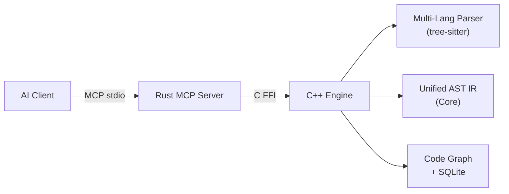
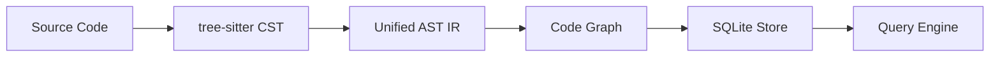
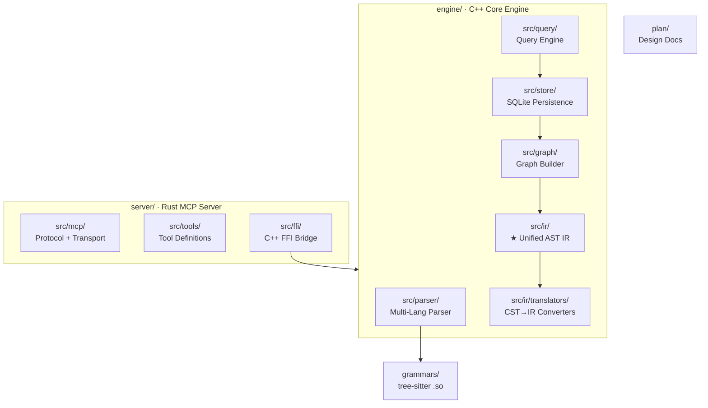

# CodeScope

**CodeScope** is a code understanding service based on the MCP (Model Context Protocol). It parses source code to generate an AST, constructs multi-dimensional code graphs, and exposes query interfaces — enabling AI to understand code structure, behavior, and relationships through graph traversal.

## Architecture



**Data flow:**


## Project Structure



## Features

- **Multi-language parser**: C, C++, Rust, Python, JavaScript, TypeScript, Go, Java via tree-sitter
- **Unified AST IR**: Language-neutral intermediate representation with exact source-location mapping
- **Code graph**: Symbol reference graph + call graph with SQLite-backed persistence
- **Semantic edges**: `SymbolRef`, `CallTarget`, `Receiver`, `TypeRef`, `BaseClass`
- **Graph queries**: `find_definition`, `find_references`, `get_callers/get_callees`, `get_neighbors`, `find_shortest_path`, `get_subgraph`, `locate_code`
- **MCP protocol**: Full JSON-RPC 2.0 over stdio, compatible with any MCP client

## Quick Start

### Prerequisites

- Rust 2024 Edition + 1.85+ (`cargo`)
- CMake 3.30+, C++23 compiler (Clang 17+)
- SQLite3 (dev packages)
- tree-sitter core library
- Node.js (for building grammar .so files)

### Build & Run

```bash
# Build tree-sitter grammars
cd grammars && bash build.sh && cd ..

# Build and run the MCP server
cargo run --bin ast-graph-mcp
```

The server listens on stdio for MCP JSON-RPC messages.

### Environment Variables

| Variable | Default | Description |
|----------|---------|-------------|
| `ASTGRAPH_DB_PATH` | `/tmp/astgraph.db` | SQLite database path |
| `GRAMMARS_DIR` | `grammars/` | Directory with grammar .so files |

### MCP Tools

| Tool | Description |
|------|-------------|
| `find_definition` | Find symbol definition location |
| `find_references` | Find all references to a symbol |
| `get_callers` | Get functions that call a given function |
| `get_callees` | Get functions called by a given function |
| `get_neighbors` | Get neighbor nodes in the graph |
| `find_shortest_path` | Find shortest path between two nodes |
| `get_subgraph` | Get subgraph centered on a node |
| `locate_code` | Locate code entity in source file |
| `index_project` | Index a project directory |
| `index_file` | Index a single source file |
| `get_graph_stats` | Get code graph statistics |

## Supported Languages & Status

| Language | Parser | IR Translator | Verified |
|----------|--------|---------------|----------|
| Python | ✅ | ✅ | ✅ |
| Go | ✅ | ✅ | ✅ |
| C | ✅ | ✅ | ⬜ |
| C++ | ✅ | ✅ | ⬜ |
| Rust | ✅ | ✅ | ⬜ |
| JavaScript | ✅ | ✅ | ⬜ |
| TypeScript | ✅ | ✅ | ⬜ |
| Java | ✅ | ✅ | ⬜ |

## License

MIT
