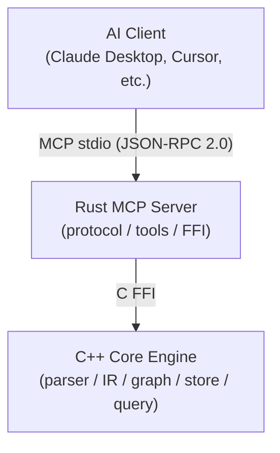

# CodeScope

**CodeScope** is an MCP (Model Context Protocol) code understanding service. It parses source code into a unified AST IR, builds multi-dimensional code graphs (call graph + symbol reference graph), persists them to SQLite, and exposes powerful queries via 14 MCP tools — enabling AI to understand code structure, behavior, and relationships through graph traversal instead of reading raw source files.

## Architecture



**Data flow:**


## Features

### 14 MCP Tools

| Category      | Tool                 | Description                                                |
| ------------- | -------------------- | ---------------------------------------------------------- |
| **Core** (11) | `find_definition`    | Locate symbol definition                                   |
| <br />        | `find_references`    | Find all references to a symbol                            |
| <br />        | `get_callers`        | Get functions that call a given function                   |
| <br />        | `get_callees`        | Get functions called by a given function                   |
| <br />        | `get_neighbors`      | Get neighbor nodes in the graph                            |
| <br />        | `find_shortest_path` | Find shortest path between two nodes                       |
| <br />        | `get_subgraph`       | Extract subgraph centered on a node                        |
| <br />        | `locate_code`        | Locate code entity in source file                          |
| <br />        | `index_project`      | Index an entire project directory                          |
| <br />        | `index_file`         | Index a single source file                                 |
| <br />        | `get_graph_stats`    | Get code graph statistics                                  |
| **Search**    | `search_code`        | FTS5 full-text search (prefix matching)                    |
| **Analysis**  | `get_complexity`     | Cyclomatic complexity + nesting depth                      |
| <br />        | `graph_query`        | Cypher-like DSL: `MATCH (Func)-[Calls]->(Func)`            |
| <br />        | `detect_changes`     | Change impact analysis (callers/callees of modified files) |
| <br />        | `get_communities`    | Label-propagation community detection                      |

### Supported Languages (8)

| Language   | Parser | IR Translator | Verified |
| ---------- | ------ | ------------- | -------- |
| Python     | ✅      | ✅             | ✅        |
| Go         | ✅      | ✅             | ✅        |
| C          | ✅      | ✅             | ✅        |
| C++        | ✅      | ✅             | ✅        |
| Rust       | ✅      | ✅             | ✅        |
| JavaScript | ✅      | ✅             | ✅        |
| TypeScript | ✅      | ✅             | ✅        |
| Java       | ✅      | ✅             | ✅        |

### Graph Capabilities

- **6 edge types**: `References`, `Calls`, `Defines`, `Contains`, `Imports`, `Inherits`
- **8 node types**: `Function`, `Method`, `Class`, `Struct`, `Interface`, `Variable`, `Module`, `File`
- **SQLite persistence**: Zero external dependencies, portable single-file database
- **FTS5 full-text search**: Prefix matching on symbol names and file paths
- **Community detection**: Label propagation algorithm for architecture overview
- **Change impact analysis**: Trace callers/callees through the graph

## Quick Start

### Prerequisites

- Rust 2024 Edition + 1.85+ (`cargo`)
- CMake 3.30+, C++23 compiler (Clang 17+)
- SQLite3 (dev packages)
- tree-sitter core library
- Node.js (for building grammar .so files)

### Build & Run

```bash
# 1. Install tree-sitter grammars (one-time)
npm install -g tree-sitter-python tree-sitter-c tree-sitter-cpp \
  tree-sitter-rust tree-sitter-javascript tree-sitter-typescript \
  tree-sitter-go tree-sitter-java

# 2. Build grammar .so files
cd grammars && bash build.sh && cd ..

# 3. Build everything
make build

# 4. Run all tests
make test

# 5. Start MCP server
cargo run --bin codescope
```

### As a Claude Desktop MCP server

Add to your `claude_desktop_config.json`:

```json
{
  "mcpServers": {
    "codescope": {
      "command": "/path/to/CodeScope/target/release/codescope",
      "args": [],
      "env": {
        "CODESCOPE_DB_PATH": "/tmp/astgraph.db",
        "GRAMMARS_DIR": "/path/to/CodeScope/grammars"
      }
    }
  }
}
```

### Environment Variables

| Variable           | Default            | Description                                    |
| ------------------ | ------------------ | ---------------------------------------------- |
| `CODESCOPE_DB_PATH` | `/tmp/astgraph.db` | SQLite database path                           |
| `GRAMMARS_DIR`     | `grammars/`        | Grammar .so files directory                    |
| `CODESCOPE_LSP`    | (unset)            | LSP server for type enhancement (e.g. `pylsp`) |

## Token Savings

Using code graphs instead of raw source files saves **~98.8% tokens** on average across 5 common query scenarios:

| Scenario                 | Graph (tokens) | Raw (tokens) | Savings   |
| ------------------------ | -------------- | ------------ | --------- |
| Find function definition | ~21            | ~2,265       | **99.1%** |
| Trace callers            | ~18            | ~2,000       | **99.1%** |
| Architecture overview    | ~32            | ~1,875       | **98.3%** |
| Function analysis        | ~43            | ~4,733       | **99.1%** |
| Symbol search            | ~23            | ~958         | **97.6%** |

## Performance Benchmarks — Fast Scan

CodeScope's **Fast Scan** extracts lightweight declarations (no full tree-sitter parse) in milliseconds, providing AI with an immediate project skeleton.

### Multi-Language Scan Results

| Project                       | Time       | Languages              | Modules | Symbols | Notes                         |
| ----------------------------- | ---------- | ---------------------- | ------- | ------- | ----------------------------- |
| **CodeScope** (self)          | **32 ms**  | cpp, rust, c           | 219     | 2,902   | Has `.gitignore`              |
| **MusicAITools** (Python)     | **8 ms**   | python                 | —       | 227     | 36 source files               |
| **goagent** (Go)              | **493 ms** | go, c, cpp, python     | 548     | 5,172   | No `.gitignore`               |
| **tinygo** (Go compiler)      | **209 ms** | go                     | —       | 8,411   | 1,774 files, 1,234 source     |
| **SQLite** (C library)        | **89 ms**  | c                      | 1       | 6,921   | 141 source files              |
| **Linux kernel/sched**        | **45 ms**  | c                      | 2       | 4,913   | Scheduler, 36 files           |
| **Linux kernel/** (core)      | **360 ms** | c                      | 46      | 40,335  | Kernel core                   |
| **Linux fs/** (filesystem)    | **1.8 s**  | c                      | 99      | 212,145 | Filesystem subsystem          |

**Average throughput: ~100,000 symbols/second**

The bottleneck is I/O — each source file is open → read → close'd. The strict C detector (requiring C type keywords in return types) eliminated ~39% false positives vs the previous permissive heuristic, while also being 31% faster.

### C Declaration Detection Accuracy

| Language       | Precision | Recall | Notes                            |
| -------------- | --------- | ------ | -------------------------------- |
| **Go**         | ~97%      | ~96%   | `func` pattern is highly specific |
| **Python**     | ~98%      | ~95%   | `def`/`class` nearly zero FP     |
| **C/C++ (strict)** | ~85%  | ~90%   | Requires type keyword in return  |
| **C/C++ (old)**    | ~65%  | ~95%   | Permissive, high FP              |
| **Rust**       | ~90%      | ~90%   | `fn` is precise                  |

### Design Philosophy

1. **Skeleton Index (Fast Scan)**: ms-level, lightweight → AI works immediately
2. **Knowledge Enhancement**: Background full parse → call graph, metrics, embeddings
3. **Stable MCP Tools**: Backend adapts via `xxx_ready` flags; tools never change
4. **`.gitignore`-aware**: Reads project `.gitignore` to skip ignored files — zero config
5. **Separate `symbol_status`**: Keeps `symbols` lean, tracks `callgraph_ready`/`metrics_ready`/`embedding_ready`

## Real-World Analysis: Linux Kernel Scheduler

Using Fast Scan on Linux v6.13 — **45 ms** to analyze the scheduler (36 files, 4,913 symbols).

### Scheduler Code Layout

```
kernel/sched/
├── core.c          — __schedule(), schedule()
├── fair.c          — CFS Completely Fair Scheduler
├── rt.c            — Real-time scheduler
├── deadline.c      — Deadline scheduler
├── fork.c          — (process creation → kernel/fork.c)
├── idle.c          — Idle task
├── sched.h         — Data structures
└── ext/            — Extensible scheduler API
```

### Parent-Child Resource Handling → `kernel/fork.c`

| Line   | Function              | Purpose                                                |
| ------ | --------------------- | ------------------------------------------------------ |
| **914**  | `dup_task_struct()`   | Copy parent's task_struct (full process descriptor)    |
| **1994** | `copy_process()`      | **Main entry** — creates new process via all copy_xxx  |
| **2115** | `p = dup_task_struct(current, node)` | Copy kernel stack, thread_info, task_struct |
| **2259** | `sched_fork(clone_flags, p)` | Init child scheduling state, set non-runnable    |

`copy_process()` execution chain:

```
dup_task_struct()     → copy kernel stack + task_struct
copy_sighand()        → copy signal handlers
copy_mm()             → copy address space (Copy-On-Write)
copy_files()          → copy file descriptor table
sched_fork()          → set up child scheduling entity
```

**Core mechanism: Copy-On-Write (COW)** — `copy_mm()` shares physical pages between parent and child as read-only. First write by either triggers a page fault and copies the page.

### Preemption Prevention

| Location                        | Mechanism              | Description                                        |
| ------------------------------- | ---------------------- | -------------------------------------------------- |
| `include/linux/preempt.h:92`    | `preempt_count()`      | Per-task counter; >0 disables kernel preemption    |
| `include/linux/preempt.h:71`    | `2*PREEMPT_DISABLE_OFFSET` | Idle task starts with preemption disabled       |
| `kernel/sched/core.c:7061`      | `__schedule()`         | Main scheduler; only switches when preempt_count==0 |
| `kernel/sched/core.c:7316`      | `schedule()`           | Voluntary yield, calls __schedule()                 |

**Three layers:**

1. **Per-task counter**: `preempt_count` > 0 → `__schedule()` returns immediately
2. **Spinlocks**: auto `preempt_disable()` on acquire, `preempt_enable()` on release
3. **Interrupt context**: IRQ handlers increment `preempt_count`, blocking preemption

### Key Source Locations

```
kernel/fork.c:914        dup_task_struct()        — Copy process structure
kernel/fork.c:1994       copy_process()           — Process creation entry
kernel/fork.c:2259       sched_fork()             — Child scheduling init
kernel/sched/core.c:7061 __schedule()             — Main scheduler
include/linux/preempt.h:108 preempt_count()       — Preemption counter
```

## Comparison with codebase-memory-mcp

| Aspect                  | CodeScope                | codebase-memory-mcp               |
| ----------------------- | ------------------------ | --------------------------------- |
| **Backend**             | SQLite (embedded)        | Neo4j (external service)          |
| **Deployment**          | Single binary            | Neo4j + configuration             |
| **Search**              | FTS5 prefix matching     | BM25 + vector semantic search     |
| **Graph query**         | Minimal DSL              | Full Cypher                       |
| **Type info**           | Optional LSP enhancement | LSP-aware                         |
| **Complexity**          | Cyclomatic + nesting     | Cyclomatic + cognitive + hotspots |
| **Community detection** | Label propagation        | Leiden algorithm                  |
| **Cross-repo**          | ❌                        | ✅                                 |
| **ADR management**      | ❌                        | ✅                                 |
| **Dependencies**        | Zero external            | Neo4j                             |

**CodeScope's edge**: Zero-dependency deployment, unified IR layer, portability.
**codebase-memory-mcp's edge**: Richer queries, semantic search, type-aware parsing.

## License

Apache 2.0
