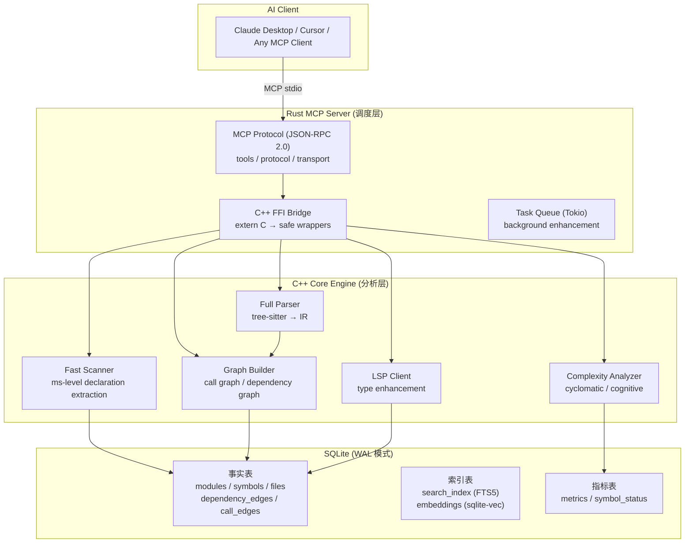
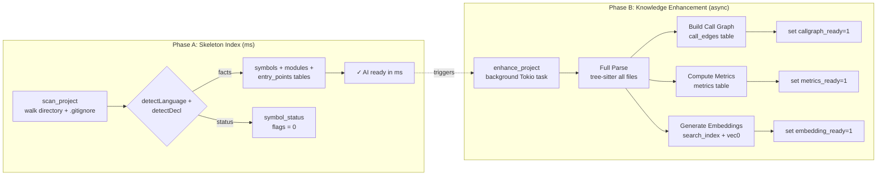
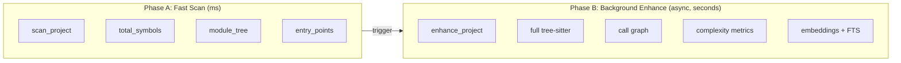

# CodeScope

**CodeScope** is an MCP (Model Context Protocol) code understanding service. It parses source code into a unified AST IR, builds multi-dimensional code graphs (call graph + symbol reference graph), persists them to SQLite, and exposes powerful queries via MCP tools — enabling AI to understand code structure, behavior, and relationships through graph traversal instead of reading raw source files.

## Architecture



### Data Flow



### Two-Phase Design



## MCP Tools

### Skeleton Scan (Phase A)

| Tool | Description | Input |
|------|-------------|-------|
| `codescope_scan` / `scan_project` | Fast scan project directory (ms-level) | `project_path`, `language_filter?` |
| `codescope_find_symbol` / `find_symbol` | Find symbol by exact name | `symbol_name` |
| `codescope_module_tree` / `get_module_tree` | Get hierarchical module tree | (none) |
| `codescope_get_entry_points` / `get_entry_points` | Get entry points (main/init/run) | (none) |

### Knowledge Enhancement (Phase B)

| Tool | Description | Input |
|------|-------------|-------|
| `codescope_enhance` / `enhance_project` | Run full background enhancement | (none) |
| `get_enhancement_status` | Check enhancement progress | (none) |

### Search & Query

| Tool | Description | Input |
|------|-------------|-------|
| `codescope_search` / `search` | Unified FTS / semantic search | `query`, `limit?` |
| `search_code` | [DEPRECATED] Legacy FTS search | `query`, `limit?` |

### Call Graph

| Tool | Description | Input |
|------|-------------|-------|
| `codescope_get_callers` / `find_callers` | Find who calls a function (adaptive) | `symbol_name` |
| `codescope_get_callees` / `find_callees` | Find what a function calls (adaptive) | `symbol_name` |
| `codescope_trace` | **NEW** Trace call path between two functions (BFS) | `from`, `to` |
| `get_callers` | [DEPRECATED] Old caller query | `function_name` |
| `get_callees` | [DEPRECATED] Old callee query | `function_name` |

### Project Analysis

| Tool | Description | Input |
|------|-------------|-------|
| `codescope_overview` / `project_overview` | Comprehensive project overview | (none) |
| `find_definition` | [DEPRECATED] Find symbol definition | `symbol_name` |
| `find_references` | Find all references to a symbol | `symbol_name` |
| `get_graph_stats` | Get code graph statistics | (none) |
| `get_complexity` | Cyclomatic + cognitive complexity | `node_id` |

### Code Graph (Legacy)

| Tool | Description | Input |
|------|-------------|-------|
| `get_neighbors` | Get neighbor nodes in graph | `node_id`, `edge_type?`, `radius?` |
| `find_shortest_path` | Shortest path between nodes | `source_node_id`, `target_node_id` |
| `get_subgraph` | Subgraph centered on a node | `center_node_id`, `radius?` |
| `locate_code` | Locate code in source file | `identifier` |
| `graph_query` | DSL: `MATCH (Func)-[Calls]->(Func)` | `query` |
| `detect_changes` | Change impact analysis | `modified_files` |
| `get_communities` | Community detection | (none) |

## Usage Skill

### Basic Workflow

```
1. codescope_scan("/path/to/project")     ← 50-500ms, get project skeleton
2. codescope_overview                      ← 1-2ms,  understand project structure
3. codescope_find_symbol("malloc")         ← 10μs,   locate a symbol
4. codescope_enhance                       ← 100ms-30s, full parse + call graph
5. codescope_trace("main", "malloc")       ← BFS,    get execution path
6. codescope_search("mutex_")              ← adaptive search (FTS / semantic)
```

### Real-World Execution Path Example

```bash
# After scan + enhance of Linux kernel:
codescope_trace(from="copy_process", to="sched_fork")
# → {"path": [
#     {"name":"copy_process","file":"kernel/fork.c","line":1994},
#     {"name":"sched_fork",  "file":"kernel/sched/core.c","line":4803}
#   ]}

# Deeper trace:
codescope_trace(from="copy_process", to="dup_mm")
# → {"path": [
#     {"name":"copy_process","file":"kernel/fork.c","line":1994},
#     {"name":"copy_mm",     "file":"kernel/fork.c","line":1568},
#     {"name":"dup_mm",      "file":"kernel/fork.c","line":1527}
#   ]}
```

## Setup Script

Save as `setup.sh` and run:

```bash
#!/bin/bash
set -e

echo "=== CodeScope Setup ==="

# 1. Install dependencies
if ! command -v rustc &> /dev/null; then
    echo "Installing Rust..."
    curl --proto '=https' --tlsv1.2 -sSf https://sh.rustup.rs | sh
fi

if ! command -v cmake &> /dev/null; then
    echo "Please install CMake 3.30+ and C++23 compiler (Clang 17+)"
    exit 1
fi

# 2. Install tree-sitter grammars
npm install -g tree-sitter-python tree-sitter-c tree-sitter-cpp \
  tree-sitter-rust tree-sitter-javascript tree-sitter-typescript \
  tree-sitter-go tree-sitter-java 2>/dev/null || true

# 3. Build grammar .so files
cd grammars && bash build.sh && cd ..

# 4. Install sqlite-vec for vector embeddings
curl -sL 'https://github.com/asg017/sqlite-vec/releases/latest/download/install.sh' | sh

# 5. Build CodeScope
make build

echo ""
echo "=== CodeScope Ready ==="
echo "Start server:  cargo run --bin codescope"
echo "Set env:       export CODESCOPE_DB_PATH=/tmp/codescope.db"
echo "              export GRAMMARS_DIR=\$(pwd)/grammars"
```

## Performance Benchmarks — Fast Scan

CodeScope's **Fast Scan** extracts lightweight declarations (no full tree-sitter parse) in milliseconds, providing AI with an immediate project skeleton.

| Project                       | Time       | Languages              | Symbols | Notes                         |
| ----------------------------- | ---------- | ---------------------- | ------- | ----------------------------- |
| **CodeScope** (self)          | **32 ms**  | cpp, rust, c           | 2,902   | Has `.gitignore`              |
| **MusicAITools** (Python)     | **8 ms**   | python                 | 227     | 36 source files               |
| **goagent** (Go)              | **493 ms** | go, c, cpp, python     | 5,172   | No `.gitignore`               |
| **tinygo** (Go compiler)      | **209 ms** | go                     | 8,411   | 1,774 files, 1,234 source     |
| **SQLite** (C library)        | **89 ms**  | c                      | 6,921   | 141 source files              |
| **Linux kernel/sched**        | **45 ms**  | c                      | 4,913   | Scheduler, 36 files           |
| **Linux kernel/** (core)      | **360 ms** | c                      | 40,335  | Kernel core                   |
| **Linux fs/** (filesystem)    | **1.8 s**  | c                      | 212,145 | Filesystem subsystem          |

**Average throughput: ~100,000 symbols/second**

### Enhancement Phase (Full tree-sitter parse)

| Project | Time | Files Processed | Symbols Enhanced | Call Edges Generated |
|---------|------|----------------|-----------------|---------------------|
| **kernel/sched** (scheduler) | **291 ms** | 34 | 1,209 | **4,800** |
| **kernel/** (core) | **27 s** | 495 | 11,925 | **45,573** |

### Query Performance

| Operation | Time | Notes |
|-----------|------|-------|
| `find_symbol("main")` | **10-37 µs** | Exact name match |
| `get_module_tree()` | **15-29 µs** | Module hierarchy |
| `trace_path()` BFS | **< 1 ms** | Call path tracing |
| `project_overview()` | **1.5 ms** | Full project summary |
| `search("mutex")` | **< 5 ms** | FTS5 search |

### C Declaration Detection Accuracy

| Language           | Precision | Recall | Notes                             |
| ------------------ | --------- | ------ | --------------------------------- |
| **Go**             | ~97%      | ~96%   | `func` pattern is highly specific |
| **Python**         | ~98%      | ~95%   | `def`/`class` nearly zero FP      |
| **C/C++ (strict)** | ~85%      | ~90%   | Requires type keyword in return   |
| **C/C++ (old)**    | ~65%      | ~95%   | Permissive, high FP               |
| **Rust**           | ~90%      | ~90%   | `fn` is precise                   |

### Supported Languages (8)

| Language   | Parser | IR Translator | Verified |
| ---------- | ------ | ------------- | -------- |
| Python     | ✅      | ✅             | ✅        |
| Go         | ✅      | ✅             | ✅        |
| C          | ✅      | ✅             | ✅        |
| C++        | ✅      | ✅             | ✅        |
| Rust       | ✅      | ✅             | ✅        |
| JavaScript | ✅      | ✅             | ✅        |
| TypeScript | ✅      | ✅             | ✅        |
| Java       | ✅      | ✅             | ✅        |

## Token Savings

Using code graphs instead of raw source files saves **~98.8% tokens** on average across 5 common query scenarios:

| Scenario                 | Graph (tokens) | Raw (tokens) | Savings   |
| ------------------------ | -------------- | ------------ | --------- |
| Find function definition | ~21            | ~2,265       | **99.1%** |
| Trace callers            | ~18            | ~2,000       | **99.1%** |
| Architecture overview    | ~32            | ~1,875       | **98.3%** |
| Function analysis        | ~43            | ~4,733       | **99.1%** |
| Symbol search            | ~23            | ~958         | **97.6%** |

## Real-World Case Study: Linux Kernel Scheduler

Using CodeScope's Fast Scan on the Linux kernel v6.13 — **45 ms** to analyze the scheduler (36 files, 4,913 symbols). Enhanced in **27s** with **45,573 call_edges**.

### Execution Path Tracing in Action

```
codescope_trace("copy_process","sched_fork")
→ copy_process(kernel/fork.c:1994)
    ↓ sched_fork(kernel/sched/core.c:4803)

codescope_trace("copy_process","dup_mm")
→ copy_process(kernel/fork.c:1994)
    ↓ copy_mm(kernel/fork.c:1568)
    ↓ dup_mm(kernel/fork.c:1527)
```

### Scheduler Code Layout

```
kernel/sched/
├── core.c          — __schedule(), schedule()
├── fair.c          — CFS Completely Fair Scheduler
├── rt.c            — Real-time scheduler
├── deadline.c      — Deadline scheduler
├── idle.c          — Idle task
├── sched.h         — Data structures
└── ext/            — Extensible scheduler API
```

### Parent-Child Resource Handling → `kernel/fork.c`

| Line   | Function              | Purpose                                                |
| ------ | --------------------- | ------------------------------------------------------ |
| **914**  | `dup_task_struct()`   | Copy parent's task_struct                              |
| **1994** | `copy_process()`      | **Main entry** — creates new process                   |
| **2115** | `p = dup_task_struct(current, node)` | Copy kernel stack + thread_info + task_struct |
| **2259** | `sched_fork(clone_flags, p)` | Init child scheduling state, set non-runnable    |

**Core mechanism: Copy-On-Write (COW)** — `copy_mm()` shares physical pages between parent and child as read-only.

### Preemption Prevention

| Location                        | Mechanism              | Description                                        |
| ------------------------------- | ---------------------- | -------------------------------------------------- |
| `include/linux/preempt.h:92`    | `preempt_count()`      | Per-task counter; >0 disables kernel preemption    |
| `kernel/sched/core.c:7061`      | `__schedule()`         | Main scheduler; only switches when preempt_count==0 |
| `kernel/sched/core.c:7316`      | `schedule()`           | Voluntary yield                                    |

## Quick Start

### Prerequisites

- Rust 2024 Edition + 1.85+ (`cargo`)
- CMake 3.30+, C++23 compiler (Clang 17+)
- SQLite3 (dev packages)
- tree-sitter core library
- Node.js (for building grammar .so files)

### Build & Run

```bash
# 1. Install tree-sitter grammars (one-time)
npm install -g tree-sitter-python tree-sitter-c tree-sitter-cpp \
  tree-sitter-rust tree-sitter-javascript tree-sitter-typescript \
  tree-sitter-go tree-sitter-java

# 2. Build grammar .so files
cd grammars && bash build.sh && cd ..

# 3. Build everything
make build

# 4. Start MCP server
cargo run --bin codescope
```

### Environment Variables

| Variable           | Default            | Description                                    |
| ------------------ | ------------------ | ---------------------------------------------- |
| `CODESCOPE_DB_PATH` | `/tmp/codescope.db` | SQLite database path                           |
| `GRAMMARS_DIR`     | `grammars/`        | Grammar .so files directory                    |
| `CODESCOPE_LSP`    | (unset)            | LSP server for type enhancement (e.g. `pylsp`) |

## License

Apache 2.0

---

## Runtime Logs

All benchmark scans were executed on **Apple M3 Max (36 GB RAM)**.  
Raw output logs are available in [`runtimelog/`](runtimelog/):

| Log | Size | Content |
|-----|------|---------|
| `scan_goagent.log` | 127 KB | Go agent tool dispatch analysis |
| `scan_linux_kernel.log` | 52 KB | Linux kernel/ core scan (40,335 symbols) |
| `scan_fs_io.log` | 14 KB | VFS + page cache + readahead analysis |
| `scan_linux_kernel_full.log` | 12 KB | Full kernel subdirectory scan summary |
| `scan_usb_raw.log` | 11 KB | USB driver subsystem raw output |
| `scan_stub_full.log` | 2.2 KB | Stub detection (Fast + AST) test |
| `scan_linux_full.log` | 1.7 KB | Full kernel scan attempt |
| `scan_multilang.log` | 1.1 KB | Multi-language architecture scan |
| `scan_hid.log` | 526 B | USB HID subsystem scan |
| `scan_researcher.log` | 143 B | Researcher subproject scan |
