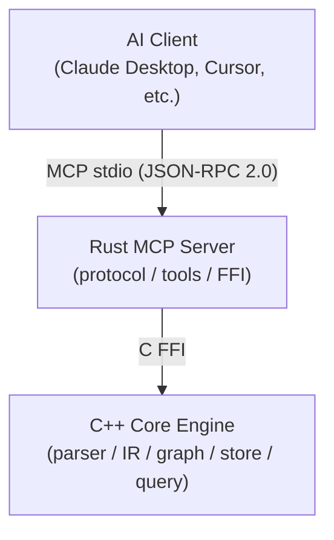
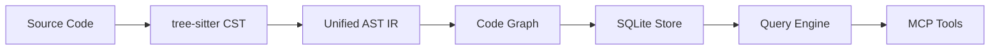

# CodeScope

**CodeScope** is an MCP (Model Context Protocol) code understanding service. It parses source code into a unified AST IR, builds multi-dimensional code graphs (call graph + symbol reference graph), persists them to SQLite, and exposes powerful queries via 14 MCP tools — enabling AI to understand code structure, behavior, and relationships through graph traversal instead of reading raw source files.

## Architecture



**Data flow:**



## Features

### 14 MCP Tools

| Category      | Tool                 | Description                                                |
| ------------- | -------------------- | ---------------------------------------------------------- |
| **Core** (11) | `find_definition`    | Locate symbol definition                                   |
| <br />        | `find_references`    | Find all references to a symbol                            |
| <br />        | `get_callers`        | Get functions that call a given function                   |
| <br />        | `get_callees`        | Get functions called by a given function                   |
| <br />        | `get_neighbors`      | Get neighbor nodes in the graph                            |
| <br />        | `find_shortest_path` | Find shortest path between two nodes                       |
| <br />        | `get_subgraph`       | Extract subgraph centered on a node                        |
| <br />        | `locate_code`        | Locate code entity in source file                          |
| <br />        | `index_project`      | Index an entire project directory                          |
| <br />        | `index_file`         | Index a single source file                                 |
| <br />        | `get_graph_stats`    | Get code graph statistics                                  |
| **Search**    | `search_code`        | FTS5 full-text search (prefix matching)                    |
| **Analysis**  | `get_complexity`     | Cyclomatic complexity + nesting depth                      |
| <br />        | `graph_query`        | Cypher-like DSL: `MATCH (Func)-[Calls]->(Func)`            |
| <br />        | `detect_changes`     | Change impact analysis (callers/callees of modified files) |
| <br />        | `get_communities`    | Label-propagation community detection                      |

### Supported Languages (8)

| Language   | Parser | IR Translator | Verified |
| ---------- | ------ | ------------- | -------- |
| Python     | ✅      | ✅             | ✅        |
| Go         | ✅      | ✅             | ✅        |
| C          | ✅      | ✅             | ✅        |
| C++        | ✅      | ✅             | ✅        |
| Rust       | ✅      | ✅             | ✅        |
| JavaScript | ✅      | ✅             | ✅        |
| TypeScript | ✅      | ✅             | ✅        |
| Java       | ✅      | ✅             | ✅        |

### Graph Capabilities

- **6 edge types**: `References`, `Calls`, `Defines`, `Contains`, `Imports`, `Inherits`
- **8 node types**: `Function`, `Method`, `Class`, `Struct`, `Interface`, `Variable`, `Module`, `File`
- **SQLite persistence**: Zero external dependencies, portable single-file database
- **FTS5 full-text search**: Prefix matching on symbol names and file paths
- **Community detection**: Label propagation algorithm for architecture overview
- **Change impact analysis**: Trace callers/callees through the graph

## Quick Start

### Prerequisites

- Rust 2024 Edition + 1.85+ (`cargo`)
- CMake 3.30+, C++23 compiler (Clang 17+)
- SQLite3 (dev packages)
- tree-sitter core library
- Node.js (for building grammar .so files)

### Build & Run

```bash
# 1. Install tree-sitter grammars (one-time)
npm install -g tree-sitter-python tree-sitter-c tree-sitter-cpp \
  tree-sitter-rust tree-sitter-javascript tree-sitter-typescript \
  tree-sitter-go tree-sitter-java

# 2. Build grammar .so files
cd grammars && bash build.sh && cd ..

# 3. Build everything
make build

# 4. Run all tests
make test

# 5. Start MCP server
cargo run --bin codescope
```

### As a Claude Desktop MCP server

Add to your `claude_desktop_config.json`:

```json
{
  "mcpServers": {
    "codescope": {
      "command": "/path/to/CodeScope/target/release/codescope",
      "args": [],
      "env": {
        "CODESCOPE_DB_PATH": "/tmp/astgraph.db",
        "GRAMMARS_DIR": "/path/to/CodeScope/grammars"
      }
    }
  }
}
```

### Environment Variables

| Variable           | Default            | Description                                    |
| ------------------ | ------------------ | ---------------------------------------------- |
| `CODESCOPE_DB_PATH` | `/tmp/astgraph.db` | SQLite database path                           |
| `GRAMMARS_DIR`     | `grammars/`        | Grammar .so files directory                    |
| `CODESCOPE_LSP`    | (unset)            | LSP server for type enhancement (e.g. `pylsp`) |

## Token Savings

Using code graphs instead of raw source files saves **\~98.8% tokens** on average across 5 common query scenarios:

| Scenario                 | Graph (tokens) | Raw (tokens) | Savings   |
| ------------------------ | -------------- | ------------ | --------- |
| Find function definition | \~21           | \~2,265      | **99.1%** |
| Trace callers            | \~18           | \~2,000      | **99.1%** |
| Architecture overview    | \~32           | \~1,875      | **98.3%** |
| Function analysis        | \~43           | \~4,733      | **99.1%** |
| Symbol search            | \~23           | \~958        | **97.6%** |

## Comparison with codebase-memory-mcp

| Aspect                  | CodeScope                | codebase-memory-mcp               |
| ----------------------- | ------------------------ | --------------------------------- |
| **Backend**             | SQLite (embedded)        | Neo4j (external service)          |
| **Deployment**          | Single binary            | Neo4j + configuration             |
| **Search**              | FTS5 prefix matching     | BM25 + vector semantic search     |
| **Graph query**         | Minimal DSL              | Full Cypher                       |
| **Type info**           | Optional LSP enhancement | LSP-aware                         |
| **Complexity**          | Cyclomatic + nesting     | Cyclomatic + cognitive + hotspots |
| **Community detection** | Label propagation        | Leiden algorithm                  |
| **Cross-repo**          | ❌                        | ✅                                 |
| **ADR management**      | ❌                        | ✅                                 |
| **Dependencies**        | Zero external            | Neo4j                             |

**CodeScope's edge**: Zero-dependency deployment, unified IR layer, portability.
**codebase-memory-mcp's edge**: Richer queries, semantic search, type-aware parsing.

## License

Apache 2.0
