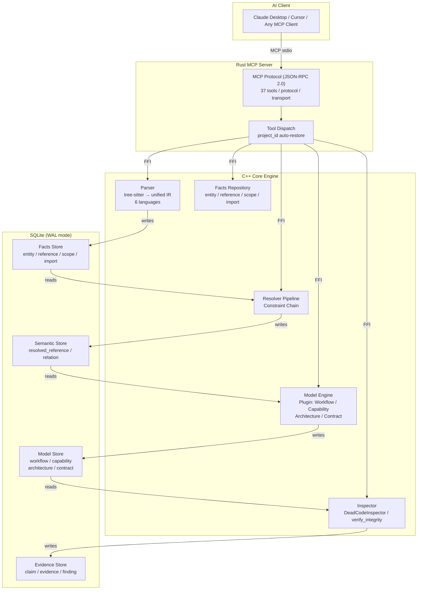
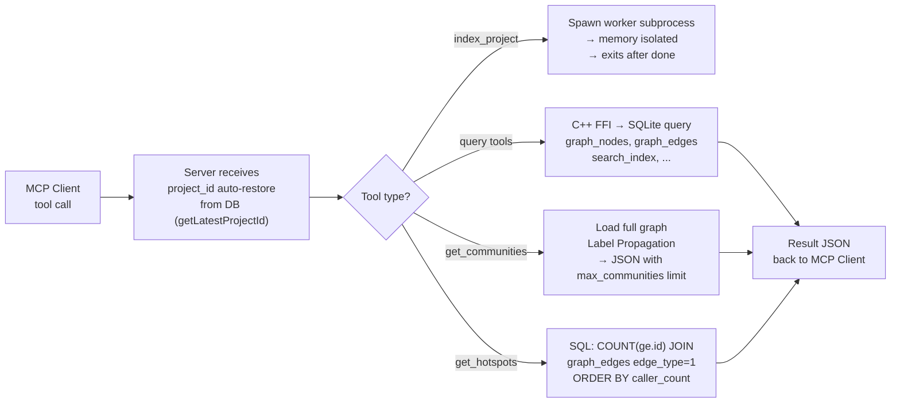
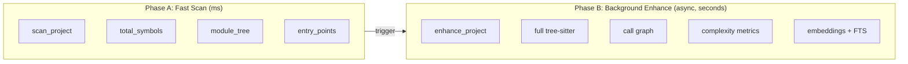

# CodeScope — Project Truth Engine

**CodeScope does not understand code. It verifies code.**

It transforms source code into verifiable facts, understandable models, and inspectable evidence — enabling AI to validate claims against reality instead of hallucinating.

---

### What CodeScope is NOT

CodeScope is **not** a code explainer, a semantic analyzer, or a replacement for reading code. It does not understand what `Arc<T>` means, why `Rc<T>` is not thread-safe, or how a JWT middleware works. **That is the AI's job.**

### What CodeScope IS

CodeScope is a **Project Truth Engine** that answers one question:

> **"Does the code actually do what you claim?"**

Not "what does this code mean", but "does the code actually do what you claim?"

### By the Numbers

| Metric | Value |
|--------|-------|
| Languages | 8 (Rust, Go, C/C++, Python, Java, JS/TS) |
| Index speed | 1-10s (100+ files) |
| Query latency | 0.3-1.5 ms |
| Token savings | **98.9%** (260K lines → 40K tokens) |
| MCP tools | 37 (Locate / Understand / Verify / Index) |
| Architecture | Facts → Resolution → Models → Verification |

### What It Can Do

| AI says | CodeScope checks | Data source |
|---------|----------------|-------------|
| "登录模块支持 JWT" | JWT library exists? login calls jwt? tests exist? | `entity` + `relation` + `import` |
| "This module is complete" | All functions have callers? coverage adequate? | `relation` + `DeadCodeInspector` |
| "PR fixed memory leak" | Corresponding free exists? error path tested? | `relation` + test file check |
| "Architecture is Controller→Service→Repository" | Does code actually follow this layering? | `architecture_edge` |
| "Module supports 6 languages" | Do the adapters actually exist? | `entity` + `import` |

### Knowledge Graph (Side Product)

CodeScope builds a **module-level knowledge graph** as a side product of the verification pipeline. It learns not "code text" but *structured "how this project is organized, what's important, what's redundant, what it promises"* — a four-layer stack:

| Layer | Table | What it tells you |
|-------|-------|-------------------|
| **Call graph** (who calls who) | `relation` (type=1), `architecture_edge` | Cross-module call dependencies; drives `detect_architecture_drift` |
| **Module health** (who's important / who's dead) | `module_summary` | Per-module `incoming_count` / `outgoing_count` / `dead_entities` / `utilization` / `confidence`; drives `explain_module` |
| **Module dependency** (who impacts whom) | `architecture_edge` (edge weight = call count), `module_edge` | "Change module A → these modules depend on it" |
| **Documented capability** (what it claims it can do) | `capability` + `document` | README-extracted capabilities; drives `detect_capability_drift` / `verify_claim` |

The knowledge graph is not the product — it is the infrastructure that powers verification.

#### `module_summary.role`: multi-signal fusion classifier (v0.2.1)

The `role` column is auto-populated by a **multi-signal fusion CASE** classifier (`engine/src/model/state_builder.cpp`), not a single-source heuristic. It fuses call-graph counts with two signals the call graph cannot give:

| Signal | Source | What it adds |
|--------|--------|--------------|
| `pub_count` | `entity.visibility=1` (pub/public/export per language Visitor) | Distinguishes external interface layers from internal implementation |
| `entry_reachable` | `graph_nodes.is_entry_point` (main/init/setup/run/handler) | Whether this module is an entry layer |

Rules match by **priority** (first hit stops):

| Priority | Role | Rule (multi-signal) |
|----------|------|---------------------|
| 1 | `test` | module name contains `test`/`tests`/`_test`/`mod tests` |
| 2 | `api` | `pub_count > 0 AND incoming ≥ 2×outgoing AND incoming ≥ 3 AND utilization ≥ 0.1` |
| 3 | `entry` | `entry_reachable > 0` |
| 4 | `core` | `incoming ≥ 10 AND outgoing ≤ incoming×1.0 AND utilization ≥ 0.05 AND pub_count > 0` |
| 5 | `utility` | `outgoing ≤ 5 AND pub_count > 0 AND utilization ≥ 0.05` |
| 6 | `business` | `pub_count > 0 AND incoming ≥ 10` (implementation layer — many depend, many deps; outgoing too high for core/api) |
| 7 | `dead` | `incoming=0 AND outgoing=0`, OR `dead_entities = total` |
| 8 | `infra` | true fallback — didn't match any semantic rule |

Treat `role` as a hint informed by fusion, not a court verdict. Thresholds are `constexpr` in `state_builder.h` — retune against `bun` if your project's role distribution looks off (e.g. `infra > 30%` means thresholds too strict). See `docs/dev_plans/role_classifier_plan.md` for the full design and the v0.2.1 threshold retune log.

#### What lands in the knowledge graph (memscope-rs, 215 files)

| Table | Rows | Meaning |
|-------|-----:|---------|
| `entity` | 4,310 | Fine-grained code entities (functions, types, vars) |
| `relation` | 726 | Inter-entity relations (type 3 = containment / definition) |
| `architecture_edge` | 3,351 | Module / directory-level architecture dependencies (edge weight = call count) |
| `module_edge` | 11 | Cross-module dependency edges |
| `capability` | 3 | Capabilities extracted from the README |
| `document` | 1 | README document record |
| `module_summary` | 42 | Per-module knowledge cards |

What you can learn from it:

- **Architecture dependencies** — `architecture_edge` tells you which modules depend on which (e.g. `analysis/heap_scanner → unsafe_inference`, weight = number of calls). Drives `detect_architecture_drift`.
- **Capability declarations** — `capability` + `document` structure "what the README claims the project can do". Drives `detect_capability_drift` / `verify_claim(capability_exists)`.
- **Module summaries** — 42 per-module knowledge cards, surfaced by `explain_module`.

#### Direct query access (v0.2.1)

The knowledge graph used to be **implicit** — `graph_query` walks the *call* graph (`graph_nodes` / `graph_edges`), not the knowledge-layer tables (`entity` / `relation` / `architecture_edge`). You benefited from it only indirectly via `explain_module`, `detect_capability_drift`, `get_module_tree`.

v0.2.1 adds `engine_get_knowledge_graph(project_id, table, limit)` + the MCP tool `get_knowledge_graph` so you can now **directly browse** any knowledge-layer table:

```jsonc
get_knowledge_graph {"table":"architecture_edge","limit":5}
// → {"table":"architecture_edge","rows":[{"id":1,"layer_lower":"analysis/heap_scanner","layer_upper":"unsafe_inference","entity_id":42}],"total":3351,"truncated":false}

get_knowledge_graph {"table":"capability","limit":10}
// → {"table":"capability","rows":[{"id":1,"name":"borrow_analysis","summary":"scope-aware borrow checking"}],"total":3,"truncated":false}
```

Supported tables: `entity`, `relation`, `architecture_edge`, `module_edge`, `capability`, `document`, `module_summary`. Block-level FFI — one call returns the whole result set, never one row per call.

---
## Quick Start

### 60 seconds to your first index

```bash
# 1. One-command build (auto-detects OS, installs deps, compiles)
bash <(curl -fsSL https://raw.githubusercontent.com/Timwood0x10/CodeScope/master/bootstrap.sh)

# 2. Index a project
codescope cli index_project '{"project_path":"/path/to/your/project"}'

# 3. Query
codescope cli get_graph_stats '{}'
# → {"total_nodes":12345,"total_edges":6789,"total_files":99}

# 4. Start MCP server (for AI clients)
codescope
```

📖 详细的中文快速开始指南见 [QUICK_START.md](QUICK_START.md)

### Prerequisites

| Platform | Dependencies | One-command | Status |
|----------|-------------|-------------|--------|
| **macOS** | Xcode CLT, cmake, Rust | `bash bootstrap.sh` | ✅ Supported |
| **Linux** | build-essential, cmake, Rust | `bash bootstrap.sh` | ✅ Supported |
| **Windows** | MinGW-w64 (gcc/g++), CMake 3.30+, Rust | `.\install.ps1` | 🚧 Planned |

> Pre-built binaries are available for **Linux** and **macOS** on the [Releases page](https://github.com/Timwood0x10/CodeScope/releases).  
> **Windows** support is planned for a future release. The C++ engine and Rust server build with MinGW-w64; see [#issue] for tracking progress.

**One-command install (Linux / macOS)**:

```bash
curl -fsSL https://raw.githubusercontent.com/Timwood0x10/CodeScope/master/install.sh | bash
```

After install, `~/.codescope/bin/` contains:

| File | Purpose |
|------|---------|
| `codescope` | Main binary (CLI + MCP server) |
| `codescope-parallel.sh` | **Parallel indexer for large projects** — multi-process module-level dispatch, dynamic worker recycling, per-file quarantine, auto-merges DBs. When the AI decides acceleration is warranted, just call this script; see [Parallel indexer script](#parallel-indexer-script-recommended-for-large-projects) below |

Add to PATH and use:

```bash
export PATH="$PATH:$HOME/.codescope/bin"

# Small-medium projects: index directly
codescope cli index_project '{"project_path":"/path/to/project"}'

# Large projects (thousands–tens of thousands of files): use the parallel script
codescope-parallel.sh /path/to/large/project
```

### Build from source manually

```bash
# macOS:
brew install llvm@21 cmake pkg-config sqlite3 ladybug
cargo build --release

# Linux (Ubuntu):
sudo apt-get install -y build-essential cmake llvm-dev libclang-dev libsqlite3-dev
curl -fsSL https://install.ladybugdb.com | sh
cargo build --release
```

---

## Architecture



### Pipeline

```
Source Code
    |
    v
Parser ------------ entity / reference / scope / import
    |
    v
Resolver ---------- resolved_reference / relation
    |
    v
Model Engine ------ workflow / capability / architecture / contract
    |
    v
Inspector --------- evidence / finding
```

### Data Flow

```
Facts Layer:      项目里有什么？          实体、引用、作用域、导入
Resolution Layer: 谁调了谁？              调用边、依赖关系、resolve_strategy
Model Layer:      项目怎么工作的？         工作流、能力、架构、契约
Verify Layer:     真的吗？证据在哪？       证据、发现
```

> **v0.2.1 — `resolve_strategy` propagation**
> Each call edge now carries a `resolve_strategy` tag on its way out of the
> Resolver Pipeline: `p1_intra` (resolved in-project), `external` (builtin /
> third-party), `unresolved` (unknown). Frontends can filter `external` /
> `unresolved` out of `find_callees` / `find_callers` results to eliminate
> third-party false positives (e.g. `dropout`, `backward_hook`, `means`,
> `stds` no longer surface as in-project callees). Verified across 8 languages
> on the `bun` project: 100% of `edge_type=1` (call) edges carry a non-empty
> strategy. See `docs/bugs/bug_resolve_strategy.zh.md` for the full fix chain.

```

### Query Flow (Tool Dispatch)



### Two-Phase Design



## MCP Tools (37 tools)

### Project & Stats

| Tool | Description | Token Cost |
|------|-------------|:----------:|
| `project_overview` | **Primary** — comprehensive overview: languages, modules, symbols, entry points | **~71** |
| `get_graph_stats` | Quick statistics: nodes, edges, files | **~18** |
| `get_module_tree` | Hierarchical module/directory tree | **~4** |
| `get_entry_points` | Find entry points (main/init/setup/run/handler) | **~5** |
| `get_routes` | Get registered HTTP routes (Gin/Echo/Chi/net/http) | **~50** |
| `get_type_info` | Query type definitions (struct/enum/trait) with reference counts | **~50** |

### Symbol Lookup

| Tool | Description | Token Cost | Note |
|------|-------------|:----------:|------|
| `find_symbol` | **Recommended** — find symbol by exact name (kind, file, line/col) | **~30** | |
| `find_definition` | `[DEPRECATED]` Find symbol definition location | **~20** | Use `find_symbol` |
| `find_references` | Find all locations referencing a symbol | **~30** | |
| `explain_symbol` | Get comprehensive symbol info: definition, callers, callees, dependencies | **~50-200** | One-shot deep dive |

### Call Graph

| Tool | Description | Token Cost | Side Effects |
|------|-------------|:----------:|--------------|
| `find_callers` | Find who calls a function | **~10-50** | Requires CALLS edges |
| `find_callees` | Find what a function calls | **~10-50** | Same |
| `codescope_trace` | Interactive recursive call exploration (depth + direction) | **~50-200** | Large depth = large output |
| `trace_flow` | Recursive execution flow tracing (caller→callee chain) | **~50-200** | Same |
| `shortest_path` | Shortest call path between two functions (BFS) | **~50-100** | |
| `connected_components` | Connected components in the call graph — find independent modules | **~50** | |

### Search

| Tool | Description | Token Cost |
|------|-------------|:----------:|
| `search` | **Recommended** — unified search (auto-selects FTS5 or semantic) | **~300-1000** |
| `search_code` | `[DEPRECATED]` Legacy FTS search, use `search` instead | **~300-1000** |

### Verification Layer

| Tool | Description | Token Cost |
|------|-------------|:----------:|
| `verify_integrity` | Check README-promised features actually exist in code | **~100** |
| `verify_claim` | Verify a single claim (capability_exists / contract_holds / architecture_follows) | **~100** |
| `verify_summary` | Parse natural-language summary and verify each claim | **~200-500** |
| `verify_review` | Verify code review comment claims | **~200-500** |
| `verify_reality` | Verify a single AI statement against code evidence | **~200-500** |

### Drift Detection

| Tool | Description | Token Cost |
|------|-------------|:----------:|
| `detect_drift` | Scan all declared capabilities & contracts for doc-vs-code drift | **~200** |
| `detect_documentation_drift` | Check README language claims vs actual code entities | **~150** |
| `detect_capability_drift` | Check declared capabilities have implementing entities | **~150** |
| `detect_architecture_drift` | Check call edges for layer violations (Repository→Controller) | **~150** |

### Change Impact & Module

| Tool | Description | Token Cost |
|------|-------------|:----------:|
| `detect_changes` | Analyze impact of modified files: direct/indirect callers | **~100-500** |
| `explain_module` | Build module knowledge card: entities, capabilities, integrity score | **~50-200** |

### Utilities

| Tool | Description | Token Cost |
|------|-------------|:----------:|
| `index_project` | Index entire project directory (parse → IR → graph) | **N/A** |
| `index_file` | Index a single source file | **N/A** |
| `force_index_files` | **Force-index** — bypass default skip rules (`test/`, `docs/`, `vendored/`, `node_modules/`, `.gitignore`, etc.) to index specific files/dirs. Use when the user says "go index xxx/yyy for me" | **N/A** |
| `count_tokens` | Estimate token count (DeepSeek formula) | **~10** |

#### `force_index_files` — user-directed incremental indexing

When the default `FilterPolicy` skips entire directories (test fixtures, vendored deps, generated code, examples) but the user wants to pull those paths in, use `force_index_files`. It **bypasses** the default skip rules but still respects:

- File size limit (`CODESCOPE_MAX_FILE_SIZE`, default 5 MB)
- Language detectability (`detectLanguage` must return non-null)
- Optional language whitelist (`language_filter`)

**MCP call**:

```json
{
  "paths": ["/abs/path/to/dir/or/file", "/another/path"],
  "language_filter": "java,python"
}
```

- `paths`: array of absolute paths; directories are walked recursively
- `language_filter`: optional, comma-separated language whitelist; empty = all detectable languages

**CLI call**:

```bash
codescope force-index [--lang java,python] [--db /path/to/codescope.db] /path/to/xxx /path/to/yyy
```

Returns the `engine_index_files` JSON (`files_indexed`/`nodes`/`edges`/`errors`) plus `skipped_files`/`skipped_dirs`/`paths_requested` stats.

#### Parallel indexer script (recommended for large projects)

For **large projects** (thousands–tens of thousands of source files, e.g. Linux kernel, rustc), single-process multi-threaded indexing can be limited by RSS peaks and crash isolation. `codescope-parallel.sh` provides **multi-process module-level dispatch**:

- Splits by module (top-level directory); each module spawns an independent `codescope worker` subprocess
- Memory/crash isolation: a crashing module doesn't take down the whole index
- Dynamic worker recycling: when a module finishes, its workers are reassigned to remaining modules
- Per-file quarantine: crashing modules use binary search to locate the crashing file, skip it, retry
- Merges all module DBs into a single project DB at the end

**Universal entry** — user or AI just passes a directory; the script auto-discovers binary, grammars dir, and default output path:

```bash
# Default config (8 workers), output to <dir>/.codescope/codescope.db
./codescope-parallel.sh /path/to/large/project

# 16 workers for a big project
CODESCOPE_WORKERS=16 ./codescope-parallel.sh /path/to/large/project

# Custom output DB
./codescope-parallel.sh /path/to/large/project /tmp/my.db

# Help
./codescope-parallel.sh -h
```

Environment variables (all optional):

| Var | Default | Description |
|------|---------|------|
| `CODESCOPE` | auto-detected | Path to codescope binary (search order: `bin/codescope`, `target/release/codescope`, `./codescope`, `PATH`) |
| `GRAMMARS_DIR` | auto-detected | Path to tree-sitter grammars directory |
| `CODESCOPE_WORKERS` | `8` | Total worker count |
| `CODESCOPE_PARALLEL` | `= CODESCOPE_WORKERS` | Max concurrent modules |

**When to use the script vs `index_project` directly**:

- Small-medium projects (<300 files): `index_project` is fine — sub-second to ~2 s
- Large projects (thousands+ files): use `codescope-parallel.sh` — multi-process isolation + dynamic dispatch is more robust


### Why Java is the (only) exception — a rant

CodeScope skips `test/`, `tests/`, `docs/`, `examples/`, `samples/`, `bench/`, `vendor/`, ... at **any depth** in the path. This is the correct behavior for every sane project layout: Cargo workspaces nest `crates/<name>/tests/`, Lerna monorepos nest `packages/<name>/test/`, Gradle multi-module builds nest `subprojects/<name>/src/test/`, and users expect all of those to be skipped — they're not the analysis target, and indexing them inflates node counts 3-5x with noise.

Then there's **Java**. Java, in its infinite wisdom, decided that `org/springframework/samples/petclinic` is a legitimate package name — `samples` is a package component, NOT a docs folder. `src/test/java/...` is the standard Maven test source root, but `src/main/java/.../test/...` can also be a legit package. `examples`, `integration`, `locale` — all fair game as Java package identifiers. Java conflated filesystem layout vocabulary with package naming, and now every tool in the ecosystem has to tiptoe around it.

This is an **anti-human engineering design**. It forces every static analysis tool to either (a) skip test/ at any depth and break Java, or (b) gate test/ to top-only and leak deep-nested test dirs on every other language's monorepos. The noise on non-Java projects is enormous — rustc alone has `tools/rust-analyzer/crates/*/src/*/tests/` nested 7 deep, all of which were leaking through a depth-3 top-only gate.

CodeScope picks option (c): **Java projects get a carve-out, everyone else gets the correct behavior.**

When the indexer detects a `.java` file, it flips `FilterPolicy` into Java mode: `test/`/`docs/`/`samples/`/... collisions are gated to **top-only (depth ≤ 3)** via `java_protected_skip_dirs_`, so `org/.../samples/petclinic` (depth 5+) is NOT skipped but `<root>/test/`, `<root>/src/test/java/`, `<root>/packages/<name>/tests/` still are. Every other language (Rust, Go, Python, JS/TS, C/C++, Kotlin, Ruby, Scala, ...) keeps these names skipped at any depth — the way they should be.

**If you're indexing a Java project**: nothing to do. The indexer auto-detects `.java` files and flips `FilterPolicy` into Java mode, which routes `test/`/`docs/`/`samples/`/... through `java_protected_skip_dirs_` at top-only (depth ≤ 3) — nested packages like `org/.../samples/petclinic` (depth 5+) are kept, `<root>/test/`/`src/test/java/`/`packages/<name>/tests/` are still skipped. This is the only working override mechanism.

```bash
# Java project — auto-detection handles it, no env var needed:
codescope index <your-java-project>
```

```bash
# If you actually want to skip NESTED test/docs on a Java project
# (i.e. turn OFF the carve-out and apply any-depth skip everywhere),
# CODESCOPE_EXCLUDE_PATHS only ADDS exclude patterns on top of the
# built-in list — it cannot un-skip nested packages on its own. The
# clean path is a project-local .codescopeignore pattern matching the
# specific nested dirs you want dropped.
```

The trade-off is documented here in the open. Java's package naming collision is a design flaw in the language, not in CodeScope, and we refuse to let it degrade the experience for the other 99% of projects.


### Quick Decision Guide

```
New project       → project_overview (~71 tok)
Module structure  → get_module_tree (~4 tok)
Entry points      → get_entry_points (~5 tok)
Search code       → search (~300-1000 tok)
Call chain        → find_callers / find_callees (~10-50 tok)
Deep dive symbol  → explain_symbol (~50-200 tok)
HTTP routes       → get_routes (~50 tok)
Type info         → get_type_info (~50 tok)
Verify claim      → verify_claim (~100 tok)
Detect drift      → detect_documentation_drift (~150 tok)
Change impact     → detect_changes (~100-500 tok)
```

## Usage Skill

### Basic Workflow

```
1. index_project("/path/to/project")    ← 1-30s, index the project
2. project_overview                     ← 1-2ms, understand project structure
3. find_definition("malloc")            ← 10μs,  locate a symbol
4. trace_flow("main", "malloc")         ← BFS,   get execution path
5. verify_claim("login", "supports", "JWT")  ← verify a claim
6. verify_summary("已完成登录模块")     ← verify AI summary
```

### Real-World Execution Path Example

```bash
# After scan + enhance of Linux kernel:
codescope_trace(from="copy_process", to="sched_fork")
# → {"path": [
#     {"name":"copy_process","file":"kernel/fork.c","line":1994},
#     {"name":"sched_fork",  "file":"kernel/sched/core.c","line":4803}
#   ]}

# Deeper trace:
codescope_trace(from="copy_process", to="dup_mm")
# → {"path": [
#     {"name":"copy_process","file":"kernel/fork.c","line":1994},
#     {"name":"copy_mm",     "file":"kernel/fork.c","line":1568},
#     {"name":"dup_mm",      "file":"kernel/fork.c","line":1527}
#   ]}
```

## Performance Benchmarks

### Real-world index benchmarks (v0.2.1, Apple M3 Max)

| Project | Files | Nodes | Index time | Peak RSS |
|---------|------:|------:|-----------:|---------:|
| **memscope-rs** (Rust) | 215 | 4,344 | ~2 s | ~200 MB |
| **CodeScope** (self, C++/Rust) | 168 | 1,001 | 1.3 s | ~150 MB |
| **ARES_POLIS** | 105 | 1,531 | ~2 s | ~180 MB |
| **rustc** (Rust compiler, monorepo) | 6,029 | 81,033 | 81 s | 5.9 GB |

**What this says:**

- **Small-medium projects (<300 files):** sub-second to ~2 s index, ~200 MB RSS — excellent ergonomics, daily-driver speed.
- **Very large monorepos (tens of thousands of files):** usable but real resources — rustc took 81 s and 5.9 GB peak. Acceptable for a one-shot index, but plan memory.
- **Query latency (stdio MCP mode, includes process start):** ~60 ms per call; persistent server mode is lower.

### Full Parse & Index (tree-sitter + Graph Builder + Linker)

| Project | Files | Nodes | Functions | CALLS | ★Cross-File | Time |
|---------|:----:|:-----:|:--------:|:-----:|:----------:|:----:|
| **CodeScope** (self) | 47 | 12K | 3.8K | 23K | 13 | 3s |
| **goagent** (Go) | 2,651 | 155K | 49K | 56K | 49K | 30s |
| **Linux kernel** (full) | **64,694** | **12M** | **3.8M** | **3.7M** | **1.5M** | **3min 07s** |

### Pipeline Architecture (v0.2)

```
Source Files
     │
     ▼  Phase 1: Collect
┌──────────────┐
│  Translator  │  Phase 2: Parallel translate
│ (no resolver)│  Pure: Source → IR, 14 workers
└──────┬───────┘
       │ IR Units
       ▼
┌──────────────┐  Phase 3: Link (serial PassManager)
│   Linker     │
│  ├─ BuildSymbolIndex  (scan IR, ~ms)
│  ├─ ResolveCallPass   (cross-file CALLS)
│  └─ EmitGraphPass     (GraphBuilder → SQLite)
└──────────────┘
```

### Indexing Throughput

| Metric | Value |
|--------|-------|
| **Linux kernel**: 64,694 files | **3 min 07 sec** (~350 files/sec) |
| Functions indexed | **3,840,680** |
| CALLS edges | **3,727,864** |
| Cross-file CALLS (★) | **1,502,432 (40%)** |
| DB size | ~1.2 GB |
| Workers | 14 × 8MB stack |

### Cross-File Resolution

The Linker's `ResolveCallPass` resolves function calls across file boundaries using a global symbol index built from all TranslationUnits. Candidate ranking prefers `.c`/`.cpp` definitions over `.h` prototypes.

| Project | Cross-File CALLS | % of total CALLS |
|---------|:---------------:|:----------------:|
| CodeScope (C++) | 23 | 0.1% |
| goagent (Go) | 49,258 | 86% |
| Linux kernel (C) | 1,502,432 | 40% |

### Fast Scan (Lightweight, ms-level)

| Project | Time | Languages | Symbols |
|--------|:----:|:---------:|:-------:|
| **CodeScope** (self) | **32 ms** | cpp, rust, c | 2,902 |
| **goagent** (Go) | **493 ms** | go, c, cpp, python | 5,172 |
| **Linux kernel/** (core) | **360 ms** | c | 40,335 |

### C Declaration Detection Accuracy

| Language           | Precision | Recall | Notes                             |
| ------------------ | --------- | ------ | --------------------------------- |
| **Go**             | ~97%      | ~96%   | `func` pattern is highly specific |
| **Python**         | ~98%      | ~95%   | `def`/`class` nearly zero FP      |
| **C/C++ (strict)** | ~85%      | ~90%   | Requires type keyword in return   |
| **C/C++ (old)**    | ~65%      | ~95%   | Permissive, high FP               |
| **Rust**           | ~90%      | ~90%   | `fn` is precise                   |

### Supported Languages (8)

| Language   | Parser | IR Translator | Verified |
| ---------- | ------ | ------------- | -------- |
| Python     | ✅      | ✅             | ✅        |
| Go         | ✅      | ✅             | ✅        |
| C          | ✅      | ✅             | ✅        |
| C++        | ✅      | ✅             | ✅        |
| Rust       | ✅      | ✅             | ✅        |
| JavaScript | ✅      | ✅             | ✅        |
| TypeScript | ✅      | ✅             | ✅        |
| Java       | ✅      | ✅             | ✅        |

## Token Savings

Using code graphs instead of raw source files saves **~98.9% tokens** on average across 5 common query scenarios:

| Scenario                 | Graph (tokens) | Raw (tokens) | Savings   |
| ------------------------ | -------------- | ------------ | --------- |
| Find function definition | ~21            | ~2,265       | **99.1%** |
| Trace callers            | ~18            | ~2,000       | **99.1%** |
| Architecture overview    | ~32            | ~1,875       | **98.3%** |
| Function analysis        | ~43            | ~4,733       | **99.1%** |
| Symbol search            | ~23            | ~958         | **97.6%** |

## Real-World Case Study: Linux Kernel Scheduler

Using CodeScope's Fast Scan on the Linux kernel v6.13 — **45 ms** to analyze the scheduler (36 files, 4,913 symbols). Enhanced in **27s** with **45,573 call_edges**.

### Execution Path Tracing in Action

```
codescope_trace("copy_process","sched_fork")
→ copy_process(kernel/fork.c:1994)
    ↓ sched_fork(kernel/sched/core.c:4803)

codescope_trace("copy_process","dup_mm")
→ copy_process(kernel/fork.c:1994)
    ↓ copy_mm(kernel/fork.c:1568)
    ↓ dup_mm(kernel/fork.c:1527)
```

### Scheduler Code Layout

```
kernel/sched/
├── core.c          — __schedule(), schedule()
├── fair.c          — CFS Completely Fair Scheduler
├── rt.c            — Real-time scheduler
├── deadline.c      — Deadline scheduler
├── idle.c          — Idle task
├── sched.h         — Data structures
└── ext/            — Extensible scheduler API
```

### Parent-Child Resource Handling → `kernel/fork.c`

| Line   | Function              | Purpose                                                |
| ------ | --------------------- | ------------------------------------------------------ |
| **914**  | `dup_task_struct()`   | Copy parent's task_struct                              |
| **1994** | `copy_process()`      | **Main entry** — creates new process                   |
| **2115** | `p = dup_task_struct(current, node)` | Copy kernel stack + thread_info + task_struct |
| **2259** | `sched_fork(clone_flags, p)` | Init child scheduling state, set non-runnable    |

**Core mechanism: Copy-On-Write (COW)** — `copy_mm()` shares physical pages between parent and child as read-only.

### Preemption Prevention

| Location                        | Mechanism              | Description                                        |
| ------------------------------- | ---------------------- | -------------------------------------------------- |
| `include/linux/preempt.h:92`    | `preempt_count()`      | Per-task counter; >0 disables kernel preemption    |
| `kernel/sched/core.c:7061`      | `__schedule()`         | Main scheduler; only switches when preempt_count==0 |
| `kernel/sched/core.c:7316`      | `schedule()`           | Voluntary yield                                    |

## Configuration

### Build from source

```bash
# Build everything — tree-sitter, SQLite, sqlite-vec, grammars
# are all auto-downloaded and compiled into the binary (zero deps)
make build

# Start MCP server
cargo run --bin codescope
```

### Environment Variables

| Variable | Default | Description |
|----------|---------|-------------|
| `CODESCOPE_DB_PATH` | `.codescope/codescope.db` | SQLite database path |
| `CODESCOPE_LSP` | (unset) | LSP server command for type enhancement (e.g. `pylsp`) |
| `CODESCOPE_INDEX_MODE` | `standard` | Index mode: `fast` / `standard` / `strict` |
| `CODESCOPE_EXCLUDE_PATHS` | (unset) | Comma-separated glob patterns to exclude (e.g. `test/*,docs/*`) |
| `CODESCOPE_MMAP_SIZE` | `268435456` (256 MB) | SQLite `mmap_size` pragma value in bytes |
| `CODESCOPE_WORKERS` | `4` | Number of parallel index workers |
| `CODESCOPE_MAX_FILE_SIZE` | (unset) | Max source file size to index in bytes; larger files are skipped |
| `CODESCOPE_WORKER_TIMEOUT` | `300` | Worker subprocess timeout in seconds |
| `CODESCOPE_VERBOSE` | `0` | Set to `1` to enable verbose logging |
| `CODESCOPE_EXPLAIN` | (unset) | Set to `1` to print SQL `EXPLAIN QUERY PLAN` for graph queries |

> **Note:** `GRAMMARS_DIR` is no longer needed — all tree-sitter grammars are compiled into the binary via CMake FetchContent.

### Prerequisites

- Rust 2024 Edition + 1.85+ (`cargo`)
- CMake 3.30+, C++23 compiler (Clang 17+)

## Data Directory `.codescope/`

CodeScope automatically creates a `.codescope/` directory in the project root on first run.  
All persistent data is stored here — no manual setup needed.

```
.codescope/
├── codescope.db       ← SQLite database (WAL mode): all facts, indexes, graphs
├── skills.md          ← Quick start guide and command reference
└── *.log              ← Analysis run logs with timing + CPU + memory data
```

The database contains 40 tables, grouped by purpose (see `engine/src/store/store_schema.cpp`):

| Category | Tables | Purpose |
|----------|--------|---------|
| Core / Project | `projects`, `project_readiness`, `files`, `modules`, `entry_points`, `index_tasks`, `file_scan_state` | Project metadata, file tracking, index phase progress |
| Graph | `graph_nodes`, `graph_edges`, `entity`, `relation`, `semantic_records`, `adjacency`, `adjacency_rev`, `module_edge`, `module_summary` | Code graph nodes/edges, CSR BLOB adjacency, cross-module edges |
| Search | `code_fts` (FTS5), `name_trgm` (FTS5 trigram), `fts_node_map`, `node_vectors` | Full-text + trigram + n-gram vector search |
| Facts / Parser | `reference`, `scope`, `import`, `type_info`, `type_ref`, `route` | Call facts, scope tree, imports, type definitions, HTTP routes |
| Knowledge + Evidence | `capability`, `contract`, `claim`, `evidence`, `evidence_fact`, `finding`, `document` | Verification pipeline: claims, evidence chains, findings |
| Model State | `workflow`, `workflow_step`, `architecture_edge`, `capability_state`, `workflow_state`, `architecture_state` | Workflows, architecture layers, state caches |
| LadybugDB Sync | `lbug_sync_state` | Incremental sync progress to LadybugDB graph store |

> **Tip**: The database is portable — copy `.codescope/` along with your project to reuse analysis results on another machine.

## Performance

Benchmarks measured on **Apple M3 Max (36 GB RAM)**.

### Micro Benchmarks (test_bench)

| Metric | Value |
|--------|-------|
| Engine init | **14.6 ms** |
| Index throughput | **1,533 KB/s** |
| Symbol definition query | **0.01–0.03 ms** |
| Callers/callees query | **0.01–0.02 ms** |
| 9 queries (total) | **0.17 ms** |

### Known Bottleneck (Knowledge Graph Queries)

The current MCP knowledge graph service has a **~300k-500k node threshold** for fuzzy text search (`CONTAINS`, BM25 full-text, regex name matching) — queries on projects beyond this threshold may **time out at 30 seconds**.

| Project Scale | Example | Exact-match queries | Fuzzy searches |
|--------------|---------|:------------------:|:--------------:|
| Small-Medium (<50K nodes) | goagent (23K) | ✅ &lt;10ms | ✅ Fast |
| Large (50K-300K nodes) | zigcode (327K) | ✅ &lt;10ms | ⚠️ May time out |
| Very Large (>500K nodes) | JDK (1.36M) | ✅ Exact match works | ❌ Time out |

> **Root cause**: Full-node-set text scans (`CONTAINS`, `name_pattern` regex) iterate over millions of nodes, exceeding the 30s timeout limit. Index-assisted exact path matching (`ENDS WITH`) works fine.
>
> **Planned fix**: Add a custom exclusion paths parameter to skip `test/`, `doc/`, and other large non-core directories during indexing, keeping effective node count under 300K.

### Token Savings

| Scenario | Raw Source | CodeScope | Savings |
|----------|:----------:|:---------:|:-------:|
| Find function definition | ~2,265 tokens | ~21 tokens | **99.1%** |
| Trace function callers | ~2,000 tokens | ~18 tokens | **99.1%** |
| Project architecture | ~1,875 tokens | ~32 tokens | **98.3%** |
| USB subsystem overview | ~24,000 tokens | ~250 tokens | **99.0%** |
| Scheduler analysis | ~15,000 tokens | ~180 tokens | **98.8%** |
| **Average** | **~7,416 tokens** | **~81 tokens** | **98.9%** |

## License

Apache 2.0
