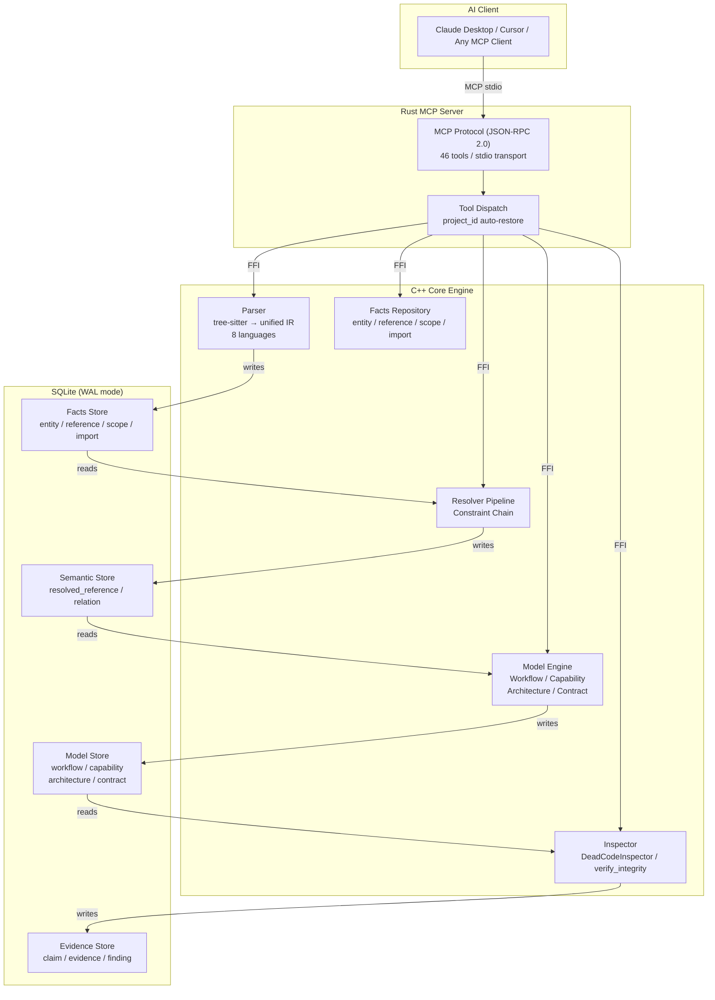
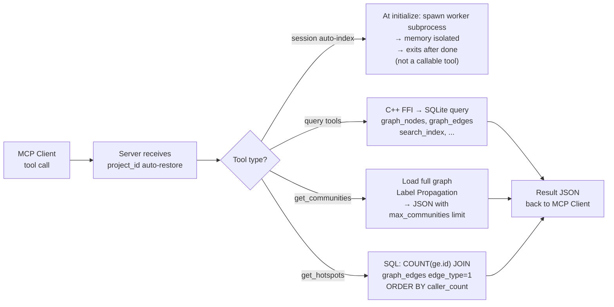
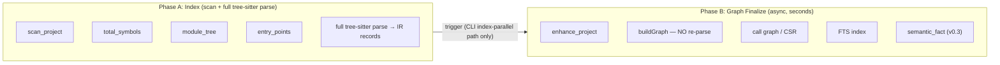

# CodeScope — Project Truth Engine

**CodeScope does not understand code. It verifies code.**

It transforms source code into verifiable facts, understandable models, and inspectable evidence — enabling AI to validate claims against reality instead of hallucinating.

**Version**: v0.2.6 | **License**: Apache 2.0

---

## 1. What Is CodeScope?

CodeScope is a **Project Truth Engine** that answers one question:

> **"Does the code actually do what you claim?"**

Not "what does this code mean", but "does the code actually do what you claim?"

It indexes source code into a structured code graph (call graph + reference graph + module knowledge), then exposes **46 MCP tools** that let AI agents locate symbols, trace call paths, verify claims, detect documentation drift, and analyze architecture — all with **~98.9% token savings** vs reading raw source files.

### Supported Languages (8)

| Language | Parser | IR Translator | Verified |
|----------|--------|---------------|----------|
| Python | ✅ | ✅ | ✅ |
| Go | ✅ | ✅ | ✅ |
| C | ✅ | ✅ | ✅ |
| C++ | ✅ | ✅ | ✅ |
| Rust | ✅ | ✅ | ✅ |
| JavaScript | ✅ | ✅ | ✅ |
| TypeScript | ✅ | ✅ | ✅ |
| Java | ✅ | ✅ | ✅ |

**What "Verified" means**: the language has an automated test that asserts a real
semantic record (a named call, method declaration, or interface implementation)
is emitted — not merely that the response JSON contains the expected keys. Those
tests live in `engine/tests/test_ir_edge_coverage.cpp`; before they existed the
per-language E2E harness only checked for the strings `"callers"` / `"callees"` /
`"total_nodes"`, so a translator that emitted **zero** edges still passed.

**Known limitations** (documented rather than silently dropped):

- **Rust**: macro invocations (`println!`, `vec!`, user `foo!()`) are recorded as
  calls to the macro name. tree-sitter does not expand macros, so code *generated*
  by a macro body is not in the graph, and a macro is matched by name only.
- **JavaScript**: `class A extends B` is not recorded as an `InterfaceImpl`
  (JavaScript has no `implements` clause); the extends expression is still visited.
  TypeScript/TSX `implements` clauses **are** recorded.
- **Inference is best-effort**: receiver types come from local declarations,
  composite literals, and `this`/`self`; dynamically typed receivers stay unknown.
- **Pathologically deep ASTs are truncated, not walked in full**: when a file's
  AST nests deeper than `kMaxVisitDepth` (250), the deeper subtrees are skipped
  and the file is reported once on stderr
  (`[module=ir, method=…] AST nesting exceeded kMaxVisitDepth=250`). The cap
  exists because the recursive walk runs on the indexer's 512 KB worker stacks;
  hand-written code never reaches it, generated code occasionally does.

### Tech Stack

| Layer | Technology |
|-------|-----------|
| Parser | tree-sitter (unified AST IR, 8 languages) |
| Indexer | C++23 (Clang 17+), SQLite (WAL mode, FTS5) |
| Server | Rust 2024 Edition, MCP Protocol (JSON-RPC 2.0, stdio transport) |
| Graph Storage | SQLite (sole graph store, CSR adjacency for sub-ms call-graph queries) |
| Scheduler | Built-in multi-process parallel indexer (static proportional allocation by default; opt-in shared chunk queue via `CODESCOPE_CPU_DYNAMIC=1`) |
| Build | CMake 3.30+ (C++), Cargo (Rust) |

---

## 2. Architecture


```mermaid
graph TB
    subgraph "AI Client"
        Client["Claude Desktop / Cursor / Any MCP Client"]
    end

    subgraph "Rust MCP Server"
        MCP["MCP Protocol (JSON-RPC 2.0)<br/>46 tools / stdio transport"]
        DISPATCH["Tool Dispatch<br/>project_id auto-restore"]
    end

    subgraph "C++ Core Engine"
        PARSER["Parser<br/>tree-sitter → unified IR<br/>8 languages"]
        FACTS["Facts Repository<br/>entity / reference / scope / import"]
        RESOLVER["Resolver Pipeline<br/>Constraint Chain"]
        MODEL["Model Engine<br/>Workflow / Capability<br/>Architecture / Contract"]
        INSPECTOR["Inspector<br/>DeadCodeInspector / verify_integrity"]
    end

    subgraph "SQLite (WAL mode)"
        F_STORE["Facts Store<br/>entity / reference / scope / import"]
        S_STORE["Semantic Store<br/>resolved_reference / relation"]
        M_STORE["Model Store<br/>workflow / capability<br/>architecture / contract"]
        E_STORE["Evidence Store<br/>claim / evidence / finding"]
    end

    Client -->|"MCP stdio"| MCP
    MCP --> DISPATCH
    DISPATCH -->|"FFI"| PARSER
    DISPATCH -->|"FFI"| FACTS
    DISPATCH -->|"FFI"| RESOLVER
    DISPATCH -->|"FFI"| MODEL
    DISPATCH -->|"FFI"| INSPECTOR

    PARSER -->|"writes"| F_STORE
    F_STORE -->|"reads"| RESOLVER
    RESOLVER -->|"writes"| S_STORE
    S_STORE -->|"reads"| MODEL
    MODEL -->|"writes"| M_STORE
    M_STORE -->|"reads"| INSPECTOR
    INSPECTOR -->|"writes"| E_STORE
```

### Pipeline

```
Source Code
    |
    v
Parser ------------ entity / reference / scope / import
    |
    v
Resolver ---------- resolved_reference / relation
    |
    v
Model Engine ------ workflow / capability / architecture / contract
    |
    v
Inspector --------- evidence / finding
```

### Query Flow


```mermaid
flowchart LR
    Q["MCP Client<br/>tool call"] --> Q1["Server receives<br/>project_id auto-restore"]
    Q1 -->     Q2{"Tool type?"}
    Q2 -->|"session auto-index"| Q3["At initialize: spawn worker subprocess<br/>→ memory isolated<br/>→ exits after done<br/>(not a callable tool)"]
    Q2 -->|"query tools"| Q4["C++ FFI → SQLite query<br/>graph_nodes, graph_edges<br/>search_index, ..."]
    Q2 -->|"get_communities"| Q5["Load full graph<br/>Label Propagation<br/>→ JSON with max_communities limit"]
    Q2 -->|"get_hotspots"| Q6["SQL: COUNT(ge.id) JOIN<br/>graph_edges edge_type=1<br/>ORDER BY caller_count"]
    Q4 --> R["Result JSON<br/>back to MCP Client"]
    Q5 --> R
    Q6 --> R
```

### Two-Phase Indexing


```mermaid
flowchart LR
    subgraph A["Phase A: Index (scan + full tree-sitter parse)"]
        S1["scan_project"]
        S2["total_symbols"]
        S3["module_tree"]
        S4["entry_points"]
        S5["full tree-sitter parse → IR records"]
    end

    subgraph B["Phase B: Graph Finalize (async, seconds)"]
        E1["enhance_project"]
        E2["buildGraph — NO re-parse"]
        E3["call graph / CSR"]
        E4["FTS index"]
        E5["semantic_fact (v0.3)"]
    end

    A -->|"trigger (CLI index-parallel path only)"| B
```

**Where the parsing happens**: the full tree-sitter parse runs in **Phase A**, not
Phase B. Phase B (`enhance_project`) is a lightweight *GraphFinalize* step —
`buildGraph` → `buildFTSFromGraph` → `resolveStagedMetrics` → semantic_fact
extraction → model build — and never re-parses or re-translates
(`engine_queries.cpp`).

**When Phase B runs automatically**: only the CLI path (`codescope index-parallel`)
triggers it after the merge (`server/src/main.rs`). The MCP session auto-index
(§5, `index_project`) triggers the FTS build only, so call `enhance_project`
explicitly if you need a full graph finalization inside an MCP session.


---

## 3. 8-Layer Smart Filtering: Why Only 6,029 of 36,919 Files Are Indexed

CodeScope does **not** index every file in a project. Instead, it applies an **8-layer cascade** that strips away noise so you only see what matters: the core source code.

### The Problem

A typical project looks like this (rustc, the Rust compiler):

```
Total source files:  36,919
  tests/            26,293  ← 71%: test suites
  src/tools/*/test/  3,802  ← 10%: embedded test directories
  library/*/test/      339  ←  1%: library tests
  compiler/*/test/     118  ← <1%: compiler tests
  docs/vendor/bench/   368  ←  1%: documentation, vendored deps, benchmarks
  ─────────────────────────────────────
  Core code indexed: 6,029  ← 16%: the actual source code
```

Without filtering, CodeScope would waste 84% of its time indexing tests, vendored dependencies, documentation, and build artifacts — files no one needs to analyze.

### The 8-Layer Filter Cascade

```
Layer 1: any-depth skip directories  (~150 patterns)
  .git, .svn, .hg, node_modules, .venv, target, build, dist,
  vendor, vendored, third_party, bin, bench, benchmarks,
  test, tests, e2e, docs, examples, samples,
  __pycache__, .github, deploy, docker, k8s, ...
  → Catches VCS, build artifacts, dependencies, vendored code and the
    test/docs/sample conventions at ANY depth

Layer 2: top-only skip directories  (depth ≤ 3, every language)
  scripts, hack, migrations, seeds, integration,
  locale, locales, i18n, l10n, assets, static, public, media, external
  → These are ordinary business directories outside the web convention
    (src/integration/, pkg/scripts/, db/migrations/, app/static/ all
    hold first-party code), so skipping them at any depth silently
    dropped real symbols — an undetectable false negative. They are
    still skipped at the project root and the next two levels, where
    the web-frontend convention they target actually lives. The
    non-source formats filling those dirs are rejected by Layer 3.
  → For Java: the Layer-1 names (test, docs, samples, ...) are also
    top-only, protecting package namespaces (org/.../samples/petclinic)

Layer 3: file suffix skip  (always applied)
  .md, .txt, .json, .yaml, .toml, .ini, .png, .jpg, .svg,
  .pdf, .zip, .tar, .min.js, .d.ts, ...
  → Non-source files, documentation, images, archives

Layer 4: exact filename skip
  package-lock.json, yarn.lock, .DS_Store, Thumbs.db,
  .env, .env.local, .gitkeep, .gitignore, ...

Layer 5: filename/directory prefix skip
  File prefixes: .env.*, docker-compose.* (plus trailing-`~` editor backups)
  Directory prefixes: build_*, cmake-build-*, _build, tools-*, tools_*

Layer 6: .gitignore pattern matching
  Respects every rule in the project's .gitignore

Layer 7: .codescopeignore (user-defined)
  Additional custom ignore patterns per project

Layer 8: file size limit + language detection
  • Max file size (default 5 MB = 5242880 bytes, configurable via CODESCOPE_MAX_FILE_SIZE)
  • Undetectable language files are silently skipped
```

> **Layer numbers are a classification, not the execution order.** The skip
> verdict is a boolean OR, so only the *result* is observable, but the checks
> actually run in this order (`FilterPolicy::shouldSkipEntry`): path components
> (Layer 1 / 2) **plus Layer 6 `.gitignore` and Layer 7 `.codescopeignore`** →
> bundle suffixes → Layer 4 exact filename + Layer 5 prefixes → Layer 3 suffix →
> the STRICT gate → the user's `CODESCOPE_EXCLUDE_PATHS` patterns last, as an
> override on top of everything else.

### Real-World Impact

| Project | Raw Source Files | After Filtering | Filtered Out | Time Saved |
|---------|:-:|:-:|:-:|:-:|
| rustc (Rust compiler) | 36,919 | **6,029** | 84% | ~2.5 min |
| CodeScope (self) | 356 | **168** | 53% | ~1 s |

### Override: `force_index_files`

Need to index a specific test file or vendored directory? Use the `force_index_files` MCP tool — it **bypasses** all 8 layers:

```bash
codescope cli force_index_files '{"paths":["/path/to/test/file.rs"]}'
```

---

## 4. Quick Start

### Prerequisites

| Platform | Dependencies |
|----------|-------------|
| **macOS** | Xcode CLT, cmake, Rust (1.85+) |
| **Linux** | build-essential, cmake, Rust (1.85+) |
| **Windows** ⚠️ **Beta** | MinGW-w64 14.0.0+, Rust `x86_64-pc-windows-gnu` target, cmake. Every graph-query tool (shortest_path, get_neighbors, get_callers/callees, graph_query, subgraph, entry_points, trace_path, hotspots, impact_analysis, ...) works via the built-in SQLite graph-query backend (CSR adjacency, sub-millisecond call-graph lookups). |

### Install Pre-built Binary

```bash
curl -fsSL https://raw.githubusercontent.com/Timwood0x10/CodeScope/main/install.sh | bash
export PATH="$PATH:$HOME/.codescope/bin"
```

> **macOS code signing issue**: If the binary is killed immediately on launch (exit code 137 / SIGKILL), re-sign it locally:
> ```bash
> codesign --sign - --force ~/.codescope/bin/codescope
> ```
> This happens because the CI-built binary uses ad-hoc signing, which newer macOS versions may reject. Re-signing with your local machine's identity resolves it.

### Build from Source

```bash
git clone https://github.com/Timwood0x10/CodeScope.git
cd CodeScope

# macOS:
brew install llvm@21 cmake pkg-config
cargo build --release

# Linux (Ubuntu):
sudo apt-get install -y build-essential cmake llvm-dev libclang-dev
cargo build --release
```

### Index and Query

```bash
# Index a project (spawns an isolated worker subprocess per module)
codescope index-parallel /path/to/your/project

# Quick overview
codescope cli project_overview '{}'

# Start MCP server (for AI clients)
codescope
```

### Large Projects

For projects with thousands of files, tune the built-in parallel scheduler:

```bash
codescope index-parallel /path/to/large/project --workers 8 --parallel 4
```

`--workers` sets the total parse-worker cores (default 8) and `--parallel` the
maximum concurrent module workers (default 4).

---

## 5. MCP Tools (46 Tools)

The 46 tools listed here are exactly the ones advertised by `tools/list`
(`server/src/tools/catalog.rs`) and dispatched by name (`TOOL_HANDLERS` in
`server/src/tools/mod.rs`); the two sets are identical — there are no
advertised-but-unhandled or handled-but-unadvertised tools.

### Indexing

> **`index_project` is session-only and NOT callable by name.** It is absent
> from `tools/list` and from the tool dispatcher, so
> `tools/call {"name":"index_project"}` returns
> `{"error":"Unknown tool: index_project …"}`. A worker-subprocess index runs
> automatically once per MCP session at `initialize`
> (`server/src/mcp/server.rs`). The CLI/agent equivalent is
> `codescope index-parallel <dir>`; `codescope cli index_project` is **not** a
> valid invocation. Call `enhance_project` explicitly if you need a full graph
> finalization inside a session (see §2).

| Tool | Description | Parameters |
|------|-------------|------------|
| `index_file` | Index a single source file. | `{"file_path": "string (required)"}` |
| `force_index_files` | Force-index files/dirs bypassing default skip rules (test/, docs/, node_modules/, .gitignore, etc.). | `{"paths": ["string (required)"], "language_filter": "string (optional)"}` |

### Project Overview

| Tool | Description | Parameters |
|------|-------------|------------|
| `project_overview` | **Primary** — comprehensive project overview: languages, modules, symbols, entry points, analysis progress. | `{}` |
| `get_graph_stats` | Quick statistics: nodes, edges, files. | `{}` |
| `get_module_tree` | Hierarchical module/directory tree. | `{}` |
| `get_entry_points` | Find entry points (main/init/setup/run/handler). | `{}` |
| `get_routes` | Get registered HTTP routes (Gin/Echo/Chi/net/http). | `{}` |
| `get_type_info` | Query type definitions (struct/enum/trait) with reference counts. | `{"type_name": "string (optional)"}` |

### Symbol Lookup

| Tool | Description | Parameters |
|------|-------------|------------|
| `find_symbol` | **Recommended** — find symbol by exact name (kind, file, line/col). | `{"symbol_name": "string (required)"}` |
| `find_references` | Find all locations referencing a symbol. | `{"symbol_name": "string (required)", "file_filter": "string (optional)"}` |
| `explain_symbol` | Get comprehensive symbol info: definition, callers, callees, dependencies. | `{"symbol_name": "string (required)"}` |
| `find_definition` | [DEPRECATED — use find_symbol] | `{"symbol_name": "string (required)"}` |

### Call Graph

| Tool | Description | Parameters |
|------|-------------|------------|
| `find_callers` | Find who calls a function. | `{"symbol_name": "string (required)", "file_filter": "string (optional)"}` |
| `find_callees` | Find what a function calls. | `{"symbol_name": "string (required)", "file_filter": "string (optional)"}` |
| `find_callers_by_entity` | Find callers of a symbol by its graph entity id. | `{"entity_id": "integer (required)"}` |
| `find_callees_by_entity` | Find callees of a symbol by its graph entity id. | `{"entity_id": "integer (required)"}` |
| `get_verifier_registry_status` | Inspect the registered verifiers and their health (supported claim types, unsupported list, backend readiness). | `{}` |
| `codescope_trace` | Interactive recursive call exploration (depth + direction) or shortest path. | `{"function_name": "string", "depth": "integer (default 1, max 5)", "direction": "callers|callees|both", "from": "string", "to": "string"}` |
| `trace_flow` | Recursive execution flow tracing (caller→callee chain). | `{"function_name": "string (required)", "depth": "integer (default 3, max 10)"}` |
| `shortest_path` | Shortest call path between two functions (BFS). | `{"from": "string", "to": "string", "from_id": "integer", "to_id": "integer"}` |
| `connected_components` | Connected components in the call graph. | `{}` |
| `get_communities` | **New** — detect communities (clusters) in the call graph via deterministic label propagation. Returns `{communities:[{id,label,member_count}], total_communities, returned_communities, inter_community_edges, truncated}`; members are omitted unless `include_members` is true. | `{"max_communities": "integer (default 20, max 500)", "include_members": "boolean (default false)", "max_members": "integer (default 10, max 200)"}` |

### Graph Query

| Tool | Description | Parameters |
|------|-------------|------------|
| `graph_query` | Cypher-like DSL query: `MATCH (Function:main)-[Calls]->(Method)`. | `{"dsl": "string (required)"}` |
| `get_graph` | Retrieve the complete code graph in paginated pages. | `{"node_offset": "integer", "node_limit": "integer (max 50000)", "edge_offset": "integer", "edge_limit": "integer (max 200000)", "node_types": "string", "edge_types": "string"}` |
| `get_subgraph` | Fetch a local region centered on a node (1-hop). | `{"node_id": "integer (required)", "radius": "integer", "node_types": "string", "edge_types": "string"}` |
| `get_neighbors` | Fetch direct neighbors (callers + callees) of a graph node. | `{"node_id": "integer (required)", "edge_type": "integer (default -1)", "radius": "integer"}` |
| `get_knowledge_graph` | Direct-query a knowledge-layer table. Tables: `entity`, `relation`, `architecture_edge`, `module_edge`, `capability`, `document`, `module_summary` (see §6). | `{"table": "string (required)", "limit": "integer (default 100, max 1000)"}` |

### Search

| Tool | Description | Parameters |
|------|-------------|------------|
| `search` | **Recommended** — unified search: FTS5 exact/prefix matching **complemented by n-gram semantic vector search** (restored in v0.2.5; lexical similarity, no external model) when results run short. | `{"query": "string (required)", "limit": "integer (default 20, max 100)"}` |
| `search_code` | [DEPRECATED — use search] | `{"query": "string (required)", "limit": "integer"}` |

### Verification

| Tool | Description | Parameters |
|------|-------------|------------|
| `verify_integrity` | Check README-promised features actually exist in code. | `{"max_findings": "integer (optional, default 200, max 2000)"}` |
| `verify_claim` | Verify a single claim (capability_exists / contract_holds / architecture_follows). | `{"claim": "string (required)"}` |
| `verify_summary` | Parse natural-language summary and verify each claim. | `{"text": "string (required)"}` |
| `verify_review` | Verify code review comment claims. | `{"text": "string (required)"}` |
| `verify_reality` | Verify a single AI statement against code evidence. | `{"text": "string (required)"}` |

### Evidence Pipeline (v0.3)

The v0.3 Evidence Pipeline transforms indexed code into verifiable evidence and project health snapshots. Flow: `Facts → SemanticFacts → Evidence → Verification → ProjectState`. Semantic facts are extracted by `enhance_project` (Step 1.5); evidence is built by applying declarative rule files (`engine/src/evidence/rules/*.json`) to the semantic_fact table.

| Tool | Description | Parameters |
|------|-------------|------------|
| `enhance_project` | Run background graph finalization: `buildGraph` (call graph + CSR), FTS, staged metrics, model build, and v0.3 semantic_fact extraction. It does **not** re-parse — the full tree-sitter parse happens during indexing (Phase A, §2). Prerequisite for `build_evidence` to produce non-empty findings. Complexity metrics and n-gram semantic vectors are built during `index_project` (restored in v0.2.5); n-gram vectors additionally require `CODESCOPE_INDEX_MODE=deep`. Returns `ok:false` with `failed_step` when a finalization step fails. | `{}` |
| `build_evidence` | Build evidence findings by applying the rule set (sync/memory/error/pattern/framework/ffi) to the project's semantic_fact rows. Each rule declares fact needs + a combine mode (Collect / MissingMatch / MissingMatchPerFunction / Count). Returns a JSON array of Evidence objects. Run after `enhance_project` so semantic facts are populated. | `{"category": "string (optional, one of: sync|memory|error|pattern|framework|ffi)"}` |
| `build_project_state` | Build (or rebuild) and persist the project state snapshot. Runs the full v0.3 Evidence Pipeline (evidence aggregation + state queries) and UPSERTs the result into the `project_state` table. Returns the snapshot JSON: overall confidence, capability/architecture/workflow/dead_code scores, per-category issue counts, and `last_updated` timestamp. | `{}` |
| `get_project_state` | Get the previously persisted project state snapshot (without rebuilding). Returns the `snapshot_json` string for the project, or a JSON error object if no snapshot exists yet (run `build_project_state` first). Use this for fast reads of the latest health snapshot. | `{}` |

### Drift Detection

| Tool | Description | Parameters |
|------|-------------|------------|
| `detect_drift` | Scan all declared capabilities & contracts for doc-vs-code drift. | `{}` |
| `detect_documentation_drift` | Check README language claims vs actual code entities. | `{}` |
| `detect_capability_drift` | Check declared capabilities have implementing entities. | `{}` |
| `detect_architecture_drift` | Check call edges for layer violations (Repository→Controller). | `{}` |

### Change Impact & Module

| Tool | Description | Parameters |
|------|-------------|------------|
| `detect_changes` | Analyze impact of modified files: direct/indirect callers. | `{"modified_files": "string (required)"}` |
| `explain_module` | Build module knowledge card: entities, capabilities, integrity score. | `{"module_name": "string (required)"}` |

### Utilities

| Tool | Description | Parameters |
|------|-------------|------------|
| `detect_ffi_boundaries` | Detect FFI boundaries (extern/C, JNI, WASM, C ABI). | `{}` |
| `count_tokens` | Estimate token count (DeepSeek formula). | `{"text": "string (required)"}` |

### Quick Decision Guide

```
New project       → project_overview
Module structure  → get_module_tree
Entry points      → get_entry_points
Search code       → search
Call chain        → find_callers / find_callees
Deep dive symbol  → explain_symbol
HTTP routes       → get_routes
Type info         → get_type_info
Verify claim      → verify_claim
Enhance project   → enhance_project
Build evidence    → build_evidence
Project health    → build_project_state
Detect drift      → detect_documentation_drift
Change impact     → detect_changes
```

---

## 6. Knowledge Graph

CodeScope builds a **module-level knowledge graph** as a side product of the verification pipeline. It learns structured metadata about how the project is organized, what's important, what's redundant, and what it promises:

| Layer | Table | What it tells you |
|-------|-------|-------------------|
| **Call graph** | `relation`, `architecture_edge` | Cross-module call dependencies; drives `detect_architecture_drift` |
| **Module health** | `module_summary` | Per-module `incoming_count` / `outgoing_count` / `dead_entities` / `utilization` / `role` |
| **Module dependency** | `architecture_edge`, `module_edge` | "Change module A → these modules depend on it" |
| **Documented capability** | `capability` + `document` | README-extracted capabilities; drives `detect_capability_drift` / `verify_claim` |

All knowledge-layer tables are directly queryable via `get_knowledge_graph`:

```jsonc
get_knowledge_graph {"table":"architecture_edge","limit":5}
// → {"table":"architecture_edge","rows":[...],"total":3351}

get_knowledge_graph {"table":"capability","limit":10}
// → {"table":"capability","rows":[...],"total":3}
```

Supported tables: `entity`, `relation`, `architecture_edge`, `module_edge`, `capability`, `document`, `module_summary`.

---

## 7. Benchmark

All benchmarks measured on **Apple M3 Max (36 GB RAM, 14 cores), macOS, 2026-08-14**, using `target/release/codescope` (v0.2.6) in `worker` (serial full index) mode with the pure-SQLite graph backend (no LadybugDB/Kuzu dependency), `CODESCOPE_INDEX_MODE=normal`. Query latency measured via MCP server mode (engine initialized once, median of 7 runs). Numbers reflect the in-memory fuzzy resolver + ordering fix (edge count 1,249 → 1,189 vs. the pre-fix binary; nodes/files unchanged). Other hardware will produce different results — expect slower performance on less capable machines.

> **Indicative, single-run figures.** These tables are one measurement on one
> machine, not a regression gate: `benchmarks/run_benchmark.sh` re-runs the
> **index-time** rows, but the latencies and the token-savings table below are
> recorded by hand and are not reproduced by any script. Treat them as
> order-of-magnitude indications.

### Index Time

| Project | Language | Files | Nodes | Edges | Index Time | Peak RSS |
|---------|----------|------:|------:|------:|-----------:|---------:|
| **CodeScope** (self) | C++/Rust | 197 | 1,509 | 1,189 | **0.95 s** | ~179 MB |
| **tinygo** | Go | 812 | 21,557 | 4,485 | **1.77 s** | ~505 MB |
| **rustc** (Rust compiler, monorepo) | Rust | 5,575 | 130,410 | 117,284 | **38.94 s** | ~4.13 GB |

### Query Latency

All graph queries run on the built-in SQLite graph-query backend (CSR adjacency tables), sub-millisecond for typical call-graph lookups. Measured on the CodeScope self-index DB unless noted.

| Query | Measured (median) |
|-------|:-----------------:|
| `get_graph_stats` | 0.08 ms |
| `find_callers("parse")` | 0.16 ms |
| `find_callees("parse")` | 0.17 ms |
| `graph_query` (LIMIT 100) | 88.8 ms |
| `graph_query` (full scan, no LIMIT, self DB) | 88.9 ms |
| `graph_query` (full scan, rustc DB) | **>180 s** — always use `LIMIT` on large graphs |
| `shortest_path` | 0.09 ms (rustc DB: 0.38 ms) |
| `get_neighbors` | 0.06 ms (rustc DB: 2.36 ms) |
| `get_subgraph` | 0.10 ms (rustc DB: 5.68 ms) |
| `get_module_tree` | 0.08 ms |
| `get_entry_points` | 0.21 ms |
| `get_knowledge_graph` | 0.10 ms |

### Micro Benchmarks

Measured on the self-index DB via MCP server mode (engine initialized once).

| Metric | Value |
|--------|-------|
| Engine init (`GraphStore::open`) | **3 ms** |
| Index throughput (CodeScope self) | **~207 files/s** (197 files / 0.95 s) |
| Symbol query (`find_callers`/`find_callees`, MCP-level) | **0.16–0.17 ms** |
| `graph_query` (LIMIT 100) | **88.8 ms** |
| 10 queries (total, MCP-level) | **~89.9 ms** (dominated by `graph_query`) |
| Query latency (CLI, includes process start) | **10–17 ms** |

### Cross-File Resolution

| Project | Cross-File CALLS | % of total CALLS |
|---------|:---------------:|:----------------:|
| CodeScope (C++) | 727 | 61.1% |
| tinygo (Go) | 2,210 | 49.3% |
| rustc (Rust) | 70,634 | 60.2% |

### Fast Scan (Lightweight, ms-level)

`codescope discover`（File discovery + module statistics, pure Rust, no engine initialization）。

| Project | Time | Languages | Modules |
|--------|:----:|:---------:|:-------:|
| **CodeScope** (self) | **27 ms** | cpp, rust, c | engine 290 / server 20 |

### Token Savings

Using code graphs instead of raw source files saves **~98.9% tokens** on average:

| Scenario | Raw Source | CodeScope | Savings |
|----------|:----------:|:---------:|:-------:|
| Find function definition | ~2,265 tokens | ~21 tokens | **99.1%** |
| Trace function callers | ~2,000 tokens | ~18 tokens | **99.1%** |
| Project architecture overview | ~1,875 tokens | ~32 tokens | **98.3%** |
| USB subsystem overview | ~24,000 tokens | ~250 tokens | **99.0%** |
| Scheduler analysis | ~15,000 tokens | ~180 tokens | **98.8%** |

---

## 8. Skills (Shell Wrappers)

The `skills/` directory provides shell scripts that wrap common CodeScope queries so you don't need to remember the JSON schema:

```bash
cd CodeScope

# Index a project
./skills/index.sh ~/path/to/project

# One-shot full analysis report
./skills/analyze.sh ~/path/to/project

# Graph statistics
./skills/stats.sh

# Module tree
./skills/modules.sh

# Trace call path A → B
./skills/trace.sh func_a func_b

# Top 20 hotspots
./skills/hotspots.sh 20

# Browse architecture dependencies
./skills/knowledge.sh architecture_edge 20
```

Each script calls `codescope cli <tool_name> '<json_args>'` internally. See `skills/skills.md` for the full reference.

---

## 9. Environment Variables

| Variable | Default | Description |
|----------|---------|-------------|
| `CODESCOPE_DB_PATH` | `.codescope/codescope.db` | SQLite database path |
| `CODESCOPE_INDEX_MODE` | `normal` | Parse-pipeline mode: `fast` / `normal` / `deep`. `strict` is a separate discovery-only mode — see the notes below. |
| `CODESCOPE_EXCLUDE_PATHS` | (unset) | Comma-separated glob patterns to exclude, matched against the project-relative path and applied **last** (they override the built-in filters). Escape a literal comma inside a pattern as `\,` (e.g. `a\,b/**`); `\\` is a literal backslash. |
| `CODESCOPE_WORKERS` | `min(hw,8)` | Total parse-worker cores (`kDefaultParseWorkers=8`). The in-memory path used for projects of ≤2000 files defaults to **4** instead. |
| `CODESCOPE_WORKER_TIMEOUT` | `300` | Worker subprocess timeout in seconds |
| `CODESCOPE_MAX_FILE_SIZE` | `5242880` (5 MB) | Max source file size to index in bytes. Files above it are skipped silently. |
| `CODESCOPE_FAIL_RETRY_MAX` | `1` | Parse failures before a file is skipped entirely (min 1); see `parse_failures` / `codescope reset-failures`. Files whose only failure is a missing grammar (`language_missing`, e.g. `.swift` while its grammar is disabled) never count and are retried on every run. The single-file / `force_index_files` path uses `3`. |
| `CODESCOPE_MMAP_SIZE` | 256 MB | SQLite `mmap_size` pragma value |
| `CODESCOPE_MEM_LIMIT_MB` | `4096` | Dynamic-scheduler memory ceiling |
| `CODESCOPE_DYNAMIC_SCHED` | (unset = static) | Opt-in dynamic CPU scheduling. `CODESCOPE_CPU_DYNAMIC` is the canonical name and this is the legacy alias; either one works. `1`/`true`/`on` enables the shared chunk-queue scheduler, `0`/`false`/`off` disables it, unset stays on the **static** proportional allocator. |
| `CODESCOPE_LSP` | (unset) | LSP server command for type enhancement |

> **`strict` and `deep`**: `CODESCOPE_INDEX_MODE=strict` only tightens file
> *discovery* (a whitelist gate on detected languages); it does not change the
> parse pipeline. `deep` additionally builds the n-gram semantic vectors that
> `normal` skips.
>
> **`index-parallel` always parses in `fast` mode.** Its per-module and chunk
> workers are launched with `CODESCOPE_INDEX_MODE=fast` hard-coded
> (`server/src/scheduler/worker.rs`, `quarantine.rs`), because the merged DB gets
> its graph pass afterwards. Setting `normal`/`strict`/`deep` therefore has no
> effect on `codescope index-parallel`; use the single-process
> `codescope index` path when you need a non-`fast` pipeline.
>
> **Dynamic scheduling is opt-in, never automatic.** The production dispatcher
> checks the explicit flag only; it does not auto-enable the chunk scheduler for
> large projects (this is deliberate — see `plan/next/DYNAMIC_SCHED_REDESIGN.md`).

---

## 10. License

Apache 2.0 — see [LICENSE](LICENSE).

**CodeScope v0.2.6** — Built with Rust 2024 + C++23 + tree-sitter + SQLite.
