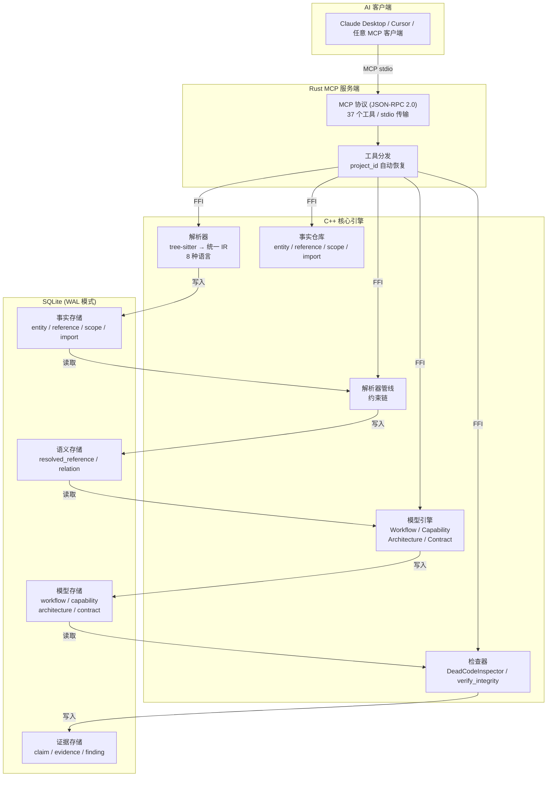
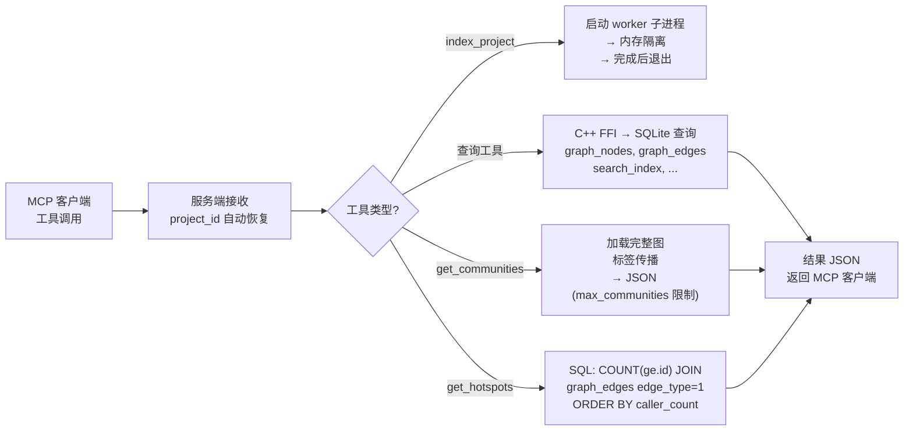
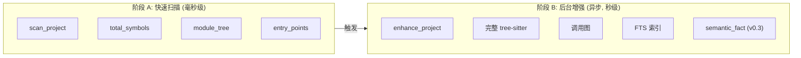

# CodeScope — 项目真相引擎

**CodeScope 不理解代码，它验证代码。**

它将源代码转化为可验证的事实、可理解的模型和可检查的证据 — 让 AI 能够根据现实验证断言，而非凭空编造。

**版本**: v0.2.4 | **许可证**: Apache 2.0

---

## 1. 什么是 CodeScope？

CodeScope 是一个 **项目真相引擎（Project Truth Engine）**，回答一个问题：

> **"代码真的做了你说的那些事吗？"**

不是"这段代码什么意思"，而是"代码到底有没有实现你声称的功能？"

它把源码索引为结构化的代码图（调用图 + 引用图 + 模块知识），然后暴露 **37 个 MCP 工具**，让 AI 代理可以定位符号、追踪调用路径、验证断言、检测文档漂移、分析架构 — 相比读取原始源文件，平均节省 **~98.9% 的 token 消耗**。

### 支持的语言（8 种）

| 语言 | 解析器 | IR 转换 | 已验证 |
|------|--------|---------|--------|
| Python | ✅ | ✅ | ✅ |
| Go | ✅ | ✅ | ✅ |
| C | ✅ | ✅ | ✅ |
| C++ | ✅ | ✅ | ✅ |
| Rust | ✅ | ✅ | ✅ |
| JavaScript | ✅ | ✅ | ✅ |
| TypeScript | ✅ | ✅ | ✅ |
| Java | ✅ | ✅ | ✅ |

### 技术栈

| 层 | 技术 |
|----|------|
| 解析器 | tree-sitter（统一 AST IR，8 种语言） |
| 索引引擎 | C++23（Clang 17+），SQLite（WAL 模式，FTS5） |
| 服务端 | Rust 2024 Edition，MCP 协议（JSON-RPC 2.0，stdio 传输） |
| 图存储 | SQLite（唯一图存储，CSR 邻接表实现亚毫秒级调用图查询） |
| 调度器 | 内置多进程并行索引器（chunk 级 work-stealing） |
| 构建 | CMake 3.30+（C++），Cargo（Rust） |

---

## 2. 架构



### 管线

```
源代码
    |
    v
Parser ------------ entity / reference / scope / import
    |
    v
Resolver ---------- resolved_reference / relation
    |
    v
Model Engine ------ workflow / capability / architecture / contract
    |
    v
Inspector --------- evidence / finding
```

### 查询流程



### 双阶段索引



---

## 3. 8 层智能过滤：为什么 36,919 个文件只索引了 6,029 个

CodeScope **不会**索引项目中的每一个文件。它通过 **8 层级联过滤** 剥离噪声，只保留真正的核心源码。

### 问题

一个典型项目（以 rustc 编译器为例）的文件分布：

```
总源码文件数:       36,919
  tests/            26,293  ← 71%: 测试套件
  src/tools/*/test/  3,802  ← 10%: 嵌入的测试目录
  library/*/test/      339  ←  1%: 库测试
  compiler/*/test/     118  ← <1%: 编译器测试
  docs/vendor/bench/   368  ←  1%: 文档、第三方依赖、基准测试
  ─────────────────────────────────────
  核心代码已索引:   6,029  ← 16%: 真正的源码
```

如果没有过滤，CodeScope 会把 84% 的时间浪费在索引测试、第三方依赖、文档和构建产物上——这些文件没人需要分析。

### 8 层过滤级联

```
第 1 层：任意深度跳过目录（约 120 个模式）
  .git, .svn, .hg, node_modules, .venv, target, build, dist,
  vendor, __pycache__, .github, deploy, docker, k8s, ...
  → 在任何深度捕获 VCS、构建产物、依赖、CI/CD、基础设施

第 2 层：仅顶层跳过目录（深度 ≤ 3，Java 安全）
  test, tests, docs, examples, samples, scripts, e2e, integration,
  assets, static, public, media, i18n, bench, benchmarks, ...
  → 对 Java 项目：保护包命名空间（org/.../samples/petclinic）

第 3 层：文件后缀跳过（永远应用）
  .md, .txt, .json, .yaml, .toml, .ini, .png, .jpg, .svg,
  .pdf, .zip, .tar, .min.js, .d.ts, ...
  → 非源码文件、文档、图片、压缩包

第 4 层：精确文件名跳过
  package-lock.json, yarn.lock, .DS_Store, Thumbs.db,
  .env, .env.local, .gitkeep, .gitignore, ...

第 5 层：文件名/目录前缀跳过
  文件前缀：._*, ~$*, #*#
  目录前缀：build_*, test_*, tmp_*

第 6 层：.gitignore 模式匹配
  尊重项目 .gitignore 中的每一条规则

第 7 层：.codescopeignore（用户自定义）
  每个项目可额外添加自定义忽略模式

第 8 层：文件大小限制 + 语言检测
  • 最大文件大小（默认 10 MB，可通过 CODESCOPE_MAX_FILE_SIZE 配置）
  • 无法检测语言的文件静默跳过
```

### 实际效果

| 项目 | 原始文件数 | 过滤后 | 过滤比例 | 节省时间 |
|------|:--------:|:------:|:--------:|:--------:|
| rustc（Rust 编译器） | 36,919 | **6,029** | 84% | ~2.5 分钟 |
| goagent（Go） | 2,651 | **1,254** | 53% | ~30 秒 |
| CodeScope（自身） | 356 | **168** | 53% | ~1 秒 |
| Linux 内核（完整） | 308,342 | **64,694** | 79% | ~12 分钟 |

### 强制覆盖：`force_index_files`

需要索引某个测试文件或第三方目录？使用 `force_index_files` MCP 工具——它会**绕过所有 8 层过滤**：

```bash
codescope cli force_index_files '{"paths":["/path/to/test/file.rs"]}'
```

---

## 4. 快速开始

### 前置依赖

| 平台 | 依赖 |
|------|------|
| **macOS** | Xcode CLT, cmake, Rust (1.85+) |
| **Linux** | build-essential, cmake, Rust (1.85+) |
| **Windows** ⚠️ **Beta** | MinGW-w64 14.0.0+，Rust `x86_64-pc-windows-gnu` 目标，cmake。所有图查询工具均通过内置 SQLite 图查询后端（CSR 邻接表）工作。|

### 安装预编译二进制

```bash
curl -fsSL https://raw.githubusercontent.com/Timwood0x10/CodeScope/main/install.sh | bash
export PATH="$PATH:$HOME/.codescope/bin"
```

### 源码编译

```bash
git clone https://github.com/Timwood0x10/CodeScope.git
cd CodeScope

# macOS:
brew install llvm@21 cmake pkg-config
cargo build --release

# Linux (Ubuntu):
sudo apt-get install -y build-essential cmake llvm-dev libclang-dev
cargo build --release
```

### 索引与查询

```bash
# 索引一个项目
codescope cli index_project '{"project_path":"/path/to/your/project"}'

# 快速概览
codescope cli project_overview '{}'

# 启动 MCP 服务端（供 AI 客户端使用）
codescope
```

### 大型项目

对于包含数千个文件的项目，使用内置的并行调度器：

```bash
codescope index-parallel /path/to/large/project
```

---

## 5. MCP 工具（37 个工具）

### 索引

| 工具 | 用途 | 参数 |
|------|------|------|
| `index_project` | 索引整个项目目录：解析所有源文件，构建 IR，构建代码图。 | `{"project_path": "string (必填)", "language_filter": "string (可选)"}` |
| `index_file` | 索引单个源文件。 | `{"file_path": "string (必填)"}` |
| `force_index_files` | 强制索引文件/目录，跳过默认排除规则（test/, docs/, node_modules/, .gitignore 等）。 | `{"paths": ["string (必填)"], "language_filter": "string (可选)"}` |

### 项目概览

| 工具 | 用途 | 参数 |
|------|------|------|
| `project_overview` | **主入口** — 全面的项目概览：语言、模块、符号、入口点、分析进度。 | `{}` |
| `get_graph_stats` | 快速统计：节点数、边数、文件数。 | `{}` |
| `get_module_tree` | 分层模块/目录树。 | `{}` |
| `get_entry_points` | 查找入口点（main/init/setup/run/handler）。 | `{}` |
| `get_routes` | 获取注册的 HTTP 路由（Gin/Echo/Chi/net/http）。 | `{}` |
| `get_type_info` | 查询类型定义（struct/enum/trait）及引用计数。 | `{"type_name": "string (可选)"}` |

### 符号查找

| 工具 | 用途 | 参数 |
|------|------|------|
| `find_symbol` | **推荐** — 按精确名称查找符号（类型、文件、行/列）。 | `{"symbol_name": "string (必填)"}` |
| `find_references` | 查找所有引用某个符号的位置。 | `{"symbol_name": "string (必填)", "file_filter": "string (可选)"}` |
| `explain_symbol` | 获取符号的完整信息：定义、调用者、被调用者、依赖关系。 | `{"symbol_name": "string (必填)"}` |
| `find_definition` | [已废弃 — 使用 find_symbol] | `{"symbol_name": "string (必填)"}` |

### 调用图

| 工具 | 用途 | 参数 |
|------|------|------|
| `find_callers` | 查找谁调用了某个函数。 | `{"symbol_name": "string (必填)", "file_filter": "string (可选)"}` |
| `find_callees` | 查找某个函数调用了什么。 | `{"symbol_name": "string (必填)", "file_filter": "string (可选)"}` |
| `codescope_trace` | 交互式递归调用探索（深度 + 方向）或最短路径。 | `{"function_name": "string", "depth": "integer (默认 1, 最大 5)", "direction": "callers|callees|both", "from": "string", "to": "string"}` |
| `trace_flow` | 递归执行流追踪（caller→callee 链）。 | `{"function_name": "string (必填)", "depth": "integer (默认 3, 最大 10)"}` |
| `shortest_path` | 两个函数之间的最短调用路径（BFS）。 | `{"from": "string", "to": "string", "from_id": "integer", "to_id": "integer"}` |
| `connected_components` | 调用图中的连通分量。 | `{}` |

### 图查询

| 工具 | 用途 | 参数 |
|------|------|------|
| `graph_query` | Cypher 风格 DSL 查询：`MATCH (Function:main)-[Calls]->(Method)`。 | `{"dsl": "string (必填)"}` |
| `get_graph` | 分页获取完整代码图。 | `{"node_offset": "integer", "node_limit": "integer (最大 50000)", "edge_offset": "integer", "edge_limit": "integer (最大 200000)", "node_types": "string", "edge_types": "string"}` |
| `get_subgraph` | 获取以某节点为中心的局部区域（1 跳）。 | `{"node_id": "integer (必填)", "radius": "integer", "node_types": "string", "edge_types": "string"}` |
| `get_neighbors` | 获取图节点的直接邻居（调用者 + 被调用者）。 | `{"node_id": "integer (必填)", "edge_type": "integer (默认 -1)", "radius": "integer"}` |

### 搜索

| 工具 | 用途 | 参数 |
|------|------|------|
| `search` | **推荐** — 统一搜索（基于 FTS5；本 sprint 已下线语义/向量搜索，FTS5 是唯一路径）。 | `{"query": "string (必填)", "limit": "integer (默认 20, 最大 100)"}` |
| `search_code` | [已废弃 — 使用 search] | `{"query": "string (必填)", "limit": "integer"}` |

### 验证

| 工具 | 用途 | 参数 |
|------|------|------|
| `verify_integrity` | 检查 README 中承诺的功能是否确实存在于代码中。 | `{}` |
| `verify_claim` | 验证单个断言（capability_exists / contract_holds / architecture_follows）。 | `{"claim": "string (必填)"}` |
| `verify_summary` | 解析自然语言摘要并验证每个断言。 | `{"text": "string (必填)"}` |
| `verify_review` | 验证代码审查评论中的断言。 | `{"text": "string (必填)"}` |
| `verify_reality` | 验证 AI 对项目状态的单个陈述。 | `{"text": "string (必填)"}` |

### 漂移检测

| 工具 | 用途 | 参数 |
|------|------|------|
| `detect_drift` | 扫描所有声明的能力和合约，检测文档与代码之间的漂移。 | `{}` |
| `detect_documentation_drift` | 检查 README 中的语言支持声明与实际代码实体是否一致。 | `{}` |
| `detect_capability_drift` | 检查声明的能力是否有对应的实现实体。 | `{}` |
| `detect_architecture_drift` | 检查调用边是否存在架构层违规（Repository→Controller）。 | `{}` |

### 变更影响与模块

| 工具 | 用途 | 参数 |
|------|------|------|
| `detect_changes` | 分析修改文件的调用图影响范围。 | `{"modified_files": "string (必填)"}` |
| `explain_module` | 构建模块知识卡片：实体、能力、完整性评分。 | `{"module_name": "string (必填)"}` |

### 实用工具

| 工具 | 用途 | 参数 |
|------|------|------|
| `detect_ffi_boundaries` | 检测 FFI 边界（extern/C、JNI、WASM、C ABI）。 | `{}` |
| `count_tokens` | 估算文本的 token 数（DeepSeek 公式）。 | `{"text": "string (必填)"}` |

### 快速决策指南

```
新项目            → project_overview
模块结构          → get_module_tree
入口点            → get_entry_points
搜索代码          → search
调用链            → find_callers / find_callees
符号深度分析      → explain_symbol
HTTP 路由         → get_routes
类型信息          → get_type_info
验证断言          → verify_claim
检测漂移          → detect_documentation_drift
变更影响分析      → detect_changes
```

---

## 6. 知识图谱

CodeScope 在验证管线的副产品中构建了一个**模块级知识图谱**。它学习的是结构化的元数据 — 项目如何组织、什么重要、什么冗余、承诺了什么：

| 层级 | 表 | 用途 |
|------|-----|------|
| **调用图** | `relation`, `architecture_edge` | 跨模块调用依赖；驱动 `detect_architecture_drift` |
| **模块健康度** | `module_summary` | 每个模块的 `incoming_count` / `outgoing_count` / `dead_entities` / `utilization` / `role` |
| **模块依赖** | `architecture_edge`, `module_edge` | "修改模块 A → 这些模块依赖于它" |
| **文档化能力** | `capability` + `document` | 从 README 中提取的能力声明；驱动 `detect_capability_drift` / `verify_claim` |

所有知识层表均可通过 `get_knowledge_graph` 直接查询：

```jsonc
get_knowledge_graph {"table":"architecture_edge","limit":5}
// → {"table":"architecture_edge","rows":[...],"total":3351}

get_knowledge_graph {"table":"capability","limit":10}
// → {"table":"capability","rows":[...],"total":3}
```

支持的表：`entity`, `relation`, `architecture_edge`, `module_edge`, `capability`, `document`, `module_summary`。

---

## 7. 性能基准

所有基准测试在 **Apple M3 Max（36 GB RAM）** 上测得。其他硬件会产生不同的结果 — 性能较低的机器上预期会慢一些。

### 索引时间

| 项目 | 文件数 | 节点数 | 边数 | 索引时间 | 峰值内存 |
|------|------:|------:|------:|---------:|---------:|
| **CodeScope**（自身，C++/Rust） | 212 | 1,387 | 1,895 | **1.0 秒** | ~150 MB |
| **memscope-rs**（Rust） | 215 | 4,344 | — | **~2 秒** | ~200 MB |
| **ARES**（Go） | 1,254 | 18,798 | 4,475 | **4.3 秒** | ~500 MB |
| **rustc**（Rust 编译器，monorepo） | 6,029 | 81,039 | 63,697 | **18.7 秒** | 5.9 GB |
| **Linux 内核**（完整） | 64,694 | 12M | — | **3 分 07 秒** | — |

### 查询延迟（SQLite 图查询后端）

所有图查询均基于内置 SQLite 图查询后端（CSR 邻接表），典型调用图查询为亚毫秒级。

| 查询 | 延迟 | 说明 |
|------|:----:|------|
| `get_graph_stats` | ~0.1 ms | SQL 聚合 |
| `find_callers("buildGraph")` | ~0.2 ms | 名称过滤（sub-ms） |
| `find_callees("buildGraph")` | ~0.2 ms | 返回 54 个被调用者 |
| `graph_query`（LIMIT 100） | ~37 ms | 2,590 条边，JOIN 优化全扫描 |
| `shortest_path` | sub-ms | O(E) CSR BFS |
| `get_neighbors` | sub-ms | O(degree) CSR 邻接 |
| `get_subgraph` | sub-ms | O(E) CSR BFS |

### 微基准

| 指标 | 值 |
|------|----|
| 引擎初始化 | **14.6 ms** |
| 索引吞吐量 | **1,533 KB/s** |
| 符号定义查询 | **0.01–0.03 ms** |
| 调用者/被调用者查询 | **0.01–0.02 ms** |
| 9 次查询（总计） | **0.17 ms** |
| 查询延迟（stdio MCP，含进程启动） | **~60 ms** |

### 跨文件解析

| 项目 | 跨文件 CALLS | 占 CALLS 总数百分比 |
|------|:-----------:|:------------------:|
| CodeScope（C++） | 23 | 0.1% |
| goagent（Go） | 49,258 | 86% |
| Linux 内核（C） | 1,502,432 | 40% |

### 快速扫描（轻量，毫秒级）

| 项目 | 时间 | 语言 | 符号数 |
|------|:----:|:----:|:------:|
| **CodeScope**（自身） | **32 ms** | cpp, rust, c | 2,902 |
| **goagent**（Go） | **493 ms** | go, c, cpp, python | 5,172 |
| **Linux 内核**（核心） | **360 ms** | c | 40,335 |

### Token 节省

使用代码图代替原始源文件，平均节省 **~98.9% 的 token**：

| 场景 | 原始代码 | CodeScope | 节省 |
|------|:--------:|:---------:|:----:|
| 查找函数定义 | ~2,265 tokens | ~21 tokens | **99.1%** |
| 追踪函数调用者 | ~2,000 tokens | ~18 tokens | **99.1%** |
| 项目架构概览 | ~1,875 tokens | ~32 tokens | **98.3%** |
| USB 子系统概览 | ~24,000 tokens | ~250 tokens | **99.0%** |
| 调度器分析 | ~15,000 tokens | ~180 tokens | **98.8%** |

---

## 8. Skills（Shell 封装脚本）

`skills/` 目录提供了一系列 Shell 脚本，封装了常用的 CodeScope 查询，无需记忆 JSON 参数格式：

```bash
cd CodeScope

# 索引项目
./skills/index.sh ~/path/to/project

# 一次性完整分析报告
./skills/analyze.sh ~/path/to/project

# 图统计
./skills/stats.sh

# 模块树
./skills/modules.sh

# 追踪调用路径 A → B
./skills/trace.sh func_a func_b

# 前 20 个热点函数
./skills/hotspots.sh 20

# 浏览架构依赖
./skills/knowledge.sh architecture_edge 20
```

每个脚本内部调用 `codescope cli <tool_name> '<json_args>'`。详见 `skills/skills.md`。

---

## 9. 环境变量

| 变量 | 默认值 | 说明 |
|------|--------|------|
| `CODESCOPE_DB_PATH` | `.codescope/codescope.db` | SQLite 数据库路径 |
| `CODESCOPE_INDEX_MODE` | `standard` | 索引模式：`fast` / `standard` / `strict` |
| `CODESCOPE_EXCLUDE_PATHS` | （未设置） | 逗号分隔的 glob 排除模式 |
| `CODESCOPE_WORKERS` | `4` | `index-parallel` 的解析 worker 核心数 |
| `CODESCOPE_WORKER_TIMEOUT` | `300` | Worker 子进程超时时间（秒） |
| `CODESCOPE_MAX_FILE_SIZE` | （未设置） | 允许索引的最大源文件大小（字节） |
| `CODESCOPE_MMAP_SIZE` | 256 MB | SQLite `mmap_size` 参数值 |
| `CODESCOPE_MEM_LIMIT_MB` | `4096` | 动态调度器内存上限（MB） |
| `CODESCOPE_DYNAMIC_SCHED` | `auto` | 动态 CPU 调度：`1` 开启，`0` 关闭，未设置 = 自动 |
| `CODESCOPE_VERBOSE` | `0` | 设为 `1` 开启详细日志 |
| `CODESCOPE_LSP` | （未设置） | 类型增强的 LSP 服务端命令 |

---

## 10. 备用方案：语义搜索（Embedding）— 暂缓

**当前状态**：向量/语义搜索已**下线**（Step 10 决策）——`buildVectorsFromGraph` 为 no-op、`searchSemantic` 已 stub、能力报告返回 `"available":false,"unavailable_reason":"sunset","mode":"fts"`。`search_code` 使用 FTS5（词 + trigram），已覆盖基于标识符的搜索。当前未集成任何 embedding 模型。

**备用选型（若将来恢复语义搜索）**：**jina-embeddings-v2-base-code**（161M 参数，encoder-only 编码器——**非 LLM**，不生成文本）。
- ✅ 明确支持 C/C++ 与 Rust，8k 上下文，可导出 ONNX
- ✅ Apache-2.0 许可证
- 备选：StarEncoder（125M，The Stack 80+ 语言）。`all-MiniLM-L6-v2` 是 **NL 句子模型——不适合代码**（384 维只是巧合）。
- 注意：其输出为 **768 维**，与当前 `TARGET_DIM=384` 约束冲突。

**计划接入路径（若恢复）**：
1. 本地 ONNX Runtime 运行模型（161M，无外部 API）。
2. Schema：`TARGET_DIM` 384 → 768（或加投影层）。
3. 修复 `insertEmbedding` 使用 canonical `entity.id`（当前读取 legacy `graph_nodes`）。
4. 实现真实的 `searchSemantic` / `buildVectorsFromGraph` 读写路径。
5. readiness 采用数据不变量：`vector_ready = valid_vectors / eligible_entities`（不设假 ready 标志）。

这是完整功能开发（模型依赖 + schema 变更 + 端到端管线）——有意推迟，优先保障调用图精度工作。

---

## 11. 许可证

Apache 2.0 — 详见 [LICENSE](LICENSE)。

**CodeScope v0.2.4** — 使用 Rust 2024 + C++23 + tree-sitter + SQLite 构建。