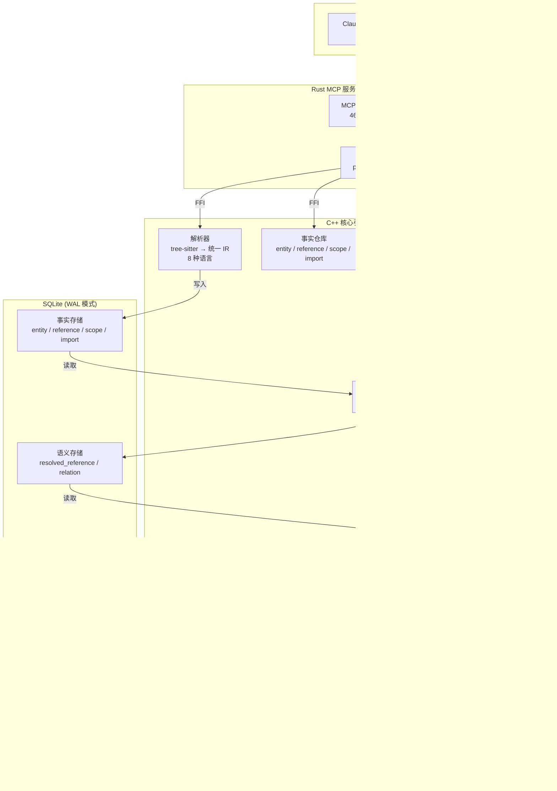
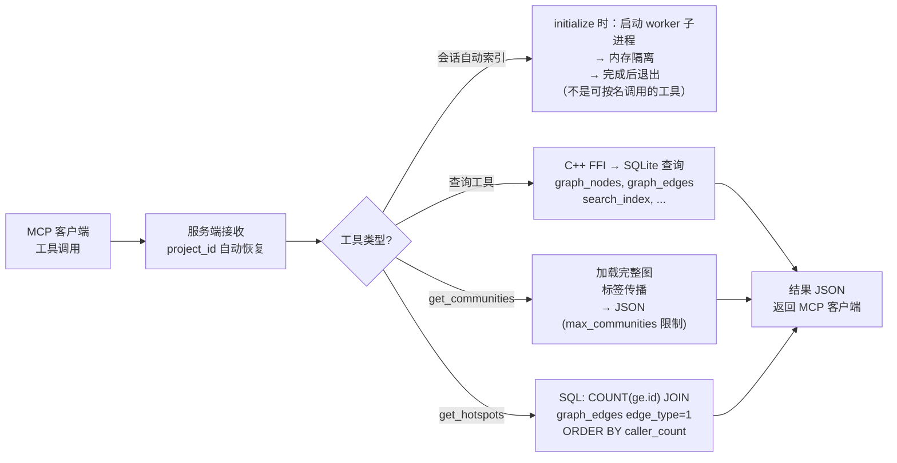
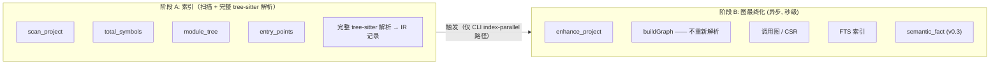

# CodeScope — 项目真相引擎

**CodeScope 不理解代码，它验证代码。**

它将源代码转化为可验证的事实、可理解的模型和可检查的证据 — 让 AI 能够根据现实验证断言，而非凭空编造。

**版本**: v0.2.7 | **许可证**: Apache 2.0

---

## 1. 什么是 CodeScope？

CodeScope 是一个 **项目真相引擎（Project Truth Engine）**，回答一个问题：

> **"代码真的做了你说的那些事吗？"**

不是"这段代码什么意思"，而是"代码到底有没有实现你声称的功能？"

它把源码索引为结构化的代码图（调用图 + 引用图 + 模块知识），然后暴露 **46 个 MCP 工具**，让 AI 代理可以定位符号、追踪调用路径、验证断言、检测文档漂移、分析架构 — 相比读取原始源文件，平均节省 **~98.9% 的 token 消耗**。

### 支持的语言（8 种）

| 语言 | 解析器 | IR 转换 | 已验证 |
|------|--------|---------|--------|
| Python | ✅ | ✅ | ✅ |
| Go | ✅ | ✅ | ✅ |
| C | ✅ | ✅ | ✅ |
| C++ | ✅ | ✅ | ✅ |
| Rust | ✅ | ✅ | ✅ |
| JavaScript | ✅ | ✅ | ✅ |
| TypeScript | ✅ | ✅ | ✅ |
| Java | ✅ | ✅ | ✅ |

**「已验证」的含义**：该语言有一份自动化测试**断言真实产生了语义记录**（具名调用、方法声明或接口实现），而不只是断言响应 JSON 里出现了预期字段。这些用例位于 `engine/tests/test_ir_edge_coverage.cpp`。此前各语言的 E2E 只检查 JSON 里是否存在 `"callers"` / `"callees"` / `"total_nodes"` 字符串，因此一个**一条边都不发**的转换器也能通过整个测试套件。

**已知限制**（如实记录而非静默丢弃）：

- **Rust**：宏调用（`println!`、`vec!`、用户 `foo!()`）会按宏名记录为调用。tree-sitter 不做宏展开，因此**宏体生成**的代码不在图中，宏也只按名字匹配。
- **JavaScript**：`class A extends B` 不会记录为 `InterfaceImpl`（JS 没有 `implements` 子句）；extends 的表达式仍会被访问。TypeScript/TSX 的 `implements` 子句**会**记录。
- **推断是尽力而为**：接收者类型来自局部声明、复合字面量与 `this`/`self`；动态类型的接收者保持未知。
- **病态深嵌套 AST 会被截断，而不是完整遍历**：当文件的 AST 嵌套超过 `kMaxVisitDepth`（250）时，更深的子树会被跳过，并在 stderr 上按文件报告一次
  （`[module=ir, method=…] AST nesting exceeded kMaxVisitDepth=250`）。该上限存在的原因是递归遍历运行在索引器 512 KB 的 worker 栈上；手写代码不会触及，生成代码偶尔会。
- **部分扩展名可识别但不解析**：`.kt`/`.kts`、`.rb`、`.scala`、`.swift` 会被识别（计入候选文件），但没有内置语法，因此被跳过并在 `parse_failures` 中记录为 `language_missing` —— 可用 `codescope parse-failures` 查看，绝不静默丢弃，每次运行都会重试，且不计入 `CODESCOPE_FAIL_RETRY_MAX` 的 fail-fast 跳过。Swift 的 `parser.c` 与内置 tree-sitter core 的 ABI 不兼容，因此其语法、visitor 与 builtin 表均不存在（见 `engine/src/parser/parser.cpp`）。
- **同一文件在各入口之间保持同一身份。** 目录遍历类入口按传入的写法记录路径，而单文件入口（`force_index_files`、调度器的 `--file-list` 重试）拿到的是 `std::fs::canonicalize` 之后的路径。通过符号链接路径索引（macOS 上 `/tmp/x` 实为 `/private/tmp/x`，任何被软链的工作区同理）之后再对其中的文件做 force-index，过去会把同一个文件存成两种写法并**复制其符号** —— `find_symbol` 会把同一个符号返回两次。现在已存写法会被复用：既覆盖「相对于项目根」的各种写法，也在第二遍里接受任何**规范化形式与被查路径相等**的绝对路径行（相等判定，不是猜测，因此绝不会把两个文件合成一个身份）；相对写法只要其前缀能从索引时的当前目录解析到项目根，也会被识别。仍未覆盖、且按既定取向保留旧行为（宁可保持旧行为也不猜）的情形：Windows 路径（缩小范围的模式用 `/`），以及索引时的工作目录已不再是当前目录的相对写法。旧版本写入的行仍会保留多出来的写法 —— 重新索引只按「正在写入的那个写法」删除 entity 行，因此重复的失败行用 `codescope reset-failures` 清掉，重复的符号需要重建数据库（删除 `.codescope/codescope.db` 后重新索引）。

### 技术栈

| 层 | 技术 |
|----|------|
| 解析器 | tree-sitter（统一 AST IR，8 种语言） |
| 索引引擎 | C++23（Clang 17+），SQLite（WAL 模式，FTS5） |
| 服务端 | Rust 2024 Edition，MCP 协议（JSON-RPC 2.0，stdio 传输） |
| 图存储 | SQLite（唯一图存储，CSR 邻接表实现亚毫秒级调用图查询） |
| 调度器 | 内置多进程并行索引器（默认静态比例分配；`CODESCOPE_CPU_DYNAMIC=1` 可启用共享 chunk 队列） |
| 构建 | CMake 3.30+（C++），Cargo（Rust） |

---

## 2. 架构


```mermaid
graph TB
    subgraph "AI 客户端"
        Client["Claude Desktop / Cursor / 任意 MCP 客户端"]
    end

    subgraph "Rust MCP 服务端"
        MCP["MCP 协议 (JSON-RPC 2.0)<br/>46 个工具 / stdio 传输"]
        DISPATCH["工具分发<br/>project_id 自动恢复"]
    end

    subgraph "C++ 核心引擎"
        PARSER["解析器<br/>tree-sitter → 统一 IR<br/>8 种语言"]
        FACTS["事实仓库<br/>entity / reference / scope / import"]
        RESOLVER["解析器管线<br/>约束链"]
        MODEL["模型引擎<br/>Workflow / Capability<br/>Architecture / Contract"]
        INSPECTOR["检查器<br/>DeadCodeInspector / verify_integrity"]
    end

    subgraph "SQLite (WAL 模式)"
        F_STORE["事实存储<br/>entity / reference / scope / import"]
        S_STORE["语义存储<br/>resolved_reference / relation"]
        M_STORE["模型存储<br/>workflow / capability<br/>architecture / contract"]
        E_STORE["证据存储<br/>claim / evidence / finding"]
    end

    Client -->|"MCP stdio"| MCP
    MCP --> DISPATCH
    DISPATCH -->|"FFI"| PARSER
    DISPATCH -->|"FFI"| FACTS
    DISPATCH -->|"FFI"| RESOLVER
    DISPATCH -->|"FFI"| MODEL
    DISPATCH -->|"FFI"| INSPECTOR

    PARSER -->|"写入"| F_STORE
    F_STORE -->|"读取"| RESOLVER
    RESOLVER -->|"写入"| S_STORE
    S_STORE -->|"读取"| MODEL
    MODEL -->|"写入"| M_STORE
    M_STORE -->|"读取"| INSPECTOR
    INSPECTOR -->|"写入"| E_STORE
```

### 管线

```
源代码
    |
    v
Parser ------------ entity / reference / scope / import
    |
    v
Resolver ---------- resolved_reference / relation
    |
    v
Model Engine ------ workflow / capability / architecture / contract
    |
    v
Inspector --------- evidence / finding
```

### 查询流程


```mermaid
flowchart LR
    Q["MCP 客户端<br/>工具调用"] --> Q1["服务端接收<br/>project_id 自动恢复"]
    Q1 --> Q2{"工具类型?"}
    Q2 -->|"会话自动索引"| Q3["initialize 时：启动 worker 子进程<br/>→ 内存隔离<br/>→ 完成后退出<br/>（不是可按名调用的工具）"]
    Q2 -->|"查询工具"| Q4["C++ FFI → SQLite 查询<br/>graph_nodes, graph_edges<br/>search_index, ..."]
    Q2 -->|"get_communities"| Q5["加载完整图<br/>标签传播<br/>→ JSON (max_communities 限制)"]
    Q2 -->|"get_hotspots"| Q6["SQL: COUNT(ge.id) JOIN<br/>graph_edges edge_type=1<br/>ORDER BY caller_count"]
    Q4 --> R["结果 JSON<br/>返回 MCP 客户端"]
    Q5 --> R
    Q6 --> R
```

### 双阶段索引


```mermaid
flowchart LR
    subgraph A["阶段 A: 索引（扫描 + 完整 tree-sitter 解析）"]
        S1["scan_project"]
        S2["total_symbols"]
        S3["module_tree"]
        S4["entry_points"]
        S5["完整 tree-sitter 解析 → IR 记录"]
    end

    subgraph B["阶段 B: 图最终化 (异步, 秒级)"]
        E1["enhance_project"]
        E2["buildGraph —— 不重新解析"]
        E3["调用图 / CSR"]
        E4["FTS 索引"]
        E5["semantic_fact (v0.3)"]
    end

    A -->|"触发（仅 CLI index-parallel 路径）"| B
```

**解析发生在哪里**：完整的 tree-sitter 解析在**阶段 A**完成，不在阶段 B。阶段 B（`enhance_project`）是一个轻量的 *GraphFinalize* 步骤 —— `buildGraph` → `buildFTSFromGraph` → `resolveStagedMetrics` → semantic_fact 抽取 → 模型构建，**从不重新解析或重新转换**（`engine_queries.cpp`）。

**阶段 B 何时自动运行**：只有 CLI 路径（`codescope index-parallel`）在合并后触发它（`server/src/main.rs`）。MCP 会话自动索引（§5 的 `index_project`）只触发 FTS 构建；如果你需要在 MCP 会话内完成整图最终化，请显式调用 `enhance_project`。


---

## 3. 8 层智能过滤：为什么 36,919 个文件只索引了 6,029 个

CodeScope **不会**索引项目中的每一个文件。它通过 **8 层级联过滤** 剥离噪声，只保留真正的核心源码。

### 问题

一个典型项目（以 rustc 编译器为例）的文件分布：

```
总源码文件数:       36,919
  tests/            26,293  ← 71%: 测试套件
  src/tools/*/test/  3,802  ← 10%: 嵌入的测试目录
  library/*/test/      339  ←  1%: 库测试
  compiler/*/test/     118  ← <1%: 编译器测试
  docs/vendor/bench/   368  ←  1%: 文档、第三方依赖、基准测试
  ─────────────────────────────────────
  核心代码已索引:   6,029  ← 16%: 真正的源码
```

如果没有过滤，CodeScope 会把 84% 的时间浪费在索引测试、第三方依赖、文档和构建产物上——这些文件没人需要分析。

### 8 层过滤级联

```
第 1 层：任意深度跳过目录（约 150 个模式）
  .git, .svn, .hg, node_modules, .venv, target, build, dist,
  vendor, __pycache__, .github, deploy, docker, k8s, ...
  → 在任何深度捕获 VCS、构建产物、依赖、CI/CD、基础设施

第 2 层：仅顶层跳过目录（深度 ≤ 3，Java 安全）
  test, tests, docs, examples, samples, scripts, e2e, integration,
  assets, static, public, media, i18n, bench, benchmarks, ...
  → 对 Java 项目：保护包命名空间（org/.../samples/petclinic）

第 3 层：文件后缀跳过（永远应用）
  .md, .txt, .json, .yaml, .toml, .ini, .png, .jpg, .svg,
  .pdf, .zip, .tar, .min.js, .d.ts, ...
  → 非源码文件、文档、图片、压缩包

第 4 层：精确文件名跳过
  package-lock.json, yarn.lock, .DS_Store, Thumbs.db,
  .env, .env.local, .gitkeep, .gitignore, ...

第 5 层：文件名/目录前缀跳过
  文件前缀：.env.*, docker-compose.*（以及以 `~` 结尾的编辑器备份文件）
  目录前缀：build_*, cmake-build-*, _build, tools-*, tools_*

第 6 层：.gitignore 模式匹配
  尊重项目 .gitignore 中的每一条规则

第 7 层：.codescopeignore（用户自定义）
  每个项目可额外添加自定义忽略模式

第 8 层：文件大小限制 + 语言检测
  • 最大文件大小（默认 5 MB = 5242880 字节，可通过 CODESCOPE_MAX_FILE_SIZE 配置）
  • 无法检测语言的文件静默跳过
```

> **层号是分类，不是执行顺序。** 跳过判定是布尔或，因此只有**结果**可观测，但检查的实际执行顺序是（`FilterPolicy::shouldSkipEntry`）：路径分量（第 1/2 层）**加上第 6 层 `.gitignore` 与第 7 层 `.codescopeignore`** → bundle 后缀 → 第 4 层精确文件名 + 第 5 层前缀 → 第 3 层后缀 → STRICT 门 → 用户 `CODESCOPE_EXCLUDE_PATHS` 最后作为覆盖。

### 实际效果

| 项目 | 原始文件数 | 过滤后 | 过滤比例 | 节省时间 |
|------|:--------:|:------:|:--------:|:--------:|
| rustc（Rust 编译器） | 36,919 | **6,029** | 84% | ~2.5 分钟 |
| CodeScope（自身） | 356 | **168** | 53% | ~1 秒 |

### 强制覆盖：`force_index_files`

需要索引某个测试文件或第三方目录？使用 `force_index_files` MCP 工具——它会**绕过所有 8 层过滤**：

```bash
codescope cli force_index_files '{"paths":["/path/to/test/file.rs"]}'
```

---

## 4. 快速开始

### 前置依赖

| 平台 | 依赖 |
|------|------|
| **macOS** | Xcode CLT, cmake, Rust (1.85+) |
| **Linux** | build-essential, cmake, Rust (1.85+) |
| **Windows** ⚠️ **Beta** | MinGW-w64 14.0.0+，Rust `x86_64-pc-windows-gnu` 目标，cmake。所有图查询工具均通过内置 SQLite 图查询后端（CSR 邻接表）工作。|

### 安装预编译二进制

> 初次使用？[`docs/QUICK_START.md`](docs/QUICK_START.md) 是 5 分钟上手路径 —— 安装、索引一个项目、
> 连接 MCP 客户端、跑通第一批查询。

```bash
curl -fsSL https://raw.githubusercontent.com/Timwood0x10/CodeScope/main/install.sh | bash
export PATH="$PATH:$HOME/.codescope/bin"
```

> **macOS 代码签名问题**：如果下载后二进制启动就被 kill（退出码 137 / SIGKILL），在本地重新签名即可：
> ```bash
> codesign --sign - --force ~/.codescope/bin/codescope
> ```
> 这是因为 CI 编译的二进制使用的是 ad-hoc 签名，较新的 macOS 版本可能会拒绝执行。用本地机器身份重新签名即可解决。

### 源码编译

```bash
git clone https://github.com/Timwood0x10/CodeScope.git
cd CodeScope

# macOS:
brew install llvm@21 cmake pkg-config
cargo build --release

# Linux (Ubuntu):
sudo apt-get install -y build-essential cmake llvm-dev libclang-dev
cargo build --release
```

### 索引与查询

```bash
# 索引一个项目（按模块派生子进程，内存相互隔离）
codescope index-parallel /path/to/your/project

# 快速概览
codescope cli project_overview '{}'

# 启动 MCP 服务端（供 AI 客户端使用）
codescope
```

### 大型项目

对于包含数千个文件的项目，可以调整内置并行调度器的规模：

```bash
codescope index-parallel /path/to/large/project --workers 8 --parallel 4
```

`--workers` 为解析 worker 核心总数（默认 8），`--parallel` 为并发模块 worker 上限（默认 4）。

### 维护

```bash
# 列出解析器无法解析的文件（含原因与重试次数）
codescope parse-failures --limit 50

# 清空它们，使这些文件在下次运行中被重新尝试
codescope reset-failures
```

两者都接受 `--db <path>`（或环境变量 `CODESCOPE_DB_PATH`），作用于该数据库中最近的项目。仅因缺少语法而失败的文件（如 `.swift`）本来每次运行都会重试，无需 reset。

---

## 5. MCP 工具（46 个工具）

这里列出的 46 个工具正是 `tools/list` 广播的（`server/src/tools/catalog.rs`）与按名分发的（`server/src/tools/mod.rs` 的 `TOOL_HANDLERS`）—— 两个集合完全一致，不存在「广播了但没有处理器」或「有处理器但没广播」的工具。

> **stdio 传输对单条响应有 1 MiB 上限。** 超过上限的工具结果会被替换为一条 JSON-RPC 错误（`-32000`），其中给出实际字节数并建议缩小查询范围或调小 limit —— **绝不静默截断**。大结果请用各工具自带的参数收窄（`graph_query` 的 DSL 里写 `LIMIT`，以及 `limit`/`node_limit`/`edge_limit`/`max_findings` 等）。

### 索引

> **`index_project` 仅限会话内自动运行，不可按名调用。** 它既不在 `tools/list` 中，也不在工具分发表里，因此
> `tools/call {"name":"index_project"}` 会返回
> `{"error":"Unknown tool: index_project …"}`。每个 MCP 会话在 `initialize` 时自动运行一次 worker 子进程索引
> （`server/src/mcp/server.rs`）。命令行/Agent 等价入口是 `codescope index-parallel <dir>`；
> `codescope cli index_project` **不是**有效调用。若需要在会话内完成整图最终化，请显式调用
> `enhance_project`（见 §2）。

| 工具 | 用途 | 参数 |
|------|------|------|
| `index_file` | 索引单个源文件。 | `{"file_path": "string (必填)"}` |
| `force_index_files` | 强制索引文件/目录，跳过默认排除规则（test/, docs/, node_modules/, .gitignore 等）。 | `{"paths": ["string (必填)"], "language_filter": "string (可选)"}` |

### 项目概览

| 工具 | 用途 | 参数 |
|------|------|------|
| `project_overview` | **主入口** — 全面的项目概览：语言、模块、符号、入口点、分析进度。 | `{}` |
| `get_graph_stats` | 快速统计：节点数、边数、文件数。 | `{}` |
| `get_module_tree` | 分层模块/目录树。 | `{}` |
| `get_entry_points` | 查找入口点（main/init/setup/run/handler）。 | `{}` |
| `get_routes` | 获取注册的 HTTP 路由（Gin/Echo/Chi/net/http）。 | `{}` |
| `get_type_info` | 查询类型定义（struct/enum/trait）及引用计数。 | `{"type_name": "string (可选)"}` |

### 符号查找

| 工具 | 用途 | 参数 |
|------|------|------|
| `find_symbol` | **推荐** — 按精确名称查找符号（类型、文件、行/列）。 | `{"symbol_name": "string (必填)"}` |
| `find_references` | 查找所有引用某个符号的位置。 | `{"symbol_name": "string (必填)", "file_filter": "string (可选)"}` |
| `explain_symbol` | 获取符号的完整信息：定义、调用者、被调用者、依赖关系。 | `{"symbol_name": "string (必填)"}` |
| `find_definition` | [已废弃 — 使用 find_symbol] | `{"symbol_name": "string (必填)"}` |

### 调用图

| 工具 | 用途 | 参数 |
|------|------|------|
| `find_callers` | 查找谁调用了某个函数。 | `{"symbol_name": "string (必填)", "file_filter": "string (可选)"}` |
| `find_callees` | 查找某个函数调用了什么。 | `{"symbol_name": "string (必填)", "file_filter": "string (可选)"}` |
| `codescope_trace` | 交互式递归调用探索（深度 + 方向）或最短路径。 | `{"function_name": "string", "depth": "integer (默认 1, 最大 5)", "direction": "callers|callees|both", "from": "string", "to": "string"}` |
| `trace_flow` | 递归执行流追踪（caller→callee 链）。 | `{"function_name": "string (必填)", "depth": "integer (默认 3, 最大 10)"}` |
| `shortest_path` | 两个函数之间的最短调用路径（BFS）。 | `{"from": "string", "to": "string", "from_id": "integer", "to_id": "integer"}` |
| `connected_components` | 调用图中的连通分量。 | `{}` |
| `get_communities` | **新增** — 通过确定性的标签传播检测调用图中的社区（聚类）。返回 `{communities:[{id,label,member_count}], total_communities, returned_communities, inter_community_edges, truncated}`；除非 `include_members` 为 true，否则不返回成员列表。 | `{"max_communities": "integer（默认 20，上限 500）", "include_members": "boolean（默认 false）", "max_members": "integer（默认 10，上限 200）"}` |

### 图查询

| 工具 | 用途 | 参数 |
|------|------|------|
| `graph_query` | Cypher 风格 DSL 查询：`MATCH (Function:main)-[Calls]->(Method)`，尾部可跟可选子句：`LIMIT <n>`（**生效**，响应会附带 `truncated: true`）与 `RETURN <fields>`（接受但当前无效果）。其它尾部文本一律报错。大图上务必用 `LIMIT` —— 宽泛模式可能超过 1 MiB 传输上限（见表格上方的说明）。 | `{"dsl": "string (必填)"}` |
| `get_graph` | 分页获取完整代码图。 | `{"node_offset": "integer", "node_limit": "integer (最大 50000)", "edge_offset": "integer", "edge_limit": "integer (最大 200000)", "node_types": "string", "edge_types": "string"}` |
| `get_subgraph` | 获取以某节点为中心的局部区域（1 跳）。 | `{"node_id": "integer (必填)", "radius": "integer", "node_types": "string", "edge_types": "string"}` |
| `get_neighbors` | 获取图节点的直接邻居（调用者 + 被调用者）。 | `{"node_id": "integer (必填)", "edge_type": "integer (默认 -1)", "radius": "integer"}` |
| `get_knowledge_graph` | 直查知识层表。支持表：`entity`、`relation`、`architecture_edge`、`module_edge`、`capability`、`document`、`module_summary`（见 §6）。 | `{"table": "string (必填)", "limit": "integer (默认 100, 最大 1000)"}` |

### 搜索

| 工具 | 用途 | 参数 |
|------|------|------|
| `search` | **推荐** — 统一搜索：FTS5 精确/前缀匹配，并在结果不足时由 **n-gram 语义向量检索**补充（v0.2.5 恢复；词法相似度，无需外部模型）。 | `{"query": "string (必填)", "limit": "integer (默认 20, 最大 100)"}` |
| `search_code` | [已废弃 — 使用 search] | `{"query": "string (必填)", "limit": "integer"}` |

### 验证

| 工具 | 用途 | 参数 |
|------|------|------|
| `verify_integrity` | 检查 README 中承诺的功能是否确实存在于代码中。 | `{}` |
| `verify_claim` | 验证单个断言。`claim` 是 **JSON 对象字符串**，不是自然语言：`{"type": "capability_exists \| contract_holds \| architecture_follows \| function_implements", "subject": "符号/模块/契约", "predicate": "可选补充"}`。缺省或无法识别的 `type` 会返回 `error_code: claim_type_unsupported`，不会被猜测性兜底。 | `{"claim": "string (必填，JSON 对象)"}` |
| `verify_summary` | 解析自然语言摘要并验证每个断言。 | `{"text": "string (必填)"}` |
| `verify_review` | 验证代码审查评论中的断言。 | `{"text": "string (必填)"}` |
| `verify_reality` | 验证 AI 对项目状态的单个陈述。 | `{"text": "string (必填)"}` |

### 漂移检测

| 工具 | 用途 | 参数 |
|------|------|------|
| `detect_drift` | 扫描所有声明的能力和合约，检测文档与代码之间的漂移。 | `{}` |
| `detect_documentation_drift` | 检查 README 中的语言支持声明与实际代码实体是否一致。 | `{}` |
| `detect_capability_drift` | 检查声明的能力是否有对应的实现实体。 | `{}` |
| `detect_architecture_drift` | 检查调用边是否存在架构层违规（Repository→Controller）。 | `{}` |

### 变更影响与模块

| 工具 | 用途 | 参数 |
|------|------|------|
| `detect_changes` | 分析修改文件的调用图影响范围。 | `{"modified_files": "string (必填)"}` |
| `explain_module` | 构建模块知识卡片：实体、能力、完整性评分。 | `{"module_name": "string (必填)"}` |

### 实用工具

| 工具 | 用途 | 参数 |
|------|------|------|
| `detect_ffi_boundaries` | 检测 FFI 边界（extern/C、JNI、WASM、C ABI）。 | `{}` |
| `count_tokens` | 估算文本的 token 数（DeepSeek 公式）。 | `{"text": "string (必填)"}` |

### 快速决策指南

```
新项目            → project_overview
模块结构          → get_module_tree
入口点            → get_entry_points
搜索代码          → search
调用链            → find_callers / find_callees
符号深度分析      → explain_symbol
HTTP 路由         → get_routes
类型信息          → get_type_info
验证断言          → verify_claim
检测漂移          → detect_documentation_drift
变更影响分析      → detect_changes
```

---

## 6. 知识图谱

CodeScope 在验证管线的副产品中构建了一个**模块级知识图谱**。它学习的是结构化的元数据 — 项目如何组织、什么重要、什么冗余、承诺了什么：

| 层级 | 表 | 用途 |
|------|-----|------|
| **调用图** | `relation`, `architecture_edge` | 跨模块调用依赖；驱动 `detect_architecture_drift` |
| **模块健康度** | `module_summary` | 每个模块的 `incoming_count` / `outgoing_count` / `dead_entities` / `utilization` / `role` |
| **模块依赖** | `architecture_edge`, `module_edge` | "修改模块 A → 这些模块依赖于它" |
| **文档化能力** | `capability` + `document` | 从 README 中提取的能力声明；驱动 `detect_capability_drift` / `verify_claim` |

所有知识层表均可通过 `get_knowledge_graph` 直接查询：

```jsonc
get_knowledge_graph {"table":"architecture_edge","limit":5}
// → {"table":"architecture_edge","rows":[...],"total":3351}

get_knowledge_graph {"table":"capability","limit":10}
// → {"table":"capability","rows":[...],"total":3}
```

支持的表：`entity`, `relation`, `architecture_edge`, `module_edge`, `capability`, `document`, `module_summary`。

---

## 7. 性能基准

所有基准测试在 **Apple M3 Max（36 GB RAM，14 核），macOS，2026-08-14** 上测得，使用 `target/release/codescope`（v0.2.6）`worker`（串行全量索引）模式 + 纯 SQLite 图后端（无 LadybugDB/Kuzu 依赖），`CODESCOPE_INDEX_MODE=normal`。查询延迟通过 MCP server 模式测得（引擎只初始化一次，7 次中位数）。数据反映内存化 fuzzy 解析器 + 排序修复后的状态（边数相对修复前二进制 1,249 → 1,189；节点/文件数不变）。其他硬件会产生不同的结果 — 性能较低的机器上预期会慢一些。

> **仅供参考的单次测量。** 这些表格是单机一次性测量，不是回归门禁：`benchmarks/run_benchmark.sh` 只能复现**索引时间**部分，下面的查询延迟与 token 节省表为手工记录，没有任何脚本可一键复现。请把它们当作量级参考。

### 索引时间

| 项目 | 语言 | 文件数 | 节点数 | 边数 | 索引时间 | 峰值内存 |
|------|------|------:|------:|------:|---------:|---------:|
| **CodeScope**（自身） | C++/Rust | 197 | 1,509 | 1,189 | **0.95 秒** | ~179 MB |
| **tinygo**¹ | Go | 812 | 21,557 | 4,485 | **1.77 秒** | ~505 MB |
| **rustc**（Rust 编译器，monorepo） | Rust | 5,575 | 130,410 | 117,284 | **38.94 秒** | ~4.13 GB |

¹ goagent 不在本机，以 tinygo（Go 编译器，812 文件）作为 Go 语言样本；rustc 源码树为本机 `~/code/rustc`（去重后的源码子集）。

### 查询延迟（SQLite 图查询后端）

所有图查询均基于内置 SQLite 图查询后端（CSR 邻接表），典型调用图查询为亚毫秒级。除注明外均基于 CodeScope 自身索引库测得。

| 查询 | 实测延迟（中位数） |
|------|:-----------------:|
| `get_graph_stats` | 0.08 ms |
| `find_callers("parse")` | 0.16 ms |
| `find_callees("parse")` | 0.17 ms |
| `graph_query`（LIMIT 100） | 88.8 ms |
| `graph_query`（无 LIMIT 全量扫描，self 库） | 88.9 ms |
| `graph_query`（无 LIMIT 全量扫描，rustc 库） | **>180 秒** — 大图务必使用 `LIMIT` |
| `shortest_path` | 0.09 ms（rustc 库：0.38 ms） |
| `get_neighbors` | 0.06 ms（rustc 库：2.36 ms） |
| `get_subgraph` | 0.10 ms（rustc 库：5.68 ms） |
| `get_module_tree` | 0.08 ms |
| `get_entry_points` | 0.21 ms |
| `get_knowledge_graph` | 0.10 ms |

### 微基准

基于自身索引库通过 MCP server 模式测得（引擎只初始化一次）。

| 指标 | 值 |
|------|----|
| 引擎初始化（`GraphStore::open`） | **3 ms** |
| 索引吞吐量（CodeScope 自身） | **~207 文件/秒**（197 文件 / 0.95 秒） |
| 符号查询（`find_callers`/`find_callees`，MCP 级） | **0.16–0.17 ms** |
| `graph_query`（LIMIT 100） | **88.8 ms** |
| 10 次查询（总计，MCP 级） | **~89.9 ms**（主要由 `graph_query` 贡献） |
| 查询延迟（CLI，含进程启动） | **10–17 ms** |

### 跨文件解析

| 项目 | 跨文件 CALLS | 占 CALLS 总数百分比 |
|------|:-----------:|:------------------:|
| CodeScope（C++） | 727 | 61.1% |
| tinygo（Go） | 2,210 | 49.3% |
| rustc（Rust） | 70,634 | 60.2% |

### 快速扫描（轻量，毫秒级）

`codescope discover`（文件发现 + 模块统计，纯 Rust，无引擎初始化）。

| 项目 | 时间 | 语言 | 模块数 |
|------|:----:|:----:|:------:|
| **CodeScope**（自身） | **27 ms** | cpp, rust, c | engine 290 / server 20 |

### Token 节省

使用代码图代替原始源文件，平均节省 **~98.9% 的 token**：

| 场景 | 原始代码 | CodeScope | 节省 |
|------|:--------:|:---------:|:----:|
| 查找函数定义 | ~2,265 tokens | ~21 tokens | **99.1%** |
| 追踪函数调用者 | ~2,000 tokens | ~18 tokens | **99.1%** |
| 项目架构概览 | ~1,875 tokens | ~32 tokens | **98.3%** |
| USB 子系统概览 | ~24,000 tokens | ~250 tokens | **99.0%** |
| 调度器分析 | ~15,000 tokens | ~180 tokens | **98.8%** |

---

## 8. Skills（Shell 封装脚本）

`skills/` 目录提供了一系列 Shell 脚本，封装了常用的 CodeScope 查询，无需记忆 JSON 参数格式：

```bash
cd CodeScope

# 索引项目
./skills/index.sh ~/path/to/project

# 一次性完整分析报告
./skills/analyze.sh ~/path/to/project

# 图统计
./skills/stats.sh

# 模块树
./skills/modules.sh

# 追踪调用路径 A → B
./skills/trace.sh func_a func_b

# 前 20 个热点函数
./skills/hotspots.sh 20

# 浏览架构依赖
./skills/knowledge.sh architecture_edge 20
```

每个脚本内部调用 `codescope cli <tool_name> '<json_args>'`。详见 `skills/skills.md`。

---

## 9. 环境变量

| 变量 | 默认值 | 说明 |
|------|--------|------|
| `CODESCOPE_DB_PATH` | `.codescope/codescope.db` | SQLite 数据库路径 |
| `CODESCOPE_INDEX_MODE` | `normal` | 解析管线模式：`fast` / `normal` / `deep`。`strict` 是另一类仅影响文件发现的模式 —— 见下方说明。 |
| `CODESCOPE_EXCLUDE_PATHS` | （未设置） | 逗号分隔的 glob 排除模式，按项目相对路径匹配，**最后**应用（覆盖内置过滤）。模式中的字面逗号需转义为 `\,`（如 `a\,b/**`）；`\\` 表示字面反斜杠。 |
| `CODESCOPE_WORKERS` | `min(hw,8)` | 解析 worker 核心总数（`kDefaultParseWorkers=8`）。≤2000 文件走的 in-memory 路径默认 **4**。 |
| `CODESCOPE_WORKER_TIMEOUT` | `300` | Worker 子进程超时时间（秒） |
| `CODESCOPE_MAX_FILE_SIZE` | `5242880`（5 MB） | 允许索引的最大源文件大小（字节）。超限文件被静默跳过。 |
| `CODESCOPE_FAIL_RETRY_MAX` | `1` | 自动索引路径中文件被彻底跳过前允许的解析失败次数（最小 1），见 `parse_failures` / `codescope reset-failures`。仅因**缺少语法**而失败的文件（`language_missing`，例如 `.swift`）不计入，每次运行都会重试。`force_index_files` **不**套用该跳过：被强制索引的文件总会被重新尝试。 |
| `CODESCOPE_MMAP_SIZE` | 256 MB | SQLite `mmap_size` 参数值 |
| `CODESCOPE_MEM_LIMIT_MB` | `4096` | 动态调度器内存上限（MB） |
| `CODESCOPE_DYNAMIC_SCHED` | （未设置 = 静态） | 可选开启的动态 CPU 调度。规范名是 `CODESCOPE_CPU_DYNAMIC`，本变量是历史别名，两者均可。`1`/`true`/`on` 启用共享 chunk 队列调度器，`0`/`false`/`off` 关闭，未设置则保持**静态**比例分配。 |
| `CODESCOPE_LSP` | （未设置） | 类型增强的 LSP 服务端命令 |

> **`strict` 与 `deep`**：`CODESCOPE_INDEX_MODE=strict` 只收紧文件**发现**（对可识别语言的白名单门），不改变解析管线；`deep` 则会额外构建 `normal` 跳过的 n-gram 语义向量。
>
> **`index-parallel` 始终以 `fast` 模式解析。** 它的每个 module/chunk worker 都硬编码了 `CODESCOPE_INDEX_MODE=fast`（`server/src/scheduler/worker.rs`、`quarantine.rs`），因为合并后的库会再走一遍图构建。因此在 `codescope index-parallel` 下设置 `normal`/`strict`/`deep` **无效**；需要非 `fast` 管线时请使用单进程 `codescope index`。
>
> **动态调度是 opt-in，永不自动开启。** 生产分发器只检查显式开关，不会因为项目大就自动启用 chunk 调度器（这是有意设计，见 `plan/next/DYNAMIC_SCHED_REDESIGN.md`）。

---

## 10. 许可证

Apache 2.0 — 详见 [LICENSE](LICENSE)。

**CodeScope v0.2.7** — 使用 Rust 2024 + C++23 + tree-sitter + SQLite 构建。