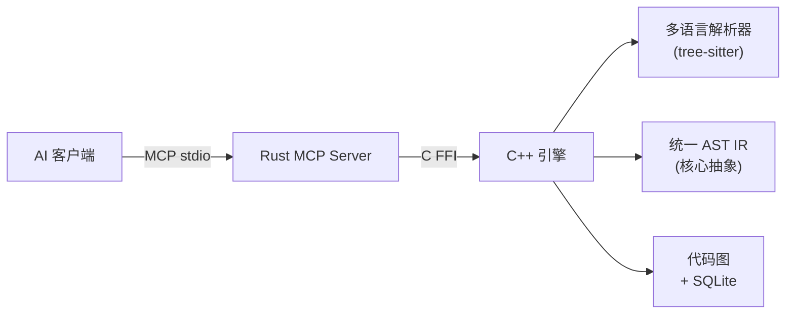
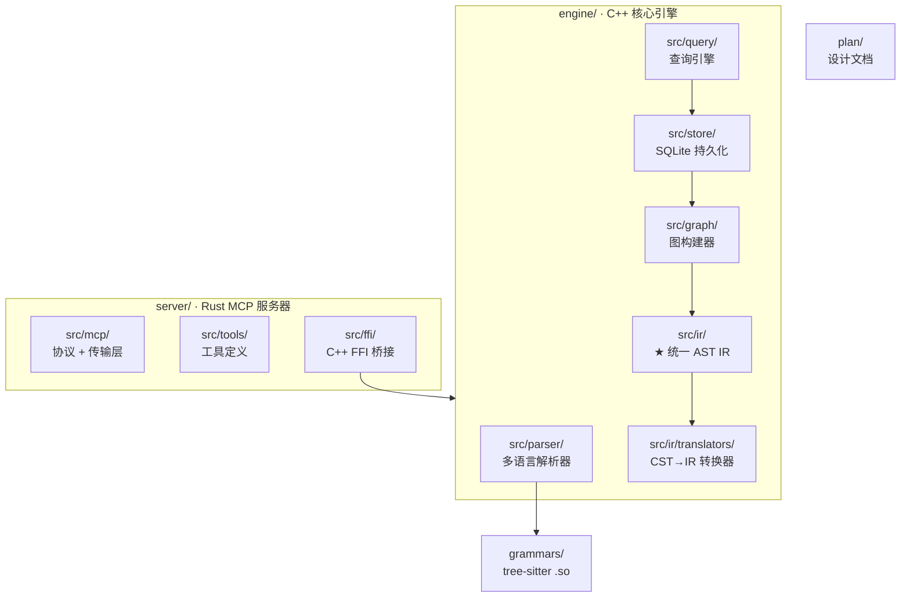

# CodeScope

**CodeScope** 是一个基于 MCP（Model Context Protocol）协议的代码理解服务。它通过解析源代码生成抽象语法树（AST），从 AST 构建多维度的代码图结构，并暴露查询接口，让 AI 通过图理解代码的结构和行为，从而精准定位和分析代码。

## 架构



**数据流：**


## 项目结构



## 特性

- **多语言解析**：通过 tree-sitter 支持 C、C++、Rust、Python、JavaScript、TypeScript、Go、Java
- **统一 AST IR**：语言无关的中间表示，精确保留源码行列号映射
- **代码图构建**：符号引用图 + 调用图，SQLite 持久化存储
- **语义边**：`SymbolRef`（符号引用）、`CallTarget`（调用目标）、`Receiver`（接收者）、`TypeRef`（类型引用）、`BaseClass`（基类）
- **图查询**：`find_definition`（查找定义）、`find_references`（查找引用）、`get_callers/get_callees`（调用者/被调用者）、`get_neighbors`（邻居节点）、`find_shortest_path`（最短路径）、`get_subgraph`（子图）、`locate_code`（定位代码）
- **MCP 协议**：完整的 JSON-RPC 2.0 over stdio，兼容任意 MCP 客户端

## 快速开始

### 前置依赖

- Rust 2024 Edition + 1.85+（`cargo`）
- CMake 3.30+，C++23 编译器（Clang 17+）
- SQLite3（开发包）
- tree-sitter 核心库
- Node.js（构建语法 .so 文件）

### 构建与运行

```bash
# 构建 tree-sitter 语法
cd grammars && bash build.sh && cd ..

# 构建并运行 MCP 服务
cargo run --bin ast-graph-mcp
```

服务器在 stdio 上监听 MCP JSON-RPC 消息。

### 环境变量

| 变量 | 默认值 | 说明 |
|----------|---------|-------------|
| `ASTGRAPH_DB_PATH` | `/tmp/astgraph.db` | SQLite 数据库路径 |
| `GRAMMARS_DIR` | `grammars/` | 语法 .so 文件目录 |

### MCP 工具

| 工具 | 说明 |
|------|------|
| `find_definition` | 查找符号定义位置 |
| `find_references` | 查找符号的所有引用 |
| `get_callers` | 获取调用指定函数的函数 |
| `get_callees` | 获取指定函数调用的函数 |
| `get_neighbors` | 获取图中节点的邻居 |
| `find_shortest_path` | 查找两个节点间的最短路径 |
| `get_subgraph` | 获取以某节点为中心的子图 |
| `locate_code` | 定位代码实体在源文件中的位置 |
| `index_project` | 索引整个项目目录 |
| `index_file` | 索引单个源文件 |
| `get_graph_stats` | 获取代码图统计信息 |

## 支持的语言与状态

| 语言 | 解析器 | IR 转换器 | 已验证 |
|------|--------|-----------|--------|
| Python | ✅ | ✅ | ✅ |
| Go | ✅ | ✅ | ✅ |
| C | ✅ | ✅ | ⬜ |
| C++ | ✅ | ✅ | ⬜ |
| Rust | ✅ | ✅ | ⬜ |
| JavaScript | ✅ | ✅ | ⬜ |
| TypeScript | ✅ | ✅ | ⬜ |
| Java | ✅ | ✅ | ⬜ |

## 编码规范

参见 [plan/rules/code_rules.md](plan/rules/code_rules.md)

- 文件不超过 1000 行
- 注释使用英文
- Rust 遵循 rustfmt + clippy，C++ 遵循 Google C++ Style Guide
- C++ 使用 C++23，Rust 使用 2024 Edition
- 严格的内存管理规则（RAII、禁止裸 new/delete）

## License

MIT
