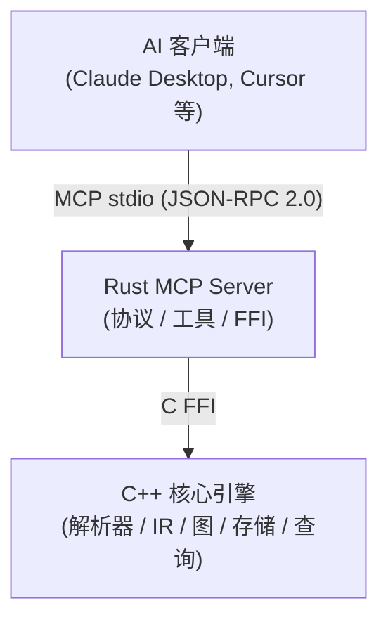

# CodeScope

**CodeScope** 是一个基于 MCP（Model Context Protocol）协议的代码理解服务。它通过解析源代码生成统一 AST IR，构建多维代码图（调用图 + 符号引用图），持久化到 SQLite，并通过 14 个 MCP 工具暴露强大的查询能力——让 AI 通过图遍历理解代码结构和行为，无需读取原始源文件。

## 架构



**数据流：**


## 功能特性

### 14 个 MCP 工具

| 分类          | 工具                   | 说明                                      |
| ----------- | -------------------- | --------------------------------------- |
| **核心** (11) | `find_definition`    | 查找符号定义位置                                |
| <br />      | `find_references`    | 查找符号的所有引用                               |
| <br />      | `get_callers`        | 获取调用指定函数的函数                             |
| <br />      | `get_callees`        | 获取指定函数调用的函数                             |
| <br />      | `get_neighbors`      | 获取图中节点的邻居                               |
| <br />      | `find_shortest_path` | 查找两个节点间的最短路径                            |
| <br />      | `get_subgraph`       | 获取以某节点为中心的子图                            |
| <br />      | `locate_code`        | 定位代码实体在源文件中的位置                          |
| <br />      | `index_project`      | 索引整个项目目录                                |
| <br />      | `index_file`         | 索引单个源文件                                 |
| <br />      | `get_graph_stats`    | 获取代码图统计信息                               |
| **搜索**      | `search_code`        | FTS5 全文搜索（前缀匹配）                         |
| **分析**      | `get_complexity`     | 圈复杂度 + 嵌套深度                             |
| <br />      | `graph_query`        | Cypher-like DSL：`MATCH (函数)-[调用]->(函数)` |
| <br />      | `detect_changes`     | 变更影响分析（修改文件的调用者/被调用者）                   |
| <br />      | `get_communities`    | 标签传播社区检测                                |

### 支持的语言（8 种）

| 语言         | 解析器 | IR 转换器 | 已验证 |
| ---------- | --- | ------ | --- |
| Python     | ✅   | ✅      | ✅   |
| Go         | ✅   | ✅      | ✅   |
| C          | ✅   | ✅      | ✅   |
| C++        | ✅   | ✅      | ✅   |
| Rust       | ✅   | ✅      | ✅   |
| JavaScript | ✅   | ✅      | ✅   |
| TypeScript | ✅   | ✅      | ✅   |
| Java       | ✅   | ✅      | ✅   |

### 图能力

- **6 种边类型**：`References`、`Calls`、`Defines`、`Contains`、`Imports`、`Inherits`
- **8 种节点类型**：`Function`、`Method`、`Class`、`Struct`、`Interface`、`Variable`、`Module`、`File`
- **SQLite 持久化**：零外部依赖，单文件数据库，可移植
- **FTS5 全文搜索**：符号名和文件路径前缀匹配
- **社区检测**：标签传播算法实现架构概览
- **变更影响分析**：通过调用图追踪影响传播

## 快速开始

### 前置依赖

- Rust 2024 Edition + 1.85+（`cargo`）
- CMake 3.30+，C++23 编译器（Clang 17+）
- SQLite3（开发包）
- tree-sitter 核心库
- Node.js（构建语法 .so 文件）

### 构建与运行

```bash
# 1. 安装 tree-sitter 语法（一次性）
npm install -g tree-sitter-python tree-sitter-c tree-sitter-cpp \
  tree-sitter-rust tree-sitter-javascript tree-sitter-typescript \
  tree-sitter-go tree-sitter-java

# 2. 构建语法 .so 文件
cd grammars && bash build.sh && cd ..

# 3. 构建全部
make build

# 4. 运行所有测试
make test

# 5. 启动 MCP 服务
cargo run --bin codescope
```

### 作为 Claude Desktop MCP 服务器

添加到 `claude_desktop_config.json`：

```json
{
  "mcpServers": {
    "codescope": {
      "command": "/path/to/CodeScope/target/release/codescope",
      "args": [],
      "env": {
        "CODESCOPE_DB_PATH": "/tmp/astgraph.db",
        "GRAMMARS_DIR": "/path/to/CodeScope/grammars"
      }
    }
  }
}
```

### 环境变量

| 变量                 | 默认值                | 说明                          |
| ------------------ | ------------------ | --------------------------- |
| `CODESCOPE_DB_PATH` | `/tmp/astgraph.db` | SQLite 数据库路径                |
| `GRAMMARS_DIR`     | `grammars/`        | 语法 .so 文件目录                 |
| `CODESCOPE_LSP`    | 未设置                | LSP 服务器命令（如 `pylsp`），用于类型增强 |

## Token 节省

使用代码图代替原始源文件，5 个常见查询场景平均节省 **~98.8%** 的 token：

| 场景     | 图 (tokens) | 源码 (tokens) | 节省        |
| ------ | ---------- | ----------- | --------- |
| 函数定义查找 | ~21       | ~2,265     | **99.1%** |
| 调用者追踪  | ~18       | ~2,000     | **99.1%** |
| 架构概览   | ~32       | ~1,875     | **98.3%** |
| 函数分析   | ~43       | ~4,733     | **99.1%** |
| 符号搜索   | ~23       | ~958       | **97.6%** |

## 性能基准测试 —— Fast Scan

CodeScope 的 **Fast Scan** 在毫秒级完成轻量声明提取（无需完整 tree-sitter 解析），让 AI 立即获得项目骨架认知。

### 多语言扫描结果

| 项目 | 耗时 | 语言 | 模块 | 符号数 | 备注 |
|------|------|------|------|--------|------|
| **CodeScope**（自扫描） | **32 ms** | cpp, rust, c | 219 | 2,902 | 有 .gitignore |
| **MusicAITools**（Python） | **8 ms** | python | — | 227 | 36 个源文件 |
| **goagent**（Go 项目） | **493 ms** | go, c, cpp, python | 548 | 5,172 | 无 .gitignore |
| **tinygo**（Go 编译器） | **209 ms** | go | — | 8,411 | 1,774 文件 |
| **SQLite**（C 库） | **89 ms** | c | 1 | 6,921 | 141 个源文件 |
| **Linux kernel/sched** | **45 ms** | c | 2 | 4,913 | 调度子系统 |
| **Linux kernel/**（核心） | **360 ms** | c | 46 | 40,335 | 内核核心 |
| **Linux fs/**（文件系统） | **1.8 s** | c | 99 | 212,145 | 文件系统 |

**平均吞吐：约 100,000 符号/秒**

瓶颈在 I/O —— 每个源文件都要 open → read → close。严格的 C 检测器（要求返回类型含 C 类型关键字）比之前宽松启发式减少了约 39% 假阳性，同时快了 31%。

### C 声明检测精度

| 语言 | 精确率 | 召回率 | 说明 |
|------|--------|--------|------|
| **Go** | ~97% | ~96% | `func` 模式极其精确 |
| **Python** | ~98% | ~95% | `def`/`class` 几乎零误报 |
| **C/C++（严格）** | ~85% | ~90% | 要求返回类型含类型关键字 |
| **C/C++（旧）** | ~65% | ~95% | 宽松模式，假阳性高 |
| **Rust** | ~90% | ~90% | `fn` 精确匹配 |

### 设计理念

1. **骨架索引（Fast Scan）**：毫秒级轻量扫描 → AI 立即可用
2. **知识增强**：后台全量解析 → 调用图、指标、嵌入向量
3. **稳定的 MCP 接口**：后端通过 `xxx_ready` 标志自适应，工具永不改变
4. **`.gitignore` 感知**：自动读取项目 `.gitignore`，零配置跳过忽略文件
5. **独立的 `symbol_status` 表**：保持 `symbols` 表精简，独立追踪三个就绪标志

## 实战案例：Linux 内核调度器分析

使用 Fast Scan 对 Linux v6.13 内核调度子系统进行分析——**45 ms** 扫描 36 个源文件，识别 4,913 个符号。

### 调度代码位置

```
kernel/sched/
├── core.c          — 主调度器 __schedule()、schedule()
├── fair.c          — CFS 完全公平调度器
├── rt.c            — 实时调度器
├── deadline.c      — 截止时间调度器
├── idle.c          — 空闲任务
├── sched.h         — 调度数据结构
└── ext/            — 可扩展调度接口
```

### 父子进程资源处理 → `kernel/fork.c`

| 行号 | 函数 | 作用 |
|------|------|------|
| **914** | `dup_task_struct()` | 复制父进程的 task_struct（完整进程描述符） |
| **1994** | `copy_process()` | **核心函数**——创建新进程入口，调用所有 copy_xxx |
| **2115** | `p = dup_task_struct(current, node)` | 复制内核栈、thread_info、task_struct |
| **2259** | `sched_fork(clone_flags, p)` | 初始化子进程调度状态，设为非运行态 |

`copy_process()` 执行链：

```
dup_task_struct()     → 复制内核栈 + task_struct
copy_sighand()        → 复制信号处理句柄
copy_mm()             → 复制地址空间（写时复制 COW）
copy_files()          → 复制文件描述符表
sched_fork()          → 设置子进程调度实体
```

**核心机制：写时复制（COW）**——`copy_mm()` 让父子共享同一物理内存页，标记为只读。任一进程首次写入时触发缺页中断，复制该页。

### 防止抢占

| 位置 | 机制 | 说明 |
|------|------|------|
| `include/linux/preempt.h:92` | `preempt_count()` | 每进程抢占计数器，>0 时禁止内核抢占 |
| `include/linux/preempt.h:71` | `2*PREEMPT_DISABLE_OFFSET` | 空闲任务初始值，禁止抢占 |
| `kernel/sched/core.c:7061` | `__schedule()` | 主调度器，仅当 preempt_count==0 时才切换 |
| `kernel/sched/core.c:7316` | `schedule()` | 主动让出 CPU，调用 __schedule() |

**三层防线：**

1. **每进程计数器**：`preempt_count` > 0 → `__schedule()` 直接返回，不切换
2. **自旋锁**：获取时自动 `preempt_disable()`，释放时 `preempt_enable()`
3. **中断上下文**：硬/软中断处理中 `preempt_count` 递增，阻止任何抢占

### 源码关键位置

```
kernel/fork.c:914        dup_task_struct()        — 复制进程结构
kernel/fork.c:1994       copy_process()           — 进程创建总入口
kernel/fork.c:2259       sched_fork()             — 子进程调度初始化
kernel/sched/core.c:7061 __schedule()             — 主调度器
include/linux/preempt.h:108 preempt_count()       — 抢占计数器
```

## 对比 codebase-memory-mcp

| 维度         | CodeScope   | codebase-memory-mcp |
| ---------- | ----------- | ------------------- |
| **后端**     | SQLite（嵌入式） | Neo4j（外部服务）         |
| **部署**     | 单个二进制       | Neo4j + 配置文件        |
| **搜索**     | FTS5 前缀匹配   | BM25 + 向量语义搜索       |
| **图查询**    | 最小 DSL      | 完整 Cypher           |
| **类型信息**   | 可选 LSP 增强   | LSP 感知              |
| **复杂度**    | 圈复杂度 + 嵌套深度 | 圈复杂度 + 认知复杂度 + 热路径  |
| **社区检测**   | 标签传播        | Leiden 算法           |
| **跨仓库**    | ❌           | ✅                   |
| **ADR 管理** | ❌           | ✅                   |
| **外部依赖**   | 零           | Neo4j               |

**CodeScope 优势**：零依赖部署、统一 IR 层、可移植。
**codebase-memory-mcp 优势**：更丰富的查询、语义搜索、类型感知解析。

## License

Apache 2.0
