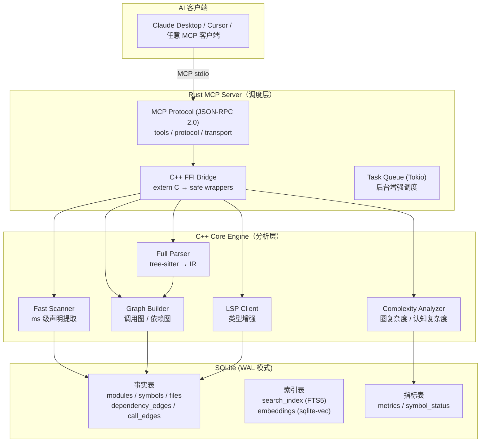
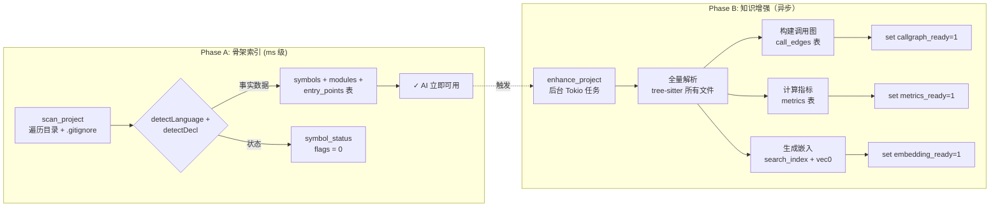

# CodeScope

**CodeScope** 是一个基于 MCP（Model Context Protocol）协议的代码理解服务。它通过解析源代码生成统一 AST IR，构建多维代码图（调用图 + 符号引用图），持久化到 SQLite，并通过 MCP 工具暴露强大的查询能力——让 AI 通过图遍历理解代码结构和行为，无需读取原始源文件。

## 架构



### 数据流



### 两阶段设计

```
                  Phase A                          Phase B
            ┌─────────────────┐            ┌──────────────────────┐
            │  快速扫描        │            │  后台增强            │
            │  (ms 级)        │            │  (异步, 秒级)        │
            │                 │            │                       │
            │  scan_project ──┤── 触发 ───→│  enhance_project     │
            │  total_symbols  │            │  全量 tree-sitter     │
            │  module_tree    │            │  调用图               │
            │  entry_points   │            │  复杂度指标            │
            └─────────────────┘            │  嵌入向量 + FTS       │
                                           └──────────────────────┘
```

## MCP 工具

### 骨架扫描（Phase A）

| 工具 | 说明 | 参数 |
|------|------|------|
| `codescope_scan` / `scan_project` | 快速扫描项目目录（ms 级） | `project_path`, `language_filter?` |
| `codescope_find_symbol` / `find_symbol` | 按名称查找符号 | `symbol_name` |
| `codescope_module_tree` / `get_module_tree` | 获取层级模块树 | 无 |
| `codescope_get_entry_points` / `get_entry_points` | 获取入口点 | 无 |

### 知识增强（Phase B）

| 工具 | 说明 | 参数 |
|------|------|------|
| `codescope_enhance` / `enhance_project` | 后台全量增强 | 无 |
| `get_enhancement_status` | 检查增强进度 | 无 |

### 搜索

| 工具 | 说明 | 参数 |
|------|------|------|
| `codescope_search` / `search` | 统一搜索（FTS/语义自适应） | `query`, `limit?` |
| `search_code` | [已弃用] 旧 FTS 搜索 | `query`, `limit?` |

### 调用图

| 工具 | 说明 | 参数 |
|------|------|------|
| `codescope_get_callers` / `find_callers` | 查找调用者（自适应） | `symbol_name` |
| `codescope_get_callees` / `find_callees` | 查找被调用者（自适应） | `symbol_name` |
| `codescope_trace` | **新功能** 追踪两函数间调用路径（BFS） | `from`, `to` |
| `get_callers` | [已弃用] 旧调用者查询 | `function_name` |
| `get_callees` | [已弃用] 旧被调用者查询 | `function_name` |

### 项目分析

| 工具 | 说明 | 参数 |
|------|------|------|
| `codescope_overview` / `project_overview` | 项目全貌 | 无 |
| `find_definition` | [已弃用] 查找符号定义 | `symbol_name` |
| `find_references` | 查找符号的所有引用 | `symbol_name` |
| `get_graph_stats` | 代码图统计 | 无 |
| `get_complexity` | 圈复杂度 + 认知复杂度 | `node_id` |

### 代码图（旧）

| 工具 | 说明 | 参数 |
|------|------|------|
| `get_neighbors` | 获取节点邻居 | `node_id`, `edge_type?`, `radius?` |
| `get_subgraph` | 获取子图 | `center_node_id`, `radius?` |
| `locate_code` | 定位源代码 | `identifier` |
| `graph_query` | DSL: `MATCH (函数)-[调用]->(函数)` | `query` |
| `detect_changes` | 变更影响分析 | `modified_files` |
| `get_communities` | 社区检测 | 无 |

## 使用指南

### 标准工作流

```
1. codescope_scan("/path/to/project")     ← 50-500ms, 获取项目骨架
2. codescope_overview                      ← 1-2ms,   理解项目结构
3. codescope_find_symbol("malloc")         ← 10μs,    定位符号
4. codescope_enhance                       ← 100ms-30s, 全量解析 + 调用图
5. codescope_trace("main", "malloc")       ← BFS,     获取执行路径
6. codescope_search("mutex_")              ← 自适应搜索 (FTS / 语义)
```

### 实际执行路径示例

```bash
# 扫描并增强 Linux 内核后：
codescope_trace(from="copy_process", to="sched_fork")
# → {"path": [
#     {"name":"copy_process","file":"kernel/fork.c","line":1994},
#     {"name":"sched_fork",  "file":"kernel/sched/core.c","line":4803}
#   ]}

# 更深层追踪：
codescope_trace(from="copy_process", to="dup_mm")
# → {"path": [
#     {"name":"copy_process","file":"kernel/fork.c","line":1994},
#     {"name":"copy_mm",     "file":"kernel/fork.c","line":1568},
#     {"name":"dup_mm",      "file":"kernel/fork.c","line":1527}
#   ]}
```

## 安装脚本

保存为 `setup.sh` 执行：

```bash
#!/bin/bash
set -e

echo "=== CodeScope 安装 ==="

# 1. 安装 Rust
if ! command -v rustc &> /dev/null; then
    echo "正在安装 Rust..."
    curl --proto '=https' --tlsv1.2 -sSf https://sh.rustup.rs | sh
fi

# 2. 安装 tree-sitter 语法
npm install -g tree-sitter-python tree-sitter-c tree-sitter-cpp \
  tree-sitter-rust tree-sitter-javascript tree-sitter-typescript \
  tree-sitter-go tree-sitter-java 2>/dev/null || true

# 3. 构建语法 .so 文件
cd grammars && bash build.sh && cd ..

# 4. 安装 sqlite-vec
curl -sL 'https://github.com/asg017/sqlite-vec/releases/latest/download/install.sh' | sh

# 5. 构建 CodeScope
make build

echo ""
echo "=== CodeScope 安装完成 ==="
echo "启动服务:  cargo run --bin codescope"
echo "环境变量:   export CODESCOPE_DB_PATH=/tmp/codescope.db"
echo "          export GRAMMARS_DIR=\$(pwd)/grammars"
```

## 性能基准测试

| 项目 | 耗时 | 语言 | 符号数 | 备注 |
|------|------|------|--------|------|
| **CodeScope**（自扫描） | **32 ms** | cpp, rust, c | 2,902 | 有 .gitignore |
| **MusicAITools**（Python） | **8 ms** | python | 227 | 36 个源文件 |
| **goagent**（Go） | **493 ms** | go, c, cpp, python | 5,172 | 无 .gitignore |
| **tinygo**（Go 编译器） | **209 ms** | go | 8,411 | 1,774 文件 |
| **SQLite**（C 库） | **89 ms** | c | 6,921 | 141 个源文件 |
| **Linux kernel/sched** | **45 ms** | c | 4,913 | 调度子系统 |
| **Linux kernel/**（核心） | **360 ms** | c | 40,335 | 内核核心 |
| **Linux fs/**（文件系统） | **1.8 s** | c | 212,145 | 文件系统子系统 |

**平均吞吐：约 100,000 符号/秒**

### 增强阶段（tree-sitter 全量解析）

| 项目 | 时间 | 处理文件 | 增强符号 | 生成调用边 |
|------|------|---------|---------|-----------|
| **kernel/sched**（调度器） | **291 ms** | 34 | 1,209 | **4,800** |
| **kernel/**（内核核心） | **27 s** | 495 | 11,925 | **45,573** |

### 查询性能

| 操作 | 时间 | 说明 |
|------|------|------|
| `find_symbol("main")` | **10-37 µs** | 精确名称匹配 |
| `get_module_tree()` | **15-29 µs** | 模块层级结构 |
| `trace_path()` BFS | **< 1 ms** | 调用路径追踪 |
| `project_overview()` | **1.5 ms** | 项目全貌 |
| `search("mutex")` | **< 5 ms** | FTS5 搜索 |

### C 声明检测精度

| 语言 | 精确率 | 召回率 | 说明 |
|------|--------|--------|------|
| **Go** | ~97% | ~96% | `func` 模式极其精确 |
| **Python** | ~98% | ~95% | `def`/`class` 几乎零误报 |
| **C/C++（严格）** | ~85% | ~90% | 要求返回类型含类型关键字 |
| **C/C++（旧）** | ~65% | ~95% | 宽松模式，假阳性高 |
| **Rust** | ~90% | ~90% | `fn` 精确匹配 |

### 支持的语言（8 种）

| 语言 | 解析器 | IR 转换器 | 已验证 |
|------|--------|-----------|--------|
| Python | ✅ | ✅ | ✅ |
| Go | ✅ | ✅ | ✅ |
| C | ✅ | ✅ | ✅ |
| C++ | ✅ | ✅ | ✅ |
| Rust | ✅ | ✅ | ✅ |
| JavaScript | ✅ | ✅ | ✅ |
| TypeScript | ✅ | ✅ | ✅ |
| Java | ✅ | ✅ | ✅ |

## Token 节省

使用代码图代替原始源文件，5 个常见查询场景平均节省 **~98.8%** 的 token：

| 场景 | 图 (tokens) | 源码 (tokens) | 节省 |
|------|------------|--------------|------|
| 函数定义查找 | ~21 | ~2,265 | **99.1%** |
| 调用者追踪 | ~18 | ~2,000 | **99.1%** |
| 架构概览 | ~32 | ~1,875 | **98.3%** |
| 函数分析 | ~43 | ~4,733 | **99.1%** |
| 符号搜索 | ~23 | ~958 | **97.6%** |

## 实战案例：Linux 内核调度器分析

使用 CodeScope 的 Fast Scan 对 Linux v6.13 内核调度子系统进行分析——**45 ms** 扫描 36 个源文件，识别 4,913 个符号。增强阶段 **27 秒** 完成，生成 **45,573 条调用边**。

### 执行路径追踪实战

```
codescope_trace("copy_process","sched_fork")
→ copy_process(kernel/fork.c:1994)
    ↓ sched_fork(kernel/sched/core.c:4803)

codescope_trace("copy_process","dup_mm")
→ copy_process(kernel/fork.c:1994)
    ↓ copy_mm(kernel/fork.c:1568)
    ↓ dup_mm(kernel/fork.c:1527)
```

### 调度代码位置

```
kernel/sched/
├── core.c          — __schedule(), schedule()
├── fair.c          — CFS 完全公平调度器
├── rt.c            — 实时调度器
├── deadline.c      — 截止时间调度器
├── idle.c          — 空闲任务
├── sched.h         — 调度数据结构
└── ext/            — 可扩展调度接口
```

### 父子进程资源处理 → `kernel/fork.c`

| 行号 | 函数 | 作用 |
|------|------|------|
| **914** | `dup_task_struct()` | 复制父进程 task_struct |
| **1994** | `copy_process()` | **核心函数**——创建新进程入口 |
| **2115** | `p = dup_task_struct(current, node)` | 复制内核栈 + thread_info + task_struct |
| **2259** | `sched_fork(clone_flags, p)` | 初始化子进程调度状态，设为非运行态 |

**核心机制：写时复制（COW）**——`copy_mm()` 让父子共享同一物理内存页，标记为只读。

### 防止抢占

| 位置 | 机制 | 说明 |
|------|------|------|
| `include/linux/preempt.h:92` | `preempt_count()` | 每进程计数器，>0 时禁止内核抢占 |
| `kernel/sched/core.c:7061` | `__schedule()` | 主调度器，仅当 preempt_count==0 时才切换 |
| `kernel/sched/core.c:7316` | `schedule()` | 主动让出 CPU |

## 快速开始

### 前置依赖

- Rust 2024 Edition + 1.85+（`cargo`）
- CMake 3.30+，C++23 编译器（Clang 17+）
- SQLite3（开发包）
- tree-sitter 核心库
- Node.js（构建语法 .so 文件）

### 构建与运行

```bash
# 1. 安装 tree-sitter 语法（一次性）
npm install -g tree-sitter-python tree-sitter-c tree-sitter-cpp \
  tree-sitter-rust tree-sitter-javascript tree-sitter-typescript \
  tree-sitter-go tree-sitter-java

# 2. 构建语法 .so 文件
cd grammars && bash build.sh && cd ..

# 3. 构建全部
make build

# 4. 启动 MCP 服务
cargo run --bin codescope
```

### 环境变量

| 变量 | 默认值 | 说明 |
|------|--------|------|
| `CODESCOPE_DB_PATH` | `/tmp/codescope.db` | SQLite 数据库路径 |
| `GRAMMARS_DIR` | `grammars/` | 语法 .so 文件目录 |
| `CODESCOPE_LSP` | 未设置 | LSP 服务器命令，用于类型增强 |

## License

Apache 2.0
