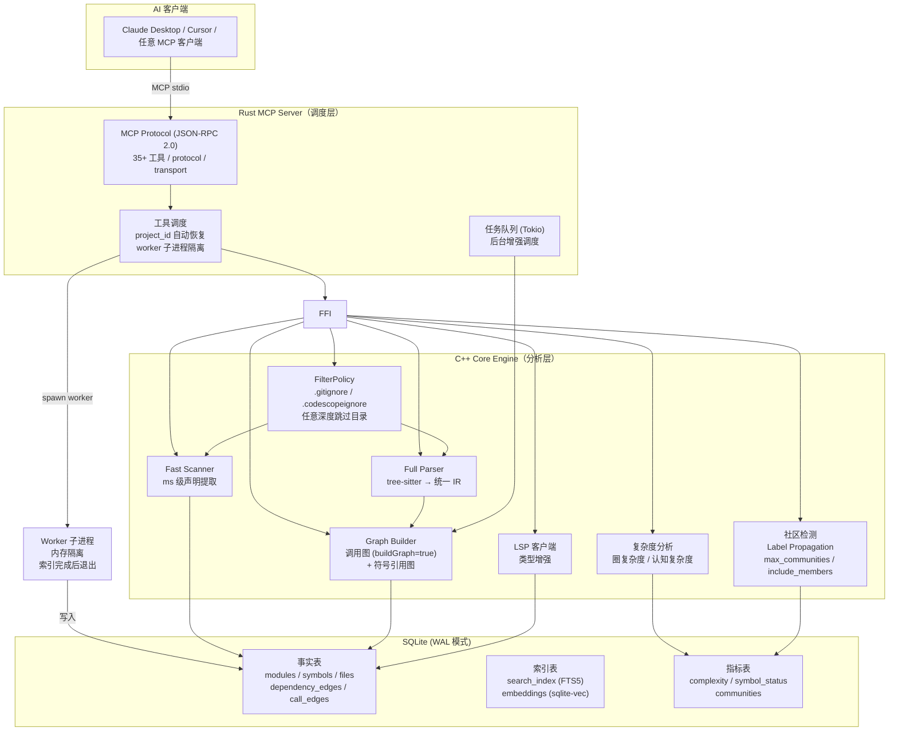
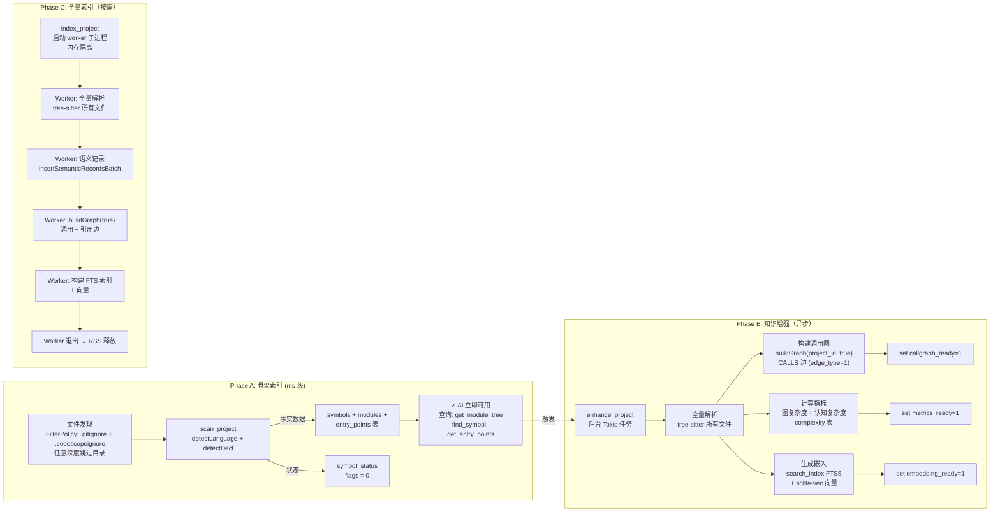
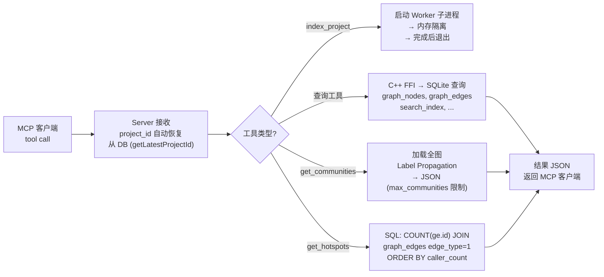
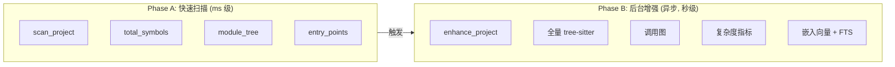

# CodeScope

**CodeScope** 是一个基于 MCP（Model Context Protocol）协议的代码理解服务。它通过解析源代码生成统一 AST IR，构建多维代码图（调用图 + 符号引用图），持久化到 SQLite，并通过 MCP 工具暴露强大的查询能力——让 AI 通过图遍历理解代码结构和行为，无需读取原始源文件。

## 架构



### 数据流



### 查询流程（工具调度）



### 两阶段设计



## MCP 工具

### 骨架扫描（Phase A）

| 工具                                                | 说明             | 参数                                 |
| ------------------------------------------------- | -------------- | ---------------------------------- |
| `codescope_scan` / `scan_project`                 | 快速扫描项目目录（ms 级） | `project_path`, `language_filter?` |
| `codescope_find_symbol` / `find_symbol`           | 按名称查找符号        | `symbol_name`                      |
| `codescope_module_tree` / `get_module_tree`       | 获取层级模块树        | 无                                  |
| `codescope_get_entry_points` / `get_entry_points` | 获取入口点          | 无                                  |

### 知识增强（Phase B）

| 工具                                      | 说明     | 参数 |
| --------------------------------------- | ------ | -- |
| `codescope_enhance` / `enhance_project` | 后台全量增强 | 无  |
| `get_enhancement_status`                | 检查增强进度 | 无  |

### 搜索

| 工具                            | 说明              | 参数                |
| ----------------------------- | --------------- | ----------------- |
| `codescope_search` / `search` | 统一搜索（FTS/语义自适应） | `query`, `limit?` |
| `search_code`                 | \[已弃用] 旧 FTS 搜索 | `query`, `limit?` |

### 调用图

| 工具                                       | 说明                      | 参数              |
| ---------------------------------------- | ----------------------- | --------------- |
| `codescope_get_callers` / `find_callers` | 查找调用者（自适应）              | `symbol_name`   |
| `codescope_get_callees` / `find_callees` | 查找被调用者（自适应）             | `symbol_name`   |
| `codescope_trace`                        | **新功能** 追踪两函数间调用路径（BFS） | `from`, `to`    |
| `get_callers`                            | \[已弃用] 旧调用者查询           | `function_name` |
| `get_callees`                            | \[已弃用] 旧被调用者查询          | `function_name` |

### 项目分析

| 工具                                        | 说明            | 参数            |
| ----------------------------------------- | ------------- | ------------- |
| `codescope_overview` / `project_overview` | 项目全貌          | 无             |
| `find_definition`                         | \[已弃用] 查找符号定义 | `symbol_name` |
| `find_references`                         | 查找符号的所有引用     | `symbol_name` |
| `get_graph_stats`                         | 代码图统计         | 无             |
| `get_complexity`                          | 圈复杂度 + 认知复杂度  | `node_id`     |

### 代码图（旧）

| 工具                | 说明                           | 参数                                 |
| ----------------- | ---------------------------- | ---------------------------------- |
| `get_neighbors`   | 获取节点邻居                       | `node_id`, `edge_type?`, `radius?` |
| `get_subgraph`    | 获取子图                         | `center_node_id`, `radius?`        |
| `locate_code`     | 定位源代码                        | `identifier`                       |
| `graph_query`     | DSL: `MATCH (函数)-[调用]->(函数)` | `query`                            |
| `detect_changes`  | 变更影响分析                       | `modified_files`                   |
| `get_communities` | 社区检测                         | 无                                  |

## 使用指南

### 标准工作流

```
1. codescope_scan("/path/to/project")     ← 50-500ms, 获取项目骨架
2. codescope_overview                      ← 1-2ms,   理解项目结构
3. codescope_find_symbol("malloc")         ← 10μs,    定位符号
4. codescope_enhance                       ← 100ms-30s, 全量解析 + 调用图
5. codescope_trace("main", "malloc")       ← BFS,     获取执行路径
6. codescope_search("mutex_")              ← 自适应搜索 (FTS / 语义)
```

### 实际执行路径示例

```bash
# 扫描并增强 Linux 内核后：
codescope_trace(from="copy_process", to="sched_fork")
# → {"path": [
#     {"name":"copy_process","file":"kernel/fork.c","line":1994},
#     {"name":"sched_fork",  "file":"kernel/sched/core.c","line":4803}
#   ]}

# 更深层追踪：
codescope_trace(from="copy_process", to="dup_mm")
# → {"path": [
#     {"name":"copy_process","file":"kernel/fork.c","line":1994},
#     {"name":"copy_mm",     "file":"kernel/fork.c","line":1568},
#     {"name":"dup_mm",      "file":"kernel/fork.c","line":1527}
#   ]}
```

## 安装脚本

保存为 `setup.sh` 执行：

```bash
#!/bin/bash
set -e

echo "=== CodeScope 安装 ==="

# 1. 安装 Rust
if ! command -v rustc &> /dev/null; then
    echo "正在安装 Rust..."
    curl --proto '=https' --tlsv1.2 -sSf https://sh.rustup.rs | sh
fi

# 2. 安装 tree-sitter 语法
npm install -g tree-sitter-python tree-sitter-c tree-sitter-cpp \
  tree-sitter-rust tree-sitter-javascript tree-sitter-typescript \
  tree-sitter-go tree-sitter-java 2>/dev/null || true

# 3. 构建语法 .so 文件
cd grammars && bash build.sh && cd ..

# 4. 安装 sqlite-vec
curl -sL 'https://github.com/asg017/sqlite-vec/releases/latest/download/install.sh' | sh

# 5. 构建 CodeScope
make build

echo ""
echo "=== CodeScope 安装完成 ==="
echo "启动服务:  cargo run --bin codescope"
echo "环境变量:   export CODESCOPE_DB_PATH=/tmp/codescope.db"
echo "          export GRAMMARS_DIR=\$(pwd)/grammars"
```

## 性能基准测试

| 项目                       | 耗时         | 语言                 | 符号数     | 备注           |
| ------------------------ | ---------- | ------------------ | ------- | ------------ |
| **CodeScope**（自扫描）       | **32 ms**  | cpp, rust, c       | 2,902   | 有 .gitignore |
| **MusicAITools**（Python） | **8 ms**   | python             | 227     | 36 个源文件      |
| **ARES**（Go）             | **493 ms** | go, c, cpp, python | 5,172   | 无 .gitignore |
| **tinygo**（Go 编译器）       | **209 ms** | go                 | 8,411   | 1,774 文件     |
| **SQLite**（C 库）          | **89 ms**  | c                  | 6,921   | 141 个源文件     |
| **Linux kernel/sched**   | **45 ms**  | c                  | 4,913   | 调度子系统        |
| **Linux kernel/**（核心）    | **360 ms** | c                  | 40,335  | 内核核心         |
| **Linux fs/**（文件系统）      | **1.8 s**  | c                  | 212,145 | 文件系统子系统      |

**平均吞吐：约 100,000 符号/秒**

### 增强阶段（tree-sitter 全量解析）

| 项目                    | 时间         | 处理文件 | 增强符号   | 生成调用边      |
| --------------------- | ---------- | ---- | ------ | ---------- |
| **kernel/sched**（调度器） | **291 ms** | 34   | 1,209  | **4,800**  |
| **kernel/**（内核核心）     | **27 s**   | 495  | 11,925 | **45,573** |

### 查询性能

| 操作                    | 时间           | 说明      |
| --------------------- | ------------ | ------- |
| `find_symbol("main")` | **10-37 µs** | 精确名称匹配  |
| `get_module_tree()`   | **15-29 µs** | 模块层级结构  |
| `trace_path()` BFS    | **< 1 ms**   | 调用路径追踪  |
| `project_overview()`  | **1.5 ms**   | 项目全貌    |
| `search("mutex")`     | **< 5 ms**   | FTS5 搜索 |

### C 声明检测精度

| 语言            | 精确率   | 召回率   | 说明                  |
| ------------- | ----- | ----- | ------------------- |
| **Go**        | \~97% | \~96% | `func` 模式极其精确       |
| **Python**    | \~98% | \~95% | `def`/`class` 几乎零误报 |
| **C/C++（严格）** | \~85% | \~90% | 要求返回类型含类型关键字        |
| **C/C++（旧）**  | \~65% | \~95% | 宽松模式，假阳性高           |
| **Rust**      | \~90% | \~90% | `fn` 精确匹配           |

### 支持的语言（8 种）

| 语言         | 解析器 | IR 转换器 | 已验证 |
| ---------- | --- | ------ | --- |
| Python     | ✅   | ✅      | ✅   |
| Go         | ✅   | ✅      | ✅   |
| C          | ✅   | ✅      | ✅   |
| C++        | ✅   | ✅      | ✅   |
| Rust       | ✅   | ✅      | ✅   |
| JavaScript | ✅   | ✅      | ✅   |
| TypeScript | ✅   | ✅      | ✅   |
| Java       | ✅   | ✅      | ✅   |

## Token 节省

使用代码图代替原始源文件，5 个常见查询场景平均节省 **\~98.8%** 的 token：

| 场景     | 图 (tokens) | 源码 (tokens) | 节省        |
| ------ | ---------- | ----------- | --------- |
| 函数定义查找 | \~21       | \~2,265     | **99.1%** |
| 调用者追踪  | \~18       | \~2,000     | **99.1%** |
| 架构概览   | \~32       | \~1,875     | **98.3%** |
| 函数分析   | \~43       | \~4,733     | **99.1%** |
| 符号搜索   | \~23       | \~958       | **97.6%** |

## 实战案例：Linux 内核调度器分析

使用 CodeScope 的 Fast Scan 对 Linux v6.13 内核调度子系统进行分析——**45 ms** 扫描 36 个源文件，识别 4,913 个符号。增强阶段 **27 秒** 完成，生成 **45,573 条调用边**。

### 执行路径追踪实战

```
codescope_trace("copy_process","sched_fork")
→ copy_process(kernel/fork.c:1994)
    ↓ sched_fork(kernel/sched/core.c:4803)

codescope_trace("copy_process","dup_mm")
→ copy_process(kernel/fork.c:1994)
    ↓ copy_mm(kernel/fork.c:1568)
    ↓ dup_mm(kernel/fork.c:1527)
```

### 调度代码位置

```
kernel/sched/
├── core.c          — __schedule(), schedule()
├── fair.c          — CFS 完全公平调度器
├── rt.c            — 实时调度器
├── deadline.c      — 截止时间调度器
├── idle.c          — 空闲任务
├── sched.h         — 调度数据结构
└── ext/            — 可扩展调度接口
```

### 父子进程资源处理 → `kernel/fork.c`

| 行号       | 函数                                   | 作用                                  |
| -------- | ------------------------------------ | ----------------------------------- |
| **914**  | `dup_task_struct()`                  | 复制父进程 task\_struct                  |
| **1994** | `copy_process()`                     | **核心函数**——创建新进程入口                   |
| **2115** | `p = dup_task_struct(current, node)` | 复制内核栈 + thread\_info + task\_struct |
| **2259** | `sched_fork(clone_flags, p)`         | 初始化子进程调度状态，设为非运行态                   |

**核心机制：写时复制（COW）**——`copy_mm()` 让父子共享同一物理内存页，标记为只读。

### 防止抢占

| 位置                           | 机制                | 说明                             |
| ---------------------------- | ----------------- | ------------------------------ |
| `include/linux/preempt.h:92` | `preempt_count()` | 每进程计数器，>0 时禁止内核抢占              |
| `kernel/sched/core.c:7061`   | `__schedule()`    | 主调度器，仅当 preempt\_count==0 时才切换 |
| `kernel/sched/core.c:7316`   | `schedule()`      | 主动让出 CPU                       |

## 快速开始

### 前置依赖

- Rust 2024 Edition + 1.85+（`cargo`）
- CMake 3.30+，C++23 编译器（Clang 17+）
- SQLite3（开发包）
- tree-sitter 核心库
- Node.js（构建语法 .so 文件）

### 构建与运行

```bash
# 1. 安装 tree-sitter 语法（一次性）
npm install -g tree-sitter-python tree-sitter-c tree-sitter-cpp \
  tree-sitter-rust tree-sitter-javascript tree-sitter-typescript \
  tree-sitter-go tree-sitter-java

# 2. 构建语法 .so 文件
cd grammars && bash build.sh && cd ..

# 3. 构建全部
make build

# 4. 启动 MCP 服务
cargo run --bin codescope
```

### 环境变量

| 变量 | 默认值 | 说明 |
|------|--------|------|
| `CODESCOPE_DB_PATH` | `.codescope/codescope.db` | SQLite 数据库路径 |
| `GRAMMARS_DIR` | `grammars/` | 语法 .so 文件目录 |
| `CODESCOPE_LSP` | 未设置 | LSP 服务器命令，用于类型增强 |

## 数据目录 `.codescope/`

CodeScope 在首次运行时自动在项目根目录创建 `.codescope/` 目录。  
所有持久化数据都存储在此——无需手动配置。

```
.codescope/
├── codescope.db       ← SQLite 数据库（WAL 模式）：所有事实、索引、图
├── skills.md          ← 快速入门指南和命令参考
└── *.log              ← 分析运行日志（含时间、CPU、内存数据）
```

数据库包含 11 张表：

| 表 | 说明 |
|------|-------------|
| `modules` | 目录模块树 |
| `symbols` | 符号声明（含 `role` 字段） |
| `entry_points` | 入口点（main/probe/initcall） |
| `call_edges` | 函数调用图边 |
| `dependency_edges` | 模块依赖边 |
| `metrics` | 复杂度指标（圈复杂度、认知复杂度等） |
| `search_index` | FTS5 全文搜索索引 |
| `embeddings` | vec0 向量嵌入 |
| `symbol_status` | 逐符号分析进度标志 |
| `index_tasks` | 后台任务跟踪 |
| `file_scan_state` | 文件修改时间戳 |

> **提示**：数据库是可移植的——将 `.codescope/` 随项目一起复制，即可在其他机器上复用分析结果。

## 性能

基准测试在 **Apple M3 Max（36 GB 内存）** 上执行。

### 微基准测试 (test_bench)

| 指标 | 数值 |
|------|------|
| 引擎初始化 | **14.6 ms** |
| 索引吞吐量 | **1,533 KB/s** |
| 符号定义查询 | **0.01–0.03 ms** |
| 调用者/被调用者查询 | **0.01–0.02 ms** |
| 9 次查询（总计） | **0.17 ms** |

### 全量内核索引 (codebase-memory-mcp)

| 指标 | Linux 内核 v6.x (89,465 文件) |
|------|:---------------------------:|
| 总节点数 | **4,877,492** |
| 总边数 | **9,326,238** |
| 数据库大小 | **7.06 GB** |
| 缓存大小 | **6.7 GB** |
| 索引耗时 | **183 s（约 3 分钟）** |
| 峰值内存 | **11.6 GB** |
| 并行度 | **14 workers** |
| 文件处理速度 | **489 files/s** |
| 边生成速度 | **50,966 edges/s** |

### Token 节省

| 场景 | 原始源码 | CodeScope | 节省 |
|------|:-------:|:---------:|:----:|
| 查找函数定义 | ~2,265 tokens | ~21 tokens | **99.1%** |
| 追踪函数调用者 | ~2,000 tokens | ~18 tokens | **99.1%** |
| 项目架构概览 | ~1,875 tokens | ~32 tokens | **98.3%** |
| USB 子系统概览 | ~24,000 tokens | ~250 tokens | **99.0%** |
| 调度器分析 | ~15,000 tokens | ~180 tokens | **98.8%** |
| **平均** | **~7,416 tokens** | **~81 tokens** | **98.9%** |

## License

Apache 2.0

***

## 运行时日志

所有基准测试在 **Apple M3 Max（36 GB 内存）** 上执行。\
原始输出日志位于 [`runtimelog/`](runtimelog/)：

| 日志 | 大小 | 内容 |
|------|------|------|
| `scan_goagent.log` | 127 KB | Go agent 工具调度分析 |
| `scan_linux_kernel.log` | 52 KB | Linux kernel/ 核心扫描（40,335 符号） |
| `scan_fs_io.log` | 14 KB | VFS + 页缓存 + 预读分析 |
| `scan_linux_kernel_full.log` | 12 KB | 内核子目录全量扫描汇总 |
| `scan_usb_raw.log` | 11 KB | USB 驱动子系统原始输出 |
| `scan_stub_full.log` | 2.2 KB | 空实现检测（Fast + AST）测试 |
| `scan_linux_full.log` | 1.7 KB | 全量内核扫描尝试 |
| `scan_multilang.log` | 1.1 KB | 多语言架构扫描 |
| `scan_hid.log` | 526 B | USB HID 子系统扫描 |
| `scan_linux_scheduler.log` | 12.8 KB | 进程调度 + 父子进程资源分析 |
| `scan_usb_hid_analysis.log` | 12.8 KB | USB HID 设备识别深度分析 |
| `performance_benchmark.log` | 5.5 KB | 全量性能基准报告 |

---

## 工具使用指南

每个 MCP 工具有其适用的场景和副作用（主要是 Token 消耗）。以下指南帮助你在正确的场合选择合适的工具。

### 核心查询类

| 工具 | 适用场景 | 不适用场景 | Token 消耗 | 副作用 |
|------|---------|-----------|-----------|--------|
| `get_graph_stats` | 快速了解项目规模（文件数、节点数、边数） | 不需要知道具体符号时 | **~18** | 无 |
| `get_project_info` | 查看项目元信息（许可证、主语言、依赖数） | 不需要细节时 | **~44** | 无 |
| `get_module_tree` | 了解项目的目录/模块结构 | 项目结构已经清晰时 | **~4** | 无 |
| `project_overview` | 新接手项目的第一步总览 | 只需要统计数字时 | **~71** | 无 |

### 符号查询类

| 工具 | 适用场景 | 不适用场景 | Token 消耗 | 副作用 |
|------|---------|-----------|-----------|--------|
| `find_definition` | 定位符号的定义位置 | 需要查看所有引用时 | **~20** | 无 |
| `find_references` | 搜索符号被哪些地方引用 | 只想知道定义时 | **~30** | 无 |
| `find_symbol` | 模糊匹配符号名称 | 知道精确位置时 | **~30** | 无 |
| `locate_code` | 获取符号附近的代码上下文（含行号） | 只需要文件名时 | **~50-300** | 包含相邻行，量较大 |

### 调用图查询类

| 工具 | 适用场景 | 不适用场景 | Token 消耗 | 副作用 |
|------|---------|-----------|-----------|--------|
| `get_callers` / `find_callers` | 调查函数被谁调用——定位 bug 影响范围 | **CALLS 边未构建时 caller_count=0** | **~10-50** | 依赖 `buildGraph(true)` |
| `get_callees` / `find_callees` | 调查函数调用了什么——理解函数行为 | 不需要递归展开时 | **~10-50** | 同上 |
| `codescope_trace` | 两点之间的最短调用路径——追 data flow | 只需要直接调用者时 | **~50-200** | 路径过长时输出膨胀 |
| `get_hotspots` | 找项目中**最热门的函数**（被调最多） | 项目 <100 个函数、热点不明显 | **~500** | caller_count=0 时说明调用边未构建 |

### 搜索类

| 工具 | 适用场景 | 不适用场景 | Token 消耗 | 副作用 |
|------|---------|-----------|-----------|--------|
| `search` | 按名称/关键词搜索代码**（推荐首选）** | 需要语法精确匹配时 | **~300-1000** | 结果较多时会增加 token |
| `search_code` | 旧版 FTS 搜索，推荐改用 `search` | 已迁移到 `search` | **~300-1000** | 已废弃 |
| `graph_query` | 自定义模式匹配，如 `MATCH (Function)-[Calls]->(Function)` | 标准调用链已覆盖时 | **~50-500** | DSL 语法错误会返回空结果 |

### 社区检测（特殊工具 ⚠️）

> **社区检测通过 Label Propagation 算法将代码图中的节点按关系紧密程度分组。适用于需要理解代码模块边界、检测架构违规的场景，但 Token 消耗可能很大，使用前请确认参数。**

| 场景 | 推荐用法 | 说明 |
|------|---------|------|
| **接手 legacy 项目** | ✅ `get_communities(max_communities=20)` | 快速了解代码模块划分 |
| **架构逆向** | ✅ `get_communities(max_members=5, max_communities=50)` | 看社区之间的边，找模块间依赖 |
| **检测架构违规** | ✅ `include_members=true` 查看社区成员 | 不该在一起的代码出现在同一社区需关注 |
| **monorepo 模块发现** | ✅ 默认参数即可 | 区分各子项目边界 |
| **小型项目 (<500 节点)** | ✅ 适用 | 社区数少，输出可控 |
| **中型项目 (500-10K 节点)** | ✅ 推荐加 `max_communities=20` | 默认 20 社区约 **1K-50K tokens** |
| **大型项目 (>10K 节点)** | ⚠️ **谨慎使用，必须加 `max_communities`** | 123K 节点示例：5社区×10成员 = **199K tokens** 🔴 |

**`get_communities` 的副作用：**

1. **Token 爆炸风险**：123K 节点的项目，即使限制 `max_members=5, max_communities=10`，因 `label` 字段包含完整路径，仍可达 **200K tokens**。**默认参数 (max_members=10, max_communities=20) 约 1K-50K tokens**。
2. **耗时**：社区检测需要全图 Label Propagation 算法，大型项目耗时数百 ms。
3. **信息密度**：对于目录结构清晰的项目，`get_module_tree`（4 tokens）比社区检测（200K tokens）更高效。
4. **屏蔽策略**：
   - `max_communities` 优先调低（10-20），限制社区总数
   - `include_members=false`（默认），只返回摘要，需成员详情时再开启
   - 先用 `get_module_tree` 了解结构，社区检测仅作补充

### 热点分析

| 场景 | 推荐用法 | 说明 |
|------|---------|------|
| **性能优化** | ✅ `get_hotspots(top_n=10)` | 找被调用最多的函数，优先优化 |
| **代码审查** | ✅ `get_hotspots(top_n=20)` | 高复杂度 + 高调用数的函数需要关注 |
| **重构决策** | ✅ 配合 `get_complexity` 交叉分析 | 高复杂度 + 高热点的函数最值得重构 |

**前提条件**：`get_hotspots` 的 `caller_count` 依赖调用边构建。如果索引时 `buildGraph(project_id, false)`，所有 caller_count 为 0。确认方法：检查索引输出中是否有 `calls=XXms`（非零）。

### 变更影响分析

| 工具 | 适用场景 | Token 消耗 |
|------|---------|-----------|
| `detect_changes` | 修改代码后分析影响范围——返回直接/间接调用者 | **~100-500** |

### 增强工具（Phase B）

| 工具 | 适用场景 | 说明 |
|------|---------|------|
| `enhance_project` | 触发后台全量分析（调用图 + 复杂度 + 向量索引） | 异步运行，`get_enhancement_status` 查看进度 |
| `codescope_build_context` | **PRIMARY**：AI 问答上下文构建 | 自动判断需要什么信息 |
| `codescope_capabilities` | 检查当前项目各功能的就绪状态 | 快速诊断"为什么查不到数据" |

### 总结选择策略

```
新接手项目 → project_overview (71 tok) + get_module_tree (4 tok)
找入口点   → get_entry_points (5 tok)
查热点     → get_hotspots (500 tok)
搜代码     → search (300-1000 tok)
查调用链   → find_callers / find_callees (10-50 tok)
做架构分析  → get_module_tree (4 tok) + 可选 get_communities (1K-200K tok)
查变更影响  → detect_changes (100-500 tok)
```

