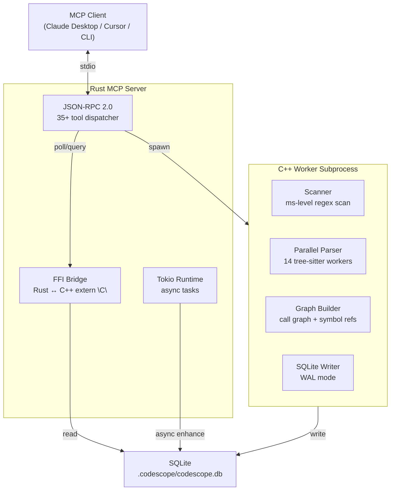
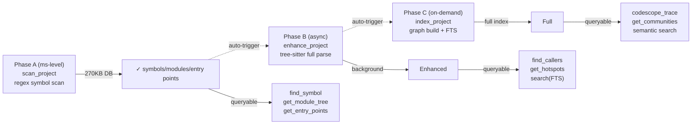
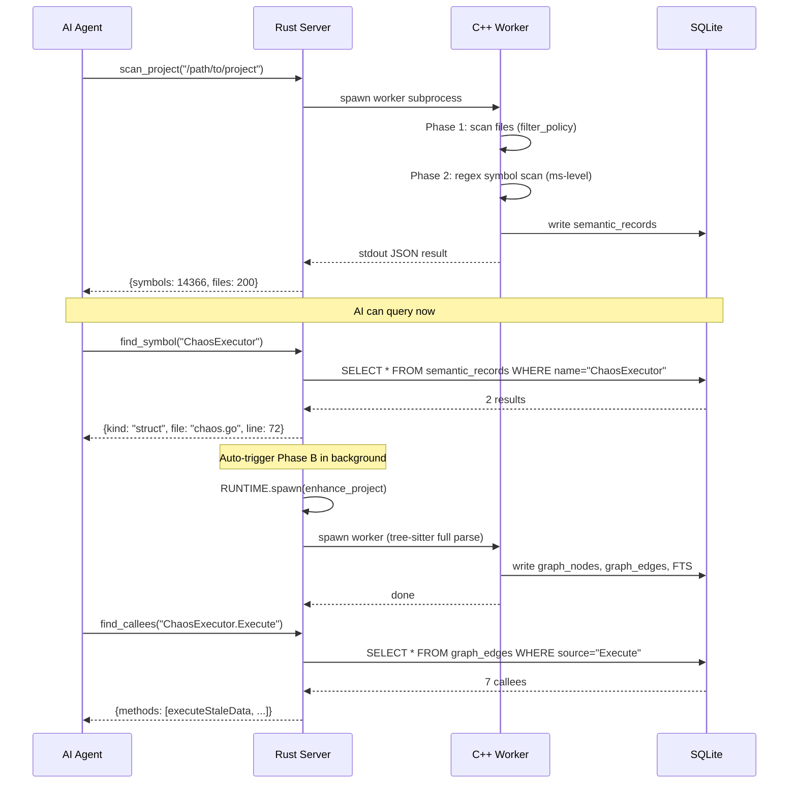

# CodeScope Architecture (1): Introduction — When an MCP Tool Returns 56KB and You Only Need 629 Bytes

> I didn't set out to build something "X times better than CBM."
> I was using codebase-memory-mcp and got frustrated by one thing:
> **AI asks for a symbol, it returns the entire project.**
>
> 56KB of JSON, 70% of which is fingerprints, AST profiles, and body tokens that AI doesn't need. The truly useful parts — struct fields, constant values, switch-case branches — were missing.
> So I decided to build a tool that only answers what was asked.

## Series Index

| # | Title | One-liner |
|:--:|------|-----------|
| 1 | **Introduction** (this article) | Why rewrite a code understanding tool, and the overall architecture |
| 2 | Progressive Readiness | Millisecond-level understanding |
| 3 | Worker Isolation | Why indexing won't slow down your MCP Server |
| 4 | Zero-Redundancy Responses | Minimal responses, on-demand |
| 5 | C++ Engine Pipeline | From source code to multi-dimensional code graph |
| 6 | MCP Protocol Layer | Design philosophy of 35+ tools |
| 7 | Language Translators | 10 languages unified into one IR |
| 8 | SQLite Storage Layer | The secret of 270KB replacing 64MB |
| 9 | Adaptive Queries | When data isn't ready yet |
| 10 | Performance Truth | From small projects to 60,000 files |

## I. Starting Point: A 56KB Response

Let's start with data so you understand what I'm talking about.

Same machine, same codebase (GoAgent, ~24K lines of Go), same question ("How does Chaos work, and what patterns does it have"), two tools with different design philosophies:

| Dimension | codebase-memory-mcp v0.8.1 | CodeScope | Note |
|-----------|:--------------------------:|:---------:|------|
| Minimum useful response | **56,183 bytes** | **629 bytes** | CBM returns full info, CodeScope returns minimal on-demand |
| Equivalent tokens | ~14,046 | ~157 | CodeScope uses fewer tokens, CBM responses contain more native info |
| First query wait time | After full index (minutes) | **Query immediately after create** | CodeScope's progressive model vs CBM's full-index model |

Both designs have trade-offs. CBM's full-index model provides lower query latency and richer information after indexing completes. CodeScope's progressive model lets AI start interacting faster, but deep queries wait for background indexing.

### What's in 56KB

Using CBM's `search_graph` response as an example:

```
┌─────────────────────────────────────────────┐
│ search_graph response 56,183 bytes breakdown  │
│                                              │
│ ████████████████████████████████  70%  noise   │
│   (test functions, doc sections, route nodes) │
│                                              │
│ ████████████                      20%  needed │
│   (node names, labels, files)               │
│                                              │
│ ████                             10%  useful  │
│   (ChaosExecutor, ChaosAction, etc.)         │
└─────────────────────────────────────────────┘
```

This is a design choice. CBM returns as much information as possible in one shot, suitable for deep analysis. CodeScope returns on-demand to minimize unnecessary token consumption — at the cost of potentially requiring multiple queries to get full context.

It's worth noting that [codebase-memory-mcp](https://github.com/DeusData/codebase-memory-mcp) is an excellent open-source code understanding tool that outperforms CodeScope in some scenarios:
- **Full Linux kernel indexing**: CBM can index the entire Linux kernel source (~65K files) in minutes; CodeScope's full-index stability for large projects still needs improvement
- **Response richness**: CBM's `search_graph` returns more comprehensive fields, suitable for one-shot full information retrieval
- **Community ecosystem**: CBM has a more mature open-source community and documentation

CodeScope's goal is not to replace CBM, but to offer a different design approach — progressive readiness and minimal responses. If you need fast startup interaction and are token-sensitive, CodeScope may suit you better. If you need deep analysis after full indexing, CBM is the better choice.

### What's in 629 Bytes

```json
{
  "results": [
    {
      "id": 2851,
      "kind": "struct",
      "name": "ChaosExecutor",
      "signature": "type ChaosExecutor struct {",
      "visibility": "default",
      "language": "go",
      "file_path": "~/go/src/goagent/.../chaos.go",
      "line": 72,
      "column": 1
    }
  ]
}
```

Every field is useful. No fingerprints, no AST profiles, no body tokens. AI knows it's a struct, which file, which line, and its signature. If it wants to know more, it will ask again — not get everything dumped at once.

---

## II. Architecture Overview: Three Layers + One DB

CodeScope's overall architecture is a three-layer structure:



- **Rust MCP Server**: Handles protocol, tool dispatch, async tasks. Doesn't touch source parsing.
- **C++ Worker Subprocess**: Does the heavy lifting — scanning files, parsing ASTs, building graphs, writing to DB. Exits when done, RSS fully returned to OS.
- **SQLite**: The sole persistence layer. WAL mode, read-write separation.

Why C++ engine as subprocess instead of threads? Memory isolation. When a Worker indexes 60,000 files of Linux Kernel, RSS can hit several GB, but it's an independent process — memory is fully released on exit, never polluting the Server process.

---

## III. Progressive Readiness Model

This is CodeScope's core design decision, and its biggest philosophical difference from codebase-memory-mcp.

CBM's model: queries only after full indexing. This means users must wait for full indexing to complete before interacting, but once indexed, query latency is low and information is complete.

CodeScope's model: progressive readiness — **deepen gradually, available at any time.**



| Phase | Time (small project ~200 files) | DB Size | Capabilities |
|:-----:|:-------------------------------:|:-------:|--------------|
| Phase A | **~9ms** | 270 KB | Symbol names, module tree, entry points |
| Phase B | Background 1-5 min | A few MB | Call graph, FTS search |
| Phase C | On-demand (minutes for large projects) | Full | Call chain trace, community detection |

The result: `scan_project` returns immediately and queries are available. Phase B/C run in the background without affecting normal usage.

---

## IV. Data Flow: From Folder to AI Answer



Key design point: **After Phase A returns, AI can immediately start querying. Phase B runs in the background without affecting AI's normal workflow.**

---

## V. Tech Stack: Why C++ + Rust + SQLite

This combination wasn't decided on day one. I took some detours.

### Why C++ for the Engine

tree-sitter's C API is a first-class citizen. C++ can directly call tree-sitter parsers without an extra FFI layer. And tree-sitter parsing itself is C-based, so wrapping in C++ is natural.

Additionally, C++ has advantages in memory layout and performance. 14 worker threads parsing hundreds of files in parallel — C++'s pthread + arena allocator is more controllable than GC'd languages.

### Why Rust for the Server

The MCP protocol is essentially a long-running JSON-RPC 2.0 server over stdio transport. Rust's Tokio async runtime is perfect for this — handling multiple tool calls, background tasks, and polling simultaneously.

More importantly, Rust's FFI ecosystem (`extern "C"` bindings) integrates with C++ very directly. 40+ FFI functions, each exported as `extern "C"`, callable from Rust via `#[link(name = "engine")]`.

### Why SQLite for Storage

No distributed setup needed. No high concurrency needed. One DB file per project in `.codescope/` directory. SQLite's WAL mode supports read-write separation — Worker writes data, Server reads data, no blocking.

Plus, SQLite's FTS5 full-text search and vec0 vector extensions work out of the box, no need for Elasticsearch or Milvus.

### Honest Reflection: Why Not Pure Rust

If I were to do it again, I would seriously consider rewriting the entire engine in Rust. C++'s build system (CMake) plus cross-platform compatibility (Windows .dll, macOS .dylib, Linux .so) brings maintenance costs far beyond expectations.

But the choice of C++ was reasonable at the time: tree-sitter's ecosystem is C/C++ based, the team had C++ background, and C++ is indeed more flexible in low-level memory control. **There's no perfect tech stack, only the right one for the current stage.**

---

## VI. Technical Metrics

| Metric | Value |
|--------|:-----:|
| Supported languages | 13 (C/C++/Go/Rust/Java/Python/TS/JS etc.) |
| Phase A scan | **ms-level** for Linux Kernel 60,000 files |
| Index speed | 1,167 Go files → **3.28s** |
| Max graph nodes | 263,614 (GoAgent project) |
| Max graph edges | 245,849 |
| Query latency | Most queries **<1ms**, full graph Label Propagation **<500ms** |
| Index DB size | 270 KB (Phase A) → full (MB-tens of MB) |
| Process isolation | Worker subprocess, RSS 100% returned to OS |
| Worker timeout | 300s + 3 retries |
| MCP tools | 35+ |

---

## VII. Series Preview

| # | Title | Core Content |
|:--:|------|--------------|
| **2** | Progressive Readiness | How Phase A scans ms-level, Phase B async enhancement, Phase C full index |
| **3** | Worker Isolation | Why subprocesses over threads, cost and benefit of memory isolation |
| **4** | Zero-Redundancy Responses | Why each field exists or doesn't, comparison with CBM's 56KB |
| **5** | C++ Engine Pipeline | From filter_policy to graph_builder, a data's complete journey |
| **6** | MCP Protocol Layer | How 35+ tools are designed, registration and routing |
| **7** | Language Translators | How 10 languages unify into IR, tree-sitter visitor design |
| **8** | SQLite Storage Layer | WAL mode, FTS5, vec0, incremental indexing |
| **9** | Adaptive Queries | Graceful degradation when data isn't ready |
| **10** | Performance Truth | From 200 files to 60,000 files, measured data |

Every article follows the same pattern: **Problem → Design Journey → Trade-offs → Honest Reflection.** No marketing. No "10x faster than X." Just engineers talking about engineering.

Next: [CodeScope Architecture (2): Progressive Readiness](codescope-architecture-02-progressive-readiness.md)
