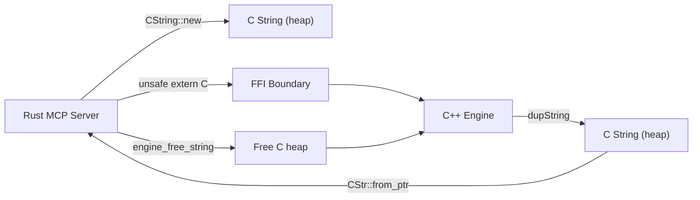
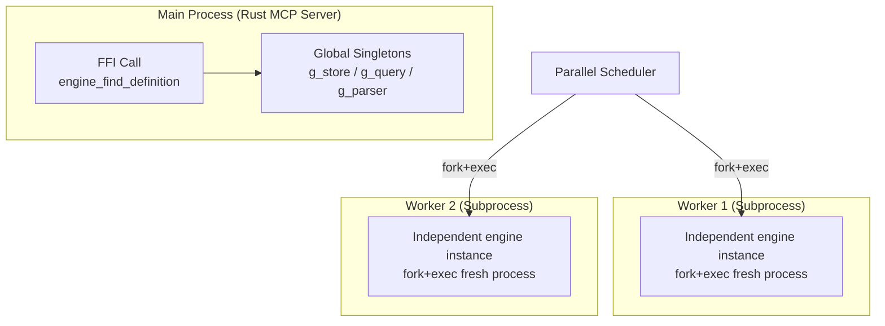
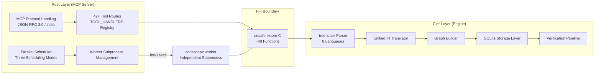

# CodeScope Deep Dive (1): Dual-Language Architecture — Why We Wrote a C++ Project in Rust

> *"Sometimes the best tool for the job isn't the one you'd like to use."*
> 有时最好的工具并不是你喜欢的那个。

## Why Two Languages?

If I had to explain CodeScope's architecture in one sentence, I'd say: **Rust writes an MCP server, C++ writes an entire engine, FFI glues them together, and each index task runs in its own subprocess.**

This is not an elegant design. It's ugly, it's messy, and debugging it touches two language runtimes simultaneously. But it solves two problems I couldn't solve otherwise:

1. **Rust's ecosystem** has MCP SDKs, serde serialization, tokio async — these are the most comfortable way to write a JSON-RPC server.
2. **C++'s ecosystem** has tree-sitter parsers, SQLite's native C API, and syntax parsers for various languages — these are the most direct path to building a code analysis engine.

I initially tried a pure Rust approach. Using the `tree-sitter` crate to parse code, writing my own IR and storage layer. But I quickly discovered that when you need to cover 8 languages, handle repositories in the hundreds of GB range, and still deliver millisecond-level responses, the overhead of Rust's abstraction layers becomes non-negligible. On the C++ side, tree-sitter's C API can be called directly, SQLite's C API is zero-overhead, and every memory layout can be precisely controlled.

So it ended up like this: **Rust writes the frontend (MCP server), C++ writes the backend (engine core), with a nasty but necessary FFI layer in between.**

## Core Files

```
server/src/ffi/mod.rs    ← Rust-side FFI declarations (~700 lines)
engine/src/engine_ffi.cpp  ← C++-side FFI implementation
engine/src/engine.h       ← C++ public API
```

## The Harsh Reality of FFI

Let's look at the Rust side first. Here's what the FFI declarations look like:

```rust
// server/src/ffi/mod.rs
unsafe extern "C" {
    fn engine_init(db_path: *const c_char) -> i32;
    fn engine_shutdown();

    fn engine_create_project(root_path: *const c_char, name: *const c_char) -> u64;
    fn engine_index_project(
        project_id: u64,
        dir_path: *const c_char,
        language_filter: *const c_char,
    ) -> *mut c_char;
    fn engine_find_definition(
        project_id: u64,
        symbol_name: *const c_char,
        file_filter: *const c_char,
    ) -> *mut c_char;
    // ... 40+ similar declarations
}
```

Every `unsafe extern "C"` block is saying: **"Rust doesn't know what's going on out there, but I trust it."** And that trust is easy to break.

And the C++ side implementation looks like this:

```cpp
// engine/src/engine_ffi.cpp
extern "C" char* engine_index_project(
    uint64_t project_id,
    const char* dir_path,
    const char* language_filter)
{
    std::string result = // ... actual indexing logic
    return dupString(result);  // heap-allocated, Rust side must free
}
```

This code hides a classic FFI trap: **Who is responsible for freeing the memory?**

After the Rust side calls `engine_index_project` and gets back a `*mut c_char`, it must call `engine_free_string` to release it. Forget to free = memory leak. Free twice = crash. This is what cross-language memory management is like — you're always worried the other side forgot something.

## The Wrapper Layer Around FFI

On the Rust side, each FFI call is wrapped in a safe Rust function that converts C pointers into Rust `String` or `Result`:

```rust
// server/src/ffi/mod.rs (simplified)
pub fn index_project(project_id: u64, dir_path: &str, language_filter: &str) -> Result<String, String> {
    let dir_c = CString::new(dir_path).unwrap();
    let lang_c = CString::new(language_filter).unwrap();

    let ptr = unsafe { engine_index_project(project_id, dir_c.as_ptr(), lang_c.as_ptr()) };
    if ptr.is_null() {
        return Err("engine returned null".into());
    }
    let result = unsafe { CStr::from_ptr(ptr) }.to_string_lossy().into_owned();
    unsafe { engine_free_string(ptr) };
    Ok(result)
}
```

This pattern is repeated 40+ times. Every time it's:
1. `CString::new` — Rust string → C string
2. unsafe call
3. Null pointer check
4. `CStr::from_ptr` — C string → Rust string
5. `engine_free_string` — Free C-side memory

This process is so mechanical that I've written several bugs: forgetting to check for null pointers, forgetting to free, and even using a pointer after freeing it.



## Global Singleton: C++'s "Implicit State"

Inside the engine, there are three global singletons:

```cpp
// engine/src/engine_internal.h
extern std::unique_ptr<store::GraphStore> g_store;
extern std::unique_ptr<query::QueryEngine> g_query;
extern std::unique_ptr<Parser> g_parser;
```

They are initialized by `engine_init()` and destroyed by `engine_shutdown()`. The Rust-side MCP server calls `engine_init` once at startup and `engine_shutdown` once at shutdown.

But the thread-safety model here is fragile:

```cpp
// engine/src/engine_internal.h
// Thread-safety model:
// - The Rust MCP server calls FFI functions SEQUENTIALLY from a single
//   thread (the main event loop in server/src/mcp/server.rs).
// - Index worker SUBPROCESSES have their own engine instance (fork+exec).
// - engine_shutdown() must only be called when no FFI query is in flight.
```

In plain English: **"Don't call FFI from multiple threads at the same time."**

This constraint was never an issue in v0.1 — the MCP server was a single-threaded event loop, processing all requests serially. But when the parallel scheduler was introduced in v0.2, the problem emerged: **The scheduler forks subprocesses, each with its own engine instance, but the parent process's engine is still handling query requests simultaneously.**

The solution: within subprocesses, `fork+exec` restarts a `codescope worker` process, with a completely independent memory space that won't interfere with the parent process's global singletons.



## A Lesson That Made My Blood Run Cold

During v0.1.2 development, I encountered a baffling crash: on CI, `engine_shutdown` would occasionally trigger a `double free`.

After three days of debugging, I found the root cause was a **dangling pointer**. After a certain Rust-side FFI call returned, the C++ side was holding a pointer to data on Rust's stack. When the Rust `CString` was dropped, the C++ side was still using it. On a single thread this might occasionally work, but under CI's high load it would crash.

The fix was to change all cross-boundary strings to **deep copies** — the C++ side immediately copies the received C string into a `std::string`, never holding any pointer to Rust memory.

The lesson: **Pointers across the FFI boundary must either be const and not freed during their lifetime, or be copied immediately. There is no middle ground.**

## Why Endure This Pain?

If FFI is this much trouble, why not use pure Rust or pure C++?

**Pure C++ approach**: C++ has no native MCP SDK. I would need to manually implement the JSON-RPC 2.0 protocol, HTTP transport (or stdio transport), and routing dispatch for all tools. That's roughly 2000-3000 lines of extra code, and every new tool requires manual registration.

**Pure Rust approach**: Rust's `tree-sitter` crate is a wrapper around the C API, with minimal performance loss, but the problem is this: a large amount of code in the C++ engine (especially the IR translator and graph builder) is written using C++17/C++20 features. Porting it all to Rust would require reimplementing a complete IR system and graph algorithms — that's months of work.

So FFI isn't the optimal solution; it's the **optimal solution under the current constraints**. Rust handles what it's good at: networking, serialization, process management, type safety. C++ handles what it's good at: parsing, graph construction, memory control, performance-critical paths.



## Summary

CodeScope's dual-language architecture wasn't designed — it was forced. We couldn't give up Rust's MCP ecosystem or C++'s parsing ecosystem, so FFI became the cost we had to bear.

40+ `unsafe extern "C"` declarations, manually managing the lifetime of every string, thread-safety constraints on global singletons — these are all real technical debt. But so far, it runs reliably enough.

In the next article, I'll break down **Worker Subprocess Isolation** — why every index task must run in its own subprocess, and how to handle repositories with millions of lines of code without crashing.