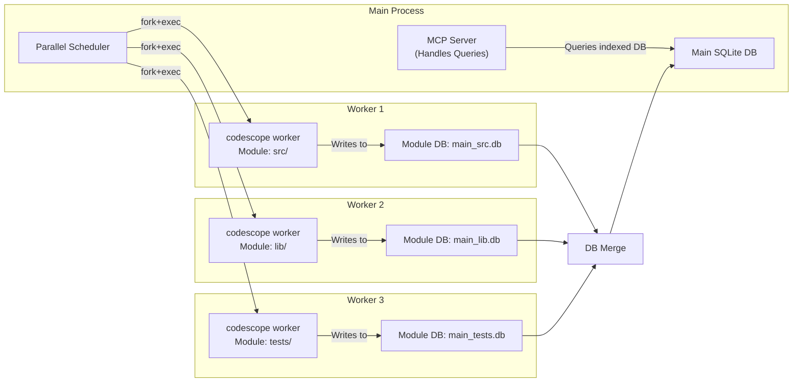
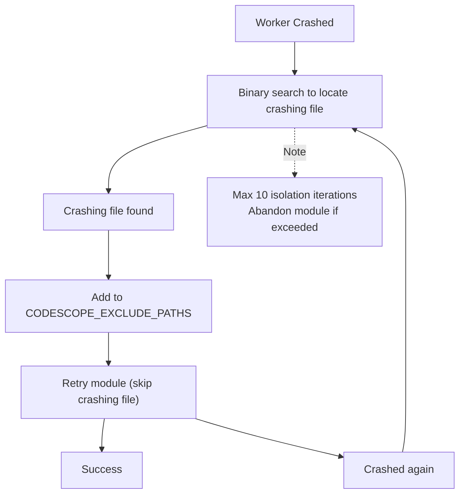
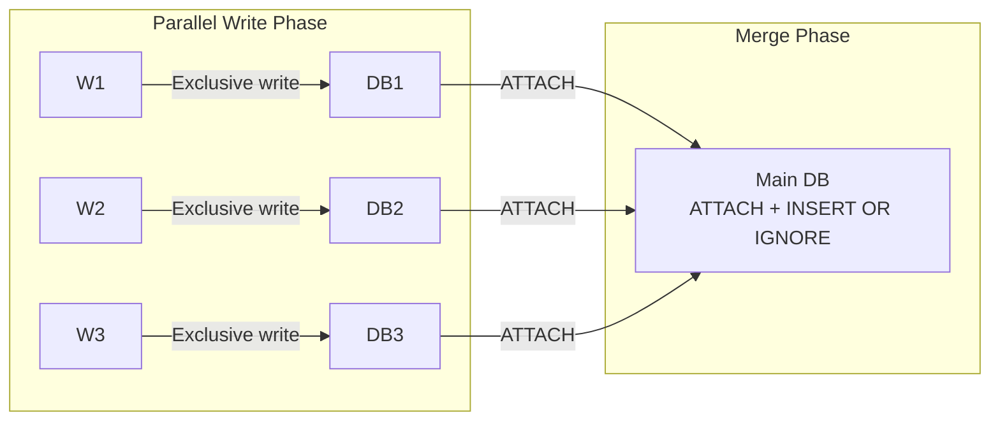

# CodeScope Deep Dive (2): Worker Subprocess Isolation — Why Indexing Must Run in Subprocesses

> *"The only way to make a C++ program crash-proof is to run it in a separate process."*
> 让 C++ 程序不崩溃的唯一方法，是把它跑在单独的进程里。

## Starting with an OOM Crash

In the early versions of CodeScope (v0.1), indexing ran directly in the main process. After calling `engine_index_project`, the entire MCP server would freeze — single-threaded event loop, unable to handle any new requests until indexing completed.

But that wasn't the most serious problem. The most serious problem was: **When indexing a large repository (like the Linux kernel or JDK), the C++ engine's memory usage would spike to several GB, and then the OOM killer would take down the entire process.**

The MCP server crashes, the LLM client receives a `connection closed` error, and the user probably mutters "what garbage software."

The solution was straightforward: **Run indexing tasks in subprocesses.** If a subprocess crashes, the main process is unaffected and can reschedule or gracefully degrade.

## Core Files

```
server/src/scheduler/worker.rs  ← Worker subprocess management (~576 lines)
server/src/scheduler/mod.rs     ← Scheduler main logic (~1382 lines)
server/src/main.rs              ← worker subcommand entry point
```

## fork + exec: A Simple Approach

The Rust scheduler spawns subprocesses in a straightforward way:

```rust
// server/src/scheduler/worker.rs
pub(super) fn run_module_worker(
    exe: &str,
    project_dir: &str,
    module_name: &str,
    files_estimate: u64,
    workers: u32,
    grammars_dir: &str,
    db_prefix: &str,
    project_id: u64,
    quarantine_exclude: Option<&str>,
) -> ModuleResult {
    let module_dir = Path::new(project_dir).join(module_name);
    let module_db = format!("{}_{}.db", db_prefix, module_name);

    // Each worker starts from a clean DB file
    let _ = std::fs::remove_file(&module_db);

    let mut cmd = Command::new(exe);
    cmd.args([
        "worker",
        &module_db,
        module_dir.to_str().unwrap_or(""),
        "",  // empty language filter
        &project_name,
        &project_id_str,
    ]);
    cmd.env("GRAMMARS_DIR", grammars_dir);
    cmd.env("CODESCOPE_DB_PATH", &module_db);
    cmd.env("CODESCOPE_INDEX_MODE", "fast");
    // ...
}
```

Each module launches an independent `codescope worker` subprocess. This subprocess is a completely independent process instance — it has its own address space, its own global variables, its own `g_store` singleton. This means:

- Subprocess crashes → main process is unaffected
- Subprocess memory leaks → OS automatically reclaims on process exit
- Subprocess OOM → only the subprocess itself is killed, the main process keeps running



## Timeout and Isolation

Each worker has a hard timeout:

```rust
const DEFAULT_WORKER_TIMEOUT_SECS: u64 = 600;
```

If it doesn't finish within 10 minutes, the subprocess is `kill`ed. This prevents an infinite loop in a parser from hogging the entire scheduler.

But there's a question: **How do we know if a worker exited normally or crashed?**

```rust
// Wait for the subprocess to exit
match child.wait_with_output() {
    Ok(output) => {
        if output.status.success() {
            // Normal exit, parse stdout JSON
        } else {
            // Crash or non-zero exit code
            // Enter isolation flow
        }
    }
    Err(e) => {
        // wait itself failed
    }
}
```

## Isolation Mechanism: Binary Search to Locate the Crashing File

When a worker crashes, the scheduler doesn't simply retry the entire module — it uses **binary search** to locate the file causing the crash:

```rust
// server/src/scheduler/mod.rs (simplified)
fn quarantine_crashing_file(
    module: &Module,
    files: &[FileEntry],
    crash_index: usize,
) -> Option<String> {
    let mut lo = 0;
    let mut hi = files.len();

    while lo < hi {
        let mid = (lo + hi) / 2;
        let test_files = &files[lo..=mid];

        // Index only these files
        if run_worker_with_files(module, test_files).is_ok() {
            lo = mid + 1;  // Crash is on the right
        } else {
            hi = mid;       // Crash is on the left (including mid)
        }
    }

    // Found the crashing file
    Some(files[lo].path.clone())
}
```

Once the crashing file is found, the scheduler adds it to `CODESCOPE_EXCLUDE_PATHS` and then **retries the entire module** — skipping this file.



This mechanism has located tree-sitter parser crashes on specific C++ template code several times in my testing. After isolation, the entire project can still be indexed, just missing that one file — which is 100x better than a total indexing failure.

## One DB Per Worker to Avoid SQLite Concurrent Writes

Another key design decision: **Each worker writes to its own SQLite file.**

```rust
let module_db = format!("{}_{}.db", db_prefix, module_name);
```

SQLite's WAL mode supports concurrent reads, but concurrent writes require locking. If multiple workers write to the same DB file simultaneously, lock contention causes severe performance degradation, or even deadlocks.

Each worker having its own DB file means:

- No lock contention
- No deadlock risk
- After indexing completes, merge via `ATTACH + INSERT OR IGNORE`



## A Lesson That Made My Blood Run Cold

During v0.2.0 development, I discovered that **entity IDs from different modules conflicted in the merged DB.**

Each worker's `project_id` was assigned by the scheduler (1, 2, 3, ...), but entity IDs auto-incremented starting from 1. Two modules could both have an entity with `id=42`, and `INSERT OR IGNORE` during the merge would lose the second module's entity.

The fix was: **Apply offset remapping to each module's entity IDs during merge.**

```rust
// server/src/scheduler/merge.rs (simplified)
// For module i > 0:
// 1. Calculate offset = MAX(id) of current main table
// 2. Copy module data to a temp table
// 3. Add offset to temp table's id and FK columns
// 4. INSERT OR IGNORE into the main table
// 5. DROP the temp table

const TABLE_SPECS: &[TableSpec] = &[
    TableSpec {
        name: "entity",
        remap_cols: &[("id", "self")],  // id += offset
        skip_rowid: false,
    },
    TableSpec {
        name: "relation",
        remap_cols: &[
            ("id", "self"),          // Primary key remap
            ("source_id", "entity"), // FK follows entity's offset
            ("target_id", "entity"), // FK follows entity's offset
        ],
        skip_rowid: false,
    },
    // ...
];
```

This remapping needs to know the foreign key relationships between tables: `relation.source_id` references `entity.id`, so `source_id`'s offset must match `entity.id`'s offset.

**Table order matters**: referenced tables (entity) must be merged first, referencing tables (relation) later. That's why the order of `TABLE_SPECS` is carefully arranged.

## Summary

Worker subprocess isolation is the key to CodeScope running stably on production-grade repositories. It solves three problems:

1. **Crash isolation**: C++ engine crashes don't bring down the MCP server
2. **Memory reclamation**: All memory is automatically freed when the process exits
3. **Concurrent writes**: Each worker has its own DB file, no lock contention

The cost is: process startup overhead (~10ms), the extra step of DB merging, and those annoying ID remappings. But compared to the pain of the main process being killed by OOM, this cost is negligible.

In the next article, I'll break down the **Parallel Scheduler** — the design and trade-offs of three scheduling modes, and why a simple "static allocation" approach fails on large repositories.