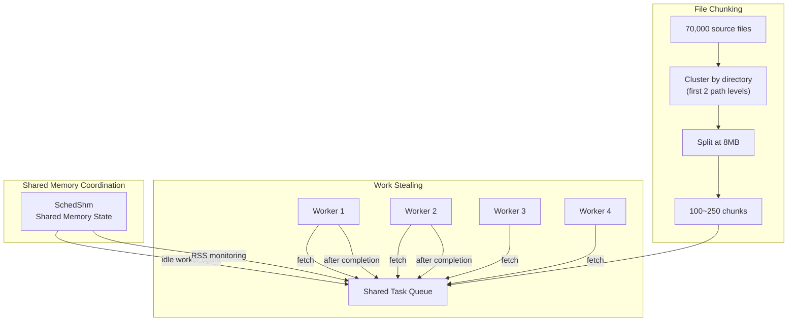
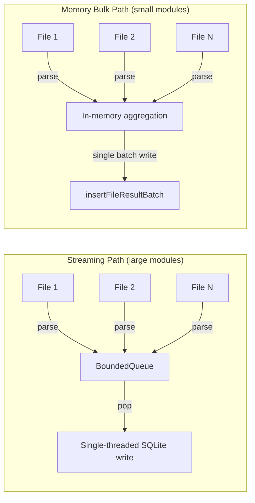
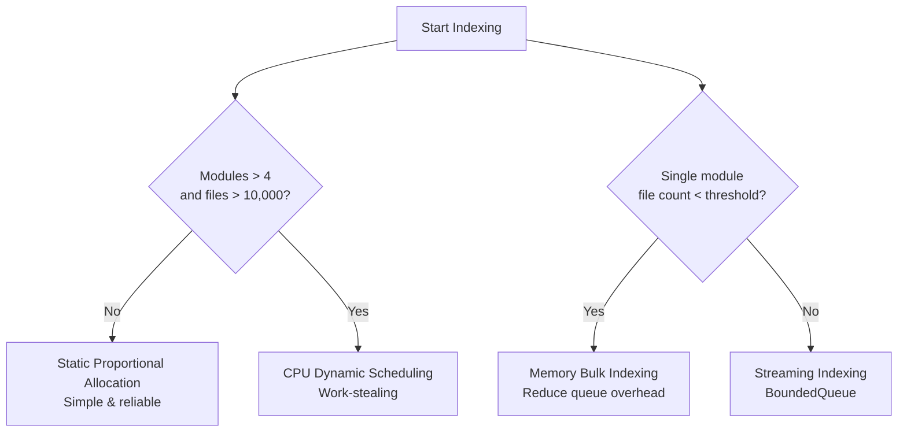

# CodeScope Deep Dive (3): Parallel Scheduler — Design and Trade-offs of Three Scheduling Modes

> *"A scheduler that doesn't know when to give up is worse than no scheduler at all."*

## The Starting Point

CodeScope's indexing needs to process a massive number of files. The Linux kernel has ~70,000 source files, and JDK has ~40,000. If parsed serially, a single file's tree-sitter parsing + IR construction + SQLite writing takes 50-200ms, meaning 70,000 files would take 1-4 hours.

Users can't wait 4 hours. So parallelism is essential.

But parallel scheduling isn't as simple as "spawn N threads." The problems are:

1. **Huge disparity in module sizes**: `src/` might have 10,000 files, while `docs/` has only 50
2. **Subsystem resource contention**: SQLite writes, memory allocation, file I/O
3. **Crash handling**: A crash in one module must not affect other modules
4. **CPU core limits**: Unlimited parallelism is not possible

## Core Files

```
server/src/scheduler/mod.rs        ← Scheduler main logic (~1382 lines)
server/src/scheduler/chunk_plan.rs ← Chunk planning (~524 lines)
server/src/scheduler/dyn_config.rs ← Dynamic scheduling config (~220 lines)
server/src/scheduler/shm.rs        ← Shared memory
server/src/scheduler/chunk_queue.rs← Work-stealing queue
```

## Mode 1: Static Proportional Allocation

This is the most straightforward approach and the default scheduling mode of CodeScope.

```rust
// server/src/scheduler/mod.rs (conceptual)
fn allocate_workers_static(modules: &[Module], total_workers: u32) -> Vec<u32> {
    let total_files: u64 = modules.iter().map(|m| m.file_count).sum();

    modules.iter().map(|m| {
        std::cmp::max(
            1,  // At least 1 worker per module
            (m.file_count as f64 / total_files as f64 * total_workers as f64).ceil() as u32
        )
    }).collect()
}
```

The core logic is simple: **allocate CPU cores proportionally by file count.**

- Module A has 10,000 files (50% of total) → 4 cores allocated (out of 8 total)
- Module B has 5,000 files (25%) → 2 cores allocated
- Module C has 500 files (2.5%) → 1 core allocated (minimum 1)

```mermaid
flowchart LR
    subgraph "Module Discovery"
        Discover["discover_modules()<br/>scan top-level dirs + file count"]
    end

    subgraph "Static Allocation"
        Alloc["allocate workers proportionally by file count"]
        W1["Module A: 4 workers"]
        W2["Module B: 2 workers"]
        W3["Module C: 1 worker"]
        W4["Module D: 1 worker"]
    end

    subgraph "Parallel Execution"
        WA["Worker subprocess<br/>CODESCOPE_SKIP_ASYNC=1"]
        WB["Worker subprocess"]
        WC["Worker subprocess"]
        WD["Worker subprocess"]
    end

    subgraph "Merge"
        Merge["DB Merge<br/>ATTACH + INSERT OR IGNORE"]
    end

    Discover --> Alloc
    Alloc --> W1 --> WA
    Alloc --> W2 --> WB
    Alloc --> W3 --> WC
    Alloc --> W4 --> WD
    WA --> Merge
    WB --> Merge
    WC --> Merge
    WD --> Merge
```

**Pros**: Simple, predictable, no runtime monitoring needed.

**Cons**: If Module A's 10,000 files are all small files while Module B's 5,000 files are all large files, the allocation no longer reflects the actual workload. Once a small module finishes, its cores sit idle until all modules are complete.

## Mode 2: CPU-Dynamic (Chunked Work-Stealing)

The "core waste" problem of static allocation becomes unacceptable on large repositories (>50,000 files). This leads to the second mode: **work-stealing**.

```rust
// server/src/scheduler/dyn_config.rs
pub fn should_enable(&self, total_modules: usize, total_files: u64) -> bool {
    match self.force_on {
        Some(b) => b,
        None => total_modules > 4 && total_files > 10000,
    }
}
```

This mode is **opt-in** by default—it only activates via the `CODESCOPE_CPU_DYNAMIC=1` environment variable or when a project exceeds 10,000 files and 4 modules.

Its core idea: **split files into smaller chunks, then have multiple workers dynamically fetch tasks from a shared queue.**

```rust
// server/src/scheduler/chunk_plan.rs
/// Default: 8 MB per chunk
pub const TARGET_BYTES: u64 = 8 * 1024 * 1024;
/// Maximum: 32 MB
pub const MAX_BYTES: u64 = 32 * 1024 * 1024;
/// Cluster by first 2 path levels
pub const CLUSTER_DEPTH: usize = 2;
```



**Chunking algorithm**:

1. Cluster by first 2 path levels (`src/compiler/`, `src/parser/`)
2. Sort descending by byte size
3. Greedy packing: accumulate files until `TARGET_BYTES` (8MB) is reached
4. Force-split oversized directories (>32MB)

This way, files in the same directory are likely to end up in the same chunk, preserving **directory locality**—related files are parsed together, reducing cross-module context switching.

**Memory monitoring**: The dynamic scheduler also has a memory limit mechanism. When RSS exceeds the threshold (default 4GB), no new chunks are allocated to prevent OOM.

```rust
// server/src/scheduler/dyn_config.rs
pub fn from_env() -> Self {
    let mem_limit_mb = env::var("CODESCOPE_MEM_LIMIT_MB")
        .ok()
        .and_then(|v| v.parse().ok())
        .unwrap_or(4096);
    // ...
}
```

## Mode 3: Memory Bulk Indexing (Membulk)

For small modules (<= file count threshold), the scheduler uses a third mode: **memory bulk indexing**.

```cpp
// engine/src/engine_internal.h
/// For small modules (<= kMemBulkFileThreshold files) the parse workers
/// aggregate FileResult in memory instead of pushing through BoundedQueue,
/// then flush once via insertFileResultBatch.
char *engine_index_project_membulk(
    uint64_t project_id, const std::string &dir, uint64_t max_file_size,
    const FilterPolicy &filter,
    const std::vector<std::pair<std::string, std::string>> &job_lang,
    const std::unordered_map<std::string, const TSLanguage *> &lang_ptrs,
    bool is_reindex, bool mode_fast, bool mode_deep);
```

Why is this mode needed? Because the **BoundedQueue** (thread-safe producer-consumer queue) overhead is too high for small modules. If a module has only 50 files, each file must be pushed to the queue after parsing, then popped by another thread and written to SQLite—this synchronization overhead can account for up to 30% of total time.

For small modules, a better strategy is: **all parsing threads aggregate results in memory, then flush everything in a single batch write after parsing completes.**



## Selection Criteria for Scheduling Modes

The three modes correspond to three scenarios:



## A Lesson That Made My Blood Run Cold

In v0.2.2, I encountered a **deadlock**.

In dynamic scheduling mode, multiple workers coordinate task allocation through shared memory (`SchedShm`). When all chunks have been claimed, the last worker sends a "done" signal, and the scheduler begins merging databases.

But there was an edge case: **if a worker is scheduled out by the OS after claiming a chunk but before starting work** (e.g., due to CPU contention from other processes), other workers might have already completed all work and started merging. When the delayed worker wakes up, it's still writing to its own DB, but the merge thread is already reading from it. Under SQLite's WAL mode, reads and writes can proceed concurrently, but if we're using `INSERT OR IGNORE` for merging while the worker is still writing, we get a **partial merge** problem.

The fix: **ensure all workers have exited before merging.** The scheduler no longer relies on a "done" signal in shared memory; instead, it waits for each child process's `wait()` to return.

```rust
// Fixed logic
for handle in worker_handles {
    let result = handle.join().unwrap_or_else(|_| {
        // Thread panic or worker crash
        ModuleResult::crashed(module_name)
    });
    results.push(result);
}
// Only start merging after all workers have confirmed exit
merge_results(results, &db_path);
```

## Summary

The three scheduling modes weren't designed upfront; they were added incrementally as problems emerged:

1. **Static Proportional Allocation**: Simple, predictable, suitable for most projects
2. **CPU Dynamic Scheduling**: Solves the core waste problem for large repositories, but requires opt-in
3. **Memory Bulk Indexing**: Solves the queue overhead problem for small modules, a performance optimization

The core design principle of the scheduler is: **the scheduler only manages CPU core allocation; it does not participate in file discovery, parsing, or graph construction.** It neither knows nor cares about the content of each file; it only cares about "which module has how many files" and "which core is idle."

This separation of concerns makes it easy to replace the scheduler in the future—for example, with a Kubernetes cluster scheduler or a priority-based queue.

In the next article, I'll take apart the **Two-Phase Index**—how Fast Scan returns results in milliseconds, and what Background Enhance does behind the scenes.