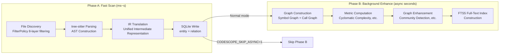
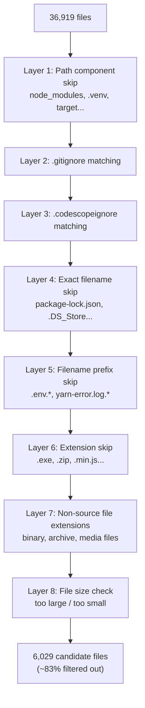
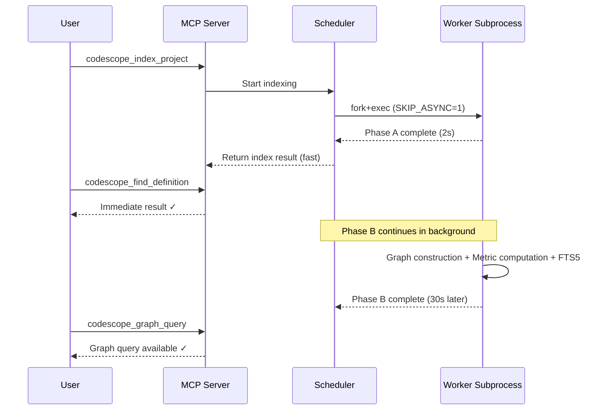

# CodeScope Deep Dive (4): Two-Phase Index — The Trade-off Between Millisecond Response and Deep Analysis

> *"The user doesn't care about your graph database. They care about getting an answer before they forget the question."*

## The Problem: Indexing Is Too Slow

CodeScope's full indexing pipeline includes: file discovery → tree-sitter parsing → IR construction → metric computation → graph construction → graph enhancement (community detection, clustering). For a repository the size of the Linux kernel, full indexing takes 5-15 minutes.

An LLM's patience is limited. If a user initiates a `codescope_index_project` request and then has to wait 10 minutes before they can query, the tool becomes unusable.

But here's the good news: **most queries only need basic symbol information** (definitions, references, call relationships), not graph analysis. If we can return a basic symbol index within seconds, and let graph analysis quietly complete in the background, the user won't perceive any latency.

That's the origin of the two-phase index.

## Core Files

```
server/src/scheduler/worker.rs          ← CODESCOPE_SKIP_ASYNC in Worker
server/src/engine_ffi.cpp               ← engine_index_project implementation
engine/src/engine_internal.h            ← engine_index_post_parse declaration
engine/src/engine_helpers.cpp           ← Index helper functions
```

## Phase A: Fast Scan (milliseconds to seconds)

The goal of Fast Scan is: **return a queryable index as quickly as possible.**

It only does the essential work:

1. File discovery + filtering (8-layer filter strategy)
2. tree-sitter parsing (AST generation)
3. IR translation (unified intermediate representation)
4. Symbol extraction (entities, relations)
5. SQLite writing



During the parallel worker indexing phase, each worker sets `CODESCOPE_SKIP_ASYNC=1`:

```rust
// server/src/scheduler/worker.rs
cmd.env("CODESCOPE_INDEX_MODE", "fast");
```

This means workers only do Phase A, skipping Phase B. The merged DB can be ready within seconds, and **users can start querying immediately.**

## Phase B: Background Enhance (async, seconds to minutes)

Phase B starts after Phase A completes, executing a series of **compute-intensive** operations:

1. **Graph construction**: Build a symbol graph from the `entity` and `relation` tables
2. **Metric computation**: Cyclomatic complexity, cognitive complexity, nesting depth, etc.
3. **Graph enhancement**: Community detection, cluster analysis
4. **FTS5 full-text index**: Build an inverted index for code search

```cpp
// engine/src/engine_internal.h
/// Index Project: in-memory bulk path + shared post-parse
///
/// For small modules (<= kMemBulkFileThreshold files) the parse workers
/// aggregate FileResult in memory instead of pushing through BoundedQueue,
/// then flush once via insertFileResultBatch. The post-parse graph-building
/// sequence is shared with the streaming path via engine_index_post_parse.
char *engine_index_project_membulk(
    uint64_t project_id, const std::string &dir, uint64_t max_file_size,
    const FilterPolicy &filter,
    const std::vector<std::pair<std::string, std::string>> &job_lang,
    const std::unordered_map<std::string, const TSLanguage *> &lang_ptrs,
    bool is_reindex, bool mode_fast, bool mode_deep);
```

The `mode_fast` parameter controls whether Phase B is skipped. The `mode_deep` parameter controls whether additional deep analysis is performed (e.g., preprocessing for drift detection).

## The 8-Layer Filtering Strategy

During the file discovery phase of Phase A, FilterPolicy applies 8 layers of filtering to reduce the number of files that need to be parsed:

```cpp
// engine/src/filter_policy.h
class FilterPolicy {
    // ...
    bool shouldSkipEntry(const std::string &rel_path, bool is_dir) const;
};
```



On real-world projects, these 8 layers of filtering can eliminate about 83% of files. The effect is especially significant for repositories like the Linux kernel, which contain a large number of documentation files, scripts, configuration files, and binaries.

## Progressive Readiness UX

The core value of the two-phase index lies in **progressive readiness**:



After the user sends an indexing request, they receive an "indexing complete" response within 2 seconds, and can immediately query definitions and references. Graph analysis and full-text search results become available 30 seconds later.

If the user doesn't perceive that work is still happening in the background, then the design is successful.

## A Lesson That Made My Blood Run Cold

In v0.2.0, I discovered that the **merged DB was missing the FTS5 index**.

The reason was: each worker skipped FTS5 construction during Phase A (`CODESCOPE_SKIP_ASYNC=1`), and the merged DB did not trigger FTS5 reconstruction either. As a result, the `search_code` tool returned empty results, even though the user was certain the code contained a particular keyword.

The fix: **perform a full FTS5 rebuild on the main DB after the merge step.**

But this introduced another problem: FTS5 rebuild time can be long (5-10 seconds for large repositories). If we rebuild FTS5 after every index merge, the user's wait time for the first query increases.

The final solution: **rebuild FTS5 immediately after the merge, but make the rebuild process incremental—only index newly inserted rows, not re-index existing ones.**

```sql
-- Rebuild FTS5 index
INSERT INTO code_fts(code_fts)
VALUES('rebuild');
```

## Summary

The two-phase index is CodeScope's trade-off between "response speed" and "analysis depth":

- **Phase A (Fast Scan)**: Only does symbol extraction, skips graph analysis, allowing users to get a queryable index in milliseconds to seconds
- **Phase B (Background Enhance)**: Performs graph construction, metric computation, and FTS5 indexing in the background, automatically upgrading query capabilities upon completion

This approach is not perfect—if a user initiates a graph query before graph construction is complete, they'll receive a "data not yet ready" prompt. But most of the time, the user's first few queries are symbol lookups; graph queries come later. The two-phase index aligns perfectly with this usage pattern.

In the next article, I'll take apart the **Unified IR and Language Translators**—how 8 different languages share the same code model.