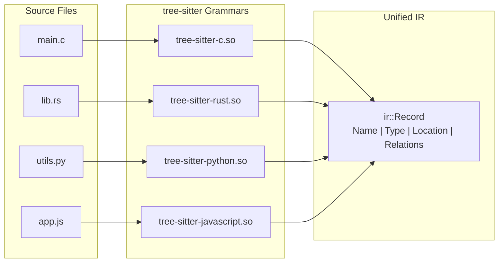
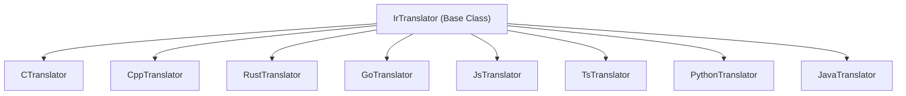
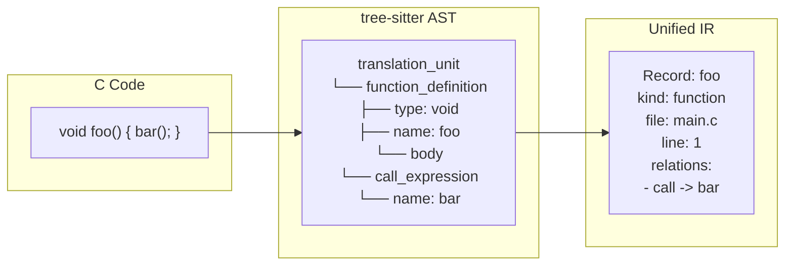

# CodeScope Deep Dive (5): tree-sitter Parser & Unified IR — 8 Languages, One Model

> *"A programming language is a tool. Code analysis should not care which tool you used."*
> 编程语言是工具。代码分析不应该关心你用了哪个工具。

## The Problem: 8 Languages, One Format

CodeScope supports 8 languages: C, C++, Rust, Go, JavaScript, TypeScript, Python, Java.

Each language has its own AST structure, syntax rules, and scoping rules. Writing a separate set of analysis code for each language would cause maintenance costs to spiral out of control.

The solution is: **use a unified IR (Intermediate Representation) to abstract across all languages**.

## Core Files

```
engine/src/parser/parser.cpp      ← tree-sitter parser wrapper
engine/src/parser/parser.h        ← Parser interface
engine/src/ir/ir.h                ← Unified IR definition
engine/src/ir/ir.cpp              ← IR construction
engine/src/ir/ir_translator.h     ← IR translator base class
engine/src/ir/ir_translator.cpp   ← IR translator implementation
```

## tree-sitter: One Parser, Many Languages

tree-sitter is an incremental parsing library that supports grammar definitions for many languages. CodeScope uses tree-sitter as its underlying parser — each language needs only one `.so` grammar file.

```cpp
// engine/src/parser/parser.h (conceptual)
class Parser {
    std::unordered_map<std::string, const TSLanguage*> languages_;
    // ...
};
```

Parsing flow:

1. Detect the file's language (by extension or shebang)
2. Load the corresponding tree-sitter grammar (`.so` file)
3. Parse the file to generate an AST (CST is technically a concrete syntax tree)
4. Traverse the AST to extract symbol information



## Unified IR Definition

The core data structure of IR is `ir::Record`:

```cpp
// engine/src/ir/ir.h (conceptual)
namespace ir {

struct Record {
    std::string name;        // Symbol name
    std::string kind;        // Symbol type (function, class, variable, ...)
    std::string file_path;   // File path
    int line;                // Start line
    int col;                 // Start column
    int end_line;            // End line
    int end_col;             // End column
    std::vector<Relation> relations;  // Relations to other symbols
    std::vector<Record> children;     // Nested symbols
};

struct Relation {
    std::string kind;        // Relation type (call, reference, inherit, contain, ...)
    std::string target_name; // Target symbol name
    int target_line;         // Target location
    int target_col;
};

} // namespace ir
```

The key to this IR design: **abstract enough to express the structure of all languages, yet concrete enough to retain sufficient information for queries.**

## IR Translators

The conversion from each language's tree-sitter AST to the unified IR is implemented by `IrTranslator`:

```cpp
// engine/src/ir/ir_translator.h (conceptual)
class IrTranslator {
public:
    virtual std::vector<ir::Record> translate(const TSNode &root,
                                               const std::string &source) = 0;
    virtual ~IrTranslator() = default;
};
```

Each language has a translator subclass:



Each translator knows how to extract function definitions, class definitions, variable declarations, function calls, etc., from the AST of its specific language.

## Relation Extraction

The `Relation` structure in IR is the foundation of CodeScope's graph queries. As the translator traverses the AST, it identifies the following relations:

- **call**: Function call relationship
- **reference**: Symbol reference
- **inherit**: Inheritance relationship
- **contain**: Containment relationship (class contains method, function contains variable)
- **implement**: Implementation relationship (interface implementation)



## Incremental Parsing

One key feature of tree-sitter is **incremental parsing**. When a file is modified, tree-sitter can re-parse only the modified portion instead of the entire file.

CodeScope leverages this feature for incremental indexing:

```cpp
// Conceptual: Incremental indexing pseudocode
TSTree *old_tree = cache.get(file_path);
TSTree *new_tree = ts_parser_parse_incremental(
    parser, old_tree, new_input);
```

In incremental mode, re-indexing a modified file takes only a few milliseconds, rather than tens of milliseconds.

## A Lesson That Made My Blood Run Cold

While developing the IR translator, I ran into a **C++ template parsing issue**.

```cpp
template<typename T>
T add(T a, T b) {
    return a + b;
}
```

In this simple template function, tree-sitter's C++ grammar parses `T` as a `type_identifier`, and `a` and `b` as `declaration`. The IR translator needs to correctly identify:

- The function name is `add`, not `T`
- `T` is a template parameter, not a function parameter
- `a` and `b` are function parameters with type `T`
- The return type is `T`

But the initial translator implementation recognized `T` as the function name (because it was the first `identifier` node in the AST), resulting in the indexed function name being `T` instead of `add`.

The fix: **In the translator, check the `template` node first, then process the function definition.**

```cpp
// Fixed C++ translator logic (conceptual)
if (node_kind == "template_declaration") {
    // First process template parameters
    auto template_params = extract_template_params(node);
    // Then process the inner function/class definition
    for (auto child : ts_node_named_children(node)) {
        if (is_function_definition(child)) {
            return translate_function(child, source, template_params);
        }
    }
}
```

This bug exposed a deeper issue: **The unified IR design assumes that all languages have similar structures, but C++ templates, Java generics, and Rust generics differ fundamentally at the AST level.** Translators must handle these language-specific details while maintaining IR abstraction.

## Summary

The unified IR is the core abstraction that enables CodeScope to support multiple languages:

- **tree-sitter** provides the underlying parsing capability, one grammar file per language
- **IR translators** convert language-specific ASTs into a unified data structure
- **Relation extraction** is done during AST traversal, building the symbol relationship graph
- **Incremental parsing** makes re-indexing efficient

This design is not perfect — language-specific edge cases (C++ templates, Rust macros, Python decorators) make the translators complex. But compared to writing a separate analysis tool for each language, the unified IR has much lower maintenance costs.

In the next article, I'll break down the **SQLite Graph Storage** — how to store code graphs using a relational database.