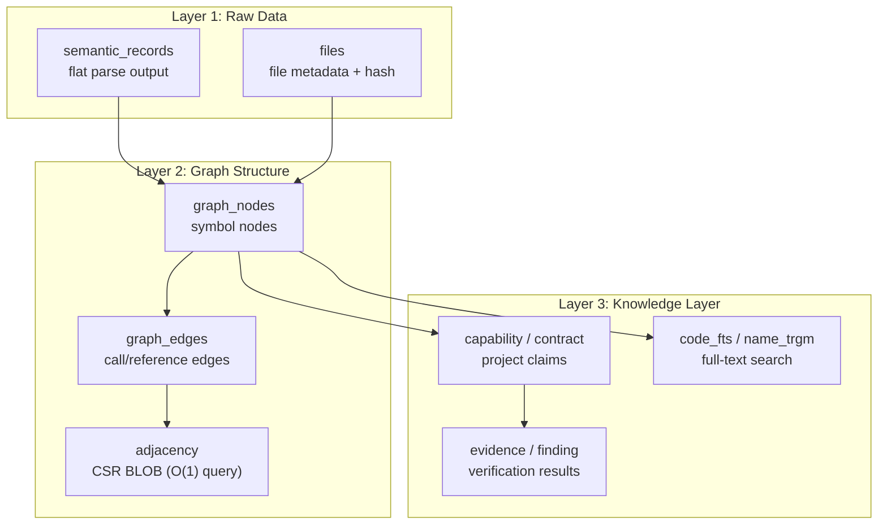
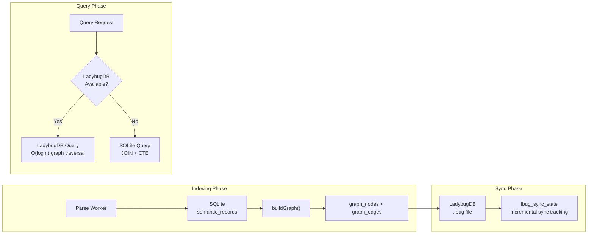
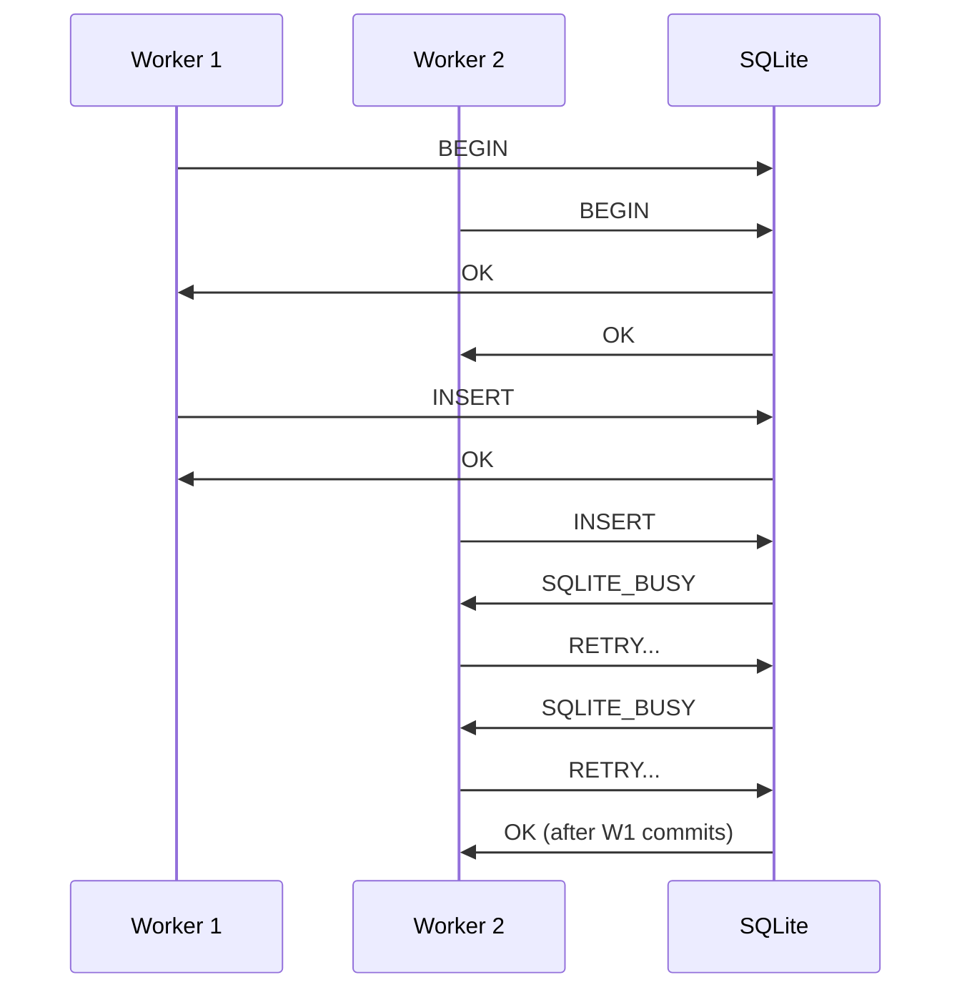
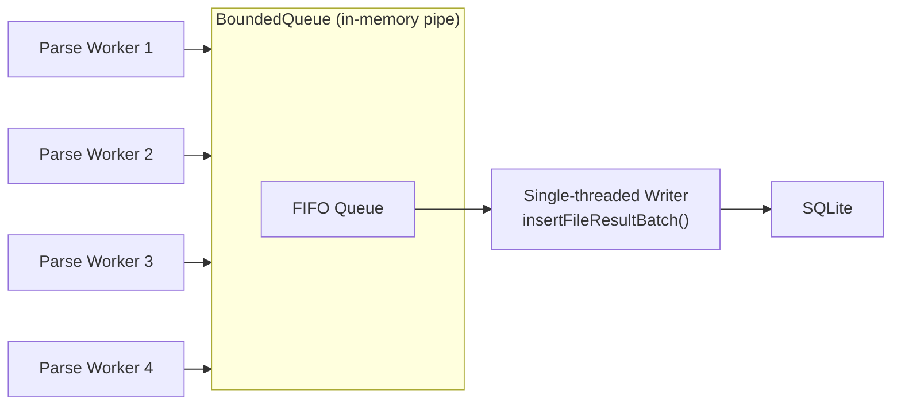

# CodeScope Deep Dive (6): SQLite Graph Storage — Schema Design & FTS

> *"A graph database is a great idea. A graph database that requires a server process is a deployment nightmare."*
> 图数据库是个好主意。但需要启动一个服务进程的图数据库，就是部署噩梦了。

## The Problem: Where to Store the Code Graph?

The core output of CodeScope is a **code symbol graph**: nodes are functions, classes, variables; edges are calls, references, inheritance relationships. This graph must be persisted to support subsequent queries.

There were three options:

1. **In-memory graph** — Fast, but gone after indexing, no incremental reuse
2. **Dedicated graph database** — Neo4j, KuzuDB are powerful, but users need to install a service, configure ports, handle authentication
3. **SQLite** — Zero configuration, single file, embedded in-process

CodeScope chose the third path: **SQLite as the primary store, with LadybugDB (embedded graph database) as an optional acceleration layer.**

## Core Files

```
engine/src/store/store.h                ← GraphStore interface
engine/src/store/store_schema.cpp        ← All CREATE TABLE / INDEX DDL
engine/src/store/store_core.cpp          ← SQLite operation implementation
engine/src/store/store_ladybug_core.cpp  ← LadybugDB graph storage integration
```

## Schema Design: Three-Layer Storage

CodeScope's database schema is organized into three layers:



### Layer 1: Raw Parse Data

The most central table is `semantic_records`:

```sql
CREATE TABLE IF NOT EXISTS semantic_records (
    rowid INTEGER PRIMARY KEY AUTOINCREMENT,
    original_id INTEGER NOT NULL,    -- In-file ID (starting from 1)
    project_id INTEGER NOT NULL,
    kind INTEGER NOT NULL,           -- Symbol type (function/class/variable/...)
    name TEXT,
    qualified_name TEXT DEFAULT '',
    parent_id INTEGER DEFAULT 0,     -- Parent symbol ID (containment relationship)
    arity INTEGER DEFAULT 0,         -- Number of function parameters (for overload disambiguation)
    is_static INTEGER DEFAULT 0,
    type_name TEXT DEFAULT '',
    call_kind INTEGER DEFAULT 0,     -- 0=direct, 1=method, 2=interface, ...
    visibility INTEGER NOT NULL DEFAULT 0,
    start_row INTEGER DEFAULT 0, start_col INTEGER DEFAULT 0,
    end_row INTEGER DEFAULT 0, end_col INTEGER DEFAULT 0,
    file_path TEXT NOT NULL,
    language TEXT DEFAULT ''
);
```

There is one key design decision in this table: **flat storage, no graph construction**. All parse results are laid out flat in a single table, with `parent_id` representing containment relationships. The graph structure is built later from `semantic_records` during the `buildGraph()` phase.

Why this design? Because the parsing phase runs in parallel — multiple workers write to the same table simultaneously. If we built the graph structure directly, we'd need cross-file ID coordination, which is far too complex. Flat storage allows each worker to write independently without interference.

### Layer 2: Graph Structure

`buildGraph()` constructs `graph_nodes` and `graph_edges` from `semantic_records`:

```sql
CREATE TABLE IF NOT EXISTS graph_nodes (
    id INTEGER PRIMARY KEY,
    project_id INTEGER NOT NULL,
    ir_node_id INTEGER NOT NULL,
    node_type INTEGER NOT NULL,
    name TEXT NOT NULL,
    qualified_name TEXT,
    file_path TEXT NOT NULL,
    language TEXT NOT NULL,
    start_row INTEGER NOT NULL, start_col INTEGER NOT NULL,
    end_row INTEGER NOT NULL, end_col INTEGER NOT NULL,
    is_stub INTEGER DEFAULT 0,
    visibility INTEGER NOT NULL DEFAULT 0,
    ...
);

CREATE TABLE IF NOT EXISTS graph_edges (
    id INTEGER PRIMARY KEY AUTOINCREMENT,
    project_id INTEGER NOT NULL,
    source_node_id INTEGER NOT NULL,
    target_node_id INTEGER NOT NULL,
    edge_type INTEGER NOT NULL,
    graph_type TEXT NOT NULL DEFAULT 'symbol_reference',
    call_site_file TEXT DEFAULT '',
    call_site_line INTEGER DEFAULT 0,
    ...
);
```

`graph_edges` has a `UNIQUE(project_id, source_node_id, target_node_id, edge_type, graph_type)` constraint. This constraint looks simple, but we've been bitten by it — the initial version didn't have the `graph_type` field, causing conflicts between `symbol_reference` and `call_graph` graphs on the same pair of nodes.

#### Query Optimization: CSR BLOB

For high-frequency queries like `getCallers` / `getCallees`, CodeScope uses **CSR (Compressed Sparse Row) BLOB** optimization:

```sql
CREATE TABLE IF NOT EXISTS adjacency (
    src_id INTEGER PRIMARY KEY,    -- Caller node ID
    project_id INTEGER NOT NULL,
    tgt_blob BLOB                  -- packed u32[] callee node ID list
);

CREATE TABLE IF NOT EXISTS adjacency_rev (
    tgt_id INTEGER PRIMARY KEY,    -- Callee node ID
    project_id INTEGER NOT NULL,
    src_blob BLOB                  -- packed u32[] caller node ID list
);
```

At query time, a single B-tree lookup retrieves the entire BLOB, then pointer arithmetic traverses it directly:

```
getCallees(id):
  1. B-tree lookup on adjacency WHERE src_id = id
  2. Get tgt_blob (packed u32 array)
  3. Cast pointer: u32* arr = (u32*)blob.data
  4. Return arr[0..len/4]
```

**O(1) B-tree lookup + O(n) traversal**, which is two orders of magnitude faster than a JOIN on `graph_edges`.

### Layer 3: Full-Text Search

CodeScope uses SQLite FTS5 for full-text search:

```sql
-- Unicode tokenizer, supports Chinese
CREATE VIRTUAL TABLE IF NOT EXISTS code_fts USING fts5(
    name, qualified_name, file_path, content,
    project_id UNINDEXED,
    node_id UNINDEXED,
    node_kind UNINDEXED,
    tokenize='unicode61'
);

-- Trigram tokenizer, supports fuzzy search
CREATE VIRTUAL TABLE IF NOT EXISTS name_trgm USING fts5(
    name, qualified_name,
    project_id UNINDEXED,
    node_id UNINDEXED,
    node_type UNINDEXED,
    tokenize='trigram'
);
```

Two FTS indexes serve different use cases:

- **`code_fts`**: Standard full-text search, matching symbol names, qualified names, file paths
- **`name_trgm`**: Trigram substring search, supporting fuzzy matching in the `LIKE '%substr%'` pattern

The Trigram index was specifically designed for million-node projects. Without it, `LIKE '%foo%'` queries would require a full table scan, easily exceeding the MCP timeout threshold of 30 seconds on large projects.

## Batch Processing Optimization

The initial implementation inserted one row at a time, which had poor performance. After optimization, we switched to batch inserts:

```cpp
// store.h (conceptual)
void insertGraphNodes(uint64_t project_id,
                      const std::vector<graph::GraphNode> &nodes);
void insertFileResultBatch(uint64_t project_id,
                           const std::vector<FileResult> &batch,
                           bool is_reindex = true);
```

The core idea of batch inserts: **prepare once, bind/step/reset in a loop**.

```cpp
// Conceptual: Batch insert pseudocode
sqlite3_stmt *stmt;
sqlite3_prepare_v2(db, "INSERT INTO graph_nodes VALUES (...)", -1, &stmt, NULL);

for (const auto &node : nodes) {
    sqlite3_bind_int64(stmt, 1, node.id);
    sqlite3_bind_text(stmt, 2, node.name.c_str(), -1, SQLITE_TRANSIENT);
    // ...
    sqlite3_step(stmt);
    sqlite3_reset(stmt);
}
sqlite3_finalize(stmt);
```

Performance improved by about **10x**. Not because SQLite got faster, but because we reduced the overhead of `prepare`/`finalize` — each `prepare` goes through SQL parsing and VDBE compilation.

## LadybugDB: Optional Graph Storage Acceleration

SQLite is a relational database. Graph queries (like k-hop traversal, shortest path) require recursive CTEs or multi-table JOINs, which don't perform well enough.

LadybugDB is an embedded graph database (similar to KuzuDB) that CodeScope uses as an optional acceleration layer:

```cpp
// store.h
bool initLadybugDB();       // Create .lbug file
bool hasLadybugDB() const;  // Check if available
bool isGraphReady() const;  // Check if graph data has been populated
```

Data flow:



LadybugDB synchronization is incremental. The `lbug_sync_state` table tracks the last-synced node and edge IDs, avoiding full rebuilds.

## A Lesson That Made My Blood Run Cold

**SQLite's concurrent write issue.**

In the initial design, multiple parse workers wrote to the same SQLite database file in parallel. The result was frequent `SQLITE_BUSY (5)` errors.

SQLite's WAL mode supports concurrent reads, but writes are still serialized. Multiple workers writing simultaneously inevitably cause lock contention.



The fix: **Introduce a BoundedQueue, single-threaded writes.**



Parse workers are only responsible for parsing — they push results into an in-memory queue. A dedicated writer thread pulls data from the queue and writes to SQLite in batches. This way:

- Writes are serialized, no lock contention
- Batch writes can merge results from multiple files, making full use of `insertFileResultBatch()`
- Parse workers don't wait for I/O and can immediately process the next file

## Index Design

The schema's many indexes are not all created at once. CodeScope's approach is: **load data in bulk first, then build indexes**.

```cpp
// Conceptual: Two-phase index creation
bool GraphStore::createSchema() {
    // 1. Create tables (no indexes)
    exec("CREATE TABLE IF NOT EXISTS graph_nodes (...);");
    // 2. Load data...
}

bool GraphStore::createIndexesAfterBulkLoad() {
    // 3. Create indexes after data loading is complete
    exec("CREATE INDEX IF NOT EXISTS idx_gn_file_row_type ON ...");
    exec("CREATE INDEX IF NOT EXISTS idx_ge_callers ON ...");
    // ...
}
```

Why? Because SQLite's index maintenance overhead during data insertion is significant. Inserting data first and then bulk-creating indexes is faster overall.

## Summary

CodeScope's storage layer design is a pragmatic choice:

- **SQLite as the primary store**, zero configuration, single file, embedded in-process
- **Flat storage**, no graph construction during parsing, reducing concurrency complexity
- **CSR BLOB** optimizes high-frequency queries, avoiding JOIN overhead
- **FTS5 + Trigram** dual indexes, supporting full-text search and fuzzy matching
- **LadybugDB** as optional acceleration, without changing the core architecture
- **BoundedQueue** resolves the concurrent write issue

In the next article, I'll break down the **Verification Pipeline** — how ClaimParser extracts assertions from documentation, how VerifierRegistry dispatches verifiers, and how Evidence generates a Verdict.