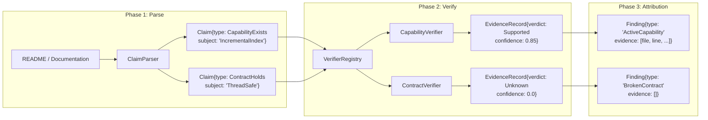

# CodeScope Deep Dive (7): Verification Pipeline — Claim → Evidence → Verdict

> *"The most dangerous assumption in software engineering is that the code matches the docs."*
> 软件工程中最危险的假设，就是认为代码和文档是一致的。

## The Problem: How to Keep Code and Docs in Sync?

As a project grows to a certain scale, deviation between code and documentation is inevitable. The README says "supports incremental indexing," but the code may only implement full rebuilds. The API docs say "thread-safe," but the implementation uses bare locks.

This deviation is not a bug — it's **drift** — code evolves continuously, documentation is forgotten, and the two gradually grow apart.

The traditional solution is manual review, but humans are not good at this kind of mechanical comparison work. CodeScope's Verification Pipeline is designed for exactly this: **automatically extract assertions from documentation, find evidence in the code, and deliver a verdict.**

## Core Files

```
engine/src/verify/claim.h               ← Claim/EvidenceRecord data structures
engine/src/verify/claim_parser.h         ← Extract Claims from documentation
engine/src/verify/verifier.h             ← Verifier base class
engine/src/verify/registry.h             ← VerifierRegistry (scheduler)
engine/src/verify/capability_verifier.h  ← Capability verifier
engine/src/verify/contract_verifier.h    ← Contract verifier
engine/src/verify/architecture_verifier.h ← Architecture verifier
engine/src/verify/finding.h             ← Legacy Finding structure
```

## Pipeline Architecture

The verification pipeline is divided into three phases:



### Phase 1: ClaimParser

`ClaimParser` extracts structured assertions from free-form text:

```cpp
// claim_parser.h
class ClaimParser {
public:
    std::vector<Claim> parse(
        const std::string &text,
        const std::string &source_kind,
        const std::string &source_ref
    ) const;
};
```

The input is README, AI summary, or PR description; the output is a `Claim` struct:

```cpp
// claim.h
struct Claim {
    ClaimType type;        // CapabilityExists / ContractHolds / ArchitectureFollows
    std::string subject;   // Subject, e.g. "IncrementalIndex"
    std::string predicate; // Predicate, e.g. "implemented_by"
    std::string object;    // Object, e.g. "Runtime"
    std::string scope;     // "repository" by default
    std::string source_kind; // "readme" / "ai_summary" / "pr" / "manual"
    std::string source_ref;  // File path, traceable
};
```

Design principle: **Conservative extraction**. Only match high-confidence patterns (e.g., "supports X", "thread-safe"). Ambiguous text produces no Claim — because Unknown is a legitimate verdict, but a wrong Claim poisons the entire verification chain.

### Phase 2: VerifierRegistry

`VerifierRegistry` is a Meyers singleton that holds all registered `Verifier` instances:

```cpp
// registry.h
class VerifierRegistry {
public:
    static VerifierRegistry &instance();

    void register_verifier(std::unique_ptr<Verifier> v);
    void register_default_verifiers(GraphStore *store, uint64_t project_id);
    void clear();
    Verifier *match(const Claim &claim) const;
};
```

The core logic is in `match()`: iterate the Claim through all registered verifiers and return the first one whose `accepts()` returns true.

```cpp
// Concept: match implementation
Verifier *VerifierRegistry::match(const Claim &claim) const {
    for (const auto &v : verifiers_) {
        if (v->accepts(claim)) {
            return v.get();
        }
    }
    return nullptr;
}
```

Each verifier declares the types of Claims it can handle:

```cpp
// verifier.h
class Verifier {
public:
    virtual std::string name() const = 0;
    virtual bool accepts(const Claim &claim) const = 0;
    virtual EvidenceRecord verify(const Claim &claim) = 0;
};
```

### Phase 3: EvidenceRecord

The evidence record output by the verifier:

```cpp
// claim.h
struct EvidenceRecord {
    int64_t claim_id = 0;
    Verdict verdict = Verdict::Unknown;  // Supported / Contradicted / Unknown
    double confidence = 0.0;
    std::string verifier_name;
    std::string detail;
    std::vector<std::pair<int, int64_t>> facts;  // (fact_kind, ref_id)
};
```

`facts` is the chain of evidence. Each `(fact_kind, ref_id)` pair points to a specific line in `graph_nodes`, `graph_edges`, or documentation. This way, users can not only see that "code is inconsistent with docs," but also see **which specific function, which specific line of code caused the inconsistency.**

## Verifier Implementations

### CapabilityVerifier

Verifies "whether a capability claimed by the project is actually implemented in the code."

Logic:
1. Look up the symbol corresponding to the Claim's subject in `graph_nodes`
2. Check if the symbol has callers (is invoked)
3. If it has callers → Supported (capability is implemented)
4. If it has no callers and is a stub → Contradicted (capability not implemented)
5. Otherwise → Unknown

```cpp
// Concept: CapabilityVerifier::verify() pseudocode
EvidenceRecord CapabilityVerifier::verify(const Claim &claim) {
    auto nodes = store_->findNodesByName(claim.subject);
    if (nodes.empty()) {
        return {.verdict = Unknown, .confidence = 0.0};
    }

    for (auto &node : nodes) {
        auto callers = store_->getCallers(node.id);
        if (!callers.empty()) {
            return {.verdict = Supported, .confidence = 0.85};
        }
    }
    return {.verdict = Contradicted, .confidence = 0.7};
}
```

### ContractVerifier

Verifies "whether architectural contracts are being followed" (e.g., "thread-safe").

The logic is more complex and requires checking multiple dimensions:
- Whether shared mutable state is protected by locks
- Whether global variables are properly encapsulated
- Whether code blocks marked as `unsafe` conflict with the contract

### ArchitectureVerifier

Verifies "whether actual call relationships follow architectural conventions" (e.g., "Controller → Service → Repository").

Extracts all call relationships from `graph_edges` and compares them against the allowed directions defined in the architectural specification. Relationships that violate the direction are flagged as Contradicted.

## Persistence

Verification results are written to the SQLite `evidence` and `evidence_fact` tables:

```sql
CREATE TABLE IF NOT EXISTS evidence (
    id INTEGER PRIMARY KEY AUTOINCREMENT,
    claim_id INTEGER NOT NULL,
    verdict INTEGER NOT NULL,        -- 0=Supported, 1=Contradicted, 2=Unknown
    confidence REAL NOT NULL,
    verifier_name TEXT NOT NULL,
    detail TEXT DEFAULT '',
    created_at TEXT DEFAULT (datetime('now')),
    FOREIGN KEY (claim_id) REFERENCES claim(id)
);

CREATE TABLE IF NOT EXISTS evidence_fact (
    id INTEGER PRIMARY KEY AUTOINCREMENT,
    evidence_id INTEGER NOT NULL,
    fact_kind INTEGER NOT NULL,      -- 0=node, 1=edge, 2=document
    fact_ref INTEGER NOT NULL,       -- graph_nodes.id / graph_edges.id / document.rowid
    FOREIGN KEY (evidence_id) REFERENCES evidence(id)
);
```

## A Lesson That Made Me Break Out in a Cold Sweat

**Singleton lifecycle issues in multi-project scenarios.**

`VerifierRegistry` is a Meyers singleton — globally unique per process. However, `Verifier` instances are constructed bound to a specific `(store, project_id)`.

When a user switches projects within an MCP session, the old verifiers remain in the registry while new verifiers are appended. The result:

1. User switches project → calls `register_default_verifiers(new_store, new_pid)`
2. New verifiers are appended to the end of the list
3. Old verifiers still hold references to the old project's `(store, project_id)`
4. If `match()` hits an old verifier, it queries the new project's data using the old project's store — with unpredictable results

```cpp
// Problem: during project switching
VerifierRegistry::instance().register_default_verifiers(store1, pid1);
// ... user switches project ...
VerifierRegistry::instance().register_default_verifiers(store2, pid2);
// Old verifiers are still there! If match() hits an old verifier, it uses store1 to query pid2's data
```

The fix:

```cpp
// Must call clear() before switching projects
VerifierRegistry::instance().clear();
VerifierRegistry::instance().register_default_verifiers(store2, pid2);
```

This bug was documented in the comments, but nobody remembered to call `clear()` during the first implementation. The result was that the data retrieved was completely nonsensical.

## Summary

The Verification Pipeline is a key step in CodeScope's evolution from a "code search engine" to a "code truth engine":

- **ClaimParser** extracts assertions from documentation, conservatively but precisely
- **VerifierRegistry** dispatches assertions to the appropriate verifier
- **Verifier** queries the knowledge graph, collects evidence, and delivers a verdict
- **EvidenceRecord** contains a complete chain of evidence traceable back to the source code

In the next article, I'll break down **Drift Detection** — how to automatically discover discrepancies between code and documentation across three dimensions: DocumentationDrift, CapabilityDrift, and ArchitectureDrift.