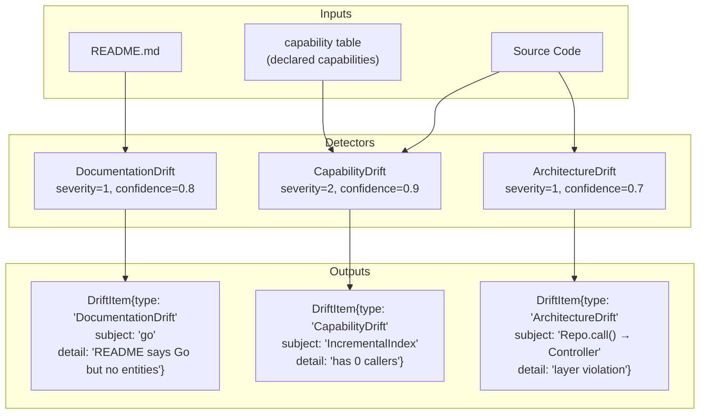
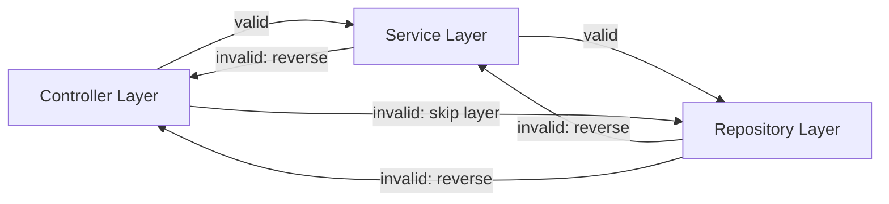
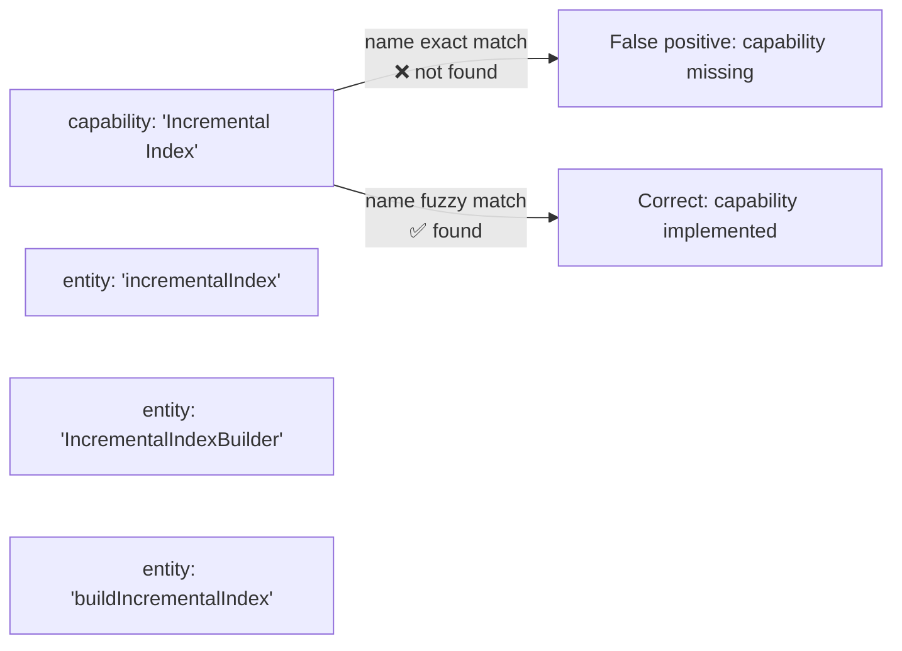
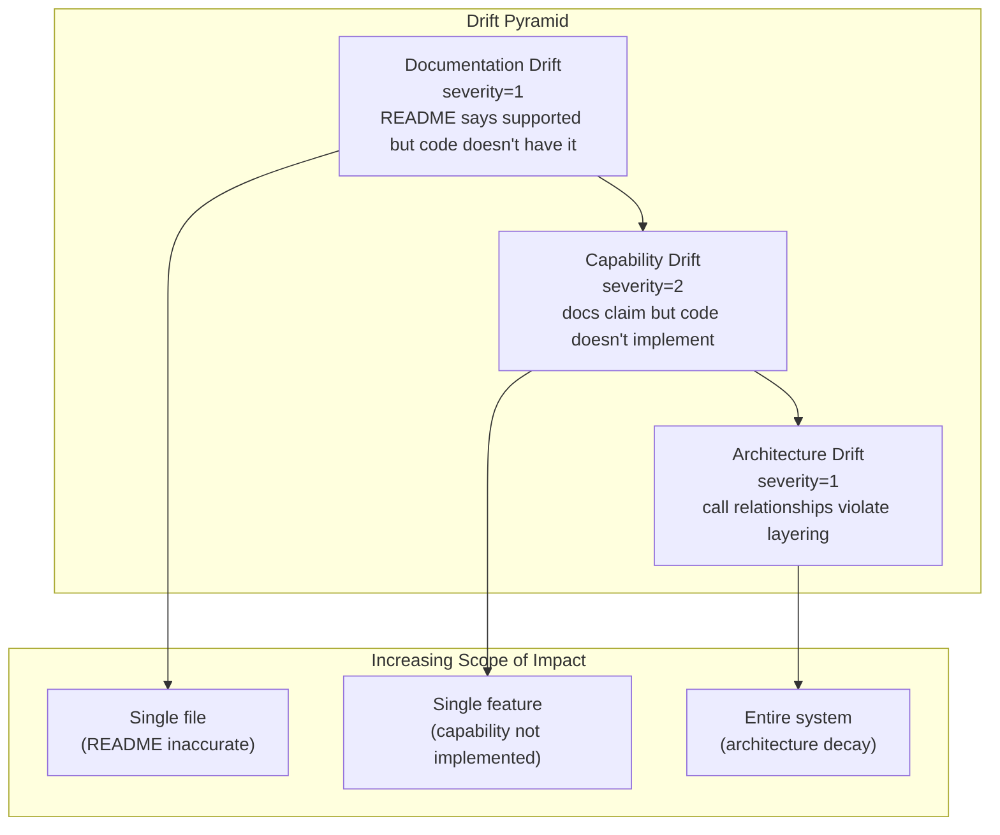

# CodeScope Deep Dive (8): Drift Detection — The Trinity of Documentation, Capability, and Architecture

> *"Documentation is a love letter to your future self. Drift is the heartbreak when you realize it was never updated."*
> 文档是写给未来自己的情书。漂移是当你发现它从未被更新时的心碎。

## The Problem: When Does Documentation Start to Diverge from Code?

In the previous article, I broke down the Verification Pipeline — ClaimParser extracts assertions from documentation, Verifier finds evidence in the code, and ultimately delivers a verdict of Supported / Contradicted / Unknown.

But the Verification Pipeline has a prerequisite: **someone must provide the Claims first.** Either the user inputs them manually, or the AI extracts them automatically.

Drift Detection is the "self-driven mode" of the Verification Pipeline — it requires no user input, automatically scans three dimensions, and proactively discovers discrepancies between code and documentation:

1. **Documentation Drift**: The README says it supports C++, but no C++ entities are found in the code
2. **Capability Drift**: The documentation claims "supports incremental indexing," but the implementing function has no callers
3. **Architecture Drift**: Actual call relationships violate the Controller → Service → Repository layering convention

## Core Files

```
engine/src/verify/documentation_drift.h    ← Documentation drift detection
engine/src/verify/documentation_drift.cpp  ← Implementation
engine/src/verify/capability_drift.h       ← Capability drift detection
engine/src/verify/capability_drift.cpp     ← Implementation
engine/src/verify/architecture_drift.h     ← Architecture drift detection
engine/src/verify/architecture_drift.cpp   ← Implementation
engine/src/verify/finding.h               ← DriftItem data structure
```

## The Trinity



### 1. Documentation Drift (severity=1, confidence=0.8)

The most intuitive drift detection: **Does the code actually implement the languages claimed in the README?**

```cpp
// documentation_drift.h
struct DriftItem {
    std::string type;      // "DocumentationDrift"
    int severity;          // 1 = warning
    std::string subject;   // The missing language name
    std::string detail;    // Human-readable description
};

struct LanguageClaim {
    std::string canonical; // "cpp", "rust", "go", ...
    std::string display;   // "C++", "Rust", "Go", ...
    size_t mention_count;  // Number of occurrences in the README
};
```

Detection flow:

1. Read the project README content from the `document` table
2. `extractLanguageClaims()` scans the README using regex to extract language names (C++, Python, Go, Rust, JavaScript, TypeScript, Java)
3. `countEntitiesByLanguage()` queries the `entity` table to count the actual number of entities per language
4. If the README claims support for a language but the `entity` table shows 0 entities for that language → report Drift

```cpp
// Concept: detectDocumentationDrift pseudocode
std::vector<DriftItem> detectDocumentationDrift(store &store, uint64_t pid) {
    auto readme = store.getReadme(pid);
    auto claims = extractLanguageClaims(readme);
    std::vector<DriftItem> items;

    for (const auto &claim : claims) {
        int64_t count = countEntitiesByLanguage(store, pid, claim.canonical);
        if (count == 0) {
            items.push_back({
                .type = "DocumentationDrift",
                .severity = kDriftSeverityDoc,    // 1
                .subject = claim.display,
                .detail = "README claims " + claim.display +
                          " but no entities found",
            });
        }
    }
    return items;
}
```

**Why is severity only 1?** Because the README may be describing an external dependency, not the project's own implementation language. For example, "CodeScope supports C++ projects" might mean users can analyze C++ projects with CodeScope, not that the project itself is written in C++.

### 2. Capability Drift (severity=2, confidence=0.9)

This is the most severe type of drift: **a feature documented in the docs is not implemented in the code.**

```cpp
// capability_drift.h
inline constexpr int kDriftSeverityCapability = 2;     // error
inline constexpr double kDriftConfidenceCapability = 0.9;
```

Detection flow:

1. Read the list of capabilities claimed by the project from the `capability` table
2. For each capability, look up entities with matching names in the `entity` table
3. For matched entities, check whether they have callers (are invoked)
4. If an entity has no callers → the capability is "dead" — the code exists but is unused
5. If the entity does not exist → the capability is entirely missing

```cpp
// Concept: detectCapabilityDrift pseudocode
std::vector<DriftItem> detectCapabilityDrift(store &store, uint64_t pid) {
    auto capabilities = store.getCapabilities(pid);
    std::vector<DriftItem> items;

    for (const auto &cap : capabilities) {
        int64_t count = countImplementingEntities(store, pid, cap.name);
        if (count == 0) {
            items.push_back({
                .type = "CapabilityDrift",
                .severity = kDriftSeverityCapability,  // 2
                .subject = cap.name,
                .detail = "Declared capability '" + cap.name +
                          "' has 0 implementing entities with callers",
            });
        }
    }
    return items;
}
```

**Why is confidence as high as 0.9?** Because this detection is deterministic — a row in the `capability` table either has a corresponding implementing entity or it doesn't. There is no ambiguity.

### 3. Architecture Drift (severity=1, confidence=0.7)

The most complex drift detection: **whether actual call relationships violate architectural layering conventions.**

```cpp
// architecture_drift.h
inline constexpr const char *kLayerController = "Controller";
inline constexpr const char *kLayerService = "Service";
inline constexpr const char *kLayerRepository = "Repository";
```

Detection flow:

1. `classifyEntityLayer()` classifies an entity into the Controller / Service / Repository layer based on its name and file path

```cpp
// Concept: classifyEntityLayer pseudocode
std::string classifyEntityLayer(const std::string &name,
                                const std::string &file_path) {
    if (name.ends_with("Controller") ||
        file_path.contains("/controllers/")) {
        return "Controller";
    }
    if (name.ends_with("Service") ||
        file_path.contains("/services/")) {
        return "Service";
    }
    if (name.ends_with("Repository") ||
        file_path.contains("/repositories/")) {
        return "Repository";
    }
    return "";  // Unknown
}
```

2. Read the `relation` table and extract all call edges (type=1)
3. For each call edge, check whether the flow from source layer to target layer is valid

Valid flow: **Controller → Service → Repository**



**Why is confidence only 0.7?** Because layer classification is a heuristic based on naming conventions and file paths. Not all projects follow the Controller/Service/Repository naming convention. False positives are expected.

## Scheduler Integration

Drift detection does not run once. CodeScope's scheduler automatically dispatches all three detectors after indexing completes:

```cpp
// Concept: Drift detection scheduling
schedule_drift_detection(project_id) {
    // Run three detectors in parallel
    auto doc_drifts = detectDocumentationDrift(store, project_id);
    auto cap_drifts = detectCapabilityDrift(store, project_id);
    auto arch_drifts = detectArchitectureDrift(store, project_id);

    // Merge results
    auto all_drifts = concat(doc_drifts, cap_drifts, arch_drifts);

    // Write to finding table
    for (auto &drift : all_drifts) {
        store.insertFinding(project_id, drift);
    }
}
```

## A Lesson That Made Me Break Out in a Cold Sweat

**The false positive problem with Capability Drift.**

The original Capability Drift detection logic was simple: if `capability.name` could not be found in `entity.name`, report a drift.

But in real projects, there is a **naming discrepancy** between capabilities and implementing entities. For example, the capability table declares "Incremental Index," while the implementing entity is called "incrementalIndex" or "incremental_index."



The fix: **changed from exact match to containment match.** `countImplementingEntities()` was changed to use a `LIKE '%cap_name%'` fuzzy query, and comparisons are performed after stripping underscores and spaces.

This bug exposed a deeper issue: **the mapping between capability names and entity names is not 1:1.** A single capability may be implemented by multiple entities, and a single entity may implement multiple capabilities. Perfect mapping requires semantic understanding; fuzzy matching is a pragmatic but imperfect compromise.

## The Relationship Between the Three



- **Documentation Drift** is a surface-level issue, affecting a single file
- **Capability Drift** is a functional issue, affecting a single capability
- **Architecture Drift** is a structural issue, affecting the entire system

The three also form a progressive relationship: inaccurate documentation → untrustworthy capability claims → architectural conventions being ignored.

## Summary

Drift Detection is the core capability that distinguishes CodeScope from traditional code search tools:

- **Documentation Drift**: README semantics vs. code entities, severity=1, confidence=0.8
- **Capability Drift**: Declared capabilities vs. implementation code, severity=2, confidence=0.9
- **Architecture Drift**: Layering conventions vs. actual calls, severity=1, confidence=0.7

The three detectors cover all levels from documentation to code, from features to architecture. They require no user input, run automatically after indexing completes, and continuously track the health of the codebase.

---

## Postscript

With this, the eight-article CodeScope Deep Dive series is complete:

| # | Article | Core Module |
|---|---------|-------------|
| 1 | Dual-Language Architecture | Rust MCP Server + C++ Engine FFI |
| 2 | Worker Subprocess Isolation | fork+exec + DB merging |
| 3 | Parallel Scheduler | Three scheduling modes |
| 4 | Two-Phase Indexing | Fast Scan + Background Enhance |
| 5 | tree-sitter Parser & Unified IR | 8 languages, one model |
| 6 | SQLite Graph Storage | Schema + FTS + batch processing |
| 7 | Verification Pipeline | Claim → Evidence → Verdict |
| 8 | Drift Detection | Trinity of documentation, capability, and architecture |

CodeScope's evolution from a "code search engine" to a "project truth engine" centers on the fact that it no longer just **indexes code**, but rather **understands code** — from the symbol level to the semantic level, from static analysis to verification and reasoning. Every step involved engineering trade-offs and compromises, and those trade-offs and compromises are precisely what this series has attempted to document.