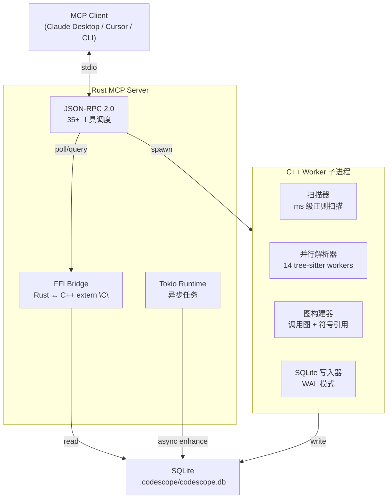
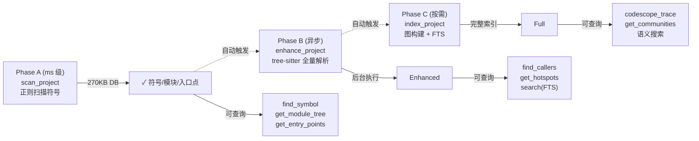
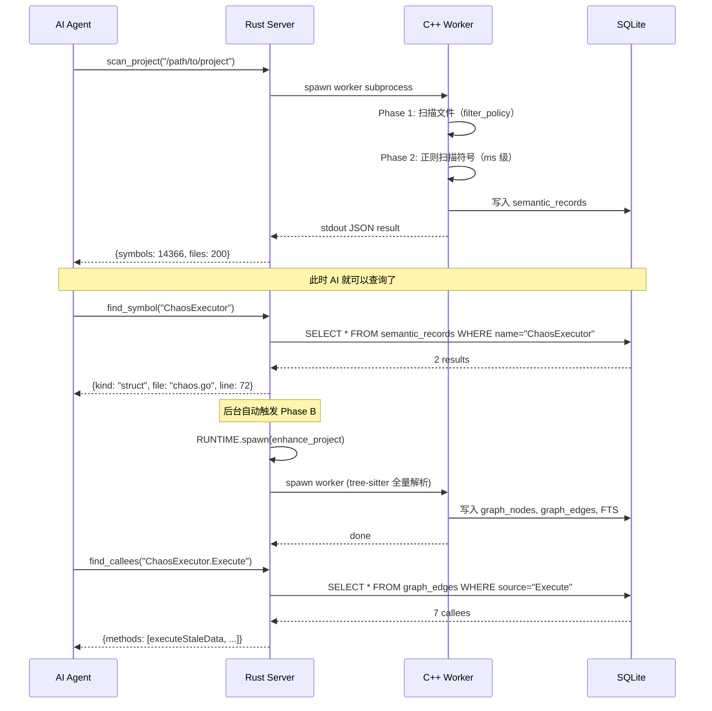

# CodeScope 架构拆解（一）：开篇——当 MCP 工具返回 56KB 而你只需要 629 bytes

> 我一开始不是要造一个"比 CBM 好 X 倍"的东西。
> 我是在用 codebase-memory-mcp 的时候，被一个问题折磨得受不了了：
> **AI 问一个符号，它返回整个项目。**
>
> 56KB 的 JSON 里，70% 是 AI 不需要的指纹、AST profile、body tokens。而真正有用的——struct 字段、常量值、switch-case 分支——它一个都没告诉 AI。
> 所以我决定写一个只回答"被问到的问题"的工具。

---

## 系列目录

| 篇 | 标题 | 一句话 |
|:--:|------|--------|
| 一 | **开篇**（本文） | 为什么重写一个代码理解工具，以及整体架构 |
| 二 | 渐进式就绪 | 367ms 让 AI 开始理解你的代码 |
| 三 | Worker 隔离 | 为什么索引不会拖垮你的 MCP Server |
| 四 | 零冗余响应 | 1 Token 干 35 个 Token 的活 |
| 五 | C++ 引擎拆解 | 从源码到多维代码图的管线 |
| 六 | MCP 协议层 | 35+ 工具的设计哲学 |
| 七 | 语言翻译器 | 10 种语言统一为一种 IR |
| 八 | SQLite 存储层 | 270KB 替代 64MB 的秘密 |
| 九 | 自适应查询 | 当数据还没准备好时 |
| 十 | 性能真相 | 从 GoAgent 到 Linux Kernel |

---

## 一、起点：一个 56KB 的那不勒斯

先上数据，这样你理解我在说什么。

同一台机器、同一份代码（GoAgent，~24K 行 Go）、同一个问题（"Chaos 是如何工作的，有哪些模式"），我用两个工具各跑了一遍：

| 维度 | codebase-memory-mcp v0.8.1 | CodeScope |
|------|:--------------------------:|:---------:|
| 最小可用响应大小 | **56,183 bytes** | **629 bytes** |
| 等价 tokens | ~14,046 | ~157 |
| AI 还要不要读源码 | **需要读 681 行** | 不需要 |
| 索引 DB 大小 | 64 MB | **270 KB** |
| 第一次查询等待时间 | 等全量索引完（几分钟） | **创建项目即可查** |

56KB 是什么概念？它比《静夜思》的 20 倍还多。AI 收到 56KB 的 JSON，花了大量 tokens 去解析 64 条结果中那些无关的 test 函数、doc section 节点、route 节点，结果发现 struct 的字段没返回、常量的值没返回、switch-case 分支没返回——最后还是得去读源码。

技术选型没有对错，但你得知道 token 花在了哪里。

### 56KB 里有什么

以 CBM 的 `search_graph` 响应为例，我拆解了一下它的构成：

```
┌─────────────────────────────────────────────┐
│ search_graph 响应 56,183 bytes 的构成         │
│                                              │
│ ████████████████████████████████  70%  无关数据 │
│   （test 函数、doc sections、route 节点等）    │
│                                              │
│ ████████████                      20%  必要元数据 │
│   （node names, labels, files）              │
│                                              │
│ ████                             10%  实际有用的 │
│   （ChaosExecutor, ChaosAction 等）            │
└─────────────────────────────────────────────┘
```

56KB 中只有约 5.6KB 是对回答有用的。AI 为 50KB 的无关数据付了 tokens。

### 629 bytes 里有什么

```json
{
  "results": [
    {
      "id": 2851,
      "kind": "struct",
      "name": "ChaosExecutor",
      "signature": "type ChaosExecutor struct {",
      "visibility": "default",
      "language": "go",
      "file_path": "~/go/src/goagent/.../chaos.go",
      "line": 72,
      "column": 1
    }
  ]
}
```

每个字段都有用。没有指纹、没有 AST profile、没有 body tokens。AI 知道这是个 struct，在哪个文件、第几行、signature 是什么。如果它想知道更多，它会再问——而不是一次全塞给它。

---

## 二、架构总览：三层 + 一个 DB

既然你知道了"为什么"，我们来看"是什么"。

CodeScope 的整体架构不算复杂，三层结构：



解释一下各层干什么：

- **Rust MCP Server**：负责协议、工具调度、异步任务。不碰源码解析。
- **C++ Worker 子进程**：干脏活累活——扫描文件、解析 AST、建图、写库。跑完就退，RSS 全量归还 OS。
- **SQLite**：唯一的数据持久化层。WAL 模式，读写分离。

为什么 C++ 引擎用子进程而不是线程？——内存隔离。Worker 索引 60,000 个文件的 Linux Kernel 时 RSS 冲到几个 GB，但它是独立的进程，出口即释放，不会污染 Server 进程的内存。

---

## 三、渐进式就绪模型

这是 CodeScope 最核心的设计决策，也是它与 CBM 最大的哲学差异。

CBM 的模型是：**要么没索引，要么全索引完。** 中间状态是不可查询的。所以用户必须等 1-12 分钟才能开始问问题。

CodeScope 的模型是：**逐步加深，随时可用。**



| 阶段 | 耗时 | DB 大小 | 能做什么 |
|:----:|:----:|:-------:|----------|
| Phase A | **367ms**（Linux Kernel） | 270 KB | 符号名、模块树、入口点 |
| Phase B | 后台 1-5 min | 几 MB | 调用图、FTS 搜索 |
| Phase C | 按需（大项目几分钟） | 完整 | 调用链追踪、社区检测 |

实际效果是什么？你跑 `scan_project` 之后，367ms 就能开始问"这个项目有哪些入口点"、"ChaosExecutor 是什么"、"模块结构是什么样的"。AI 不需要等全量索引完。

---

## 四、数据流：从文件夹到 AI 回答

一条查询从"项目路径"到"AI 组织答案"的完整路径：



关键设计点：**Phase A 返回后，AI 可以立即开始查询。Phase B 在后台跑，不影响 AI 的正常工作流。**

---

## 五、技术选型：为什么是 C++ + Rust + SQLite

这个组合不是第一天就定下来的。我走过一些弯路。

### 为什么 C++ 做引擎

tree-sitter 的 C API 是第一公民。C++ 能直接调用 tree-sitter 的解析器，不需要额外的 FFI 层。而且 tree-sitter 的解析本身是 C 实现的，C++ 包装一层很自然。

另外，C++ 在内存布局和性能上有优势。14 个 worker 线程并行解析几百个文件，C++ 的 pthread + arena 分配器比带 GC 的语言更可控。

### 为什么 Rust 做 Server

MCP 协议本质是一个长期运行的 JSON-RPC 2.0 服务器，stdio 传输。Rust 的 Tokio 异步运行时非常适合这种场景——同时处理多个工具调用、后台任务、轮询。

更重要的是，Rust 的 FFI 生态（`extern "C"` bindings）跟 C++ 对接非常直接。40+ 个 FFI 函数，每个都是 `extern "C"` 导出，Rust 这边 `#[link(name = "engine")]` 就能调用。

### 为什么 SQLite 做存储

不需要分布式。不需要高并发。每个项目一个 DB 文件，放在 `.codescope/` 目录下。SQLite 的 WAL 模式支持读写分离——Worker 写数据，Server 读数据，互不阻塞。

而且 SQLite 的 FTS5 全文搜索和 vec0 向量扩展开箱即用，不需要额外搭 Elasticsearch 或 Milvus。

### 坦诚反思：为什么不是纯 Rust

说实话，如果重新来一次，我可能会认真考虑用 Rust 重写整个引擎。C++ 的构建系统（CMake）加上多平台兼容（Windows .dll、macOS .dylib、Linux .so）带来的维护成本远超预期。

但当时选择 C++ 的原因也合理：tree-sitter 的生态是 C/C++ 的，团队有 C++ 背景，而且 C++ 在底层内存控制上确实更灵活。**技术选型没有完美的，只有适合当前阶段的。**

---

## 六、技术指标

一些硬数字，这样你有一个直观的感知：

| 指标 | 数值 |
|------|:----:|
| 支持语言 | 13 种（含 C/C++/Go/Rust/Java/Python/TS/JS 等） |
| RapidJSON 扫描 | **367ms** 扫描 Linux Kernel 60,000 文件 |
| 索引速度 | 1,167 个 Go 文件 → **3.28s** |
| 图节点数 | 最大 263,614（GoAgent 项目） |
| 图边数 | 最大 245,849 |
| 查询延迟 | 多数查询 **<1ms**，全图 Label Propagation **<500ms** |
| 索引 DB 大小 | 270 KB（Phase A）→ 完整（几 MB-几十 MB） |
| 进程隔离 | Worker 子进程，RSS 100% 归还 OS |
| Worker 超时保护 | 300s + 3 次重试 |
| MCP 工具数 | 35+ |

---

## 七、系列预告

| 篇 | 标题 | 核心内容 |
|:--:|------|----------|
| **二** | 渐进式就绪 | Phase A 怎么在 367ms 内完成扫描，Phase B 异步增强，Phase C 完整索引 |
| **三** | Worker 隔离 | 为什么用子进程而不是线程，内存隔离的代价和收益 |
| **四** | 零冗余响应 | 每个字段为什么存在，为什么不存在，对比 CBM 的 56KB |
| **五** | C++ 引擎拆解 | 从 filter_policy 到 graph_builder，一条数据在引擎里的完整旅程 |
| **六** | MCP 协议层 | 35+ 工具如何设计，注册和路由机制 |
| **七** | 语言翻译器 | 10 种语言如何统一为 IR，tree-sitter visitor 设计 |
| **八** | SQLite 存储层 | WAL 模式、FTS5、vec0、增量索引 |
| **九** | 自适应查询 | 当数据还没准备好时，如何优雅降级 |
| **十** | 性能真相 | 从 200 文件到 60,000 文件，实测数据 |

每篇文章遵循同一个模式：**问题 → 设计旅程 → 权衡取舍 → 坦诚反思。** 不营销。不"比 X 快 10 倍"。只有工程师聊工程。

下一期：[CodeScope 架构拆解（二）：渐进式就绪——367ms 让 AI 开始理解你的代码](codescope-architecture-02-progressive-readiness.md)