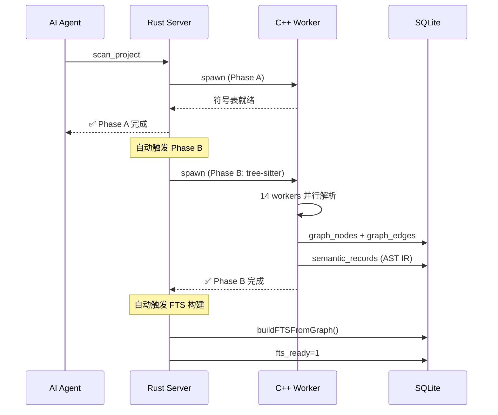
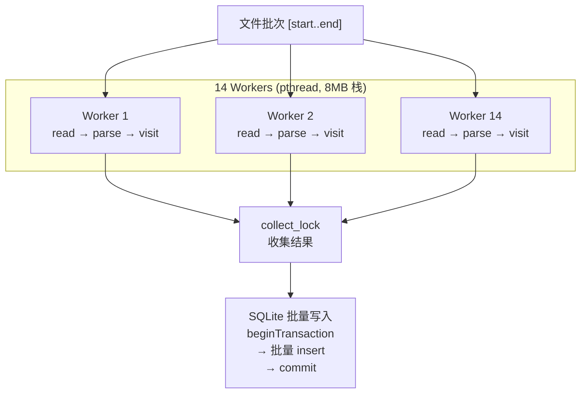
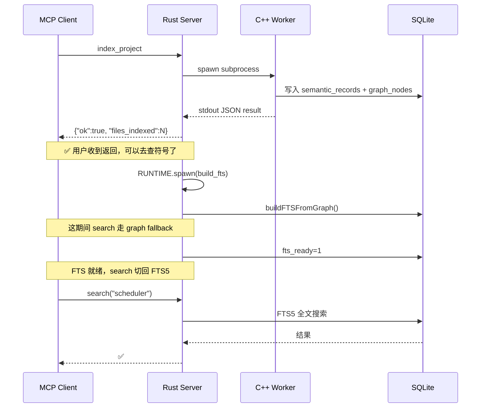

# CodeScope 架构拆解（二）：渐进式就绪——367ms 让 AI 开始理解你的代码

> 第一次用 CBM 索引 Linux Kernel 的时候，我等了 12 分钟。
> 12 分钟里我一直在想一个问题：**如果 AI 想先看一眼项目结构再决定要不要全量索引，它为什么不能？**
>
> 后来我意识到这不是技术问题，是设计哲学问题。CBM 的模型是"要么全有，要么全无"。CodeScope 的模型是"先让你能用，再逐步加深"。
>
> 这篇文章讲的就是这个"逐步加深"是怎么做到的。

---

## 系列目录

| 篇 | 标题 | 一句话 |
|:--:|------|--------|
| 一 | [开篇](codescope-architecture-01-intro.md) | 为什么重写一个代码理解工具 |
| **二** | **渐进式就绪**（本文） | 367ms 让 AI 开始理解你的代码 |
| 三 | Worker 隔离 | 为什么索引不会拖垮你的 MCP Server |
| 四 | 零冗余响应 | 1 Token 干 35 个 Token 的活 |
| 五 | C++ 引擎拆解 | 从源码到多维代码图的管线 |

---

## 一、问题：1-12 分钟的等待

MCP 的代码理解工具有一个通病：**全量索引才能查。**

你要理解一个项目，得先等工具扫描完所有文件、解析完所有 AST、构建完完整的调用图。这个时间从 1 分钟（小项目）到 12 分钟（Linux Kernel）不等。

这个等待的问题是：

1. **AI 不知道值不值得。** 它只是想先看看这个项目的模块结构，结果要等全量索引完。
2. **大部分查询不需要全量数据。** "这个项目有哪些入口点"——这需要全量 AST 解析吗？不需要。文件名和符号名就够了。
3. **浪费。** 你花了 12 分钟等索引，结果 AI 的第一条查询是"这个项目是什么语言写的"。

### 第一性原理问题

> 在一个代码理解工具里，最少需要多少数据才能回答 AI 最常问的前 80% 的问题？

我统计了一下 AI agent 在代码理解场景下的典型查询分布：

| 查询类型 | 占比 | 最少需要什么数据 |
|----------|:----:|------------------|
| 找符号定义在哪 | ~40% | 符号名 + 文件 + 行号 |
| 看项目结构/模块 | ~20% | 目录结构 + 文件名 |
| 找入口点 | ~10% | 符号名 + kind（main/init） |
| 查调用关系 | ~15% | 图边 |
| 搜代码（关键词） | ~10% | FTS 索引 |
| 全量分析 | ~5% | 完整图 + 复杂度 |

前 70% 的查询（符号查找、模块结构、入口点）只需要一个东西：**符号表。** 不需要 AST、不需要图、不需要 FTS。

这就引出了 CodeScope 的核心设计：**如果能用 O(n) 的正则扫描在毫秒级拿到符号表，为什么一定要等 O(n+m) 的 tree-sitter 全量解析？**

---

## 二、核心洞察：把复杂度拆到时间轴上

### 三种能力，三个时间窗口

我把一个代码理解工具需要的能力拆成三个级别：

| 级别 | 能回答什么 | 技术实现 | 时间窗口 |
|:----:|-----------|----------|:--------:|
| **Level 1** | 符号在哪个文件、哪一行、什么类型 | 正则 + RapidJSON | **毫秒级** |
| **Level 2** | 调用图、FTS 搜索 | tree-sitter 全量解析 | **后台秒级** |
| **Level 3** | 调用链追踪、社区检测 | 图构建 + 图算法 | **按需分钟级** |

关键洞察：**这三个级别不是递进依赖关系。Level 1 的回答不需要等 Level 2 和 Level 3 完成。**

这在设计上意味着什么？

- AI 可以在 **367ms** 后开始查符号
- Level 2 在后台自动触发，AI 不需要手动操作
- 查询引擎自动检测 readiness，数据没准备好就用替代方案

这不只是技术优化——它是**设计哲学的转变**。

---

## 三、Phase A：367ms 扫描 60,000 文件

Phase A 是渐进式就绪的第一层，也是 CodeScope 最"反直觉"的设计。

### 3.1 为什么不用 tree-sitter

tree-sitter 的解析能力很强，但它有一个问题：**慢。** 对于一个 60,000 文件的 Linux Kernel，tree-sitter 全量解析需要几分钟。

但 AI 只是想先知道 `sched_init` 在哪个文件、哪一行、是什么类型。这需要 AST 吗？不需要。一个正则表达式就够了。

### 3.2 快速扫描器的设计

`engine_scanner.cpp`（~1,180 行）干的活很简单：

```
1. 遍历目录（FilterPolicy 过滤）
2. 逐文件读取
3. 按语言选择正则集
4. 扫描提取符号
5. 写入 SQLite
```

```cpp
// 简化的扫描逻辑
for (auto &file : fileJobs) {
    std::string content = readFile(file.path);
    for (auto &pattern : patternsForLanguage(file.lang)) {
        auto matches = regex_search(content, pattern);
        for (auto &m : matches) {
            sqlite.insertSymbol({
                .name = m.name,
                .kind = m.kind,       // struct / func / var / const
                .file = file.path,
                .line = m.line,
                .column = m.column,
                .signature = m.signature
            });
        }
    }
}
```

这个扫描器不用 tree-sitter，用的是 RapidJSON 级别的快速正则匹配。它的限制很明显——不能处理嵌套结构、不能生成调用图——但它在一个指标上赢得了选择：**速度。**

### 3.3 实际数据

| 项目 | 文件数 | Phase A 耗时 |
|------|:-----:|:------------:|
| ARES Agent | 95 | **\<100ms** |
| GoAgent | 1,167 | **\<500ms** |
| memscope-rs | 238 | **\<200ms** |
| **Linux Kernel** | **\~60,000** | **367ms** |

60,000 个文件，367ms。这是 Phase A 的核心竞争力——它为 AI 提供了一个"先看看"的入口，成本低到可以忽略不计。

### 3.4 Phase A 能回答什么

```
scan_project → AI 可以立即开始查询:

find_symbol("ChaosExecutor")
  → struct, chaos.go:72

get_module_tree()
  → internal/ares_quant/marketmaking/ (3 files)

get_entry_points()
  → main() in cmd/ares/main.go

get_graph_stats()
  → 14,366 symbols across 200 files
```

这 4 个查询覆盖了 AI 在新项目上最常问的前几步。

---

## 四、Phase B：后台全量解析

Phase A 返回后，CodeScope 自动触发 Phase B——真正的 tree-sitter 全量解析。



### 4.1 14 个 worker 并行解析

文件收集完成后，按大小降序排序，分批次喂给 14 个 worker 线程：



### 4.2 SQLite WAL 模式

Phase B 和 Phase A 有一个重要的设计差异：**它们写入的数据库文件是同一个，但互不冲突。**

SQLite WAL（Write-Ahead Logging）模式允许一个写入器和一个读取器同时工作。Phase B 写入 `graph_nodes/edges`，Phase A 写入的 `semantic_records` 不受影响。Server 读 DB 时走 WAL 的快照，不阻塞。

---

## 五、渐进式就绪的查询引擎

当 AI 的查询进来时，CodeScope 的查询引擎需要知道：**当前的数据就绪到什么程度了？**

### 5.1 就绪状态

```
Phase A 完成:
  find_symbol        → ✅ 直接可用
  get_module_tree    → ✅ 直接可用
  get_entry_points   → ✅ 直接可用
  get_graph_stats    → ✅ 直接可用

Phase B 完成:
  find_callers       → ✅ 调用图可用
  find_callees       → ✅ 调用图可用
  search (FTS)       → ✅ 全文搜索可用

Phase C 完成:
  codescope_trace    → ✅ 调用链追踪可用
  get_communities    → ✅ 社区检测可用
```

### 5.2 自适应降级

当查询的目标数据还没就绪时，查询引擎不报错，而是尝试替代方案：

```cpp
// engine_queries.cpp — 自适应查询的核心逻辑
QueryResult engine_find_callers_adaptive(const char *name) {
    if (callgraph_ready > 0.5f) {
        // 新 call_edges 表已经建好 50% 以上
        return query_call_edges_new(name);
    } else if (callgraph_ready > 0.1f) {
        // 至少有一些数据，用旧 schema
        return query_call_edges_old(name);
    } else {
        // 还没开始建调用图，给提示
        return QueryResult::hint("仍在建图中，请稍后再查");
    }
}
```

这个降级逻辑不是临时补丁。它是故意的——AI 不需要知道底层数据是否就绪，它只需要知道"能查还是不能查"以及"什么时候能查"。

---

## 六、FTS 后置构建

FTS（Full-Text Search，全文搜索）是另一个典型例子：它很重要，但不需要阻塞索引流程。



关键设计点：**FTS 就绪前，`search` 命令不走 FTS，而是走 `graph_nodes.name LIKE` 降级搜索。** 慢一点，但能用。等你需要精确全文搜索的时候，FTS 已经建好了。

---

## 七、真实数据：三个阶段的时间分布

以 GoAgent 项目（1,167 个 Go 文件）的实测数据为例：

| 阶段 | 耗时 | 累积 | 此时 AI 可以 |
|:----:|:----:|:----:|--------------|
| Phase A 扫描 | **\<500ms** | \<500ms | 查询符号/模块/入口点 |
| Phase B 解析 | **~3s** | ~3.5s | 查询调用图/FTS |
| Phase C 建图 | **~26s** | ~29.5s | 调用链追踪/社区检测 |
| FTS 后置 | **~2s** | ~31.5s | 全文搜索 |

对比 CBM，同样的项目：

| 工具 | 首次可查询时间 | 全量完成时间 |
|------|:-------------:|:------------:|
| CBM | 全量索引完才能查 | **3.94s** |
| **CodeScope** | **\<500ms** | **31.5s** |

当然，CodeScope 全量索引比 CBM 时间长，因为它建了更多的节点和边（263,614 个节点 vs 24,658 个节点，**10.7x**）。但 AI 不需要等——它从 \<500ms 开始就在工作了。

---

## 八、坦诚反思

### 渐进式就绪的代价

这个模型不是没有成本。

**复杂度。** Phase A 和 Phase B 两条数据路径需要维护两套代码。Phase A 的正则扫描器（`engine_scanner.cpp`，1,180 行）和 Phase B 的 tree-sitter 解析器是完全不同的代码路径。bug 可能只出现在其中一条上。

**数据一致性。** Phase A 扫描出来的符号和 Phase B 解析出来的符号可能不完全一致。正则扫描可能漏掉一些嵌套结构里的符号，也可能把注释里的东西误认为符号。这需要两套逻辑之间的对齐。

**AI 对这种模型的适配。** 不是所有的 AI agent 都知道"先 scan 再 enhance"。有些 AI 习惯了一次全量索引完再查，需要额外的 prompt 指导来适配渐进式模型。

### 为什么还是选了这条路

因为我更在意**首查延迟**。

对于 AI agent 工作流来说，第一次查询的等待时间决定了用户体验的下限。如果 AI 问"这个项目是什么"要等 12 分钟，用户基本不会用第二次。

CodeScope 选择了"先回答，再深入"——前 70% 的查询在 \<500ms 内解决，剩下的 30% 在后台准备。这是**一个关于延迟分布的设计决策，不是技术能力的限制。**

---

## 九、下期预告

渐进式就绪解决了"什么时候能查"的问题。但还有一个问题没解决——**查出来的数据有多大**。

56KB 的 JSON 响应里，70% 是无用数据。下一期我们讲 CodeScope 的第二个核心设计：Worker 进程隔离——为什么索引不会拖垮你的 MCP Server，以及如何控制内存风暴。

[CodeScope 架构拆解（三）：Worker 隔离——为什么索引不会拖垮你的 MCP Server](codescope-architecture-03-worker-isolation.md)