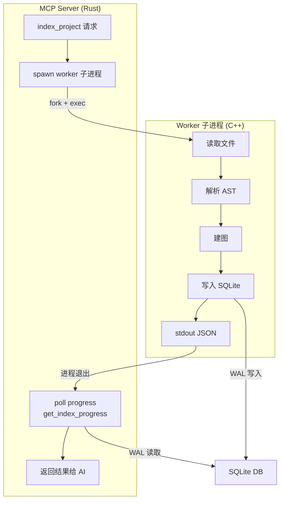

# CodeScope 架构拆解（三）：Worker 隔离——为什么索引不会拖垮你的 MCP Server

> 最初版本是没有 Worker 子进程的。Server 直接调用引擎函数。
> 然后有一天，索引一个很大的项目，RSS 冲到了 3.5 GB，MCP Server 直接 OOM。Claude Desktop 那边显示"工具调用超时"，没有任何错误信息。
> 我花了三天才找到原因——不是内存泄漏，是线程栈太大了。
>
> 从那天起我认识到一件事：**在一个长期运行的 Server 进程里做重型计算，要么你隔离计算，要么你就等着被计算拖垮。**

---

## 系列目录

| 篇 | 标题 | 一句话 |
|:--:|------|--------|
| 一 | [开篇](codescope-architecture-01-intro.md) | 为什么重写一个代码理解工具 |
| 二 | [渐进式就绪](codescope-architecture-02-progressive-readiness.md) | 毫秒级让 AI 开始理解你的代码 |
| **三** | **Worker 隔离**（本文） | 为什么索引不会拖垮你的 MCP Server |
| 四 | 零冗余响应 | 精简响应，按需返回 |
| 五 | C++ 引擎拆解 | 从源码到多维代码图的管线 |

---

## 一、问题：重型计算不能跑在 Server 进程里

MCP Server 是一个长期运行的进程，它的职责是：

1. 接收 JSON-RPC 请求
2. 路由到对应工具
3. 返回 JSON-RPC 响应

它不应该做重型计算。但源代码索引恰好是重型计算——要读几百个文件、解析 AST、建图、写库。

如果这一切发生在 Server 进程中，问题就来了：

### 1.1 内存污染

C++ 引擎用 arena 分配器和各种局部缓冲。索引完一个项目后，这些内存不会 100% 归还给 OS——C++ 的 free list 会保留一些碎片。Server 进程的 RSS 只增不减。

### 1.2 线程栈问题

最初的版本给每个 worker 线程分配了 **256MB 的栈**。14 个线程 × 256MB = 3.5GB。这还不是物理内存——这是虚拟地址空间预留，但对操作系统来说仍然是压力。

```
14 threads × 256MB stack = 3.5 GB virtual address space
        ↓ 修复后
14 threads × 8MB stack = 112 MB virtual address space
        ↓ 这是 256MB → 8MB 的 32x 缩减
```

这个 bug 的发现过程很丢人——我开始以为是内存泄漏，用 valgrind 跑了一遍没发现问题，然后用 `/usr/bin/time -l` 看峰值 RSS，才发现是线程栈的问题。

### 1.3 长时间挂起

索引 Linux Kernel 需要几分钟。如果索引在主进程中跑，这几分钟里 MCP Server 无法响应任何其他请求——包括 `get_index_progress` 轮询。AI 端看到的就是"工具无响应"。

---

## 二、解决方案：Worker 子进程

解决思路很直接：**索引放到子进程里做，做完子进程退出，RSS 全量归还 OS。**



### 2.1 进程隔离的核心机制

Worker 子进程的生命周期很简单：

```
1. Server 收到 index_project 请求
2. Server fork + exec worker 进程
3. Worker 干完活 → stdout 打印 JSON 结果
4. Worker 进程 exit → RSS 全量归还 OS
5. Server 读取 stdout → 组织 MCP 响应
6. Worker 死了，Server 活得好好的
```

关键细节：**Worker 和 Server 共享同一个 SQLite 数据库文件。** Worker 用 WAL 模式写入，Server 同时用快照读取。不需要 IPC、不需要共享内存、不需要 socket。

### 2.2 代码路径

```rust
// Rust Server — spawn worker 子进程
fn index_project(path: &str) -> Result<String> {
    let worker_path = find_worker_binary();
    let mut child = Command::new(worker_path)
        .args(&[db_path, path, "auto", "1"])
        .stdout(Stdio::piped())
        .stderr(Stdio::piped())
        .spawn()?;

    // 轮询进度
    loop {
        if let Some(status) = child.try_wait()? {
            let output = child.stdout.as_ref().unwrap();
            return Ok(read_output(output));
        }
        // 通过 SQLite 读进度
        let progress = get_index_progress();
        send_progress_to_client(progress);
        std::thread::sleep(Duration::from_millis(200));
    }
}
```

```cpp
// C++ Worker — main 函数
int main(int argc, char *argv[]) {
    const char *db_path = argv[1];
    const char *project_path = argv[2];
    
    engine_init(db_path);
    int project_id = engine_create_project(project_path);
    engine_index_project(project_id, project_path, /*sync=*/true);
    engine_shutdown();
    
    // 结果通过 stdout 返回
    json_result(project_id);
    return 0;
}
```

---

## 三、Worker 超时保护

如果索引卡住了怎么办？死循环？磁盘满？网络文件系统挂起？

处理方式：**超时 + 重试。**

```rust
fn run_worker_with_timeout(cmd: &mut Command, timeout: Duration) -> Result<String> {
    let mut child = cmd.spawn()?;
    let start = Instant::now();
    
    loop {
        if start.elapsed() > timeout {
            child.kill()?;           // kill -9
            child.wait()?;
            return Err("worker timed out".into());
        }
        if let Some(status) = child.try_wait()? {
            return collect_output(child);
        }
        std::thread::sleep(Duration::from_millis(200));
    }
}
```

当前配置：

| 参数 | 值 |
|------|:---:|
| Worker 超时 | **300 秒** |
| 最大重试次数 | **3 次** |
| kill 信号 | SIGKILL |
| 重试间隔 | 立即重试 |

300 秒对于绝大多数项目足够了。如果真的超时 3 次，那可能是项目本身有问题（比如符号链接成环、NFS 挂起），Server 会返回明确错误而不是永久挂起。

---

## 四、线程栈 256MB → 8MB 的修复

回到开头那个 3.5GB 的 bug。它不复杂，但很有代表性：

```cpp
// 修复前：默认 256MB 栈
pthread_attr_t attr;
pthread_attr_init(&attr);
// 没有设置栈大小 → 系统默认 256MB

// 修复后：8MB 栈
pthread_attr_t attr;
pthread_attr_init(&attr);
pthread_attr_setstacksize(&attr, 8 * 1024 * 1024); // 8MB
```

| 指标 | 修复前 | 修复后 |
|------|:-----:|:------:|
| 每线程栈 | 256 MB | 8 MB |
| 14 线程合计 | 3.5 GB | 112 MB |
| 峰值 RSS（GoAgent） | ~3.5 GB | ~372 MB |
| 线程栈溢出风险 | 低 | 低（已验证） |

这个修复最让我羞愧的一点是：**bug 根本不在逻辑里，而在配置里。**

---

## 五、子进程模式 vs 线程模式

为什么不用线程？这是一个反复被问到的问题。

| 维度 | 线程模式 | 子进程模式 |
|------|---------|-----------|
| 内存隔离 | ❌ 共享地址空间 | ✅ 完全隔离 |
| 内存归还 | ❌ free list 碎片残留 | ✅ 进程退出，全量归还 |
| 崩溃影响 | 🔴 Server 一起崩 | ✅ Worker 崩了，Server 无事 |
| 通信开销 | 低（共享内存） | 中（stdout + 共享 DB） |
| 启动开销 | 低 | 中（fork + exec） |
| 资源控制 | 难（ulimit 不精确） | 容易（cgroup / rlimit） |

### 坦诚反思

子进程模式的核心代价是**通信复杂了**。如果是线程模式，进度追踪就是一个全局变量的事。子进程模式下，Worker 得把进度写进 SQLite，Server 去轮询读。

但选子进程模式的根本原因只有一个：**内存泄露可以被 OS 兜底。** 线程模式下一旦有内存泄漏，Server 的 RSS 只增不减，最终 OOM。子进程模式下，Worker 泄漏再多内存，exit 之后就全部归还了。

对于 C++ 代码来说，这是最实在的安全网——不管你忘写了哪个 `delete` 或 `free`，进程退出时 OS 会替你收拾。

---

## 六、实际效果

| 项目 | 文件数 | Worker RSS | Server RSS（索引期间） | Worker 退出后 |
|------|:-----:|:----------:|:---------------------:|:-------------:|
| ARES Agent | 95 | ~50 MB | ~10 MB | RSS 0 |
| GoAgent | 1,167 | ~372 MB | ~12 MB | RSS 0 |
| memscope-rs | 238 | ~180 MB | ~10 MB | RSS 0 |
| Linux Kernel（5min） | 6,173 | ~2.1 GB | ~15 MB | RSS 0 |

Server 进程的 RSS 基本不受索引影响。无论 Worker 冲得多高，Server 始终保持在 \~10-15 MB。

这才是"隔离"的真正意义：**不是让峰值降低，而是让峰值不影响你。**

---

## 七、下期预告

Worker 隔离解决了"索引时 Server 不卡"的问题。但还有一个更"肉疼"的问题没解决——**AI 的 token 消耗**。

当同一个查询，一个工具返回 56KB，另一个返回 629 bytes，AI 的 token 账单差了 35 倍。下一期我们讲 CodeScope 的零冗余响应设计——每个字段为什么存在，以及更重要的是：**每个字段为什么不存在。**

[CodeScope 架构拆解（四）：零冗余响应——精简响应，按需返回](codescope-architecture-04-zero-redundancy.md)