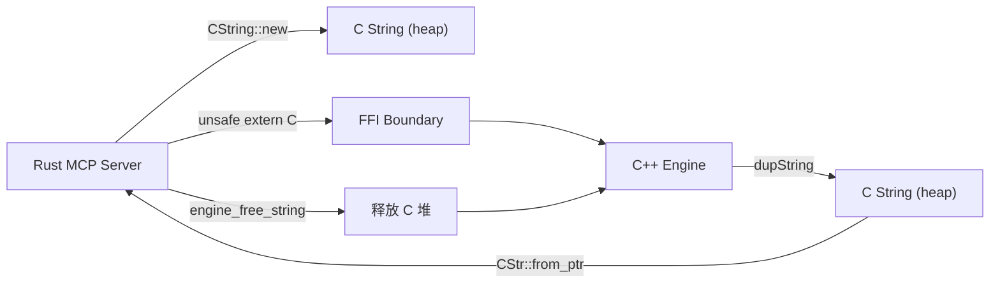
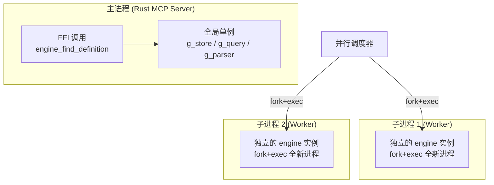
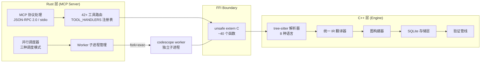

# CodeScope 拆解 (一)：双语言架构 — 为什么我们用 Rust 写了一个 C++ 项目

> *"Sometimes the best tool for the job isn't the one you'd like to use."*
> 有时最好的工具并不是你喜欢的那个。

## 为什么是两种语言？

如果让我用一句话解释 CodeScope 的架构，我会说：**Rust 写了一个 MCP 服务器，C++ 写了一整个引擎，中间用 FFI 粘起来，每个索引任务跑在独立的子进程里。**

这不是一个优雅的设计。它很丑，很麻烦，而且调试的时候会同时触及两种语言的运行时。但它解决了两个我解决不了的问题：

1. **Rust 的生态**里有 MCP SDK、serde 序列化、tokio 异步——这些是写一个 JSON-RPC 服务器最舒服的姿势。
2. **C++ 的生态**里有 tree-sitter 解析器、SQLite 的原生 C API、以及各种语言的语法解析器——这些是构建代码分析引擎最直接的路径。

我最初试过纯 Rust 方案。用 `tree-sitter` crate 解析代码，写自己的 IR 和存储层。但很快发现，当需要覆盖 8 种语言、处理百 GB 级别的仓库、同时还要做到毫秒级响应时，Rust 的抽象层带来的开销开始变得不可忽略。而 C++ 这边，tree-sitter 的 C API 可以直接调用，SQLite 的 C API 是零开销的，所有内存布局都可以精确控制。

所以最终变成了：**Rust 写前端（MCP 服务器），C++ 写后端（引擎核心），中间隔着一层讨厌但必要的 FFI。**

## 核心文件

```
server/src/ffi/mod.rs    ← Rust 侧的 FFI 声明 (~700 行)
engine/src/engine_ffi.cpp  ← C++ 侧的 FFI 实现
engine/src/engine.h       ← C++ 公开 API
```

## FFI 的惨痛现实

先看 Rust 这边。这是 FFI 声明的样子：

```rust
// server/src/ffi/mod.rs
unsafe extern "C" {
    fn engine_init(db_path: *const c_char) -> i32;
    fn engine_shutdown();

    fn engine_create_project(root_path: *const c_char, name: *const c_char) -> u64;
    fn engine_index_project(
        project_id: u64,
        dir_path: *const c_char,
        language_filter: *const c_char,
    ) -> *mut c_char;
    fn engine_find_definition(
        project_id: u64,
        symbol_name: *const c_char,
        file_filter: *const c_char,
    ) -> *mut c_char;
    // ... 40+ 个类似声明
}
```

每个 `unsafe extern "C"` 块都在说：**"Rust 不知道外面在干什么，但我信任它。"** 这种信任很容易出问题。

而 C++ 侧的实现长这样：

```cpp
// engine/src/engine_ffi.cpp
extern "C" char* engine_index_project(
    uint64_t project_id,
    const char* dir_path,
    const char* language_filter)
{
    std::string result = // ... 实际索引逻辑
    return dupString(result);  // 堆分配，Rust 侧必须 free
}
```

这段代码里埋了一个典型的 FFI 陷阱：**谁负责释放内存？**

Rust 侧调用 `engine_index_project` 后得到一个 `*mut c_char`，它必须调用 `engine_free_string` 来释放。忘记释放 = 内存泄漏。释放两次 = 崩溃。跨语言边界的内存管理就是这样——你永远在担心对面是不是忘了什么。

## 围绕 FFI 的包装层

在 Rust 侧，每个 FFI 调用都包了一层安全的 Rust 函数，把 C 指针转换成 Rust 的 `String` 或 `Result`：

```rust
// server/src/ffi/mod.rs (简化)
pub fn index_project(project_id: u64, dir_path: &str, language_filter: &str) -> Result<String, String> {
    let dir_c = CString::new(dir_path).unwrap();
    let lang_c = CString::new(language_filter).unwrap();

    let ptr = unsafe { engine_index_project(project_id, dir_c.as_ptr(), lang_c.as_ptr()) };
    if ptr.is_null() {
        return Err("engine returned null".into());
    }
    let result = unsafe { CStr::from_ptr(ptr) }.to_string_lossy().into_owned();
    unsafe { engine_free_string(ptr) };
    Ok(result)
}
```

这个模式重复了 40 多次。每次都是：
1. `CString::new` — Rust 字符串 → C 字符串
2. unsafe 调用
3. 检查空指针
4. `CStr::from_ptr` — C 字符串 → Rust 字符串
5. `engine_free_string` — 释放 C 侧的内存

这个过程如此机械，以至于我写过好几个 bug：忘记检查空指针、忘记释放、甚至在释放后继续使用指针。



## 全局单例：C++ 的"隐式状态"

引擎内部有三个全局单例：

```cpp
// engine/src/engine_internal.h
extern std::unique_ptr<store::GraphStore> g_store;
extern std::unique_ptr<query::QueryEngine> g_query;
extern std::unique_ptr<Parser> g_parser;
```

它们由 `engine_init()` 初始化，`engine_shutdown()` 销毁。Rust 侧的 MCP 服务器在启动时调用一次 `engine_init`，在关闭时调用一次 `engine_shutdown`。

但这里的线程安全模型是脆弱的：

```cpp
// engine/src/engine_internal.h
// Thread-safety model:
// - The Rust MCP server calls FFI functions SEQUENTIALLY from a single
//   thread (the main event loop in server/src/mcp/server.rs).
// - Index worker SUBPROCESSES have their own engine instance (fork+exec).
// - engine_shutdown() must only be called when no FFI query is in flight.
```

译成人话：**"别在多个线程里同时调 FFI。"**

这个约束在 v0.1 版本里从来不是问题——MCP 服务器是单线程事件循环，所有请求串行处理。但到了 v0.2 引入并行调度器后，问题来了：**调度器会 fork 子进程，每个子进程有自己的 engine 实例，但父进程的 engine 还在同时处理查询请求。**

解决方案是：子进程里 `fork+exec` 重新启动一个 `codescope worker` 进程，完全独立的内存空间，不会干扰父进程的全局单例。



## 一个让我冷汗直流的教训

在 v0.1.2 的开发中，我遇到了一个诡异的崩溃：在 CI 上，`engine_shutdown` 偶尔会触发 `double free`。

debug 了三天后，发现原因是一个**野指针**。Rust 侧的某个 FFI 调用返回后，C++ 侧持有了一个指向 Rust 栈上数据的指针。当 Rust 的 `CString` 被 drop 后，C++ 侧还在用它。这在单线程上偶尔能跑对，但在 CI 的高负载下就崩溃了。

修复方案是把所有跨边界的字符串都改成**深拷贝**——C++ 侧收到 C 字符串后立即拷贝到 `std::string`，不再持有任何指向 Rust 内存的指针。

教训是：**跨 FFI 边界的指针，要么是 const 的且生命周期内不会释放，要么就立刻拷贝。没有中间地带。**

## 为什么要承受这种痛苦？

如果 FFI 这么麻烦，为什么不用纯 Rust 或纯 C++？

**纯 C++ 方案**：C++ 没有原生的 MCP SDK。我需要手动实现 JSON-RPC 2.0 协议、HTTP 传输（或 stdio 传输）、以及所有工具的路由分发。这大约需要 2000-3000 行额外代码，而且每增加一个工具，都要手动注册。

**纯 Rust 方案**：Rust 的 `tree-sitter` crate 是对 C API 的封装，性能损耗很小，但问题在于：C++ 引擎里的大量代码（尤其是 IR 翻译器和图构建器）是用 C++17/C++20 的特性写的，如果全部移植到 Rust，需要重新实现一套完整的 IR 系统和图算法——这是几个月的工作量。

所以 FFI 不是最优解，它是**当前约束下的最优解**。Rust 负责它擅长的：网络、序列化、进程管理、类型安全。C++ 负责它擅长的：解析、图构建、内存控制、性能关键路径。



## 总结

CodeScope 的双语言架构不是设计出来的，是被逼出来的。Rust 的 MCP 生态和 C++ 的解析生态谁都不愿放弃，FFI 就成了不得不承受的代价。

40 多个 `unsafe extern "C"` 声明、每个字符串都要手动管理生命周期、全局单例的线程安全约束——这些都是真实存在的技术债务。但到目前为止，它跑得还算稳。

在下一篇文章中，我会拆解**Worker 子进程隔离**——为什么每个索引任务都要跑在独立的子进程里，以及如何在不崩溃的情况下处理百万行代码的仓库。