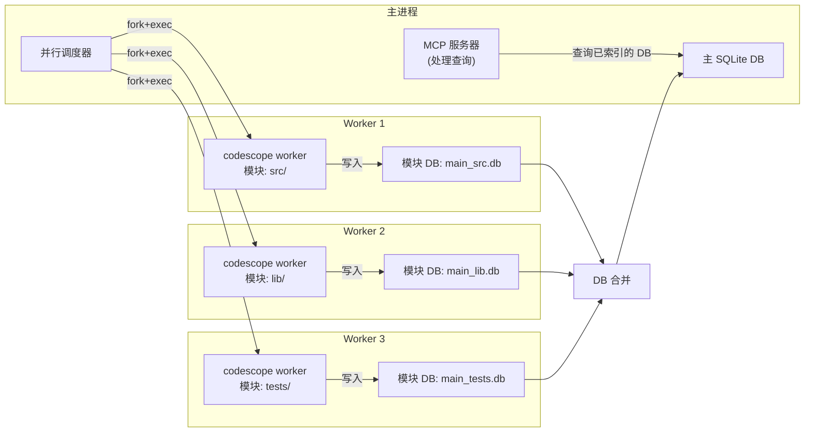
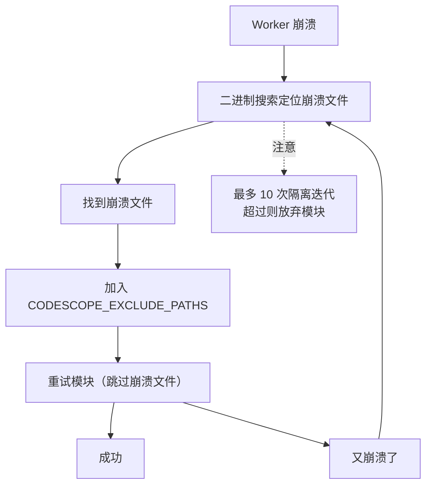
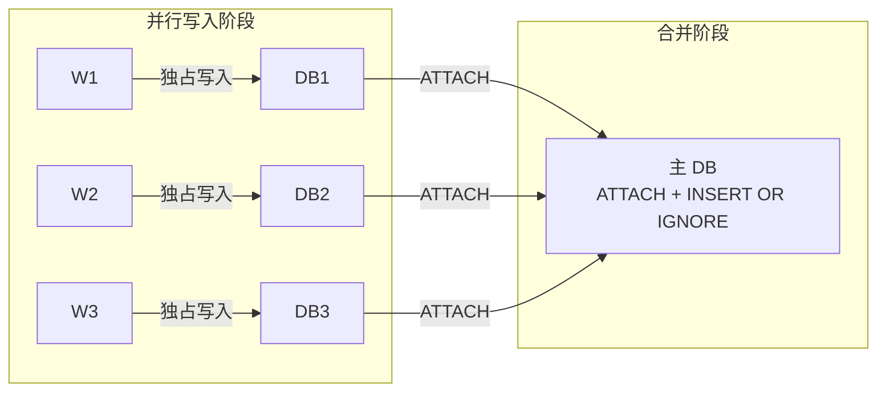

# CodeScope 拆解 (二)：Worker 子进程隔离 — 为什么索引必须跑在子进程里

> *"The only way to make a C++ program crash-proof is to run it in a separate process."*
> 让 C++ 程序不崩溃的唯一方法，是把它跑在单独的进程里。

## 从 OOM 崩溃说起

在 CodeScope 的早期版本（v0.1）里，索引是直接在主进程中跑的。调用 `engine_index_project` 后，整个 MCP 服务器就卡住了——单线程事件循环，不能处理任何新请求，直到索引完成。

但这不是最严重的问题。最严重的问题是：**当索引一个大型仓库（比如 Linux kernel 或 JDK）时，C++ 引擎的内存占用会飙升到几个 GB，然后 OOM killer 直接杀掉整个进程。**

MCP 服务器崩溃了，LLM 客户端收到一个 `connection closed` 错误，用户可能会骂一句"什么垃圾软件"。

解决方案很直接：**把索引任务放到子进程里跑。** 如果子进程崩溃，主进程不受影响，可以重新调度或优雅降级。

## 核心文件

```
server/src/scheduler/worker.rs  ← Worker 子进程管理 (~576 行)
server/src/scheduler/mod.rs     ← 调度器主逻辑 (~1382 行)
server/src/main.rs              ← worker 子命令入口
```

## fork + exec：一个简单的方案

Rust 的调度器生成子进程的方式简单粗暴：

```rust
// server/src/scheduler/worker.rs
pub(super) fn run_module_worker(
    exe: &str,
    project_dir: &str,
    module_name: &str,
    files_estimate: u64,
    workers: u32,
    grammars_dir: &str,
    db_prefix: &str,
    project_id: u64,
    quarantine_exclude: Option<&str>,
) -> ModuleResult {
    let module_dir = Path::new(project_dir).join(module_name);
    let module_db = format!("{}_{}.db", db_prefix, module_name);

    // 每个 worker 从干净的 DB 文件开始
    let _ = std::fs::remove_file(&module_db);

    let mut cmd = Command::new(exe);
    cmd.args([
        "worker",
        &module_db,
        module_dir.to_str().unwrap_or(""),
        "",  // empty language filter
        &project_name,
        &project_id_str,
    ]);
    cmd.env("GRAMMARS_DIR", grammars_dir);
    cmd.env("CODESCOPE_DB_PATH", &module_db);
    cmd.env("CODESCOPE_INDEX_MODE", "fast");
    // ...
}
```

每个模块启动一个独立的 `codescope worker` 子进程。这个子进程是一个完全独立的进程实例——它有自己的地址空间、自己的全局变量、自己的 `g_store` 单例。这意味着：

- 子进程崩溃 → 主进程不受影响
- 子进程内存泄漏 → 进程退出后 OS 自动回收
- 子进程 OOM → 只有它自己被 kill，主进程继续运行



## 超时与隔离

每个 worker 都有一个硬超时：

```rust
const DEFAULT_WORKER_TIMEOUT_SECS: u64 = 600;
```

如果 10 分钟内没跑完，子进程会被 `kill`。这防止了某个死循环的解析器占用整个调度器。

但有个问题：**怎么知道 worker 是正常退出还是崩溃了？**

```rust
// 等待子进程退出
match child.wait_with_output() {
    Ok(output) => {
        if output.status.success() {
            // 正常退出，解析 stdout JSON
        } else {
            // 崩溃或非零退出码
            // 进入隔离流程
        }
    }
    Err(e) => {
        // wait 本身失败
    }
}
```

## 隔离机制：二进制搜索定位崩溃文件

当 worker 崩溃时，调度器不会简单地重试整个模块——它会用**二进制搜索**来定位导致崩溃的文件：

```rust
// server/src/scheduler/mod.rs (简化)
fn quarantine_crashing_file(
    module: &Module,
    files: &[FileEntry],
    crash_index: usize,
) -> Option<String> {
    let mut lo = 0;
    let mut hi = files.len();

    while lo < hi {
        let mid = (lo + hi) / 2;
        let test_files = &files[lo..=mid];

        // 只索引这些文件
        if run_worker_with_files(module, test_files).is_ok() {
            lo = mid + 1;  // 崩溃在右侧
        } else {
            hi = mid;       // 崩溃在左侧（含 mid）
        }
    }

    // 找到崩溃文件
    Some(files[lo].path.clone())
}
```

找到崩溃文件后，调度器把这个文件加入 `CODESCOPE_EXCLUDE_PATHS`，然后**重试整个模块**——跳过这个文件。



这个机制在我的测试中定位过几次 tree-sitter 解析器对特定 C++ 模板代码的崩溃。隔离后，整个项目仍然可以索引，只是缺失了那个文件——这比整个索引失败好了 100 倍。

## 每个 worker 一个 DB，避免 SQLite 并发写入

另一个关键设计是：**每个 worker 写自己的 SQLite 文件。**

```rust
let module_db = format!("{}_{}.db", db_prefix, module_name);
```

SQLite 的 WAL 模式支持并发读取，但并发写入需要锁。如果多个 worker 同时写同一个 DB 文件，锁竞争会导致性能急剧下降，甚至死锁。

每个 worker 拥有独立的 DB 文件，意味着：

- 没有锁竞争
- 没有死锁风险
- 索引完成后通过 `ATTACH + INSERT OR IGNORE` 合并



## 一个让我冷汗直流的教训

在 v0.2.0 的开发中，我发现**合并后的 DB 中，来自不同模块的实体 ID 冲突了**。

每个 worker 的 `project_id` 是调度器分配的（1, 2, 3, ...），但实体 ID 从 1 开始自增。两个模块可能都有 `id=42` 的实体，合并时 `INSERT OR IGNORE` 会丢失第二个模块的实体。

修复方案是：**合并时对每个模块的实体 ID 做偏移量重映射。**

```rust
// server/src/scheduler/merge.rs (简化)
// 对于模块 i > 0：
// 1. 计算 offset = 当前主表的 MAX(id)
// 2. 复制模块数据到临时表
// 3. 对临时表的 id 和 FK 列加 offset
// 4. INSERT OR IGNORE 到主表
// 5. DROP 临时表

const TABLE_SPECS: &[TableSpec] = &[
    TableSpec {
        name: "entity",
        remap_cols: &[("id", "self")],  // id += offset
        skip_rowid: false,
    },
    TableSpec {
        name: "relation",
        remap_cols: &[
            ("id", "self"),          // 主键重映射
            ("source_id", "entity"), // FK 跟随 entity 的偏移量
            ("target_id", "entity"), // FK 跟随 entity 的偏移量
        ],
        skip_rowid: false,
    },
    // ...
];
```

这个重映射需要知道表之间的外键关系：`relation.source_id` 引用 `entity.id`，所以 `source_id` 的偏移量必须和 `entity.id` 的偏移量一致。

**表顺序很重要**：被引用的表（entity）必须先合并，引用它的表（relation）后合并。这就是为什么 `TABLE_SPECS` 的顺序是精心排好的。

## 总结

Worker 子进程隔离是 CodeScope 能在生产级仓库上稳定运行的关键。它解决了三个问题：

1. **崩溃隔离**：C++ 引擎崩溃不会拖垮 MCP 服务器
2. **内存回收**：进程退出后所有内存自动释放
3. **并发写入**：每个 worker 独立的 DB 文件，无锁竞争

代价是：进程启动开销（~10ms）、DB 合并的额外步骤、以及那些恼人的 ID 重映射。但相比于主进程被 OOM 杀掉的痛苦，这点代价不值一提。

在下一篇文章中，我会拆解**并行调度器**——三种调度模式的设计与取舍，以及为什么一个简单的"静态分配"方案在大型仓库上会失效。