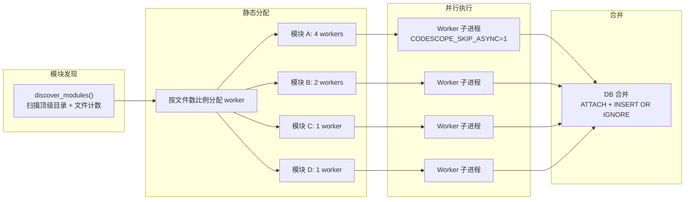
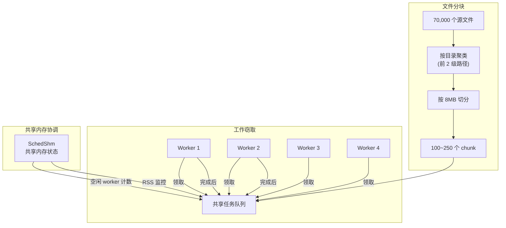
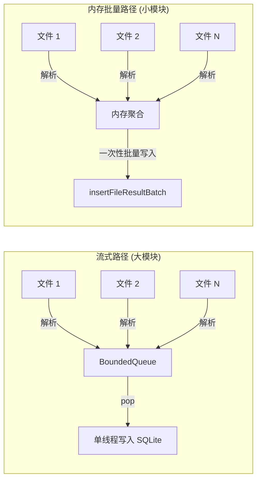
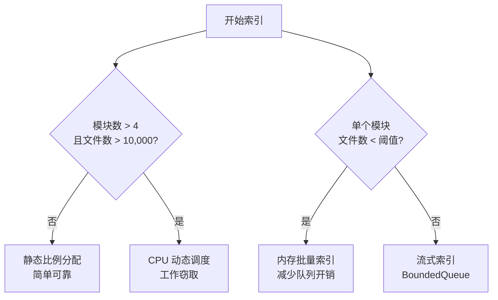

# CodeScope 拆解 (三)：并行调度器 — 三种调度模式的设计与取舍

> *"A scheduler that doesn't know when to give up is worse than no scheduler at all."*
> 不知道什么时候该放弃的调度器，还不如没有调度器。

## 问题的起点

CodeScope 的索引需要处理大量文件。Linux kernel 有 ~70,000 个源文件，JDK 有 ~40,000 个。如果串行解析，一个文件的 tree-sitter 解析 + IR 构建 + SQLite 写入需要 50-200ms，70,000 个文件就是 1-4 小时。

用户等不了 4 小时。所以需要并行。

但并行调度不是简单地"开 N 个线程"就能解决的。问题在于：

1. **模块大小差异巨大**：`src/` 可能有 10,000 个文件，`docs/` 只有 50 个
2. **子系统资源竞争**：SQLite 写入、内存分配、文件 I/O
3. **崩溃处理**：一个模块崩溃不能影响其他模块
4. **CPU 核心数限制**：不能无限并行

## 核心文件

```
server/src/scheduler/mod.rs        ← 调度器主逻辑 (~1382 行)
server/src/scheduler/chunk_plan.rs ← 分块规划 (~524 行)
server/src/scheduler/dyn_config.rs ← 动态调度配置 (~220 行)
server/src/scheduler/shm.rs        ← 共享内存
server/src/scheduler/chunk_queue.rs← 工作窃取队列
```

## 模式一：静态比例分配 (Static Proportional)

这是最直接的方案，也是 CodeScope 的默认调度模式。

```rust
// server/src/scheduler/mod.rs (概念)
fn allocate_workers_static(modules: &[Module], total_workers: u32) -> Vec<u32> {
    let total_files: u64 = modules.iter().map(|m| m.file_count).sum();

    modules.iter().map(|m| {
        std::cmp::max(
            1,  // 每个模块至少 1 个 worker
            (m.file_count as f64 / total_files as f64 * total_workers as f64).ceil() as u32
        )
    }).collect()
}
```

核心逻辑很简单：**按文件数比例分配 CPU 核心。**

- 模块 A 有 10,000 个文件（占总文件的 50%）→ 分配 4 个核心（总 8 核）
- 模块 B 有 5,000 个文件（25%）→ 分配 2 个核心
- 模块 C 有 500 个文件（2.5%）→ 分配 1 个核心（至少 1 个）



**优点**：简单、可预测、不需要运行时监控。

**缺点**：如果模块 A 的 10,000 个文件都是小文件，而模块 B 的 5,000 个文件都是大文件，分配就偏离了实际工作量。小模块完成后，它的核心闲置，直到所有模块都跑完。

## 模式二：CPU 动态调度 (CPU-Dynamic / Chunked Work-Stealing)

静态分配的"核心浪费"问题，在大型仓库（>50,000 文件）上变得不可接受。于是有了第二种模式：**工作窃取**。

```rust
// server/src/scheduler/dyn_config.rs
pub fn should_enable(&self, total_modules: usize, total_files: u64) -> bool {
    match self.force_on {
        Some(b) => b,
        None => total_modules > 4 && total_files > 10000,
    }
}
```

这个模式默认是**opt-in**的——只有通过环境变量 `CODESCOPE_CPU_DYNAMIC=1` 或项目超过 10,000 文件 + 4 个模块时才会启用。

它的核心思想是：**把文件切分成更小的块（chunk），然后让多个 worker 动态地从共享队列中领取任务。**

```rust
// server/src/scheduler/chunk_plan.rs
/// 默认每个 chunk 8 MB
pub const TARGET_BYTES: u64 = 8 * 1024 * 1024;
/// 最大 32 MB
pub const MAX_BYTES: u64 = 32 * 1024 * 1024;
/// 按前 2 级路径进行目录聚类
pub const CLUSTER_DEPTH: usize = 2;
```



**分块算法**：

1. 按前 2 级路径聚类（`src/compiler/`、`src/parser/`）
2. 按字节大小降序排序
3. 贪心打包：文件累积到 `TARGET_BYTES`（8MB）为止
4. 巨大目录（>32MB）强制拆分

这样同一个目录的文件大概率在同一个 chunk 里，保持了**目录局部性**——相关文件一起解析，减少了跨模块的上下文切换。

**内存监控**：动态调度器还有一个内存限制机制。当 RSS 超过阈值（默认 4GB）时，不再分配新的 chunk，防止 OOM。

```rust
// server/src/scheduler/dyn_config.rs
pub fn from_env() -> Self {
    let mem_limit_mb = env::var("CODESCOPE_MEM_LIMIT_MB")
        .ok()
        .and_then(|v| v.parse().ok())
        .unwrap_or(4096);
    // ...
}
```

## 模式三：内存批量索引 (Memory Bulk / Membulk)

对于小模块（<= 文件数阈值），调度器采用第三种模式：**内存批量索引**。

```cpp
// engine/src/engine_internal.h
/// For small modules (<= kMemBulkFileThreshold files) the parse workers
/// aggregate FileResult in memory instead of pushing through BoundedQueue,
/// then flush once via insertFileResultBatch.
char *engine_index_project_membulk(
    uint64_t project_id, const std::string &dir, uint64_t max_file_size,
    const FilterPolicy &filter,
    const std::vector<std::pair<std::string, std::string>> &job_lang,
    const std::unordered_map<std::string, const TSLanguage *> &lang_ptrs,
    bool is_reindex, bool mode_fast, bool mode_deep);
```

为什么需要这个模式？因为 **BoundedQueue**（线程安全的生产者-消费者队列）的开销对小型模块来说太大了。如果模块只有 50 个文件，每个文件解析后都要 push 到队列、由另一个线程 pop 然后写入 SQLite，这个同步开销可能占到总时间的 30%。

对于小模块，更好的策略是：**所有解析线程把结果聚合在内存中，解析完成后一次性批量写入。**



## 调度模式的选择标准

三种模式对应三种场景：



## 一个让我冷汗直流的教训

在 v0.2.2 中，我遇到了一个**死锁**。

动态调度模式下，多个 worker 通过共享内存（`SchedShm`）协调任务分配。当所有 chunk 都被领取后，最后一个 worker 会发送"完成"信号，然后调度器开始合并 DB。

但有一个边缘情况：**如果某个 worker 在领取 chunk 后、开始工作前被 OS 调度出去**（比如因为其他进程的 CPU 竞争），其他 worker 可能已经完成了所有工作并开始合并。当这个被延迟的 worker 醒来后，它还在写自己的 DB，但合并线程已经在读它的 DB 了——SQLite 的 WAL 模式下，读取和写入可以并发，但如果我们用的是 `INSERT OR IGNORE` 合并，而 worker 还在写入，就会出现**部分合并**的问题。

修复方案：**在合并前，确保所有 worker 都已退出。** 调度器不再依赖共享内存中的"完成"信号，而是等待每个子进程的 `wait()` 返回。

```rust
// 修复后的逻辑
for handle in worker_handles {
    let result = handle.join().unwrap_or_else(|_| {
        // 线程 panic 或 worker 崩溃
        ModuleResult::crashed(module_name)
    });
    results.push(result);
}
// 所有 worker 都确认退出后，才开始合并
merge_results(results, &db_path);
```

## 总结

三种调度模式不是一开始就设计好的，而是随着问题逐个出现而逐步加入的：

1. **静态比例分配**：简单、可预测，适合大多数项目
2. **CPU 动态调度**：解决大型仓库的核心浪费问题，但需要 opt-in
3. **内存批量索引**：解决小模块的队列开销问题，是性能优化

调度器的核心设计原则是：**调度器只管理 CPU 核心分配，不参与文件发现、解析或图构建。** 它不知道也不关心每个文件的内容，它只关心"哪个模块有多少文件"和"哪个核心空闲"。

这种关注点分离，让调度器可以在未来轻松替换——比如换成一个 Kubernetes 集群调度器，或者一个基于优先级的队列。

在下一篇文章中，我会拆解**两阶段索引**——Fast Scan 如何在毫秒级返回结果，以及 Background Enhance 在后台做了什么。