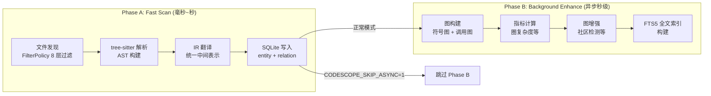
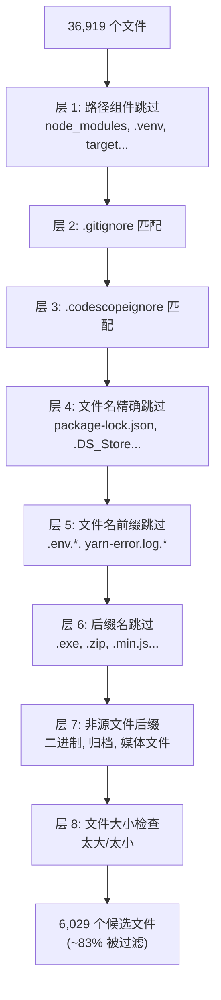
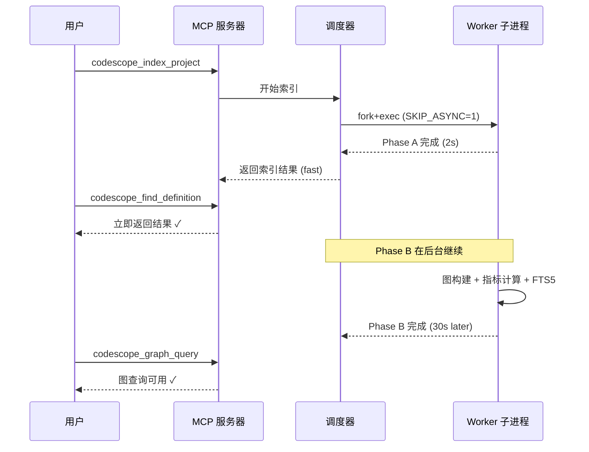

# CodeScope 拆解 (四)：两阶段索引 — 毫秒级响应与深度分析的权衡

> *"The user doesn't care about your graph database. They care about getting an answer before they forget the question."*
> 用户不在乎你的图数据库。他们在乎的是在忘记问题之前得到答案。

## 问题：索引太慢了

CodeScope 的完整索引流程包括：文件发现 → tree-sitter 解析 → IR 构建 → 指标计算 → 图构建 → 图增强（社区检测、聚类）。对于 Linux kernel 这种规模的仓库，完整索引需要 5-15 分钟。

LLM 的等待耐心是有限的。如果用户发起一个 `codescope_index_project` 请求，然后等 10 分钟才能查询，这个工具就没法用。

但有个好消息：**大多数查询只需要基本的符号信息**（定义、引用、调用关系），而不需要图分析。如果能在几秒内返回基本的符号索引，然后让图分析在后台悄悄完成，用户就感知不到延迟。

这就是两阶段索引的由来。

## 核心文件

```
server/src/scheduler/worker.rs          ← Worker 中的 CODESCOPE_SKIP_ASYNC
server/src/engine_ffi.cpp               ← engine_index_project 实现
engine/src/engine_internal.h            ← engine_index_post_parse 声明
engine/src/engine_helpers.cpp           ← 索引辅助函数
```

## Phase A：Fast Scan（毫秒 ~ 秒级）

Fast Scan 的目标是：**尽可能快地返回可查询的索引。**

它只做必要的工作：

1. 文件发现 + 过滤（8 层过滤策略）
2. tree-sitter 解析（生成 AST）
3. IR 翻译（统一中间表示）
4. 符号提取（实体、关系）
5. SQLite 写入



在 worker 并行索引阶段，每个 worker 设置 `CODESCOPE_SKIP_ASYNC=1`：

```rust
// server/src/scheduler/worker.rs
cmd.env("CODESCOPE_INDEX_MODE", "fast");
```

这意味着 worker 只做 Phase A，跳过 Phase B。合并后的 DB 可以在几秒内准备好，**用户可以立即开始查询。**

## Phase B：Background Enhance（异步，秒~分钟级）

Phase B 在 Phase A 完成后启动，执行一系列**计算密集型**操作：

1. **图构建**：从 `entity` 和 `relation` 表构建符号图
2. **指标计算**：圈复杂度、认知复杂度、嵌套深度等
3. **图增强**：社区检测、聚类分析
4. **FTS5 全文索引**：为代码搜索构建倒排索引

```cpp
// engine/src/engine_internal.h
/// Index Project: in-memory bulk path + shared post-parse
///
/// For small modules (<= kMemBulkFileThreshold files) the parse workers
/// aggregate FileResult in memory instead of pushing through BoundedQueue,
/// then flush once via insertFileResultBatch. The post-parse graph-building
/// sequence is shared with the streaming path via engine_index_post_parse.
char *engine_index_project_membulk(
    uint64_t project_id, const std::string &dir, uint64_t max_file_size,
    const FilterPolicy &filter,
    const std::vector<std::pair<std::string, std::string>> &job_lang,
    const std::unordered_map<std::string, const TSLanguage *> &lang_ptrs,
    bool is_reindex, bool mode_fast, bool mode_deep);
```

`mode_fast` 参数控制是否跳过 Phase B。`mode_deep` 参数控制是否执行额外的深度分析（如漂移检测的预处理）。

## 8 层过滤策略

在 Phase A 的文件发现阶段，FilterPolicy 应用了 8 层过滤来减少需要解析的文件数量：

```cpp
// engine/src/filter_policy.h
class FilterPolicy {
    // ...
    bool shouldSkipEntry(const std::string &rel_path, bool is_dir) const;
};
```



在真实项目上，这 8 层过滤可以过滤掉约 83% 的文件。对于 Linux kernel 这种包含大量文档、脚本、配置、二进制文件的仓库，过滤效果尤其显著。

## 渐进式就绪的用户体验

两阶段索引的核心价值在于**渐进式就绪**：



用户发出索引请求后，在 2 秒内就能收到"索引完成"的响应，然后可以立即查询定义和引用。而图分析和全文搜索的结果在 30 秒后可用。

如果用户感知不到后台还在工作，那这个设计就是成功的。

## 一个让我冷汗直流的教训

在 v0.2.0 中，我发现**合并后的 DB 缺少 FTS5 索引**。

原因是：每个 worker 在 Phase A 时跳过了 FTS5 构建（`CODESCOPE_SKIP_ASYNC=1`），合并后的 DB 也没有触发 FTS5 重建。结果 `search_code` 工具返回空结果，而用户确信代码中确实包含了某个关键字。

修复方案：**在合并步骤后，对主 DB 执行一次完整的 FTS5 重建。**

但这又带来了另一个问题：FTS5 重建的时间可能很长（对于大型仓库，需要 5-10 秒）。如果每次索引合并后都重建 FTS5，用户等待第一次查询的时间就延长了。

最终的方案是：**在合并后立即重建 FTS5，但重建过程是增量式的——只对新插入的行建立索引，不对已有行重新索引。**

```sql
-- 重建 FTS5 索引
INSERT INTO code_fts(code_fts)
VALUES('rebuild');
```

## 总结

两阶段索引是 CodeScope 在"响应速度"和"分析深度"之间的权衡方案：

- **Phase A (Fast Scan)**：只做符号提取，跳过图分析，让用户在毫秒~秒级获得可查询的索引
- **Phase B (Background Enhance)**：在后台执行图构建、指标计算、FTS5 索引，完成后自动提升查询能力

这个方案不是完美的——如果用户在图构建完成前就发起图查询，会收到"数据尚未就绪"的提示。但大多数时候，用户的前几个查询都是符号查找，图查询在之后才用到。两阶段索引正好符合这个使用模式。

在下一篇文章中，我会拆解**统一 IR 与语言翻译器**——8 种语言如何共享同一个代码模型。