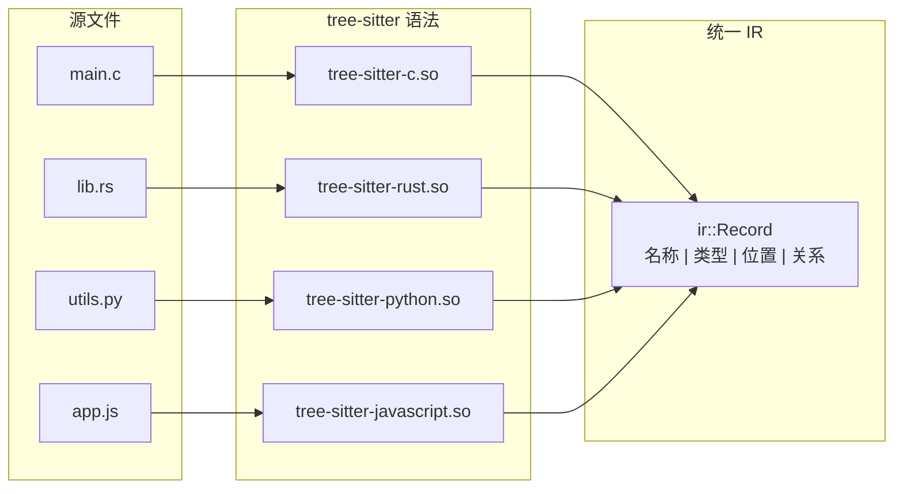
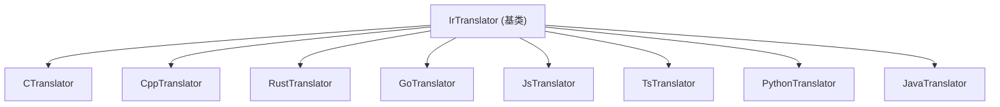
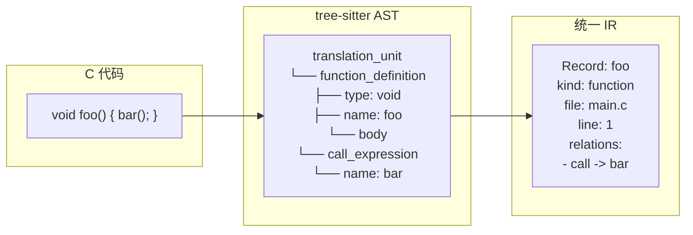

# CodeScope 拆解 (五)：tree-sitter 解析器与统一 IR — 8 种语言一个模型

> *"A programming language is a tool. Code analysis should not care which tool you used."*
> 编程语言是工具。代码分析不应该关心你用了哪个工具。

## 问题：8 种语言，一个格式

CodeScope 支持 8 种语言：C、C++、Rust、Go、JavaScript、TypeScript、Python、Java。

每种语言都有自己的 AST 结构、语法规则、作用域规则。如果为每种语言写一套独立的分析代码，维护成本会迅速失控。

解决方案是：**用统一的 IR（Intermediate Representation）来抽象所有语言**。

## 核心文件

```
engine/src/parser/parser.cpp      ← tree-sitter 解析器封装
engine/src/parser/parser.h        ← Parser 接口
engine/src/ir/ir.h                ← 统一 IR 定义
engine/src/ir/ir.cpp              ← IR 构建
engine/src/ir/ir_translator.h     ← IR 翻译器基类
engine/src/ir/ir_translator.cpp   ← IR 翻译器实现
```

## tree-sitter：一个解析器，多种语言

tree-sitter 是一个增量解析库，支持多种语言的语法定义。CodeScope 用 tree-sitter 作为底层解析器，每种语言只需要一个 `.so` 语法文件。

```cpp
// engine/src/parser/parser.h (概念)
class Parser {
    std::unordered_map<std::string, const TSLanguage*> languages_;
    // ...
};
```

解析流程：

1. 检测文件语言（根据扩展名或 shebang）
2. 加载对应的 tree-sitter 语法（`.so` 文件）
3. 解析文件生成 AST（CST 实际上是 concrete syntax tree）
4. 遍历 AST 提取符号信息



## 统一 IR 定义

IR 的核心数据结构是 `ir::Record`：

```cpp
// engine/src/ir/ir.h (概念)
namespace ir {

struct Record {
    std::string name;        // 符号名称
    std::string kind;        // 符号类型 (function, class, variable, ...)
    std::string file_path;   // 文件路径
    int line;                // 起始行
    int col;                 // 起始列
    int end_line;            // 结束行
    int end_col;             // 结束列
    std::vector<Relation> relations;  // 与其他符号的关系
    std::vector<Record> children;     // 嵌套符号
};

struct Relation {
    std::string kind;        // 关系类型 (call, reference, inherit, contain, ...)
    std::string target_name; // 目标符号名称
    int target_line;         // 目标位置
    int target_col;
};

} // namespace ir
```

这个 IR 设计的关键是：**足够抽象，能表达所有语言的结构；又足够具体，能保留足够的信息用于查询。**

## IR 翻译器

每种语言的 tree-sitter AST 到统一 IR 的转换由 `IrTranslator` 实现：

```cpp
// engine/src/ir/ir_translator.h (概念)
class IrTranslator {
public:
    virtual std::vector<ir::Record> translate(const TSNode &root,
                                               const std::string &source) = 0;
    virtual ~IrTranslator() = default;
};
```

每种语言有一个翻译器子类：



每个翻译器知道如何从特定语言的 AST 中提取函数定义、类定义、变量声明、函数调用等。

## 关系提取

IR 的 `Relation` 结构是 CodeScope 图查询的基础。翻译器在遍历 AST 时，会识别以下关系：

- **call**: 函数调用关系
- **reference**: 符号引用
- **inherit**: 继承关系
- **contain**: 包含关系（类包含方法，函数包含变量）
- **implement**: 实现关系（接口实现）



## 增量解析

tree-sitter 的一个关键特性是**增量解析**。当文件被修改时，tree-sitter 可以只重新解析被修改的部分，而不是整个文件。

CodeScope 利用这个特性来实现增量索引：

```cpp
// 概念: 增量索引伪代码
TSTree *old_tree = cache.get(file_path);
TSTree *new_tree = ts_parser_parse_incremental(
    parser, old_tree, new_input);
```

在增量模式下，重新索引一个已修改的文件只需要几毫秒，而不是几十毫秒。

## 一个让我冷汗直流的教训

在开发 IR 翻译器时，我遇到了一个**C++ 模板的解析问题**。

```cpp
template<typename T>
T add(T a, T b) {
    return a + b;
}
```

这个简单的模板函数，在 tree-sitter 的 C++ 语法中，`T` 被解析为 `type_identifier`，`a` 和 `b` 被解析为 `declaration`。IR 翻译器需要正确识别：

- 函数名是 `add`，不是 `T`
- `T` 是模板参数，不是函数参数
- `a` 和 `b` 是函数参数，类型是 `T`
- 返回类型是 `T`

但最初的翻译器实现把 `T` 识别为了函数名（因为它是 AST 中第一个 `identifier` 节点），导致索引后的函数名是 `T` 而不是 `add`。

修复方案：**在翻译器中，先检查 `template` 节点，再处理函数定义。**

```cpp
// 修复后的 C++ 翻译器逻辑 (概念)
if (node_kind == "template_declaration") {
    // 先处理模板参数
    auto template_params = extract_template_params(node);
    // 然后处理内部的函数/类定义
    for (auto child : ts_node_named_children(node)) {
        if (is_function_definition(child)) {
            return translate_function(child, source, template_params);
        }
    }
}
```

这个 bug 暴露了一个更深层次的问题：**统一 IR 设计假定所有语言的结构是相似的，但 C++ 模板与 Java 泛型、Rust 泛型在 AST 层面有本质差异。** 翻译器必须在保持 IR 抽象的同时，处理这些语言特定的细节。

## 总结

统一 IR 是 CodeScope 能够支持多语言的核心抽象：

- **tree-sitter** 提供底层解析能力，每种语言一个语法文件
- **IR 翻译器** 将语言特定的 AST 转换为统一的数据结构
- **Relation 提取** 在遍历 AST 时完成，构建符号关系图
- **增量解析** 让重新索引变得高效

这个设计不是完美的——每种语言的特殊情况（C++ 模板、Rust 宏、Python 装饰器）让翻译器变得复杂。但相比于为每种语言写一套独立的分析工具，统一 IR 的维护成本要低得多。

在下一篇文章中，我会拆解**SQLite 图谱存储**——如何用关系型数据库存储代码图。