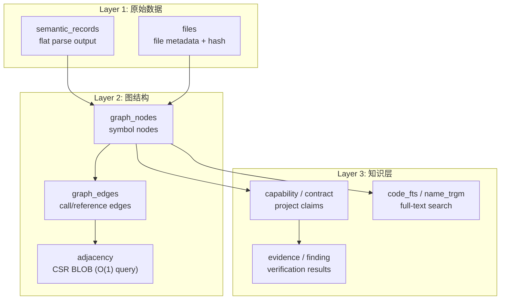
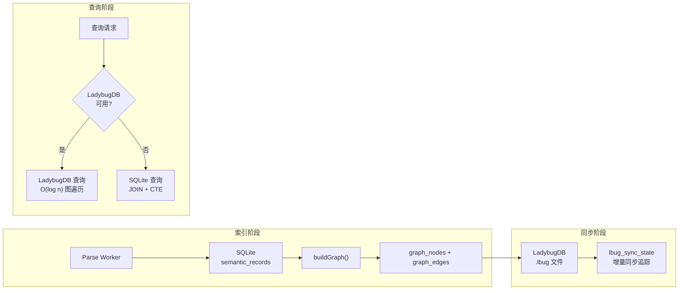
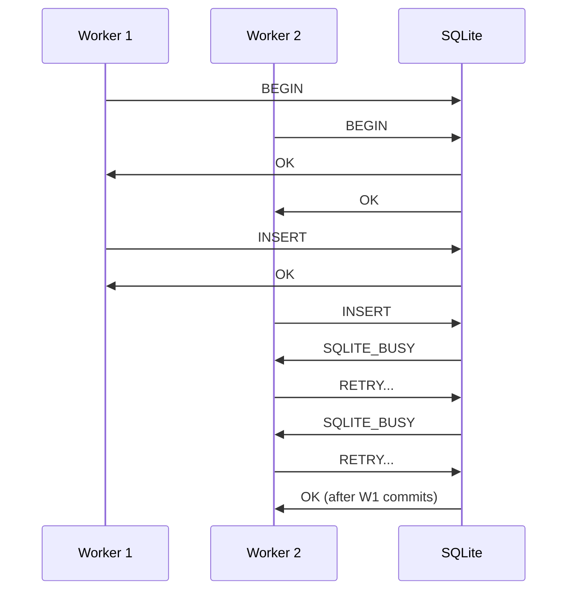
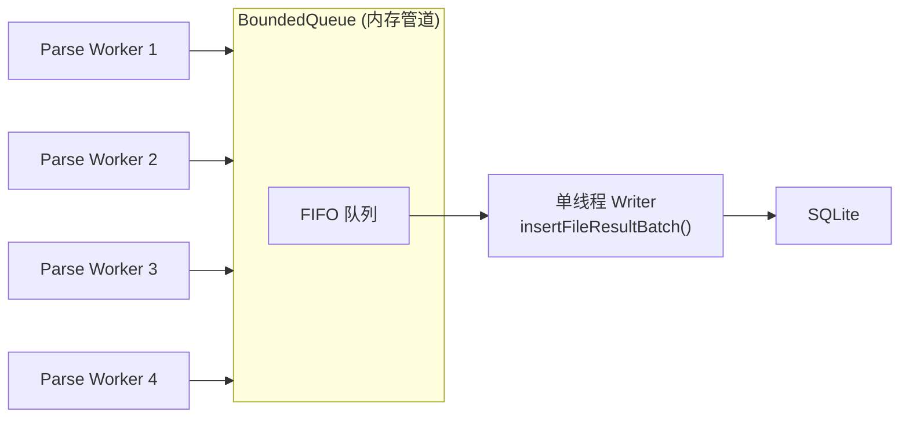

# CodeScope 拆解 (六)：SQLite 图谱存储 — Schema 设计与 FTS

> *"A graph database is a great idea. A graph database that requires a server process is a deployment nightmare."*
> 图数据库是个好主意。但需要启动一个服务进程的图数据库，就是部署噩梦了。

## 问题：代码图存哪里？

CodeScope 的核心输出是**代码符号图**：节点是函数、类、变量，边是调用、引用、继承关系。这个图必须持久化，支持后续查询。

选项有三个：

1. **内存图** — 快，但索引完就没了，没法增量复用
2. **专用图数据库** — Neo4j、KuzuDB 功能强大，但用户要装服务、配端口、处理认证
3. **SQLite** — 零配置，单文件，进程内嵌入

CodeScope 选的是第三条路：**SQLite 为主，LadybugDB（嵌入式图数据库）为可选加速层。**

## 核心文件

```
engine/src/store/store.h                ← GraphStore 接口
engine/src/store/store_schema.cpp        ← 所有 CREATE TABLE / INDEX DDL
engine/src/store/store_core.cpp          ← SQLite 操作实现
engine/src/store/store_ladybug_core.cpp  ← LadybugDB 图存储集成
```

## Schema 设计：三层存储

CodeScope 的数据库 Schema 分三层：



### Layer 1: 原始解析数据

最核心的表是 `semantic_records`：

```sql
CREATE TABLE IF NOT EXISTS semantic_records (
    rowid INTEGER PRIMARY KEY AUTOINCREMENT,
    original_id INTEGER NOT NULL,    -- 文件内 ID（从 1 开始）
    project_id INTEGER NOT NULL,
    kind INTEGER NOT NULL,           -- 符号类型（function/class/variable/...）
    name TEXT,
    qualified_name TEXT DEFAULT '',
    parent_id INTEGER DEFAULT 0,     -- 父符号 ID（containment 关系）
    arity INTEGER DEFAULT 0,         -- 函数参数个数（用于重载消歧）
    is_static INTEGER DEFAULT 0,
    type_name TEXT DEFAULT '',
    call_kind INTEGER DEFAULT 0,     -- 0=direct, 1=method, 2=interface, ...
    visibility INTEGER NOT NULL DEFAULT 0,
    start_row INTEGER DEFAULT 0, start_col INTEGER DEFAULT 0,
    end_row INTEGER DEFAULT 0, end_col INTEGER DEFAULT 0,
    file_path TEXT NOT NULL,
    language TEXT DEFAULT ''
);
```

这个表的设计有一个关键决策：**flat 存储，不建图**。所有解析结果平铺在一个表里，`parent_id` 表示 containment 关系。图结构是后续 `buildGraph()` 阶段从 `semantic_records` 构建出来的。

为什么这样设计？因为解析阶段是并行的，多个 worker 同时写同一个表。如果直接构建图结构，需要跨文件的 ID 协调，复杂度太高。Flat 存储让每个 worker 可以独立写入，互不干扰。

### Layer 2: 图结构

`buildGraph()` 从 `semantic_records` 构建出 `graph_nodes` 和 `graph_edges`：

```sql
CREATE TABLE IF NOT EXISTS graph_nodes (
    id INTEGER PRIMARY KEY,
    project_id INTEGER NOT NULL,
    ir_node_id INTEGER NOT NULL,
    node_type INTEGER NOT NULL,
    name TEXT NOT NULL,
    qualified_name TEXT,
    file_path TEXT NOT NULL,
    language TEXT NOT NULL,
    start_row INTEGER NOT NULL, start_col INTEGER NOT NULL,
    end_row INTEGER NOT NULL, end_col INTEGER NOT NULL,
    is_stub INTEGER DEFAULT 0,
    visibility INTEGER NOT NULL DEFAULT 0,
    ...
);

CREATE TABLE IF NOT EXISTS graph_edges (
    id INTEGER PRIMARY KEY AUTOINCREMENT,
    project_id INTEGER NOT NULL,
    source_node_id INTEGER NOT NULL,
    target_node_id INTEGER NOT NULL,
    edge_type INTEGER NOT NULL,
    graph_type TEXT NOT NULL DEFAULT 'symbol_reference',
    call_site_file TEXT DEFAULT '',
    call_site_line INTEGER DEFAULT 0,
    ...
);
```

`graph_edges` 有一个 `UNIQUE(project_id, source_node_id, target_node_id, edge_type, graph_type)` 约束。这个约束看起来简单，但踩过坑——最初版本没有 `graph_type` 字段，导致 `symbol_reference` 和 `call_graph` 两种图在同一对节点之间产生冲突。

#### 查询优化：CSR BLOB

对于 `getCallers` / `getCallees` 这类高频查询，CodeScope 用了 **CSR（Compressed Sparse Row）BLOB** 优化：

```sql
CREATE TABLE IF NOT EXISTS adjacency (
    src_id INTEGER PRIMARY KEY,    -- 调用者节点 ID
    project_id INTEGER NOT NULL,
    tgt_blob BLOB                  -- packed u32[] 被调用者节点 ID 列表
);

CREATE TABLE IF NOT EXISTS adjacency_rev (
    tgt_id INTEGER PRIMARY KEY,    -- 被调用者节点 ID
    project_id INTEGER NOT NULL,
    src_blob BLOB                  -- packed u32[] 调用者节点 ID 列表
);
```

查询时，一次 B-tree 查找拿到整个 BLOB，然后指针算术直接遍历：

```
getCallees(id):
  1. B-tree lookup on adjacency WHERE src_id = id
  2. Get tgt_blob (packed u32 array)
  3. Cast pointer: u32* arr = (u32*)blob.data
  4. Return arr[0..len/4]
```

**O(1) B-tree 查找 + O(n) 遍历**，比 `graph_edges` 上的 JOIN 快两个数量级。

### Layer 3: 全文搜索

CodeScope 使用 SQLite FTS5 实现全文搜索：

```sql
-- Unicode 分词器，支持中文
CREATE VIRTUAL TABLE IF NOT EXISTS code_fts USING fts5(
    name, qualified_name, file_path, content,
    project_id UNINDEXED,
    node_id UNINDEXED,
    node_kind UNINDEXED,
    tokenize='unicode61'
);

-- Trigram 分词器，支持模糊搜索
CREATE VIRTUAL TABLE IF NOT EXISTS name_trgm USING fts5(
    name, qualified_name,
    project_id UNINDEXED,
    node_id UNINDEXED,
    node_type UNINDEXED,
    tokenize='trigram'
);
```

两个 FTS 索引服务不同的场景：

- **`code_fts`**：标准全文搜索，匹配符号名、限定名、文件路径
- **`name_trgm`**：Trigram 子串搜索，支持 `LIKE '%substr%'` 模式的模糊匹配

Trigram 索引是专门为百万节点项目设计的。没有它，`LIKE '%foo%'` 查询要走全表扫描，在大型项目上轻松超过 30 秒的 MCP 超时阈值。

## 批处理优化

最初的实现是一条一条 INSERT，性能很差。优化后改为批量插入：

```cpp
// store.h (概念)
void insertGraphNodes(uint64_t project_id,
                      const std::vector<graph::GraphNode> &nodes);
void insertFileResultBatch(uint64_t project_id,
                           const std::vector<FileResult> &batch,
                           bool is_reindex = true);
```

批量插入的核心思想：**prepare 一次，bind/step/reset 循环**。

```cpp
// 概念: 批量插入伪代码
sqlite3_stmt *stmt;
sqlite3_prepare_v2(db, "INSERT INTO graph_nodes VALUES (...)", -1, &stmt, NULL);

for (const auto &node : nodes) {
    sqlite3_bind_int64(stmt, 1, node.id);
    sqlite3_bind_text(stmt, 2, node.name.c_str(), -1, SQLITE_TRANSIENT);
    // ...
    sqlite3_step(stmt);
    sqlite3_reset(stmt);
}
sqlite3_finalize(stmt);
```

性能提升约 **10 倍**。原因不是 SQLite 变快了，而是减少了 `prepare`/`finalize` 的开销——每个 `prepare` 都要走 SQL 解析和 VDBE 编译。

## LadybugDB：可选的图存储加速

SQLite 是关系型数据库，图查询（如 k-hop 遍历、最短路径）需要递归 CTE 或多表 JOIN，性能不够理想。

LadybugDB 是一个嵌入式图数据库（类似 KuzuDB），CodeScope 将其作为可选的加速层：

```cpp
// store.h
bool initLadybugDB();       // 创建 .lbug 文件
bool hasLadybugDB() const;  // 检查是否可用
bool isGraphReady() const;  // 检查图数据是否已填充
```

数据流：



LadybugDB 同步是增量式的，`lbug_sync_state` 表追踪最后同步的节点和边 ID，避免全量重建。

## 一个让我冷汗直流的教训

**SQLite 的并发写入问题。**

在最初的设计中，多个解析 worker 并行写入同一个 SQLite 数据库文件。结果频繁出现 `SQLITE_BUSY (5)` 错误。

SQLite 的 WAL 模式支持读并发，但写操作仍然是串行的。多个 worker 同时写，必然产生锁冲突。



修复方案：**引入 BoundedQueue，单线程写。**



解析 worker 只负责解析，结果推入内存队列。一个专门的 writer 线程从队列中取出数据，批量写入 SQLite。这样：

- 写入是串行的，没有锁冲突
- 批量写入可以合并多个文件的结果，充分利用 `insertFileResultBatch()`
- 解析 worker 不需要等待 I/O，可以立刻处理下一个文件

## 索引设计

Schema 里大量索引不是一次性创建的。CodeScope 的做法是：**先批量加载数据，再建索引**。

```cpp
// 概念: 两阶段建索引
bool GraphStore::createSchema() {
    // 1. 建表（无索引）
    exec("CREATE TABLE IF NOT EXISTS graph_nodes (...);");
    // 2. 加载数据...
}

bool GraphStore::createIndexesAfterBulkLoad() {
    // 3. 数据加载完成后建索引
    exec("CREATE INDEX IF NOT EXISTS idx_gn_file_row_type ON ...");
    exec("CREATE INDEX IF NOT EXISTS idx_ge_callers ON ...");
    // ...
}
```

为什么？因为 SQLite 在插入数据时维护索引的开销很大。先插入数据、再批量建索引，整体速度更快。

## 总结

CodeScope 的存储层设计是一个务实的选择：

- **SQLite 为主**，零配置、单文件、进程内嵌入
- **Flat 存储**，解析阶段不做图构建，降低并发复杂度
- **CSR BLOB** 优化高频查询，避免 JOIN 开销
- **FTS5 + Trigram** 双索引，支持全文搜索和模糊匹配
- **LadybugDB** 可选加速，不改动核心架构
- **BoundedQueue** 解决并发写入问题

下一篇文章，我会拆解**验证管线**——ClaimParser 如何从文档中提取断言，VerifierRegistry 如何调度验证器，以及 Evidence 如何生成 Verdict。