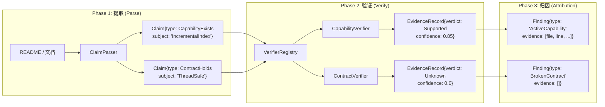

# CodeScope 拆解 (七)：验证管线 — Claim → Evidence → Verdict

> *"The most dangerous assumption in software engineering is that the code matches the docs."*
> 软件工程中最危险的假设，就是认为代码和文档是一致的。

## 问题：代码和文档怎么对得上？

当项目增长到一定规模，代码和文档之间必然产生偏差。README 里说"支持增量索引"，但代码里可能只实现了全量重建。API 文档说"线程安全"，但实现里全是裸锁。

这种偏差不是 bug，而是**漂移（drift）**——代码不断演进，文档被遗忘，最终两者渐行渐远。

传统的解决方案是人工审查，但人类不擅长做这种机械化的比对工作。CodeScope 的验证管线（Verification Pipeline）就是为此设计的：**自动从文档中提取断言，到代码中找证据，最后给出判定。**

## 核心文件

```
engine/src/verify/claim.h               ← Claim/EvidenceRecord 数据结构
engine/src/verify/claim_parser.h         ← 从文档中提取 Claims
engine/src/verify/verifier.h             ← Verifier 基类
engine/src/verify/registry.h             ← VerifierRegistry（调度器）
engine/src/verify/capability_verifier.h  ← 能力验证器
engine/src/verify/contract_verifier.h    ← 合约验证器
engine/src/verify/architecture_verifier.h ← 架构验证器
engine/src/verify/finding.h             ← 旧版 Finding 结构
```

## 管线架构

验证管线分三个阶段：



### Phase 1: ClaimParser

`ClaimParser` 从自由文本中提取结构化断言：

```cpp
// claim_parser.h
class ClaimParser {
public:
    std::vector<Claim> parse(
        const std::string &text,
        const std::string &source_kind,
        const std::string &source_ref
    ) const;
};
```

输入是 README、AI 摘要或 PR 描述，输出是 `Claim` 结构体：

```cpp
// claim.h
struct Claim {
    ClaimType type;        // CapabilityExists / ContractHolds / ArchitectureFollows
    std::string subject;   // 主语，如 "IncrementalIndex"
    std::string predicate; // 谓语，如 "implemented_by"
    std::string object;    // 宾语，如 "Runtime"
    std::string scope;     // "repository" 默认
    std::string source_kind; // "readme" / "ai_summary" / "pr" / "manual"
    std::string source_ref;  // 文件路径，可追溯
};
```

设计原则：**保守提取**。只匹配高置信度模式（如"supports X"、"thread-safe"）。模糊文本不产生 Claim——因为 Unknown 是合法的判定结果，但错误的 Claim 会污染整个验证链。

### Phase 2: VerifierRegistry

`VerifierRegistry` 是一个 Meyers 单例，持有所有注册的 `Verifier` 实例：

```cpp
// registry.h
class VerifierRegistry {
public:
    static VerifierRegistry &instance();

    void register_verifier(std::unique_ptr<Verifier> v);
    void register_default_verifiers(GraphStore *store, uint64_t project_id);
    void clear();
    Verifier *match(const Claim &claim) const;
};
```

核心逻辑在 `match()`：把 Claim 遍历所有注册的验证器，返回第一个 `accepts()` 返回 true 的。

```cpp
// 概念: match 实现
Verifier *VerifierRegistry::match(const Claim &claim) const {
    for (const auto &v : verifiers_) {
        if (v->accepts(claim)) {
            return v.get();
        }
    }
    return nullptr;
}
```

每个验证器声明它能处理的 Claim 类型：

```cpp
// verifier.h
class Verifier {
public:
    virtual std::string name() const = 0;
    virtual bool accepts(const Claim &claim) const = 0;
    virtual EvidenceRecord verify(const Claim &claim) = 0;
};
```

### Phase 3: EvidenceRecord

验证器输出的证据记录：

```cpp
// claim.h
struct EvidenceRecord {
    int64_t claim_id = 0;
    Verdict verdict = Verdict::Unknown;  // Supported / Contradicted / Unknown
    double confidence = 0.0;
    std::string verifier_name;
    std::string detail;
    std::vector<std::pair<int, int64_t>> facts;  // (fact_kind, ref_id)
};
```

`facts` 是证据链，每个 `(fact_kind, ref_id)` 对指向 `graph_nodes`、`graph_edges` 或文档中的具体行。这样，用户不仅能看到"代码与文档不一致"，还能看到"具体是哪个函数、哪一行代码导致了不一致"。

## 验证器实现

### CapabilityVerifier

验证"项目声称的能力是否在代码中实现"。

逻辑：
1. 在 `graph_nodes` 中查找 Claim 的 subject 对应的符号
2. 检查该符号是否有 caller（被调用）
3. 如果有 caller → Supported（能力已实现）
4. 如果无 caller 且是 stub → Contradicted（能力未实现）
5. 其他情况 → Unknown

```cpp
// 概念: CapabilityVerifier::verify() 伪代码
EvidenceRecord CapabilityVerifier::verify(const Claim &claim) {
    auto nodes = store_->findNodesByName(claim.subject);
    if (nodes.empty()) {
        return {.verdict = Unknown, .confidence = 0.0};
    }

    for (auto &node : nodes) {
        auto callers = store_->getCallers(node.id);
        if (!callers.empty()) {
            return {.verdict = Supported, .confidence = 0.85};
        }
    }
    return {.verdict = Contradicted, .confidence = 0.7};
}
```

### ContractVerifier

验证"架构合约是否被遵守"（如"线程安全"）。

逻辑更复杂，需要检查多个维度：
- 共享可变状态是否有锁保护
- 全局变量是否被正确封装
- 标注为 `unsafe` 的代码块是否与合约冲突

### ArchitectureVerifier

验证"实际调用关系是否遵循架构约定"（如"Controller → Service → Repository"）。

从 `graph_edges` 中提取所有调用关系，与架构规范中定义的允许方向做比对。违反方向的关系会被标记为 Contradicted。

## 持久化

验证结果写入 SQLite 的 evidence 和 evidence_fact 表：

```sql
CREATE TABLE IF NOT EXISTS evidence (
    id INTEGER PRIMARY KEY AUTOINCREMENT,
    claim_id INTEGER NOT NULL,
    verdict INTEGER NOT NULL,        -- 0=Supported, 1=Contradicted, 2=Unknown
    confidence REAL NOT NULL,
    verifier_name TEXT NOT NULL,
    detail TEXT DEFAULT '',
    created_at TEXT DEFAULT (datetime('now')),
    FOREIGN KEY (claim_id) REFERENCES claim(id)
);

CREATE TABLE IF NOT EXISTS evidence_fact (
    id INTEGER PRIMARY KEY AUTOINCREMENT,
    evidence_id INTEGER NOT NULL,
    fact_kind INTEGER NOT NULL,      -- 0=node, 1=edge, 2=document
    fact_ref INTEGER NOT NULL,       -- graph_nodes.id / graph_edges.id / document.rowid
    FOREIGN KEY (evidence_id) REFERENCES evidence(id)
);
```

## 一个让我冷汗直流的教训

**多项目场景下的单例生命期问题。**

`VerifierRegistry` 是 Meyer 单例——进程全局唯一。但 `Verifier` 实例在构造时绑定了 `(store, project_id)`。

当用户在 MCP 会话中切换项目时，旧的验证器还在注册表中，新的验证器被追加。结果：

1. 用户切换项目 → 调用 `register_default_verifiers(new_store, new_pid)`
2. 新验证器被追加到列表末尾
3. 旧验证器仍然持有旧项目的 `(store, project_id)` 引用
4. 如果 `match()` 命中旧验证器，它用旧项目的 store 去查新项目的数据——结果不可预测

```cpp
// 问题: 多项目切换时
VerifierRegistry::instance().register_default_verifiers(store1, pid1);
// ... 用户切换项目 ...
VerifierRegistry::instance().register_default_verifiers(store2, pid2);
// 旧的验证器还在！如果 match() 匹配到旧验证器，它用 store1 查 pid2 的数据
```

修复方案：

```cpp
// 切换项目前必须 clear()
VerifierRegistry::instance().clear();
VerifierRegistry::instance().register_default_verifiers(store2, pid2);
```

这个 bug 在注释里写明了，但第一次实现时没人记得调用 `clear()`。结果就是查到的数据牛头不对马嘴。

## 总结

验证管线是 CodeScope 从"代码搜索引擎"走向"代码真相引擎"的关键一步：

- **ClaimParser** 从文档中提取断言，保守但精确
- **VerifierRegistry** 将断言分派给对应的验证器
- **Verifier** 查询知识图谱，收集证据，给出判定
- **EvidenceRecord** 包含完整的证据链，可追溯回源码

下一篇文章，我将拆解**漂移检测**——如何用 DocumentationDrift、CapabilityDrift 和 ArchitectureDrift 三个维度，自动发现代码与文档之间的偏差。