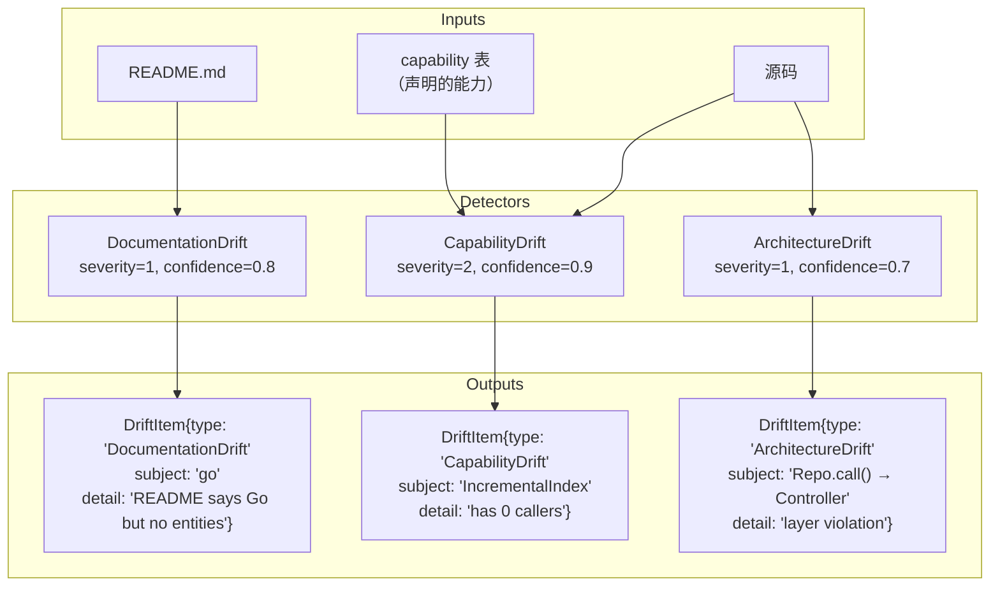
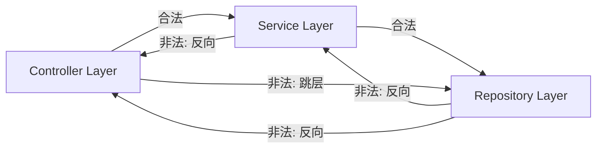
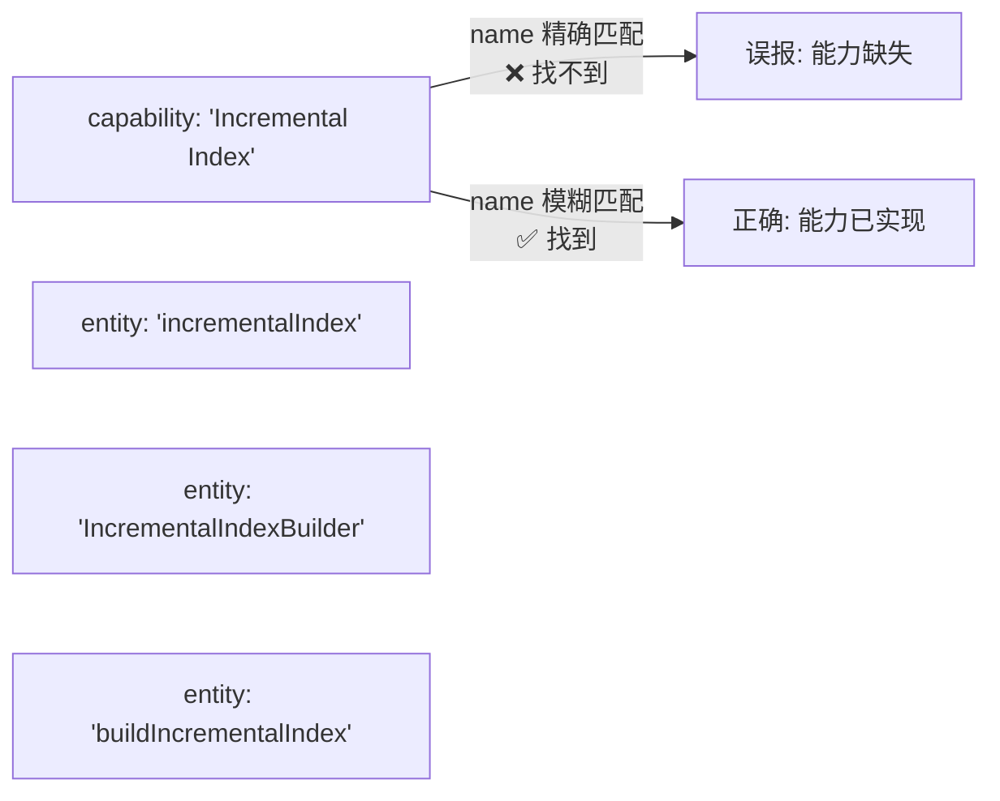
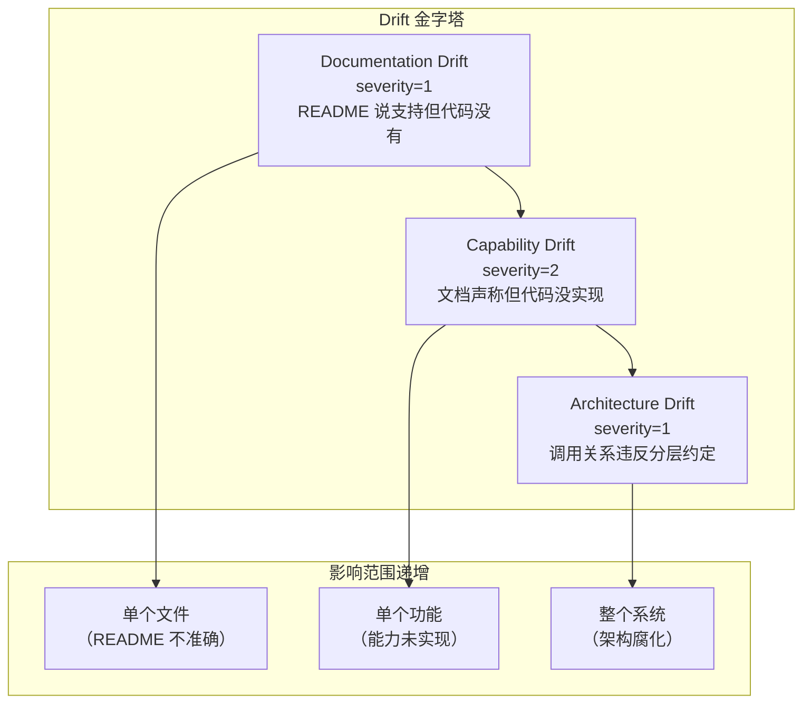

# CodeScope 拆解 (八)：漂移检测 — 文档、能力、架构的三位一体

> *"Documentation is a love letter to your future self. Drift is the heartbreak when you realize it was never updated."*
> 文档是写给未来自己的情书。漂移是当你发现它从未被更新时的心碎。

## 问题：文档什么时候开始偏离代码？

在上一篇文章中，我拆解了验证管线——ClaimParser 从文档中提取断言，Verifier 到代码中找证据，最后给出 Supported / Contradicted / Unknown 的判定。

但验证管线有一个前提：**有人先提供 Claim**。要么是用户手动输入，要么是 AI 自动提取。

漂移检测（Drift Detection）是验证管线的"自驱模式"——不需要用户输入，自动扫描三个维度，主动发现代码与文档之间的偏差：

1. **文档漂移（Documentation Drift）**：README 里说支持 C++，但代码里找不到 C++ 实体
2. **能力漂移（Capability Drift）**：文档声称"支持增量索引"，但实现函数没有调用者
3. **架构漂移（Architecture Drift）**：实际的调用关系违反了 Controller → Service → Repository 的分层约定

## 核心文件

```
engine/src/verify/documentation_drift.h    ← 文档漂移检测
engine/src/verify/documentation_drift.cpp  ← 实现
engine/src/verify/capability_drift.h       ← 能力漂移检测
engine/src/verify/capability_drift.cpp     ← 实现
engine/src/verify/architecture_drift.h     ← 架构漂移检测
engine/src/verify/architecture_drift.cpp   ← 实现
engine/src/verify/finding.h               ← DriftItem 数据结构
```

## 三位一体



### 1. Documentation Drift（severity=1, confidence=0.8）

最直观的漂移检测：**README 里声称支持的语言，代码里有没有实现？**

```cpp
// documentation_drift.h
struct DriftItem {
    std::string type;      // "DocumentationDrift"
    int severity;          // 1 = warning
    std::string subject;   // 缺失的语言名称
    std::string detail;    // 人类可读的描述
};

struct LanguageClaim {
    std::string canonical; // "cpp", "rust", "go", ...
    std::string display;   // "C++", "Rust", "Go", ...
    size_t mention_count;  // 在 README 中出现的次数
};
```

检测流程：

1. 从 `document` 表中读取项目 README 内容
2. `extractLanguageClaims()` 用正则扫描 README，提取语言名（C++、Python、Go、Rust、JavaScript、TypeScript、Java）
3. `countEntitiesByLanguage()` 查询 `entity` 表，统计每种语言的实际实体数
4. 如果 README 声称支持某语言，但 `entity` 表中该语言的实体数为 0 → 报告 Drift

```cpp
// 概念: detectDocumentationDrift 伪代码
std::vector<DriftItem> detectDocumentationDrift(store &store, uint64_t pid) {
    auto readme = store.getReadme(pid);
    auto claims = extractLanguageClaims(readme);
    std::vector<DriftItem> items;

    for (const auto &claim : claims) {
        int64_t count = countEntitiesByLanguage(store, pid, claim.canonical);
        if (count == 0) {
            items.push_back({
                .type = "DocumentationDrift",
                .severity = kDriftSeverityDoc,    // 1
                .subject = claim.display,
                .detail = "README claims " + claim.display +
                          " but no entities found",
            });
        }
    }
    return items;
}
```

**为什么 severity 只有 1？** 因为 README 可能是在描述外部依赖，而不是项目自身的实现语言。比如"CodeScope 支持 C++ 项目"可能意味着用户可以用 CodeScope 分析 C++ 项目，而不是项目本身用 C++ 写。

### 2. Capability Drift（severity=2, confidence=0.9）

这是最严重的漂移类型：**文档声称的功能，代码中没有实现。**

```cpp
// capability_drift.h
inline constexpr int kDriftSeverityCapability = 2;     // error
inline constexpr double kDriftConfidenceCapability = 0.9;
```

检测流程：

1. 从 `capability` 表读取项目声称的能力列表
2. 对每个能力，在 `entity` 表中查找匹配名称的实体
3. 对匹配的实体，检查是否有 caller（被调用者）
4. 如果实体没有 caller → 该能力已经"死亡"——代码存在但未被使用
5. 如果实体不存在 → 能力完全缺失

```cpp
// 概念: detectCapabilityDrift 伪代码
std::vector<DriftItem> detectCapabilityDrift(store &store, uint64_t pid) {
    auto capabilities = store.getCapabilities(pid);
    std::vector<DriftItem> items;

    for (const auto &cap : capabilities) {
        int64_t count = countImplementingEntities(store, pid, cap.name);
        if (count == 0) {
            items.push_back({
                .type = "CapabilityDrift",
                .severity = kDriftSeverityCapability,  // 2
                .subject = cap.name,
                .detail = "Declared capability '" + cap.name +
                          "' has 0 implementing entities with callers",
            });
        }
    }
    return items;
}
```

**为什么 confidence 高达 0.9？** 因为这个检测是确定性的——`capability` 表中的行要么有对应的实现实体，要么没有。不存在模糊空间。

### 3. Architecture Drift（severity=1, confidence=0.7）

最复杂的漂移检测：**实际调用关系是否违反了架构分层约定。**

```cpp
// architecture_drift.h
inline constexpr const char *kLayerController = "Controller";
inline constexpr const char *kLayerService = "Service";
inline constexpr const char *kLayerRepository = "Repository";
```

检测流程：

1. `classifyEntityLayer()` 根据实体名称和文件路径，将其分类到 Controller / Service / Repository 层

```cpp
// 概念: classifyEntityLayer 伪代码
std::string classifyEntityLayer(const std::string &name,
                                const std::string &file_path) {
    if (name.ends_with("Controller") ||
        file_path.contains("/controllers/")) {
        return "Controller";
    }
    if (name.ends_with("Service") ||
        file_path.contains("/services/")) {
        return "Service";
    }
    if (name.ends_with("Repository") ||
        file_path.contains("/repositories/")) {
        return "Repository";
    }
    return "";  // Unknown
}
```

2. 读取 `relation` 表，提取所有调用边（type=1）
3. 对每条调用边，检查源层和目标层的流向是否合法

合法流向：**Controller → Service → Repository**



**为什么 confidence 只有 0.7？** 因为分层分类是基于命名约定和文件路径的启发式方法。不是所有项目都遵循 Controller/Service/Repository 的命名规范。False positive 是预期内的。

## 调度器集成

漂移检测不是一次性运行的。CodeScope 的调度器在索引完成后自动调度所有三个检测器：

```cpp
// 概念: 漂移检测调度
schedule_drift_detection(project_id) {
    // 并行执行三个检测器
    auto doc_drifts = detectDocumentationDrift(store, project_id);
    auto cap_drifts = detectCapabilityDrift(store, project_id);
    auto arch_drifts = detectArchitectureDrift(store, project_id);

    // 合并结果
    auto all_drifts = concat(doc_drifts, cap_drifts, arch_drifts);

    // 写入 finding 表
    for (auto &drift : all_drifts) {
        store.insertFinding(project_id, drift);
    }
}
```

## 一个让我冷汗直流的教训

**Capability Drift 的误报问题。**

最初的 Capability Drift 检测逻辑很简单：如果 `capability.name` 在 `entity.name` 中找不到，就报告漂移。

但实际项目中，能力和实现实体之间存在**命名差异**。比如能力表中声明的是"Incremental Index"，而实现实体叫"incrementalIndex"或"incremental_index"。



修复方案：**从精确匹配改为包含匹配**。`countImplementingEntities()` 改为 `LIKE '%cap_name%'` 的模糊查询，并去掉下划线和空格后再对比。

这个 bug 暴露了一个更深层次的问题：**能力名和实体名之间的映射不是 1:1 的。** 一个能力可能由多个实体共同实现，一个实体也可能实现多个能力。完美的映射需要语义理解，模糊匹配是务实但不够完美的折中。

## 三者的关系



- **Documentation Drift** 是表层问题，影响单个文件
- **Capability Drift** 是功能问题，影响单个能力
- **Architecture Drift** 是结构问题，影响整个系统

三者又是递进关系：文档不准确 → 能力声明不可信 → 架构约定被忽视。

## 总结

漂移检测是 CodeScope 区别于传统代码搜索工具的核心能力：

- **Documentation Drift**：README 语义 vs 代码实体，severity=1，confidence=0.8
- **Capability Drift**：声明能力 vs 实现代码，severity=2，confidence=0.9
- **Architecture Drift**：分层约定 vs 实际调用，severity=1，confidence=0.7

三个检测器覆盖了从文档到代码、从功能到架构的所有层面。它们不依赖用户输入，索引完成后自动运行，持续追踪代码库的健康状态。

---

## 后记

至此，CodeScope 拆解系列八篇文章全部完成：

| # | 文章 | 核心模块 |
|---|------|----------|
| 1 | 双语言架构 | Rust MCP Server + C++ Engine FFI |
| 2 | Worker 子进程隔离 | fork+exec + DB 合并 |
| 3 | 并行调度器 | 三种调度模式 |
| 4 | 两阶段索引 | Fast Scan + Background Enhance |
| 5 | tree-sitter 解析器与统一 IR | 8 种语言，一个模型 |
| 6 | SQLite 图谱存储 | Schema + FTS + 批处理 |
| 7 | 验证管线 | Claim → Evidence → Verdict |
| 8 | 漂移检测 | 文档、能力、架构三位一体 |

CodeScope 从"代码搜索引擎"到"项目真相引擎"的演进，核心在于它不再只是**索引代码**，而是**理解代码**——从符号级别到语义级别，从静态分析到验证推理。每一步都面临了工程上的取舍和妥协，这些取舍和妥协正是这个系列试图记录的内容。