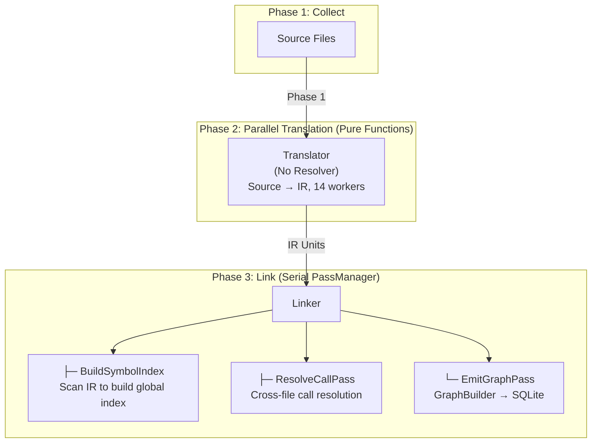

# CodeScope Architecture

**Version**: 0.2.0  
**Last updated**: 2026-07-05

---

## 1. System Overview

CodeScope is an MCP (Model Context Protocol) based code understanding service. It parses source code through a multi-stage pipeline, builds call graphs and symbol dependency graphs, persists them to SQLite, and exposes query capabilities through MCP tools.

### Four-Phase Pipeline



---

## 2. Components

### 2.1 Rust MCP Server

| Module | Responsibility |
|--------|----------------|
| `mcp/` | JSON-RPC 2.0 protocol + stdio transport |
| `ffi/` | C++ FFI bridge |
| `tools/` | 16 MCP tools registration and routing |

### 2.2 C++ Engine Split

`engine.cpp` has been split into 6 independent files:

| File | Lines | Responsibility |
|------|:-----:|----------------|
| `engine.cpp` | 49 | Entry + global variables |
| `engine_helpers.cpp` | 112 | readFile, detectLanguage, dupString |
| `engine_lifecycle.cpp` | 119 | init, shutdown, create_project |
| `engine_index.cpp` | 525 | index_file, index_project |
| `engine_scanner.cpp` | 1,180 | Fast scanner |
| `engine_queries.cpp` | 1,019 | Query/enhance/call chain/context |
| `engine_ffi.cpp` | 622 | Definition/reference/neighbor/DSL/complexity |

### 2.3 Linker Module (New)

The Linker runs a serial Pass pipeline, where all Passes share a complete `ProjectSymbolIndex`:

| Pass | Responsibility |
|------|----------------|
| `BuildSymbolIndexPass` | Build index by scanning all_nodes from all IR once (milliseconds) |
| `ResolveCallPass` | Query global index for each CallExpr, prioritize `.c`/`.cpp` definitions |
| `EmitGraphPass` | GraphBuilder → persist to SQLite |

---

## 3. Performance Benchmarks

### Full Parse

| Project | Files | Nodes | Functions | CALLS | ★Cross-file | Time |
|---------|:-----:|:-----:|:---------:|:-----:|:-----------:|:----:|
| CodeScope | 47 | 12K | 3.8K | 23K | 23 | 3s |
| goagent | 2,651 | 155K | 49K | 56K | 49K | 30s |
| **Linux Kernel** | **64,694** | **12M** | **3.8M** | **3.7M** | **1.5M** | **3min 07s** |

### Cross-File Resolution Capability

Cross-file resolution ratio varies by language:

| Project | Cross-file Ratio | Notes |
|---------|:----------------:|-------|
| CodeScope (C++) | ~0.1% | Most calls via `g_store->method()` pointer style |
| goagent (Go) | **86%** | Go naturally supports cross-package calls |
| Linux Kernel (C) | **40%** | Header declarations + `.c` implementations |

### Installation

```bash
bash install.sh
```

One-click installation of tree-sitter grammars, sqlite-vec, compilation engine + server.

---

## 4. Build

```bash
make build      # Compile engine + server
make test       # Run all tests (17 tests)
make clean      # Clean
```

### Dependencies

- **Compiler**: C++23, Clang 17+
- **Runtime**: tree-sitter (`.so`), sqlite-vec (`vec0.dylib`)
- **Build**: cmake 3.30+, Rust 2024, npm

---

## 5. License

Apache 2.0