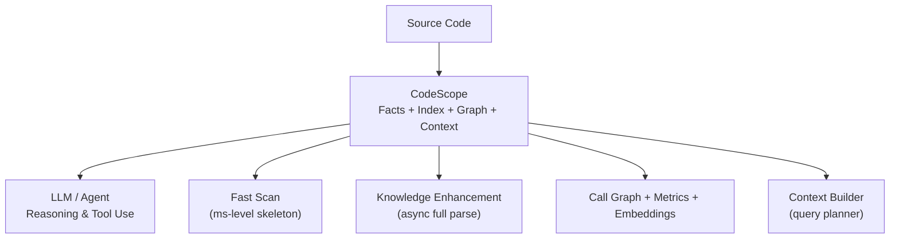
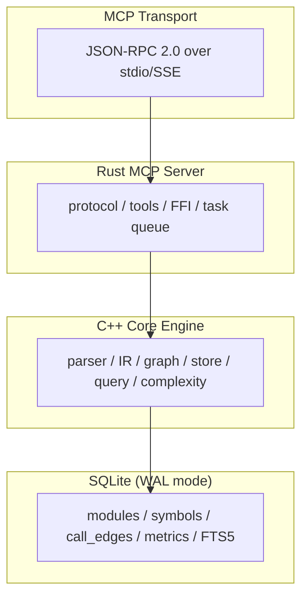
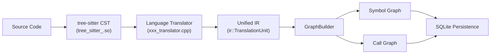

# CodeScope Architecture

**Version**: 0.2.0  
**Last updated**: 2026-07-04

---

## 1. System Overview

CodeScope is an MCP (Model Context Protocol) code understanding service that acts as a **Project Knowledge Layer** for AI. Instead of reading raw source files, AI queries CodeScope's structured knowledge base — facts, indexes, graphs, and context — to understand code structure, behavior, and relationships.



---

## 2. Architecture Layers



### 2.1 Rust MCP Server

The Rust server handles MCP protocol negotiation, tool registration, and FFI bridge to the C++ engine.

**Key modules:**

| Module | File | Responsibility |
|--------|------|---------------|
| `mcp/protocol` | `protocol.rs` | JSON-RPC 2.0 types, MCP tool definitions |
| `mcp/server` | `server.rs` | Request dispatch, tool routing |
| `mcp/transport` | `transport.rs` | stdin/stdout MCP transport |
| `ffi` | `mod.rs` | C FFI bindings to C++ engine + Tokio background tasks |
| `tools` | `mod.rs` | MCP tool listing and execution |

**Tool dispatch flow:**

```
LLM → tools/call → server.rs:handle_call_tool()
    → tools::execute(project_id, name, args)
    → ffi::scan_project() / ffi::find_symbol() / ...
    → unsafe extern "C" → C++ engine
```

### 2.2 C++ Core Engine

The C++ engine is the computation core — parsing, indexing, graph building, and querying.

**Key modules:**

| Module | Directory | Responsibility |
|--------|-----------|---------------|
| Parser | `parser/` | tree-sitter grammar loading and CST parsing |
| IR | `ir/` | Unified AST IR + translator framework |
| Graph | `graph/` | Call graph and symbol dependency graph builder |
| Store | `store/` | SQLite persistence layer (schema + CRUD) |
| Query | `query/` | Graph query engine, vector search, impact analysis |

**Translation pipeline:**



---

## 3. Two-Phase Design

### Phase A: Skeleton Index (ms-level)

```
scan_project("/project/foo")
    ↓
Walk directory tree
    ↓
Load .gitignore patterns
    ↓
For each source file:
    detectLanguage() → extension to language
    detectDecl()     → line-by-line declaration detection
    extractName()    → symbol name extraction
    ↓
Write to:
    modules table
    symbols table     (with analysis_state = SCANNED)
    entry_points table
    symbol_status table (is_stub, ready flags = 0)
    ↓
✓ AI ready in milliseconds
```

**Accuracy by language (strict mode):**

| Language | Precision | Recall |
|----------|-----------|--------|
| Go | ~97% | ~96% |
| Python | ~98% | ~95% |
| C/C++ (strict) | ~85% | ~90% |
| Rust | ~90% | ~90% |

### Phase B: Knowledge Enhancement (async)

```
enhance_project (background Tokio task)
    ↓
For each unenhanced file:
    tree-sitter full parse
    ↓
Build call graph → call_edges table
    ↓
Compute complexity → metrics table
    ↓
Generate embeddings → search_index + embeddings
    ↓
Set analysis_state flags: CALLGRAPH | METRICS | EMBEDDING
```

**Performance benchmarks:**

| Project | Fast Scan | Enhancement | Symbols | Call Edges |
|---------|-----------|-------------|---------|------------|
| CodeScope (self) | 32 ms | — | 2,902 | — |
| SQLite | 89 ms | — | 6,921 | — |
| Linux kernel/sched | 45 ms | 291 ms | 4,913 | 4,800 |
| Linux kernel/ (core) | 360 ms | 27 s | 40,335 | 45,573 |
| Linux fs/ | 1.8 s | — | 120,602 | — |
| goagent | 300 ms | — | 13,852 | — |

**Average throughput: ~100,000 symbols/second**

---

## 4. Database Schema

11 tables in a single SQLite file (WAL mode).

### Fact Tables (written in Phase A)

| Table | Description | Key Fields |
|-------|-------------|------------|
| `modules` | Directory module tree | `id`, `parent_id`, `name`, `path`, `file_count` |
| `symbols` | Symbol declarations | `id`, `project_id`, `module_id`, `kind`, `name`, `signature`, `language`, `file_path`, `line`, `column` |
| `entry_points` | Entry point symbols | `symbol_id`, `project_id`, `kind` (main/probe/initcall) |
| `call_edges` | Function call edges | `caller_symbol_id`, `callee_symbol_id`, `line`, `col` |
| `dependency_edges` | Module dependencies | `source_module_id`, `target_module_id`, `external_name`, `kind` |

### Status & Index Tables (written in Phase B)

| Table | Description | Key Fields |
|-------|-------------|------------|
| `symbol_status` | Analysis progress per symbol | `callgraph_ready`, `metrics_ready`, `embedding_ready`, `is_stub` |
| `metrics` | Complexity metrics | `owner_type`, `owner_id`, `cyclomatic`, `cognitive`, `lines` |
| `search_index` | FTS5 full-text index | `title`, `summary`, `body` |
| `embeddings` | vec0 vector embeddings | `symbol_id`, `vector[384]` |
| `index_tasks` | Background task tracking | `task_type`, `status`, `progress`, `error` |
| `file_scan_state` | File modification tracking | `file_mtime`, `file_size` |

### Trigger

```sql
CREATE TRIGGER trg_symbols_delete AFTER DELETE ON symbols
    DELETE FROM search_index WHERE symbol_id = old.id;
```

---

## 5. MCP Tools

16 tools total, organized by capability:

### Skeleton Scan (Phase A)

| Tool | Description |
|------|-------------|
| `codescope_scan` / `scan_project` | Fast scan project directory (ms-level) |
| `codescope_find_symbol` / `find_symbol` | Find symbol by exact name |
| `codescope_module_tree` / `get_module_tree` | Get hierarchical module tree |
| `codescope_get_entry_points` / `get_entry_points` | Get entry points (main/probe/initcall) |

### Knowledge Enhancement (Phase B)

| Tool | Description |
|------|-------------|
| `codescope_enhance` / `enhance_project` | Run full background enhancement |
| `get_enhancement_status` | Check enhancement progress |

### Search & Call Graph

| Tool | Description |
|------|-------------|
| `codescope_search` / `search` | Unified FTS / semantic adaptive search |
| `codescope_get_callers` / `find_callers` | Find callers (adaptive to callgraph ready) |
| `codescope_get_callees` / `find_callees` | Find callees (adaptive to callgraph ready) |
| `codescope_trace` | **BFS shortest call path between two functions** |

### Project Analysis

| Tool | Description |
|------|-------------|
| `codescope_overview` / `project_overview` | Comprehensive project overview |
| `codescope_build_context` | **Primary tool**: intelligent context assembly |
| `codescope_capabilities` | Standardized capability report |

### Legacy (deprecated, retained for compatibility)

`find_definition`, `get_callers`, `get_callees`, `search_code`, etc.

---

## 6. Multi-Language Support

8 languages supported through a **3-layer architecture**:

```
Layer 1: Fast Scanner — line-by-line pattern matching
    detectLanguage() — extension → language
    detectDecl()     — language-aware keyword matching
    extractName()    — language-aware name extraction

Layer 2: Parser — tree-sitter grammar loading
    registerLanguage(name, so_path) → dlopen + dlsym
    parse() → CST

Layer 3: IR Translator — CST → Unified IR
    createTranslator(language) → Translator subclass
    translate() → ir::TranslationUnit
```

**Currently supported:**

| Language | Grammar .so | Translator | Fast Scan |
|----------|-------------|------------|-----------|
| Python | tree-sitter-python.so | python_translator.cpp | ✅ |
| C | tree-sitter-c.so | c_translator.cpp | ✅ |
| C++ | tree-sitter-cpp.so | cpp_translator.cpp | ✅ |
| Go | tree-sitter-go.so | go_translator.cpp | ✅ |
| Rust | tree-sitter-rust.so | rust_translator.cpp | ✅ |
| JavaScript | tree-sitter-javascript.so | javascript_translator.cpp | ✅ |
| TypeScript | tree-sitter-typescript.so | typescript_translator.cpp | ✅ |
| Java | tree-sitter-java.so | java_translator.cpp | ✅ |
| **Swift** | **tree-sitter-swift.so** | **—** | **✅ (Fast Scan)** |

### Swift Compiler Analysis

| Metric | Value |
|--------|-------|
| Directory | `include/swift` (C++ headers) |
| Scan time | **421 ms** |
| Symbols | **25,860** |
| Modules | 59 |
| Language | c (Swift compiler is C++-implemented) |
| Full scan (22,272 files) | **Estimated 20-35 s** (Fast Scan) |
| Full enhancement | **Estimated 5-15 min** |
| Log | `runtimelog/scan_swift.log` (18 KB) |

### Swift-C Interop (5 Layers)

```
1. @_silgen_name     — Direct C symbol binding (Attr.h:691)
2. @_cdecl           — Export Swift fn as C ABI (Attr.h:748)
3. @convention(c)    — C function pointer type (FrontendOptions.h:358)
4. UnsafePointer     — Manual memory management (StandardTypesMangling.def:44)
5. AutoreleasingUnsafeMutablePointer — ObjC bridge (StandardTypesMangling.def:31)
```

### Linux Kernel Scheduler

```
Fast Scan:    kernel/sched/ — 45 ms, 4,913 symbols
Enhancement:  kernel/sched/ — 291 ms, 4,800 call edges
Full kernel:  kernel/      — 360 ms, 40,335 symbols
```

**Parent-child resource handling (COW):**
```
copy_process(kernel/fork.c:1994)
  → copy_mm(kernel/fork.c:1568)
    → dup_mm(kernel/fork.c:1527)
```

**Preemption prevention:**
```
preempt_count() — per-task counter; >0 disables preemption
__schedule()    — only switches when preempt_count == 0
```

### USB Driver Subsystem

```
Fast Scan:    drivers/usb/ — 351 ms, 37,286 symbols
Modules:      40 subdirectories (host, gadget, serial, storage, typec, ...)
Entry point:  usb_register_driver()
```

### SQLite Library

```
Fast Scan:    141 source files — 89 ms, 6,921 symbols
```

---

## 8. Build System

### C++ Engine

```bash
cd engine/build
cmake .. -DBUILD_TESTS=ON
make -j$(sysctl -n hw.ncpu)
```

**Compiler:** C++23, Clang 17+  
**Dependencies:** sqlite3, tree-sitter, dl  
**Build cache:** ccache (auto-detected)

### Rust Server

```bash
cd server
cargo build --release
```

**Edition:** 2024  
**Key dependencies:** serde, serde_json, tokio, once_cell

### Grammars

```bash
cd grammars && bash build.sh
```

Uses npm-installed tree-sitter packages, compiled to .so with gcc.

---

## 9. License

Apache 2.0
