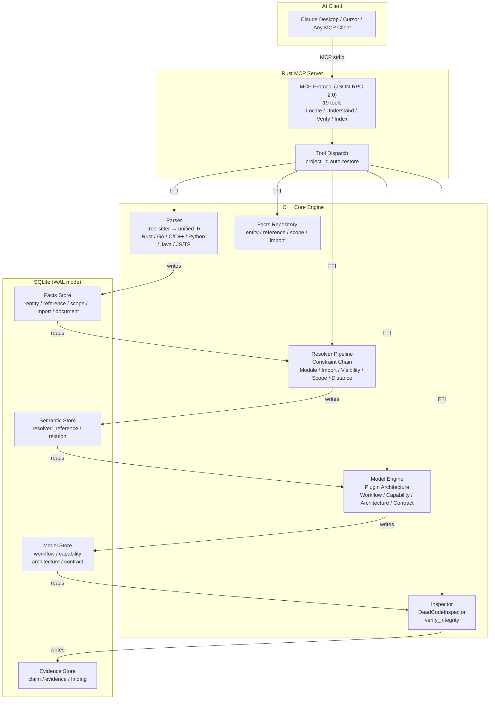
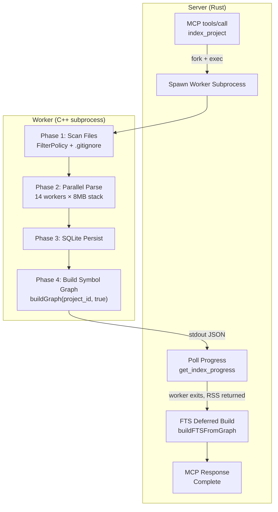
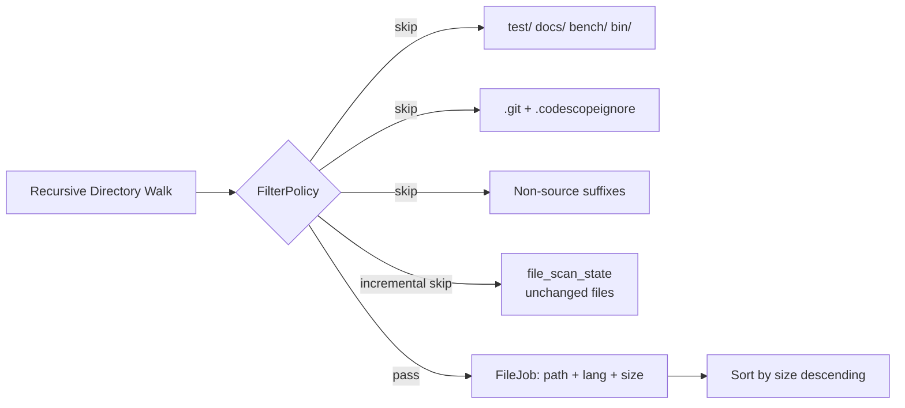
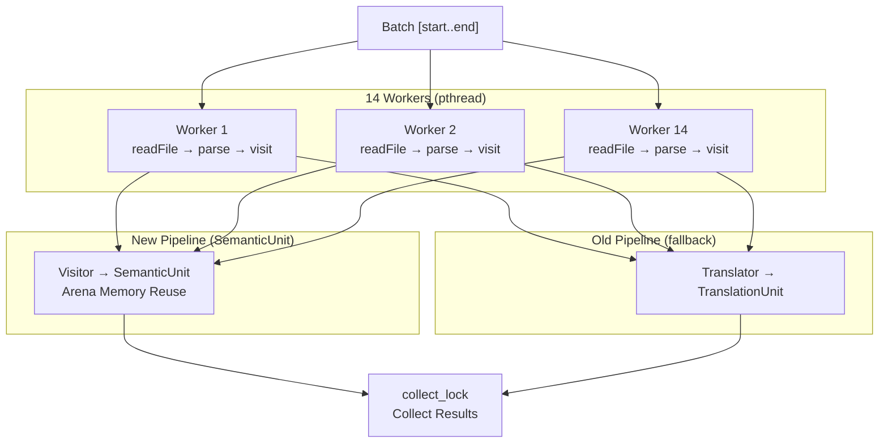
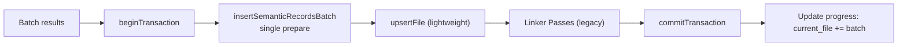
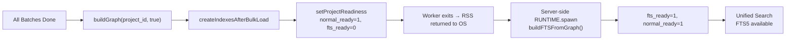
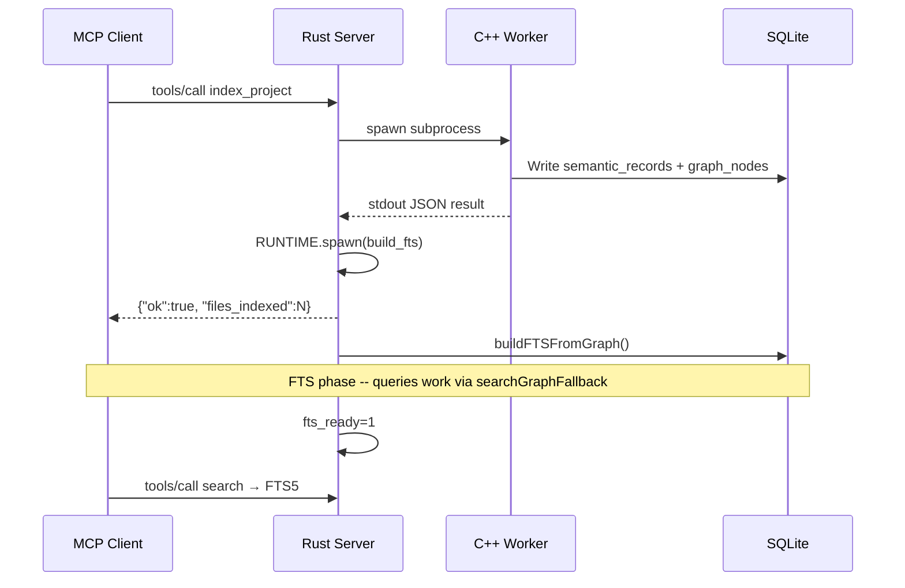
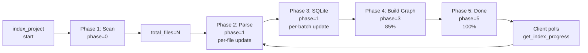

# CodeScope Architecture

**Version**: 0.4.0  
**Date**: 2026-07-12

---

## 1. System Overview

CodeScope is a **Project Truth Engine**. It transforms source code into verifiable facts, understandable models, and inspectable evidence — enabling AI to validate claims against reality instead of hallucinating.

### Architecture



### Pipeline

```
Source Code
    │
    ▼
Parser ──────────── entity / reference / scope / import
    │
    ▼
Resolver ────────── resolved_reference / relation
    │
    ▼
Model Engine ────── workflow / capability / architecture / contract
    │
    ▼
Inspector ───────── evidence / finding
    │
    ▼
MCP Tools ───────── AI response
```
    Client["MCP Client<br/>(AtomGit IDE / CLI)<br/>tools/list → tools/call"]

    subgraph ServerProcess["CodeScope Server (Rust Process)"]
        MCPServer["MCP Server<br/>(JSON-RPC 2.0 + stdio)"]
        FFIBridge["FFI Bridge<br/>(Rust ↔ C++)"]
        TokioRT["Tokio Runtime<br/>(Background Tasks)"]
    end

    subgraph WorkerProcess["Worker Subprocess (C++ Process)"]
        WorkerMain["Worker Main<br/>index_project()"]
        Parser["Parser + Translator<br/>(14 threads)"]
        GraphBuilder["GraphBuilder<br/>(Symbol + Call Graph)"]
        Store["Store Layer<br/>(SQLite Writer)"]
        Progress["IndexProgress<br/>(Progress Tracker)"]
    end

    Database["SQLite DB<br/>(.codescope/codescope.db)"]

    Client -->|"MCP JSON-RPC"| MCPServer
    MCPServer -->|"spawn subprocess"| WorkerMain
    WorkerMain -->|"parse files"| Parser
    Parser -->|"build graph"| GraphBuilder
    GraphBuilder -->|"persist"| Store
    Store -->|"write"| Database
    WorkerMain -->|"update"| Progress

    MCPServer -->|"poll progress"| FFIBridge
    FFIBridge -->|"read"| Progress
    FFIBridge -->|"return status"| MCPServer

    MCPServer -->|"spawn async task"| TokioRT
    TokioRT -->|"FTS enhancement"| Database

    MCPServer -->|"MCP Response"| Client
```

---

## 2. Index Pipeline

### 2.1 Full Index Flow



### 2.2 Phase 1: File Discovery



### 2.3 Phase 2: Parallel Parse



### 2.4 Phase 3: SQLite Persistence



### 2.5 Phase 4: Post-processing



---

## 3. Components

### 3.1 Rust MCP Server

| Module | Responsibility |
|--------|---------------|
| `mcp/` | JSON-RPC 2.0 protocol + stdio transport |
| `ffi/` | C++ FFI bridge + Tokio RUNTIME |
| `tools/` | MCP tool registration and routing |
| `main.rs` | Entry point: server / CLI / worker modes |

### 3.2 C++ Engine

| File | Lines | Responsibility |
|------|:-----:|---------------|
| `engine.cpp` | 49 | Entry + globals |
| `engine_helpers.cpp` | 112 | readFile, detectLanguage, dupString |
| `engine_lifecycle.cpp` | 119 | init, shutdown, create_project |
| `engine_index.cpp` | ~945 | index_file, index_project (with progress tracking) |
| `engine_scanner.cpp` | 1,180 | Fast scanner |
| `engine_queries.cpp` | 1,019 | Queries/enhancement/call chains/context + FTS fallback |
| `engine_ffi.cpp` | ~660 | FFI functions + build_fts + get_index_progress |
| `filter_policy.cpp` | — | Dir/file/suffix filtering + .gitignore matching |
| `store/store.cpp` | ~3,060 | SQLite storage + FTS + progress + incremental indexing |

### 3.3 Deferred FTS Build



---

## 4. Query Performance

| Query | Avg Latency | Notes |
|-------|:-----------:|-------|
| `get_graph_stats` | **<1 ms** | Pure SQL COUNT |
| `get_hotspots` | ❌ Not implemented — no MCP tool | — |
| `find_callers` / `find_callees` | **<1 ms** | Index-covered JOIN |
| `search` (FTS) | **<5 ms** | FTS5 full-text search |
| `search` (graph fallback) | **<10 ms** | LIKE fallback search |
| `get_module_tree` | **<1 ms** | Lightweight query |
| `get_entry_points` | **<1 ms** | Indexed lookup |
| `get_communities` | ❌ Engine impl exists, no MCP tool — use `connected_components` instead | — |
| `get_index_progress` | **<1 ms** | Atomic global read |

---

## 5. Index Progress Tracking



| Field | Description |
|-------|-------------|
| `project_id` | Project identifier |
| `total_files` | Total file count |
| `current_file` | Files processed so far |
| `phase` | 0=scanning 1=parsing 2=linking 3=graph building 4=FTS building 5=done |
| `percent` | 0-100 percentage |
| `current_file_path` | Current file being processed |
| `error` | Error message (if any) |

---

## 6. Build

```bash
make build      # Build engine + server
make test       # Run all tests
make clean      # Clean build artifacts
```

### Dependencies

- **Compiler**: C++23, Clang 17+
- **Runtime**: tree-sitter (`.so`), sqlite-vec (`vec0.dylib`)
- **Build tooling**: cmake 3.30+, Rust 2024, npm

---

## 7. License

Apache 2.0
