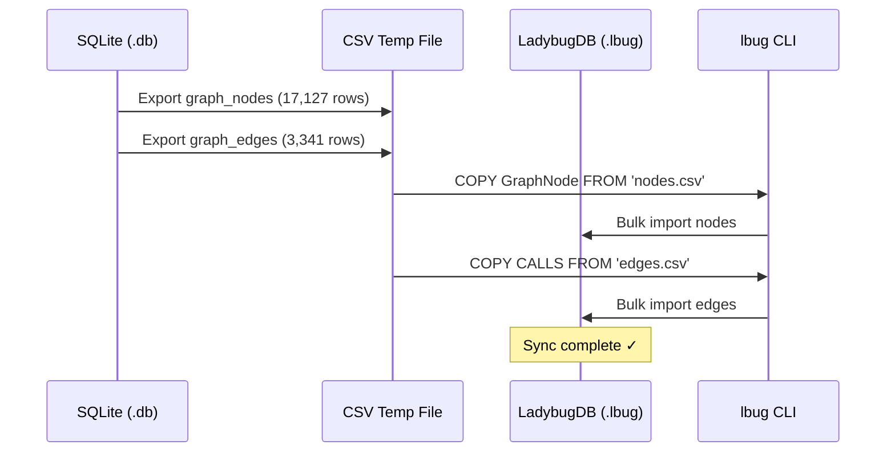
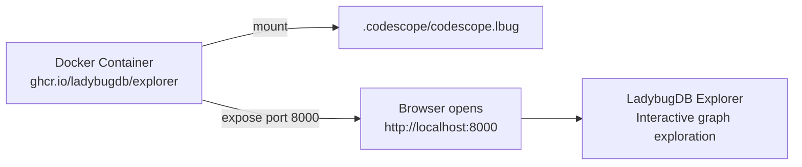
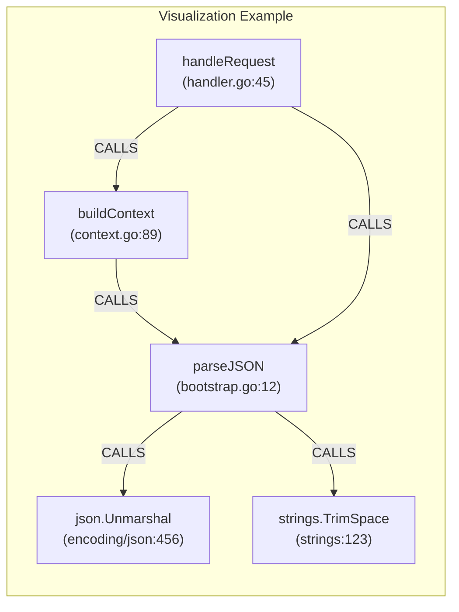
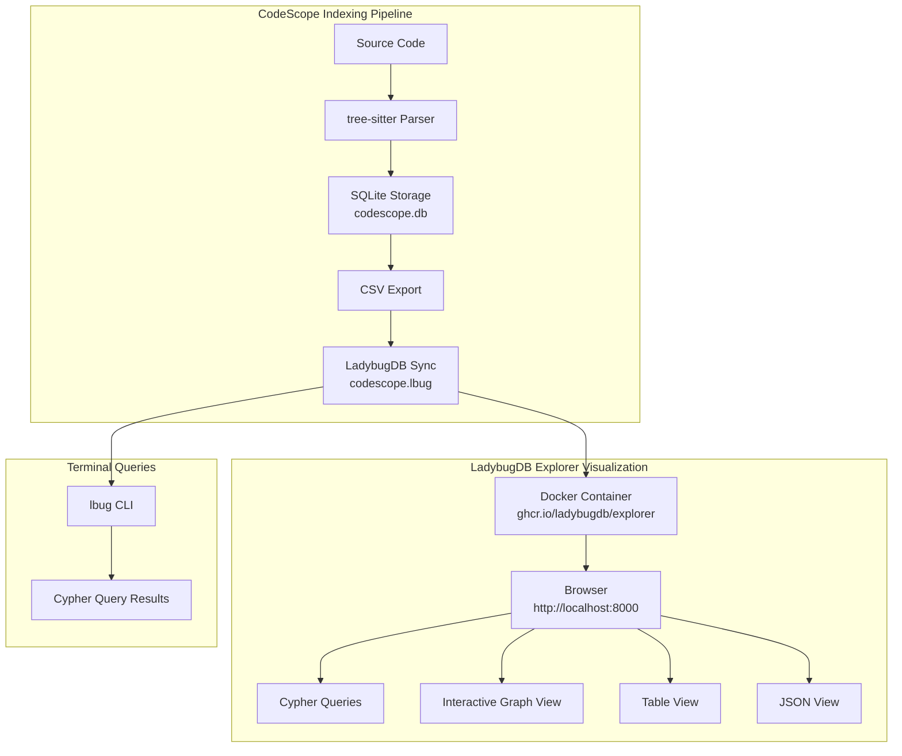

# LadybugDB Explorer with CodeScope

> **Last Updated**: 2026-07-15

This guide explains how to use [LadybugDB Explorer](https://docs.ladybugdb.com/visualization/lbug-explorer/) to visually explore CodeScope's code graph data.

---

## Prerequisites

- **Docker**: LadybugDB Explorer runs as a Docker container. [Install Docker](https://docs.docker.com/get-docker/) if you don't have it.
- **CodeScope data**: A project must be indexed first (via `codescope index_project`). This creates the `.codescope/codescope.lbug` file.

---

## Quick Start

### Step 1: Verify the LadybugDB file exists

```bash
ls -la .codescope/codescope.lbug
```

If the file doesn't exist or is 0 bytes, re-index the project:

```bash
codescope index_project
```

### Step 2: Sync data from SQLite to LadybugDB

If the `.lbug` file is empty, run the sync:



```bash
# Export nodes from SQLite
sqlite3 .codescope/codescope.db -csv -noheader \
  "SELECT id, project_id, ir_node_id, node_type, name, qualified_name, \
          signature, module_path, file_path, language, \
          start_row, start_col, end_row, end_col, \
          parent_id, is_entry_point, embedding_ready, metrics_ready \
   FROM graph_nodes WHERE project_id = 1;" \
  > /tmp/nodes.csv

# Export edges from SQLite
sqlite3 .codescope/codescope.db -csv -noheader \
  "SELECT source_node_id, target_node_id, 1, edge_type, call_site_line, label \
   FROM graph_edges WHERE project_id = 1;" \
  > /tmp/edges.csv

# Import into LadybugDB using the CLI
cat > /tmp/sync_lbug.cql << 'SCRIPT'
COPY GraphNode FROM '/tmp/nodes.csv' (header=false);
COPY CALLS FROM '/tmp/edges.csv' (header=false);
SCRIPT

lbug .codescope/codescope.lbug -i /tmp/sync_lbug.cql
```

### Step 3: Launch LadybugDB Explorer

```bash
docker run -p 8000:8000 \
  -v "$(pwd)/.codescope:/database" \
  -e LBUG_FILE=codescope.lbug \
  --rm ghcr.io/ladybugdb/explorer:latest
```

### Step 4: Open in browser

Go to [http://localhost:8000](http://localhost:8000)



---

## Usage Examples

### 1. Explore all symbols

In the Query panel, run:

```cypher
MATCH (n:GraphNode) RETURN n.name, n.language, n.file_path LIMIT 50;
```

Click **Graph** view to see the nodes as an interactive graph.

### 2. Find all Go functions

```cypher
MATCH (n:GraphNode)
WHERE n.language = 'go'
RETURN n.name, n.file_path, n.start_row
ORDER BY n.name;
```

### 3. Visualize call relationships

```cypher
MATCH (n:GraphNode)-[c:CALLS]->(m:GraphNode)
RETURN n.name, c.call_site_line, m.name
LIMIT 100;
```

Switch to **Graph** view to see the call graph as an interactive network.



### 4. Find callers of a specific function

```cypher
MATCH (caller:GraphNode)-[c:CALLS]->(callee:GraphNode)
WHERE callee.name = 'targetFunction'
RETURN caller.name, caller.file_path, c.call_site_line;
```

### 5. Find the most-called functions

```cypher
MATCH (caller:GraphNode)-[c:CALLS]->(callee:GraphNode)
RETURN callee.name, count(c) AS call_count
ORDER BY call_count DESC
LIMIT 20;
```

### 6. Find hot functions (high fan-in + high complexity)

```cypher
MATCH (caller:GraphNode)-[c:CALLS]->(callee:GraphNode)
WITH callee, count(c) AS incoming
MATCH (callee)-[c2:CALLS]->(other:GraphNode)
WITH callee, incoming, count(c2) AS outgoing
RETURN callee.name, incoming, outgoing
ORDER BY incoming DESC, outgoing DESC
LIMIT 20;
```

### 7. Shortest path between two functions

```cypher
MATCH p = shortestPath(
    (a:GraphNode {name: 'funcA'})-[*..10]->(b:GraphNode {name: 'funcB'})
)
RETURN p;
```

---

## Data Flow Overview



---

## Schema Reference

### GraphNode (Node Table)

| Column | Type | Description |
|--------|------|-------------|
| `id` | INT64 | Primary key (matches SQLite graph_nodes.id) |
| `project_id` | INT64 | Project identifier |
| `ir_node_id` | INT64 | Internal IR node reference |
| `node_type` | INT32 | 0=function, 1=class, 2=variable, 3=type, ... |
| `name` | STRING | Symbol name |
| `qualified_name` | STRING | Fully qualified name (e.g., `pkg.FuncName`) |
| `signature` | STRING | Function signature (parameters + return type) |
| `module_path` | STRING | Module/package path |
| `file_path` | STRING | Source file path |
| `language` | STRING | Programming language |
| `start_row` | INT32 | Start line in source file |
| `start_col` | INT32 | Start column |
| `end_row` | INT32 | End line |
| `end_col` | INT32 | End column |
| `parent_id` | INT64 | Parent node ID (for containment) |
| `is_entry_point` | BOOL | Whether this is an entry point (main, init, etc.) |
| `embedding_ready` | BOOL | Whether vector embedding is computed |
| `metrics_ready` | BOOL | Whether metrics are computed |

### CALLS (Relationship Table)

| Column | Type | Description |
|--------|------|-------------|
| `FROM` | GraphNode | Caller node |
| `TO` | GraphNode | Callee node |
| `project_id` | INT64 | Project identifier |
| `edge_type` | INT32 | 3=call, 1=contain, 2=reference |
| `call_site_line` | INT32 | Line number of the call site |
| `label` | STRING | Optional label |

### RELATES (Relationship Table)

| Column | Type | Description |
|--------|------|-------------|
| `FROM` | GraphNode | Source node |
| `TO` | GraphNode | Target node |
| `project_id` | INT64 | Project identifier |
| `type` | INT32 | Relation type |

---

## Tips

### Performance

- For large graphs (100k+ nodes), use `LIMIT` to avoid overloading the browser
- Use indexed properties (`name`, `language`, `file_path`) in WHERE clauses for faster queries
- The Explorer runs in your browser — all computation is on the server side

### Export

You can export query results as JSON or CSV from the Query panel's results view.

### Read-Only Mode

To launch in read-only mode (prevent accidental modifications):

```bash
docker run -p 8000:8000 \
  -v "$(pwd)/.codescope:/database" \
  -e LBUG_FILE=codescope.lbug \
  -e MODE=READ_ONLY \
  --rm ghcr.io/ladybugdb/explorer:latest
```

### Troubleshooting

**"File not found" error**: Ensure the `.lbug` file path is correct and the Docker volume mount points to the directory containing it.

**"Connection refused"**: Make sure Docker is running (`docker ps` to check) and port 8000 is not in use.

**Empty results**: Run `MATCH (n) RETURN count(n)` to verify data exists. If count is 0, re-run the sync step.

**Slow queries**: Add `LIMIT` to your queries. For large graphs, start with `LIMIT 50` and increase as needed.