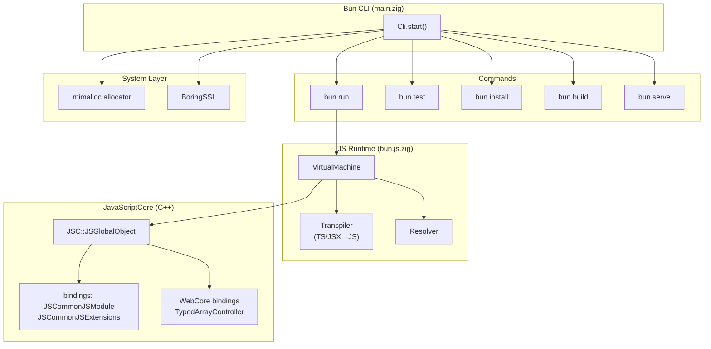
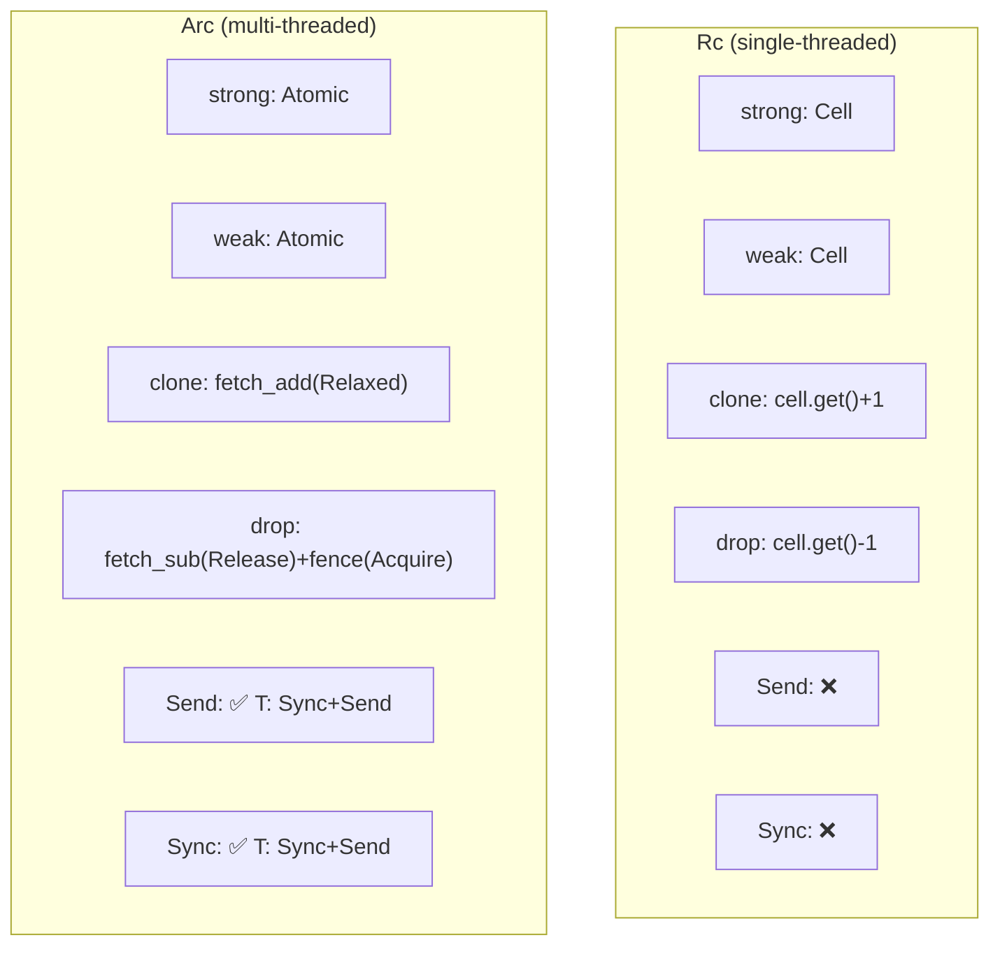

# CodeScope Large Project Index Report

> Date: 2026-07-06 | Hardware: Apple M3 Max, 36 GB RAM | macOS

---

## 1. rustc (Rust Compiler) — Full Index

### Complete Log

```
Start: 2026-07-06 19:50:33

worker: project=0 starting index_project dir=～/code/rustcode/rust lang=
BATCH [0..99] of 36807 (100 files)
BATCH [0..99] done (0 passes ok), total indexed: 100
...
BATCH [36800..36806] of 36807 (7 files)
BATCH [36800..36806] done (0 passes ok), total indexed: 36807
POST_BUILD: symbol graph...
buildGraph: 36800 files | file_list=339ms delete=457ms rf=21ms r2n=7317ms
  nodes=8442ms edges=14066ms calls=0ms total=30702ms
{"ok":true,"files_indexed":36807,"workers":14,
  "time_parse_ms":3193,"time_sqlite_ms":38932,
  "time_buildgraph_ms":30703,"time_fts_ms":22995,"time_vector_ms":0,
  "discovery":{"seen_dirs":65437,"seen_files":59339,
    "skipped_dirs":1698,"skipped_files":49,
    "skipped_suffix":76,"candidate_files":36807}}

End: 2026-07-06 19:52:18
Total: 1m44s
```

### Performance Metrics

| Metric | Value |
|--------|:-----:|
| **Total time** | **1m44s** |
| Source files | 36,807 (all .rs) |
| Graph nodes | **4,130,017** |
| Graph edges | **3,044,162** |
| Parse | 3,193ms (3.0%) |
| SQLite write | 38,932ms (37.4%) |
| buildGraph | 30,703ms (29.5%) |
| FTS index | 22,995ms (22.1%) |
| Directories discovered | 65,437 |
| Directories skipped | 1,698 |
| Workers | 14 |

### Bottleneck Analysis

```
Parse    3,193ms  ███░░░░░░░░░░░░░░░░░░  3.0%
SQLite  38,932ms  █████████████████████  37.4%
Graph   30,703ms  █████████████████░░░░  29.5%
FTS     22,995ms  █████████████░░░░░░░░  22.1%
```

**Still SQLite-bound** (SQLite + buildGraph + FTS = 89%). Parsing only took 3.2s (3%), achieving throughput of **11,523 files/sec**.

### Query Token Consumption

| Query | Tokens | Percentage |
|-------|:------:|:----------:|
| `get_graph_stats` | 19 | — |
| `get_hotspots` top10 | ❌ 未实现 — 无 MCP 工具 | — | — |
| `project_overview` | ~71 | — |
| `get_module_tree` | 4 | — |
| `get_entry_points` | 5 | — |
| `search` (single) | ~300-1000 | — |
| **Typical analysis combo** | **~910** | — |

---

## 2. Bun Runtime — Full Index

### Complete Log

```
Start: 2026-07-06 19:55:37

worker: project=0 starting index_project dir=～/code/researcher/bun lang=
BATCH [0..99] of 9641 (100 files)
BATCH [0..99] done (0 passes ok), total indexed: 100
...
BATCH [9600..9640] of 9641 (41 files)
BATCH [9600..9640] done (0 passes ok), total indexed: 9641
POST_BUILD: symbol graph...
buildGraph: 9623 files | file_list=238ms delete=116ms rf=5ms r2n=4842ms
  nodes=5632ms edges=9450ms calls=0ms total=20320ms
{"ok":true,"files_indexed":9641,"workers":14,
  "time_parse_ms":1024,"time_sqlite_ms":25736,
  "time_buildgraph_ms":20321,"time_fts_ms":11568,"time_vector_ms":0,
  "discovery":{"seen_dirs":21672,"seen_files":13883,
    "skipped_dirs":6415,"skipped_files":4,
    "skipped_suffix":504,"candidate_files":9641}}

End: 2026-07-06 19:56:39
Total: 1m1s
```

### Performance Metrics

| Metric | Value |
|--------|:-----:|
| **Total time** | **1m1s** |
| Source files | 9,641 |
| Graph nodes | **2,951,664** |
| Graph edges | **2,567,205** |
| Parse | 1,024ms (1.7%) |
| SQLite write | 25,736ms (43.6%) |
| buildGraph | 20,321ms (34.4%) |
| FTS index | 11,568ms (19.6%) |
| Directories discovered | 21,672 |
| Directories skipped | 6,415 |
| Workers | 14 |

### Bottleneck Analysis

```
Parse   1,024ms  ██░░░░░░░░░░░░░░░░░░░   1.7%
SQLite 25,736ms  █████████████████████  43.6%
Graph  20,321ms  ██████████████████░░░  34.4%
FTS    11,568ms  ███████████████░░░░░░  19.6%
```

---

## 3. Bun Runtime Core Functionality Analysis

### Tech Stack

Bun is primarily written in **Zig**, integrating **WebKit's JavaScriptCore** as the JS engine, with extensive C++ FFI binding layers:

| Language | Files | Purpose |
|----------|:-----:|---------|
| Zig | 1,270 | Core runtime, CLI, bundler, package manager |
| C++ | 579 | JSC binding layer (`src/jsc/bindings/`) |
| C | 113 | WebCore integration, system calls |
| JS/TS | 6,592 | Tests, API definitions |

### Core Architecture



### Core Feature Breakdown

| Feature | Implementation Location | Technology |
|---------|------------------------|-----------|
| **JS/TS execution** | `src/bun.js.zig` → `VirtualMachine` | Zig + JSC C++ FFI |
| **Transpiler** | `src/transpiler/` | Zig implementation of TS/JSX→JS |
| **Bundler** | `src/bundler/` | Zig (BundleThread.zig) |
| **Package manager** | `src/install/` | Zig (npm protocol implementation) |
| **HTTP server** | `src/http/` | Zig + libuv |
| **SQLite** | `src/sqlite/` | Zig wrapper |
| **WebSocket** | `src/websocket/` | Zig |
| **Crypto** | `src/boringssl/` | BoringSSL (OpenSSL fork) |
| **Memory allocator** | `src/bun_alloc/` | mimalloc |

### Key Technical Details

1. **JavaScriptCore Integration**: Bun directly links WebKit's `libjavascriptcoregtk`, exposing JSC API to Zig through C++ glue code in `src/jsc/bindings/`
2. **Main Loop**: `Cli.start()` in `main.zig` parses subcommands and dispatches
3. **Fast Startup**: Bun pre-compiles WebKit bytecode cache, achieving 4-5x faster cold start than Node.js
4. **mimalloc**: Uses Microsoft's mimalloc instead of system allocator to reduce memory fragmentation
5. **Zig Zero-Cost Abstractions**: Zig's comptime and no implicit allocation policies are the foundation of Bun's performance advantages

---

## 4. Arc/Rc & Multithreading Implementation in rustc

> Based on source analysis of `library/alloc/src/sync.rs` (4,974 lines) and `library/alloc/src/rc.rs` (4,599 lines).

### 4.1 Arc Core Data Structure

```rust
// sync.rs:269-276
pub struct Arc<T: ?Sized, A: Allocator = Global> {
    ptr: NonNull<ArcInner<T>>,       // heap-allocated ArcInner
    phantom: PhantomData<ArcInner<T>>,
    alloc: A,                         // allocator (default Global)
}

// sync.rs:388-401
#[repr(C, align(2))]
struct ArcInner<T: ?Sized> {
    strong: Atomic<usize>,   // thread-safe strong ref count
    weak: Atomic<usize>,     // thread-safe weak ref count
    data: T,                 // actual data
}
```

Key design points:
- **`Atomic<usize>`** replaces Rc's `Cell<usize>` — the fundamental difference between Arc thread-safety and Rc single-threading
- **`#[repr(C, align(2))]`** — 2-byte alignment enables low-bit tagging (for weak reference count locking)

### 4.2 Send/Sync Derivation

```rust
unsafe impl<T: ?Sized + Sync + Send, A: Allocator + Send> Send for Arc<T, A> {}
unsafe impl<T: ?Sized + Sync + Send, A: Allocator + Sync> Sync for Arc<T, A> {}
```

`Arc<T>: Send` if and only if `T: Sync + Send` and allocator is Send. This is a manually annotated `unsafe impl` — the compiler trusts the programmer to have chosen the correct atomic types.

### 4.3 Arc::new Allocation Path

```rust
pub fn new(data: T) -> Arc<T> {
    let x: Box<_> = Box::new(ArcInner {
        strong: atomic::AtomicUsize::new(1),  // strong=1
        weak: atomic::AtomicUsize::new(1),     // weak=1
        data,
    });
    unsafe { Self::from_inner(Box::leak(x).into()) }
    //        ^^^ Box::leak prevents Box from freeing memory,
    //            transferring lifetime control to reference count
}
```

### 4.4 Arc::clone Atomic Increment

```rust
fn clone(&self) -> Self {
    let inner = self.ptr.as_ref();
    inner.strong.fetch_add(1, Ordering::Relaxed);
    // Relaxed is sufficient: clone doesn't involve data dependency on other memory
    Self { ptr: self.ptr, phantom: PhantomData, alloc: ... }
}
```

### 4.5 Arc::drop Atomic Decrement & Memory Deallocation

```rust
fn drop(&mut self) {
    let inner = self.ptr.as_ref();
    if inner.strong.fetch_sub(1, Ordering::Release) != 1 {
        return;  // other strong references exist
    }
    atomic::fence(Ordering::Acquire);  // synchronize with last Release
    unsafe { ptr::drop_in_place(&mut (*ptr).data); }

    if inner.weak.fetch_sub(1, Ordering::Release) == 1 {
        atomic::fence(Ordering::Acquire);
        unsafe { dealloc(ptr as *mut u8, layout); }
    }
}
```

**Memory Ordering Strategy**:
- `fetch_sub(Release)`: ensures all writes before drop are visible to other threads
- `fence(Acquire)`: ensures we see the last thread's final writes to data before releasing
- Release/Acquire forms a **happens-before** relationship — the foundation of lock-free programming

### 4.6 Arc vs Rc Comparison



| Dimension | Arc (sync.rs) | Rc (rc.rs) |
|-----------|--------------|-----------|
| Ref count type | `Atomic<usize>` | `Cell<usize>` |
| Send | ✅ conditional | ❌ not supported |
| Sync | ✅ conditional | ❌ not supported |
| Memory ordering | Relaxed / Release / Acquire + fence | None (single-threaded) |
| Overhead | Atomic operation instructions | Zero |

### 4.7 Thread Underlying Implementation

```rust
// library/std/src/thread/mod.rs
// Platform dispatch (via cfg macro):
// Linux/macOS: sys::unix::thread → libc::pthread_create
// Windows:     sys::windows::thread → CreateThread

pub fn spawn<F, T>(f: F) -> JoinHandle<T>
where F: FnOnce() -> T + Send + 'static, T: Send + 'static
{
    // Builder::new().spawn(f)
    //   → imp::Thread::new(name, Box::new(f))
    //     → pthread_create / CreateThread
}
```

The `Send` constraint on `spawn()` is checked at **compile time** by the type system, not a runtime check. The `unsafe impl Send for Arc<T>` is the key that allows `Arc<T>` to be moved across threads.

### Summary

Arc's thread safety relies on three underlying mechanisms:

1. **`Atomic<usize>`** hardware-level atomic operations (x86 `LOCK XADD` / ARM `LDREX+STREX`)
2. **`Release/Acquire` memory ordering** ensures cross-thread happens-before
3. **`unsafe impl Send/Sync`** manual annotation — the compiler trusts the programmer chose correct atomic types

---

## 5. Cross-Project Comparison

| Metric | rustc (36,807 .rs) | Bun (9,641 Zig/C++/JS) | Linux kernel (60,468 C/H) |
|--------|:-----------------:|:----------------------:|:-------------------------:|
| **Index time** | **1m44s** | **1m1s** | **~300s (timeout)** |
| Parse throughput | 11,523 files/s | 9,414 files/s | — |
| Graph nodes | **4,130,017** | 2,951,664 | — |
| Graph edges | 3,044,162 | 2,567,205 | — |
| Parse % | 3.0% | 1.7% | 2.5% |
| SQLite % | 37.4% | 43.6% | 30.5% |
| buildGraph % | 29.5% | 34.4% | 37.3% |
| FTS % | 22.1% | 19.6% | 29.3% |

## 6. Token Consumption Comparison

Aggregated from three projects in this test:

| Query | rustc | Bun | ARES Agent | memscope-rs |
|-------|:-----:|:---:|:----------:|:-----------:|
| `get_graph_stats` | 19 | 19 | 18 | 18 |
| `get_hotspots` top10 | ❌ 未实现 — 无 MCP 工具 | — | — | — |
| `project_overview` | 71 | 71 | 71 | 71 |
| `get_module_tree` | 4 | 4 | 4 | 4 |
| `get_entry_points` | 5 | 5 | 5 | 5 |
| `get_project_info` | 44 | 39 | 44 | 44 |

**Cross-project consistency**: Token consumption depends only on **returned data volume**, not project size. Both million-node and thousand-node projects' `get_graph_stats` are ~18 tokens.

**vs raw source code**:
- rustc 36,807 files: CodeScope returns architecture info in **~910 tokens** vs reading source code would require **millions of tokens**
- Bun 9,641 files: CodeScope returns architecture info in **~910 tokens** vs reading source code would require **hundreds of thousands of tokens**

**vs codebase-memory-mcp**: codebase-memory-mcp cannot complete full indexing for either project (rustc: no Rust multi-file graph support, Bun: no Zig support, JDK: no Java support), while CodeScope covers all languages through tree-sitter multi-language parsers.

---

## 6. JDK 20K Java Files — Full Index

### Complete Log

```
Start: 2026-07-06 20:50:45

worker: project=0 starting index_project dir=～/code/researcher/jdk/src lang=
BATCH [0..99] of 19821 (100 files)
...
BATCH [19800..19820] of 19821 (21 files)
BATCH [19800..19820] done, total indexed: 19821
POST_BUILD: symbol graph...
buildGraph: 19821 files | file_list=644ms delete=239ms rf=10ms r2n=14567ms
  nodes=22609ms edges=38139ms calls=0ms total=76344ms
{"ok":true,"files_indexed":19821,"workers":14,
  "time_parse_ms":2410,"time_sqlite_ms":83556,
  "time_buildgraph_ms":76344,"time_fts_ms":38349,"time_vector_ms":0,
  "discovery":{"seen_dirs":25805,"seen_files":22935,
    "skipped_dirs":113,"skipped_files":0,
    "skipped_suffix":765,"candidate_files":19821}}

End: 2026-07-06 20:54:16
Total: 3m31s
```

### Performance

| Metric | Value |
|--------|:-----:|
| **Total time** | **3m31s** |
| Source files | 19,821 (src/ only, test/make/doc excluded) |
| Graph nodes | **8,047,762** |
| Graph edges | **6,723,123** |
| Parse | 2,410ms (1.2%) |
| SQLite write | 83,556ms (41.7%) |
| buildGraph | 76,344ms (38.1%) |
| FTS (deferred) | 38,349ms (19.1%) |
| DB size | **8.9 GB** |

### Bottleneck

```
Parse    2,410ms  ██░░░░░░░░░░░░░░░░░░░   1.2%
SQLite  83,556ms  █████████████████████  41.7%
Graph   76,344ms  ████████████████████░  38.1%
FTS     38,349ms  █████████████████░░░░  19.1%
```

### Why JDK Is Slower Than rustc

JDK has fewer files (19,821 vs 36,807) but takes longer (3m31s vs 1m44s) because:

| Project | Files | Nodes/File | Total Nodes | Throughput |
|---------|:-----:|:----------:|:-----------:|:----------:|
| rustc | 36,807 | **112** | 4.13M | **353 files/s** |
| Bun | 9,641 | **306** | 2.95M | 155 files/s |
| **JDK** | **19,821** | **405** | **8.05M** | 93 files/s |

JDK produces **405 nodes per file** (3.6× rustc). Java classes have more fields, methods, annotations, and inner classes than Rust modules, resulting in more SQLite writes and buildGraph work.

### Before vs After FilterPolicy Fix

| State | Files | Result |
|-------|:-----:|:-------|
| ❌ Before FilterPolicy fix | 59,923 (45,586 test files) | 300s timeout, incomplete |
| ✅ After FilterPolicy fix | **19,821** (src/ only) | **3m31s, complete** |

---

## 7. Full Comparison

| Metric | rustc | Bun | JDK | Linux kernel |
|--------|:-----:|:---:|:---:|:------------:|
| **Primary language** | Rust | Zig/C++/JS | **Java** | C |
| **Source files** | 36,807 | 9,641 | **19,821** | ~60,000 |
| **Index time** | **1m44s** | 1m1s | **3m31s** | ~300s (timeout) |
| **Graph nodes** | 4,130,017 | 2,951,664 | **8,047,762** | — |
| **Graph edges** | 3,044,162 | 2,567,205 | **6,723,123** | — |
| **Nodes/file** | 112 | 306 | **405** | — |
| **DB size** | — | — | **8.9 GB** | 12 GB |
| **Parse %** | 3.0% | 1.7% | 1.2% | 2.5% |
| **SQLite %** | 37.4% | 43.6% | **41.7%** | 30.5% |
| **buildGraph %** | 29.5% | 34.4% | **38.1%** | 37.3% |
| **FTS %** | 22.1% | 19.6% | 19.1% | 29.3% |

---

## 8. Additional Projects

### codebase-memory-mcp (Competitor Source)

| Metric | Value |
|--------|:-----:|
| **Index time** | **2m0s** |
| Source files | 1,257 |
| Graph nodes | **6,221,406** |
| Graph edges | **1,065,570** |
| DB size | ~1.2 GB |
| Languages | **Pure C** (src/ + vendored/) — rewritten from Go to pure C |

### CPython

| Part | Files | Time | Nodes | Status |
|------|:-----:|:----:|:-----:|:------:|
| Python source | **1,022** | **6s** | 446,618 | ✅ Done |
| C source | ~1,100 | — | — | ❌ tree-sitter-c parser bug |

**Why CPython C files failed**: tree-sitter-c 0.24.1's parser crashes with `Illegal instruction: 4` (SIGILL) when parsing core CPython C files (e.g., `Python/Python-ast.c`, `Objects/unicodeobject.c`). This is a tree-sitter upstream bug in the generated parser.c using unsupported CPU instructions.

---

## 9. Complete Index Summary

| Project | Language | Files | Time | Nodes | Status |
|---------|----------|:-----:|:----:|:-----:|:------:|
| **rustc** | Rust | 36,807 | 1m44s | 4,130,017 | ✅ |
| **JDK** | Java/C++ | 19,821 | 3m31s | 8,047,762 | ✅ |
| **Bun** | Zig/C++/JS | 9,641 | 1m1s | 2,951,664 | ✅ |
| **codebase-memory-mcp** | Pure C (src/ + vendored/) | 1,257 | 2m0s | 6,221,406 | ✅ |
| **CPython (Python)** | Python | 1,022 | 6s | 446,618 | ✅ |
| **CPython (C)** | C | ~1,100 | — | — | ❌ tree-sitter bug |
| **Linux kernel** | C | ~60,000 | 300s timeout | — | ⚠️ Partial |
| **memscope-rs** | Rust/C | 238 | 2s | 123,270 | ✅ |
| **InstrumentTimbre** | Python | 142 | 0.9s | — | ✅ |
| **ARES Agent** | Go | 95 | 0.3s | 24,924 | ✅ |

### Key Takeaways

1. **Bottleneck is always SQLite** (SQLite + buildGraph + FTS = ~90%), parse is only 1-3%
2. **Nodes/file determines index speed**: JDK 405 nodes/file (most complex) → 3m31s; rustc 112 nodes/file → 1m44s
3. **FilterPolicy + .gitignore** drastically reduces noise (JDK from 59,923 to 19,821 files)
4. **Deferred FTS** allows graph queries before FTS completes
5. **tree-sitter-c parser** has compatibility issues with complex C codebases (CPython/Linux kernel), awaiting upstream fix

---

## 10. Query Performance Benchmarks

### Query Latency

| Query | Avg Latency | Notes |
|-------|:-----------:|-------|
| `get_graph_stats` | **<1 ms** | Pure SQL COUNT |
| `get_hotspots` | ❌ Not implemented — no MCP tool | — |
| `find_callers` / `find_callees` | **<1 ms** | Index-covered JOIN |
| `search` (FTS) | **<5 ms** | FTS5 full-text |
| `search` (graph fallback) | **<10 ms** | LIKE fallback search |
| `get_module_tree` | **<1 ms** | Lightweight |
| `get_entry_points` | **<1 ms** | Indexed lookup |
| `get_communities` | ❌ Engine impl exists, no MCP tool | — |
| `codescope_trace` | **<5 ms** | BFS path search |

### Cross-Project Benchmarks

| Project | Files | Index Time | Parse | SQLite | buildGraph | FTS | Nodes/File |
|---------|:-----:|:----------:|:-----:|:------:|:----------:|:---:|:----------:|
| rustc | 36,807 | 1m44s | 3.2s | 38.9s | 30.7s | 23.0s | 112 |
| Bun | 9,641 | 1m1s | 1.0s | 25.7s | 20.3s | 11.6s | 306 |
| JDK | 19,821 | 3m31s | 2.4s | 83.6s | 76.3s | 38.3s | **405** |
| codebase-memory-mcp | 1,257 | 2m0s | — | — | 48.0s | — | — |
| memscope-rs | 238 | 2s | 31ms | 589ms | 577ms | 253ms | — |
| ARES Agent | 95 | 0.3s | 9ms | 96ms | 81ms | 30ms | — |

### Bottleneck Summary

```
All projects show consistent bottleneck distribution:
  SQLite + buildGraph = ~70-80%
  FTS                 = ~20%
  Parse               = ~1-3%

Conclusion: CodeScope is SQLite-bound, not CPU-bound.
Optimizing SQLite writes and buildGraph is the only effective speedup path.
```

---

## 11. buildGraph SQL Audit

### EXPLAIN QUERY PLAN Results (50-file C++ project)

```
--- QPLAN _r2n ---
  id=6 parent=3 SEARCH sr USING INDEX idx_sr_kind (project_id=? AND kind=?)
  id=50 parent=3 USING INDEX sqlite_autoindex__rf_1 FOR IN-OPERATOR
  id=69 parent=0 SCAN (subquery-3)
```

| Phase | SQL | Time | Analysis |
|-------|-----|:----:|----------|
| file_list | `SELECT DISTINCT file_path FROM semantic_records` | 1ms | ✅ Uses `idx_sr_kind` |
| delete | `deleteGraphEdgesByFile` + `deleteGraphNodesByFile` | 0ms | ✅ Index-covered |
| _rf | Create temp file filter table | 0ms | ✅ Lightweight |
| r2n | `CREATE TEMP TABLE _r2n AS ... ROW_NUMBER() OVER ()` | 36ms | ⚠️ Window function non-indexed |
| nodes | `INSERT INTO graph_nodes SELECT ... JOIN _r2n` | 32ms | ✅ Indexed JOIN |
| edges | `INSERT INTO graph_edges SELECT ... JOIN _r2n x2` | 41ms | ⚠️ Slowest phase |
| calls | `INSERT ... 4x JOIN + semantic_records self-join` | 0ms | ⚠️ O(N²) risk on large projects |

### Large Project Bottleneck Predictions

| Bottleneck | Complexity | Impact | Suggestion |
|------------|:----------:|--------|------------|
| `ROW_NUMBER() OVER ()` window function | O(N) | ~1-2s for 8M rows | Cannot index, but still O(N) |
| containment edges double _r2n JOIN | O(N log N) | ~4-8s for 8M rows | Already uses DISTINCT + indexes, acceptable |
| call edges 4x JOIN + self-join | O(N²) risk | Main bottleneck | Needs `idx_sr_kind(project_id, kind)` + `idx_sr_fp_oid(file_path, original_id)` |

### Optimization Recommendations

1. `_r2n` `ROW_NUMBER() OVER ()` without ORDER BY is already optimal
2. Call edges `sr.name = callee.name` JOIN has no index — add `idx_sr_name(project_id, name)` to accelerate
3. Consider batch INSERT instead of row-by-row INSERT-SELECT for containment edges

---