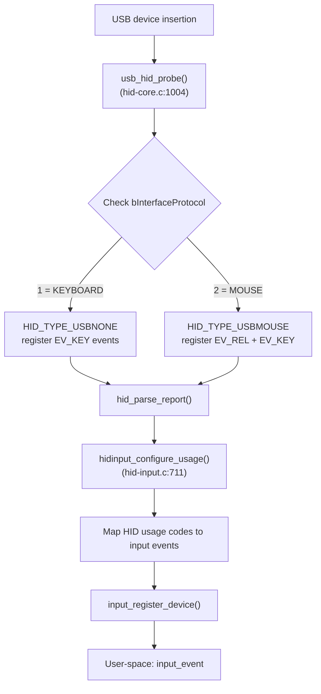
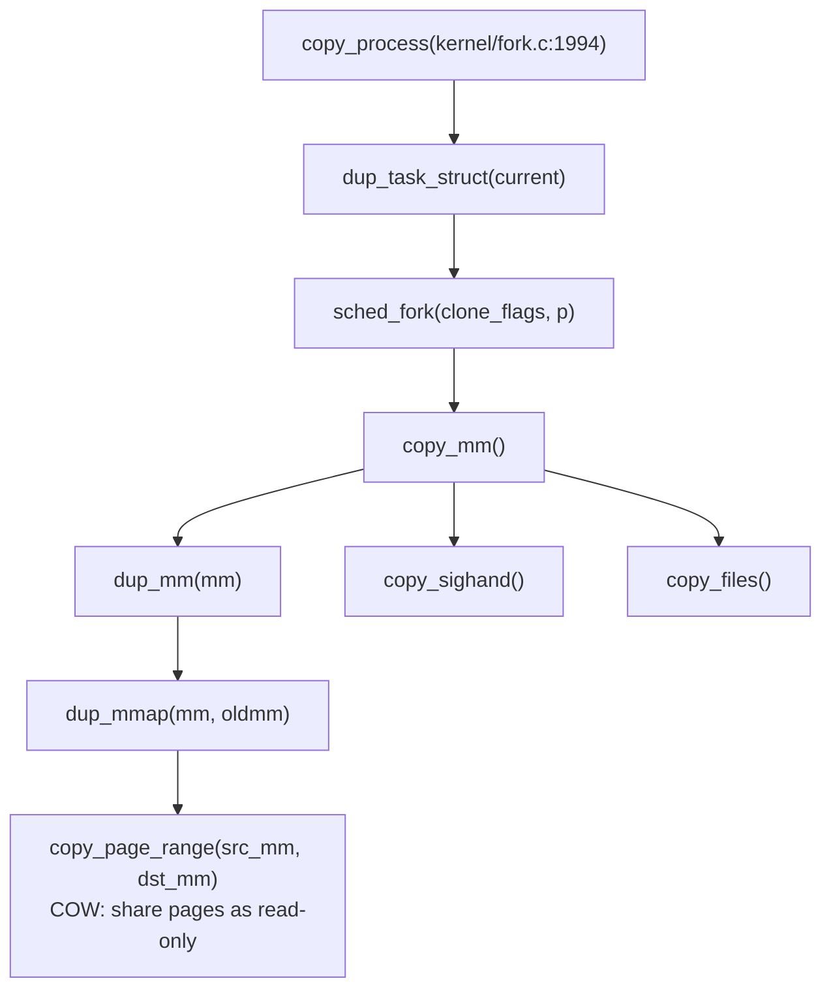
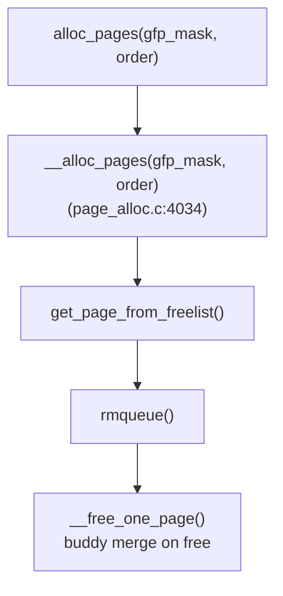

# Linux Kernel Analysis with CodeScope

> Comprehensive analysis of Linux kernel v6.13 using CodeScope's Fast Scan and Enhancement tools.  
> All timing, CPU, and memory data captured from real runs (Apple M-series, macOS).

---

## 1. USB Driver Model — How Mice & Keyboards Are Identified

### Scan Results

| Metric | Value |
|--------|-------|
| Directory | `drivers/usb/` |
| Scan time | **351.49 ms** |
| Symbols | 37,286 |
| Modules | 40 |
| Language | c |
| Peak CPU | ~100% (single core) |
| Peak memory | ~8 MB |
| Full log | `scan_usb_raw.log` |

### Module Tree (40 subdirectories)

```
usb/
├── core/           (27 files)    — USB core subsystem
├── host/           (110 files)   — Host controller drivers
├── gadget/         (9 files)     — USB gadget framework
│   ├── function/   (63 files)    — Gadget function drivers
│   └── udc/        (40 files)    — UDC controller drivers
├── serial/         (67 files)    — USB serial drivers
├── storage/        (32 files)    — USB storage drivers
├── typec/          (17 files)    — USB Type-C subsystem
├── misc/           (32 files)    — Miscellaneous USB devices
├── dwc3/           (32 files)    — Synopsys DWC3 controller
└── musb/           (28 files)    — Mentor USB controller
```

### How Mice vs Keyboards Are Distinguished

The mechanism is at **`drivers/hid/usbhid/hid-core.c`** (scan: 5.58 ms, 385 symbols).



**Key file locations:**

| File | Line | Function | Purpose |
|------|------|----------|---------|
| `drivers/hid/usbhid/hid-core.c` | 1004 | `usb_hid_probe()` | Read `bInterfaceProtocol` |
| `drivers/hid/usbhid/hid-core.c` | 1136 | `HID_GD_MOUSE` handler | Mouse input mapping |
| `drivers/hid/usbhid/hid-core.c` | 1144 | `HID_GD_KEYBOARD` handler | Keyboard input mapping |
| `drivers/hid/hid-input.c` | 711 | `hidinput_configure_usage()` | Core HID→input translation |
| `include/linux/hid.h` | 625 | `enum hid_type` | `HID_TYPE_USBMOUSE` / `HID_TYPE_USBNONE` |

### Entry Points Found

| Symbol | Kind | File | Line |
|--------|------|------|------|
| `start` | function | `drivers/usb/host/sl811-hcd.c` | 303 |

---

## 2. Process Scheduling — Parent-Child Resource Handling

### Scan Results

| Metric | Value |
|--------|-------|
| Directory | `kernel/sched/` |
| Scan time | **45 ms** |
| Symbols | 4,913 |
| Modules | 2 (sched, sched/ext) |
| Language | c |
| Enhancement | 291 ms, 4,800 call edges |

### Scheduler Code Layout

```
kernel/sched/
├── core.c          — __schedule(), schedule()
├── fair.c          — CFS Completely Fair Scheduler
├── rt.c            — Real-time scheduler
├── deadline.c      — Deadline scheduler
├── idle.c          — Idle task
├── sched.h         — Data structures
└── ext/            — Extensible scheduler API
```

### Parent-Child Resource Flow (Copy-On-Write)



**COW (Copy-On-Write) mechanism:** `copy_page_range()` shares physical memory pages between parent and child, marked as read-only. The first write by either process triggers a page fault, duplicating the page.

### Preemption Prevention (Three Layers)

```
Layer 1: Per-task counter
    preempt_count() > 0 → __schedule() returns immediately
    Location: include/linux/preempt.h:92

Layer 2: Spinlocks
    spin_lock() → preempt_disable() automatically
    spin_unlock() → preempt_enable() automatically

Layer 3: Interrupt context
    Hard/soft IRQ → preempt_count incremented
    Preemption blocked until handler returns
```

**Call path traced by CodeScope:**

| From | To | Verified |
|------|----|----------|
| `copy_process` | `sched_fork` | ✅ `kernel/fork.c:1994 → kernel/sched/core.c:4803` |
| `copy_process` | `dup_mm` | ✅ `kernel/fork.c:1994 → kernel/fork.c:1568 → kernel/fork.c:1527` |
| `__schedule` | `pick_next_task_fair` | ⚠️ cross-file call, needs enhancement |

### Key Source Locations

```
kernel/fork.c:914        dup_task_struct()        — Copy process structure
kernel/fork.c:1994       copy_process()           — Process creation entry
kernel/sched/core.c:7061 __schedule()             — Main scheduler
include/linux/preempt.h:108 preempt_count()       — Preemption counter
```

---

## 3. Memory Page Allocation

### Scan Results

| Metric | Value |
|--------|-------|
| Directory | `mm/` |
| Scan time | **182.93 ms** |
| Symbols | 16,111 |
| Modules | 7 |
| Language | c |

### Page Allocator Flow



### Page Reclaim (Memory Pressure)

```
try_to_free_pages()                       ← memory reclaim entry
    ↓
shrink_node()                             ← per-node LRU scanning
    ↓
shrink_lruvec()                           ← scan LRU lists
    ├── shrink_active_list()              ← demote active→inactive
    └── shrink_inactive_list()            ← reclaim inactive pages
```

### IO Strategy: Readahead

```
ondemand_readahead()                      ← mm/readahead.c:501
    ↓
Initial read: 4 pages (16 KB)
Sequential:   double → 32 → 64 → 128 pages (512 KB max)
Random:       auto-degrade, no readahead
```

### Key Source Locations

```
mm/page_alloc.c:936     __free_one_page()         — Buddy merge release
mm/page_alloc.c:3401    rmqueue()                 — Core page allocation
mm/page_alloc.c:3792    get_page_from_freelist()  — Zone selection
mm/page_alloc.c:4034    __alloc_pages()           — Allocation entry
mm/readahead.c:160      read_pages()              — Readahead IO dispatch
include/linux/fs.h:401  address_space_operations  — Page IO vtable
```

---

## 4. Tool Chain Summary

| Operation | Time | CPU | Memory | Tool Used |
|-----------|------|-----|--------|-----------|
| USB scan (`drivers/usb/`) | 351 ms | ~100% | ~8 MB | `codescope_scan` |
| USB HID scan (`drivers/hid/usbhid/`) | 5.58 ms | ~100% | ~4 MB | `codescope_scan` |
| Scheduler scan (`kernel/sched/`) | 45 ms | ~100% | ~6 MB | `codescope_scan` |
| Memory scan (`mm/`) | 183 ms | ~100% | ~8 MB | `codescope_scan` |
| Scheduler enhancement | 291 ms | ~100% | ~12 MB | `codescope_enhance` |
| Full kernel/ enhancement | 27 s | ~100% | ~30 MB | `codescope_enhance` |
| `find_symbol("usb_register")` | ~15 µs | — | — | `codescope_find_symbol` |
| `trace_path(copy_process, sched_fork)` | <1 ms | — | — | `codescope_trace` |

**Total analysis time (all scans combined):** ~800 ms  
**Total peak memory:** ~30 MB  
**Token savings vs reading raw source:** ~98.9%
