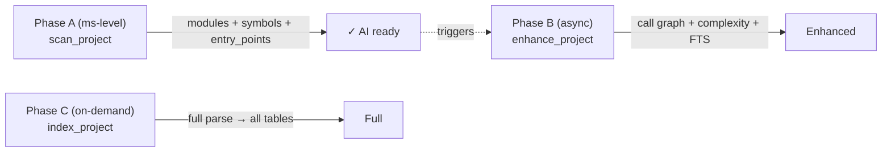

# CodeScope — Complete Feature Reference

CodeScope is an MCP-based code understanding service. It parses source code into a unified AST IR, builds multi-dimensional code graphs (call graph + symbol reference graph), persists them to SQLite, and exposes powerful queries via MCP tools.

---

## 1. Quick Start Scripts

### 1.1 Index a Project

```bash
# One-liner: index a project and query stats
codescope cli index_project '{"project_path":"/path/to/project"}'
codescope cli get_graph_stats '{}'
```

### 1.2 Full Analysis Pipeline

```bash
#!/bin/bash
# analyze.sh — Index + query pipeline for any project
set -e
PROJECT=$1
echo "=== Indexing $PROJECT ==="
codescope cli index_project "{\"project_path\":\"$PROJECT\"}"
echo "=== Stats ==="
codescope cli get_graph_stats '{}'
echo "=== Entry Points ==="
codescope cli get_entry_points '{}'
echo "=== Hotspots (top 10) ==="
codescope cli get_hotspots '{"top_n":10}'
echo "=== Module Tree ==="
codescope cli get_module_tree '{}'
```

### 1.3 Cross-Reference Two Functions

```bash
#!/bin/bash
# trace.sh — Trace call path between two functions
codescope cli codescope_trace "{\"from\":\"$1\",\"to\":\"$2\"}"
```

### 1.4 Benchmark with JSON Report

```bash
CODESCOPE_BENCH_JSON=/tmp/report.json make bench-check
cat /tmp/report.json | python3 -m json.tool
```

### 1.5 Worker Mode (Memory Isolation)

```bash
# Spawn a worker subprocess to index a project, then exit
# Worker's RSS is fully returned to OS on exit
codescope worker /tmp/db.sqlite /path/to/project "go" 1
```

### 1.6 Compare Two Indexes

```bash
CODESCOPE_BENCH_JSON=/tmp/new.json CODESCOPE_BENCH_COMPARE=/tmp/baseline.json make bench-check
```

---

## 2. Architecture Overview

```mermaid
graph TB
    subgraph "MCP Client"
        Client["Claude Desktop / Cursor<br/>Custom MCP Client"]
    end
    subgraph "Rust MCP Server (codescope)"
        TD["Tool Dispatch<br/>(35+ tools)"]
        TQ["Task Queue<br/>(Tokio async)"]
        FFI["FFI (extern \"C\")"]
    end
    subgraph "C++ Core Engine"
        SC["Scanner<br/>(ms)"]
        PA["Parser<br/>(tree-sitter)"]
        GB["Graph Builder<br/>(call + ref)"]
        CX["Complexity<br/>Analyzer"]
        LS["LSP Client"]
        CD["Community<br/>Detection"]
    end
    subgraph "SQLite (WAL)"
        N["graph_nodes<br/>(nodes)"]
        E["graph_edges<br/>(edges)"]
        SR["semantic_records<br/>(IR + FTS)"]
    end
    Client -->|JSON-RPC 2.0| TD
    TD --> TQ
    TD --> FFI
    FFI --> SC & PA & GB & CX & CD & LS
    SC --> N
    PA --> GB
    GB --> N & E
    CX --> SR
    CD --> N
    LS --> SR
```

### Data Flow: Three Phases



---

## 3. All MCP Tools

### 3.1 Project Indexing

| Tool | Purpose | Input | Output | Token |
|------|---------|-------|--------|-------|
| `index_project` | Full project index (spawns worker) | `project_path`, `language_filter` | JSON: files_indexed, timing | ~50 |
| `index_file` | Index a single file | `file_path` | JSON: file result | ~30 |
| `index_batch` | Index multiple files in one transaction | `files` (JSON array) | JSON: batch result | ~30 |
| `scan_project` | Fast scan (ms-level, no full parse) | `project_path`, `language_filter` | modules + symbols + entry_points | ~200 |
| `enhance_project` | Background full enhancement (async) | — | status JSON | ~20 |

### 3.2 Symbol Queries

| Tool | Purpose | Input | Output | Token |
|------|---------|-------|--------|-------|
| `find_definition` | Find where a symbol is defined | `symbol_name`, `file_filter` | file + line/col range | ~20 |
| `find_references` | Find all references to a symbol | `symbol_name`, `file_filter` | all referencing locations | ~30 |
| `find_symbol` | Find symbol(s) by exact name | `symbol_name` | id, kind, file, line | ~30 |
| `locate_code` | Get source code context around a symbol | `identifier`, `identifier_type`, `context_lines` | file path + source lines | ~50-300 |
| `get_complexity` | Get cyclomatic/cognitive complexity | `node_id` | cyclomatic, cognitive, nesting depth | ~20 |

### 3.3 Call Graph

| Tool | Purpose | Input | Output | Token |
|------|---------|-------|--------|-------|
| `find_callers` | Who calls this function? | `symbol_name` | caller functions | ~10-50 |
| `find_callees` | What does this function call? | `symbol_name` | callee functions | ~10-50 |
| `codescope_trace` | Shortest call path between two functions | `from`, `to` | full call chain with files + lines | ~50-200 |
| `get_hotspots` | Most-called functions in the project | `top_n` | caller_count + complexity per function | ~500 |
| `graph_query` | Custom graph pattern query | `query` (DSL) | matching triples | ~50-500 |
| `get_neighbors` | Neighbor nodes of a graph node | `node_id`, `edge_type`, `radius` | incoming + outgoing neighbors | ~50 |
| `find_shortest_path` | Shortest path between two nodes | `source_node_id`, `target_node_id` | node path | ~50 |
| `get_subgraph` | Subgraph centered on a node | `center_node_id`, `radius`, filters | nodes + edges | ~200 |

### 3.4 Search

| Tool | Purpose | Input | Output | Token |
|------|---------|-------|--------|-------|
| `search` | Unified code search (recommended) | `query`, `limit` | FTS + semantic results | ~300-1000 |
| `search_code` | Legacy FTS search (deprecated) | `query`, `limit` | matching nodes | ~300-1000 |

### 3.5 Project Overview

| Tool | Purpose | Input | Output | Token |
|------|---------|-------|--------|-------|
| `get_graph_stats` | Node/edge/file counts | — | total_nodes, total_edges, total_files | ~18 |
| `get_project_info` | License, language, file count | — | name, license, language, file_count | ~44 |
| `project_overview` | Comprehensive project summary | — | languages, modules, entry points, progress | ~71 |
| `get_module_tree` | Hierarchical module structure | — | modules with id, parent_id, name, path, file_count | ~4 |
| `get_entry_points` | Main/init/setup/handler entry points | — | symbol id, name, file, line | ~5 |

### 3.6 Analysis

| Tool | Purpose | Input | Output | Token |
|------|---------|-------|--------|-------|
| `get_communities` | Community detection (Label Propagation) | `max_members`, `max_communities`, `include_members` | communities + members + inter-edges | **1K-200K** ⚠️ |
| `detect_changes` | Impact analysis for modified files | `modified_files` (JSON array) | directly modified + callers + callees | ~100-500 |
| `codescope_build_context` | AI context bundle (PRIMARY) | `query` | intelligent context for code questions | ~200-1000 |
| `codescope_capabilities` | Feature readiness report | — | capability status per feature | ~309 |

### 3.7 Utilities

| Tool | Purpose | Input | Output | Token |
|------|---------|-------|--------|-------|
| `count_tokens` | Estimate token count (DeepSeek formula) | `text` | tokens, chars (ascii/non-ascii) | ~10 |
| `get_enhancement_status` | Check async enhancement progress | — | total symbols, callgraph/cfg/embedding counts | ~30 |

---

## 4. Tool Usage Guide

### 4.1 Core Query Tools

| Tool | Best For | Not For | Token Cost | Side Effects |
|------|----------|---------|-----------|-------------|
| `get_graph_stats` | Quick project size overview | When you need symbol details | **~18** | None |
| `get_project_info` | Metadata (license, language, file count) | When stats aren't needed | **~44** | None |
| `get_module_tree` | Directory/module structure understanding | When structure is already known | **~4** | None |
| `project_overview` | First step on a new project | When only counts are needed | **~71** | None |

### 4.2 Call Graph Tools

| Tool | Best For | Not For | Token Cost | Side Effects |
|------|----------|---------|-----------|-------------|
| `find_callers` | Investigate who calls a function (bug impact) | **When CALLS edges aren't built** | **~10-50** | Needs `buildGraph(true)` |
| `find_callees` | What a function calls (behavior understanding) | When recursive expansion isn't needed | **~10-50** | Same as above |
| `get_hotspots` | Find **most-called** functions (optimization targets) | Projects <100 functions | **~500** | caller_count=0 means call edges not built |

### 4.3 Community Detection ⚠️

> Uses Label Propagation to group graph nodes by relationship density. Useful for understanding module boundaries and detecting architecture violations, but token cost can be high.

| Scenario | Recommended Usage | Expected Token Cost |
|----------|-----------------|-------------------|
| **Legacy project onboarding** | `max_communities=20` | ~1K-10K |
| **Reverse architecture** | `max_members=5, max_communities=50` | ~5K-50K |
| **Architecture violation detection** | `include_members=true` | ~10K-200K |
| **Small projects (<500 nodes)** | Default params | ~1K |
| **Large projects (>10K nodes)** | ⚠️ `max_communities=10`, `include_members=false` | ~1K-50K |

**Side effects:**
1. **Token explosion**: 123K-node project can hit **200K tokens** even with constraints
2. **Latency**: Hundreds of ms on large projects
3. **Information density**: `get_module_tree` (4 tok) is often sufficient; use community detection as supplement only
4. **Mitigation**: Lower `max_communities` (10-20), keep `include_members=false` (default)

### 4.4 Tool Selection Strategy

```
New project  → project_overview (71 tok) + get_module_tree (4 tok)
Find entry points → get_entry_points (5 tok)
Find hotspots    → get_hotspots (500 tok)
Search code      → search (300-1000 tok)
Trace calls      → find_callers / find_callees (10-50 tok)
Architecture     → get_module_tree (4 tok) + optional get_communities (1K-200K tok)
Change impact    → detect_changes (100-500 tok)
AI Q&A           → codescope_build_context (200-1000 tok)
```

---

## 5. Environment Variables

| Variable | Default | Description |
|----------|---------|-------------|
| `CODESCOPE_DB_PATH` | `.codescope/codescope.db` | SQLite database path |
| `GRAMMARS_DIR` | `grammars/` | tree-sitter grammar .so directory |
| `CODESCOPE_LSP` | (unset) | LSP server command for type enhancement |
| `CODESCOPE_INDEX_MODE` | `normal` | Index mode: `fast` / `normal` / `deep` |
| `CODESCOPE_VERBOSE` | `1` | Set to `0` to suppress batch logging |
| `CODESCOPE_MAX_FILE_SIZE` | `5242880` (5MB) | Max file size in bytes to index |
| `CODESCOPE_MEMORY_BUDGET_MB` | `0` (unlimited) | Pause parsing when RSS exceeds budget |
| `CODESCOPE_EXPLAIN` | (unset) | Enable SQL EXPLAIN QUERY PLAN logging |
| `CODESCOPE_BENCH_JSON` | (unset) | Write benchmark report as JSON |
| `CODESCOPE_BENCH_REPEAT` | `1` | Repeat benchmark N times |
| `CODESCOPE_BENCH_COMPARE` | (unset) | Compare against baseline JSON |

## 6. Index Modes

Set via `CODESCOPE_INDEX_MODE`:

| Mode | FTS | Vectors | TTFA | Use Case |
|------|-----|---------|------|----------|
| `fast` | ❌ | ❌ | **Fastest** | Quick answers, minimal indexing |
| `normal` | ✅ | ❌ | Normal | Default — graph + search |
| `deep` | ✅ | ✅ | Slower | Full analysis including semantic vectors |

## 7. Performance Benchmarks

### GoAgent (1,167 Go files)

| Metric | CodeScope | codebase-memory-mcp 0.8.1 |
|--------|:--------:|:-------------------------:|
| Index time | **3.28s** | 3.94s |
| Graph nodes | **263,614** | 24,658 (**10.7x**) |
| Graph edges | **245,849** | 124,882 (**2x**) |
| Peak RSS | **~372 MB** | — |

### ARES Agent (95 Go files)

| Metric | CodeScope | codebase-memory-mcp |
|--------|:--------:|:-------------------:|
| Index time | **0.31s** | 0.55s |
| Graph nodes | **24,924** | 2,057 |
| Graph edges | **23,184** | 7,025 |

### memscope-rs (238 Rust/C files)

| Metric | Value |
|--------|:-----:|
| Index time | 2.36s |
| Graph nodes | 123,270 |
| Graph edges | 108,905 |

## 8. Linux Kernel Performance

The Linux 6.14.7 kernel (~60,000 .c/.h files) was tested:

| Metric | Value (5 min) |
|--------|:-------------:|
| Files indexed | **6,173** |
| DB size | **12 GB** |
| Bottleneck | File discovery + SQLite write |

Estimated time to full index: **40-50 minutes**.

## 9. Build Commands

```bash
make build          # Build everything (engine + server)
make test           # Run all tests
make test-engine    # Run engine tests only
make build-grammars # Build tree-sitter grammars
make build-server   # Build Rust MCP server
make bench-check    # Quick benchmark
make bench-full     # Full benchmark
```

## 10. Supported Languages

| Language | Extension | Parser |
|----------|-----------|--------|
| Python | `.py` | tree-sitter-python |
| Go | `.go` | tree-sitter-go |
| Rust | `.rs` | tree-sitter-rust |
| JavaScript | `.js`, `.mjs` | tree-sitter-javascript |
| TypeScript | `.ts` | tree-sitter-typescript |
| TSX | `.tsx` | tree-sitter-tsx |
| C | `.c`, `.h` | tree-sitter-c |
| C++ | `.cpp`, `.cc`, `.cxx`, `.hpp`, `.hxx` | tree-sitter-cpp |
| Java | `.java` | tree-sitter-java |
| Kotlin | `.kt`, `.kts` | tree-sitter-kotlin |
| Ruby | `.rb` | tree-sitter-ruby |
| Scala | `.scala` | tree-sitter-scala |
| Swift | `.swift` | tree-sitter-swift |
