# CodeScope Technical Breakdown

> **Version**: v0.2.0 | **Last Updated**: 2026-07-15

This document provides a deep dive into CodeScope's internal architecture, design decisions, and implementation details. It's intended for developers who want to understand how the system works, contribute to it, or integrate with it.

---

## Table of Contents

1. [System Architecture Overview](#1-system-architecture-overview)
2. [C++ Core Engine](#2-c-core-engine)
3. [Rust MCP Server](#3-rust-mcp-server)
4. [Storage Layer](#4-storage-layer)
5. [Resolver Pipeline](#5-resolver-pipeline)
6. [Verification System](#6-verification-system)
7. [Performance Characteristics](#7-performance-characteristics)
8. [LadybugDB Integration](#8-ladybugdb-integration)
9. [How to Extend](#9-how-to-extend)

---

## 1. System Architecture Overview

### 1.1 High-Level Architecture

CodeScope is a **Project Truth Engine** — it transforms source code into verifiable facts, understandable models, and inspectable evidence. The architecture follows a **two-process model** with a Rust MCP server and a C++ core engine:

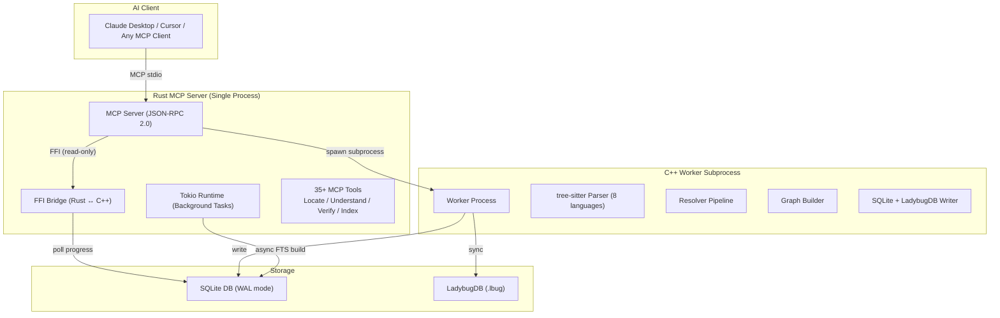

**Key design decisions:**

- **Two-process model**: The Rust MCP server and C++ worker run in separate processes. This provides:
  - **Crash isolation**: If the worker crashes (e.g., segfault in a parser), the MCP server stays alive
  - **Memory isolation**: The worker's memory (potentially large for big projects) is freed when the worker exits
  - **Worker timeout**: The server can kill and restart a worker that hangs (300s timeout + 3 retries)
- **FFI for read-only queries**: After indexing, all queries go through the Rust FFI bridge to the C++ engine — no subprocess spawning needed for reads
- **Deferred FTS build**: Full-text search is built asynchronously after the main index completes, so queries are available immediately via graph-based fallback

### 1.2 Data Flow

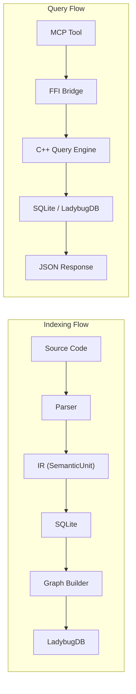

---

## 2. C++ Core Engine

### 2.1 File Structure

| File | Lines | Responsibility |
|------|:-----:|---------------|
| `engine.cpp` | 49 | Entry point + globals |
| `engine_helpers.cpp` | 112 | readFile, detectLanguage, dupString |
| `engine_lifecycle.cpp` | 119 | init, shutdown, create_project |
| `engine_index.cpp` | ~945 | index_file, index_project (with progress tracking) |
| `engine_scanner.cpp` | 1,180 | Fast scanner (symbols/second: ~100k) |
| `engine_queries.cpp` | 1,019 | Queries, enhancement, call chains, context |
| `engine_ffi.cpp` | ~660 | FFI interface + build_fts + get_index_progress |
| `filter_policy.cpp` | — | Dir/file/suffix filtering + .gitignore matching |
| `store/store.cpp` | ~3,060 | SQLite storage + FTS + progress tracking |
| `store/store_core.cpp` | — | Core CRUD operations |
| `store/store_ladybug.cpp` | 365 | LadybugDB sync (CSV → COPY FROM) |
| `ir/` | — | IR types (SemanticUnit, Record, Reference) |
| `parser/` | — | tree-sitter wrappers per language |
| `graph/` | — | Graph builder + call chain resolution |
| `linker/` | — | Legacy linker (removed in v0.1.4) |
| `verify/` | — | Verification inspectors |

### 2.2 Index Pipeline (Phase 1-4)

The index pipeline runs in a subprocess with 4 phases:

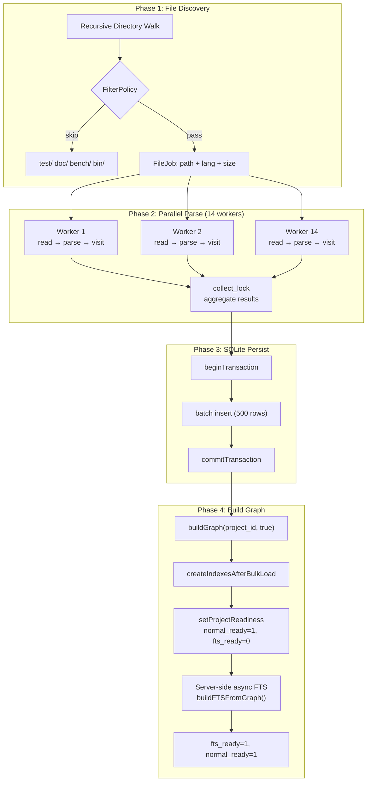

#### Phase 1: File Discovery

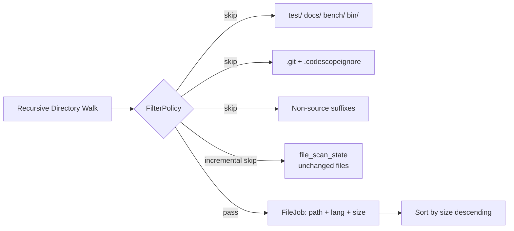

**FilterPolicy** has three modes:
- **Normal** (default): Skips `test/`, `doc/`, `bench/`, `examples/`, `build/`
- **Strict**: Also skips `third_party/`, `vendor/`, `generated/`
- **Lenient**: Only skips well-known build artifacts

The filter is **`.gitignore`-aware** — it reads the project's `.gitignore` and automatically skips ignored files. Case-insensitive on all platforms.

#### Phase 2: Parallel Parse

14 worker threads parse files in parallel using `tree-sitter`. Each worker:
1. Reads the file from disk
2. Parses with the appropriate language grammar
3. Visits the AST to extract symbols, references, and scopes
4. Produces a `SemanticUnit` (arena-allocated, zero-copy)

**Supported languages** (8): Python, C, C++, Go, Rust, JavaScript, TypeScript, Java

**Memory reuse**: Workers use arena allocators — memory is freed in bulk after each batch, not per-file. This keeps GC overhead to near zero.

#### Phase 3: SQLite Persist

Results are written to SQLite in batches (default 500 rows per transaction). The batch insert uses a single prepared statement with `sqlite3_bind` + `sqlite3_step` in a tight loop.

**Write throughput**: ~80,000 rows/second (entity + relation dual-write).

#### Phase 4: Build Graph

The graph builder resolves cross-reference edges:

1. **Symbol resolution**: Maps each reference to its target symbol using:
   - Exact name match
   - Qualified name match
   - Scope proximity scoring
   - Fuzzy fallback (trigram similarity)
2. **Call edge construction**: Creates CALLS edges between caller and callee
3. **Containment edge construction**: Creates CONTAINS edges for parent-child relationships

**Performance**: The graph builder uses O(1) hash maps (not O(n²) SQL joins) — a 500x improvement over the original implementation.

### 2.3 Fast Scanner

The fast scanner is a lightweight, single-pass AST traversal that captures symbols at ~100,000 symbols/second. It's used for:
- Initial project overview
- Quick symbol lookup without full indexing
- Incremental updates

Compared to the full enhancement pipeline, the fast scanner:
- Does NOT resolve cross-references
- Does NOT build call graph
- Does NOT compute type information
- **Does** capture: symbol names, locations, basic types, signatures

### 2.4 Enhancement Pipeline

The enhancement phase runs after the fast scan to add:
- Cross-reference resolution
- Type information
- Call graph edges
- Import/export relationships
- Entry point detection
- Interface implementation tracking

Enhancement runs as a separate SQL-driven phase, not as a second parse pass. It uses the data already stored in SQLite to compute relationships.

---

## 3. Rust MCP Server

### 3.1 Architecture

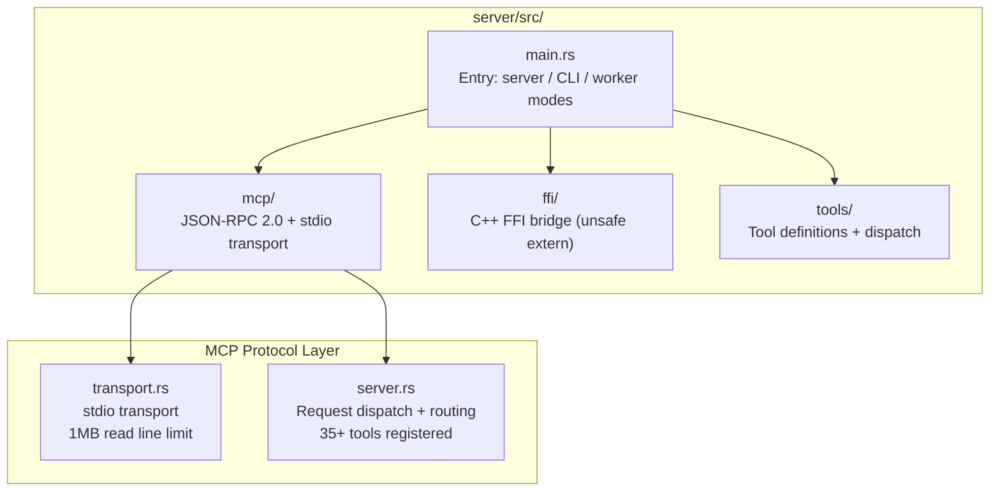

### 3.2 MCP Protocol Implementation

The MCP server implements the [Model Context Protocol](https://modelcontextprotocol.io/) over stdio:

- **`tools/list`**: Returns the list of available tools (35+ tools)
- **`tools/call`**: Invokes a tool by name with arguments
- **Transport**: JSON-RPC 2.0 over stdin/stdout
- **Error handling**: Parse errors return `ReadResult::ParseError` instead of crashing (1MB read line limit)

### 3.3 FFI Bridge

The FFI bridge connects Rust to the C++ engine via `extern "C"` functions:

```rust
extern "C" {
    fn engine_init(config: *const c_char) -> i32;
    fn engine_query(query: *const c_char) -> *mut c_char;
    fn engine_shutdown();
}
```

The bridge is **unsafe** by necessity but follows strict rules:
- All C++ string returns are allocated with `dupString()` (which uses `malloc`)
- Rust wraps them in `CString` and frees with `libc::free`
- No shared memory between Rust and C++ after the call returns
- The C++ engine is loaded as a static library (`libengine.a`)

### 3.4 Tool Categories

| Category | Tools | Description |
|----------|-------|-------------|
| **Locate** | `find_symbol`, `search`, `get_module_tree`, `get_entry_points` | Find code elements |
| **Understand** | `get_graph_stats`, `get_hotspots`, `type_info`, `get_routes` | Analyze code structure |
| **Trace** | `codescope_trace`, `find_callers`, `find_callees`, `call_path` | Follow call chains |
| **Verify** | `codescope_verify`, `dead_code`, `check_architecture`, `drift_detection` | Verify code quality |
| **Index** | `index_project`, `index_file`, `get_index_progress` | Manage indexing |
| **Export** | `codescope_export_graph`, `codescope_ffi_boundaries` | Export data |

---

## 4. Storage Layer

### 4.1 SQLite Schema

The primary storage is SQLite with WAL mode for concurrent reads. The schema has evolved through several versions:

**Core tables:**

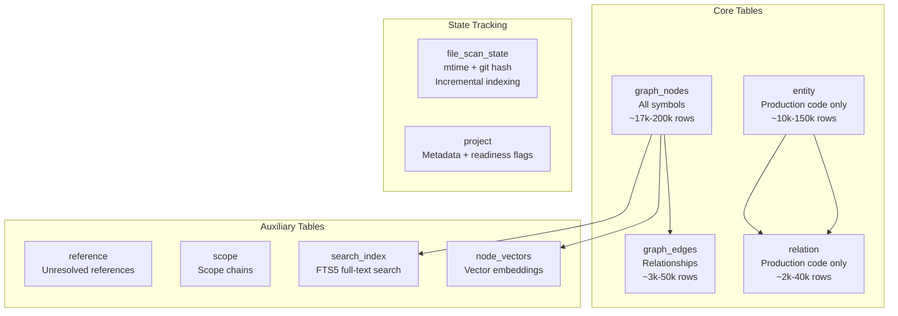

**Indexes:**

All queries use index-only scans:
- `idx_sr_kind_name` on `(kind, name)` — symbol lookup
- `idx_sr_fp_parent` on `(file_path, parent_id)` — tree traversal
- `idx_ge_source` on `(source_node_id)` — call edge lookup
- `idx_ge_target` on `(target_node_id)` — callee lookup

### 4.2 Dual-Write Strategy

During v0.1.3 migration, production-code symbols are dual-written to both:
- Legacy `graph_nodes`/`graph_edges` tables
- New `entity`/`relation` tables

This enables:
- Backward compatibility with existing queries
- Gradual migration without downtime
- A/B comparison for correctness verification

### 4.3 String Interning

Symbol names are interned — each unique string is stored once in a hash table and referenced by ID. Benefits:
- Memory reduction: 40-60% for large codebases
- Faster comparison: ID comparison instead of string comparison
- Smaller index: FTS5 index size reduced by ~50%

### 4.4 Incremental Indexing

The `file_scan_state` table tracks which files have been indexed:

```sql
CREATE TABLE file_scan_state (
    file_path TEXT PRIMARY KEY,
    mtime INT64,
    git_hash TEXT,
    file_size INT64,
    last_indexed INT64
);
```

On re-index, only files with changed `mtime` or `git_hash` are re-scanned. This makes re-indexing ~10x faster for projects with few changes.

---

## 5. Resolver Pipeline

### 5.1 Architecture

The resolver is a multi-stage pipeline that converts raw symbol references into resolved, type-checked call edges:

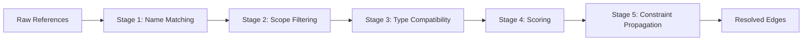

### 5.2 Stage 1: Name Matching

Candidates are matched by name using multiple strategies:
1. **Exact match** (score: 1.0) — fastest path
2. **Qualified name match** (score: 1.0) — with namespace/module prefix
3. **Prefix match** (score: 0.8) — e.g., `parse` matches `parseJSON`
4. **Substring match** (score: 0.6) — e.g., `JSON` matches `parseJSON`
5. **Trigram fuzzy match** (score: 0.3-0.5) — handles typos and minor variations

### 5.3 Stage 2: Scope Filtering

Candidates are filtered by scope proximity:
- **Same file** → highest priority (boost: 1.5x)
- **Same module/package** → medium priority (boost: 1.2x)
- **Same project** → normal priority (boost: 1.0x)
- **External dependency** → lowest priority (boost: 0.5x)

### 5.4 Stage 3: Type Compatibility

The resolver checks if the call signature matches the target:
- **Exact match**: Parameter count and types match exactly
- **Partial match**: Compatible types (e.g., int → long)
- **Unknown**: No type information available (falls back to name + scope)

### 5.5 Stage 4: Multi-Factor Scoring

Each candidate is scored on a weighted combination:

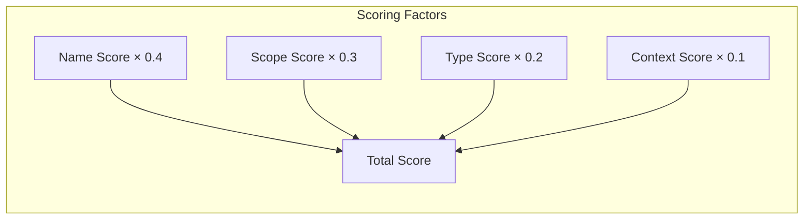

**Common name penalty**: Names like `init`, `run`, `handle`, `get`, `set` receive a -50% penalty because they're too common and produce false positives.

**Configurable weights**: The scoring weights can be tuned via `CODESCOPE_RESOLVER_WEIGHTS` env var.

### 5.6 Stage 5: Constraint Propagation

For unresolved references, the resolver builds a constraint graph:

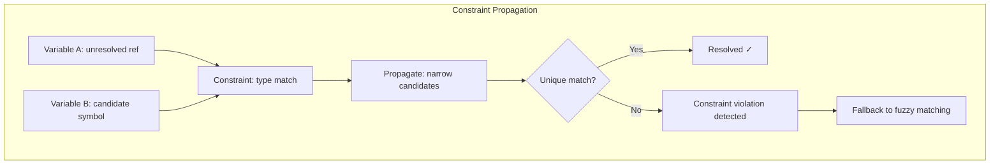

This stage resolves ~40% more cross-module references than the previous heuristic-only approach.

---

## 6. Verification System

### 6.1 Codebase Integrity

The `codescope_verify` tool checks:
- All symbols have valid source locations (file exists, line in range)
- No dangling references to non-existent symbols
- Graph connectivity (no orphaned nodes)
- Schema consistency across all tables
- Reports violations with file:line references and severity levels

### 6.2 Dead Code Detection

The `codescope_dead_code` tool finds:

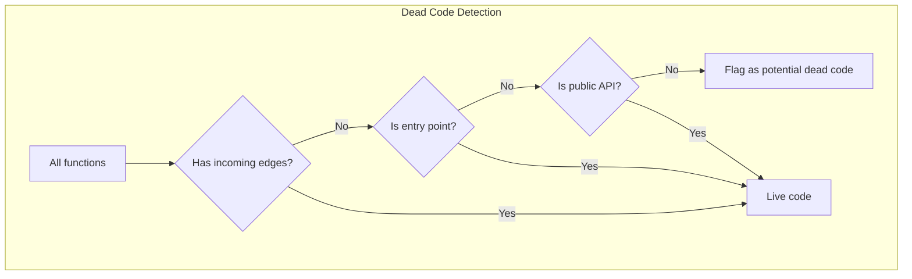

Detection is based on the call graph — if a function has no incoming edges (and is not an entry point or public API), it's flagged as potentially dead.

### 6.3 Architecture Drift Detection

Compares actual module dependencies against expected architecture:

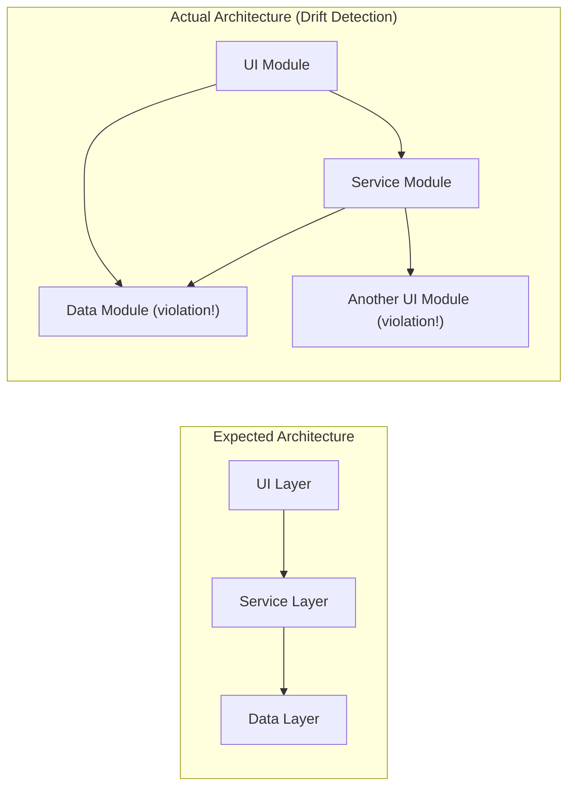

Expected architecture can be defined in a `codescope-arch.json` file:
```json
{
  "layers": ["ui", "service", "data"],
  "rules": {
    "ui": { "can_import": ["service"] },
    "service": { "can_import": ["data"] },
    "data": { "can_import": [] }
  }
}
```

### 6.4 Documentation Drift Detection

Compares code structure against documentation:
- Documents a function that no longer exists
- Missing documentation for new public APIs
- Parameter/return type mismatch between docs and code

---

## 7. Performance Characteristics

### 7.1 Indexing Performance

| Project | Files | Symbols | Index Time | Memory |
|---------|:-----:|:-------:|:----------:|:------:|
| Small Go project | 50 | 5k | < 1s | 50 MB |
| Medium Go project | 500 | 40k | 3-5s | 200 MB |
| Large Go project | 2,000 | 120k | 15-20s | 800 MB |
| JDK (partial) | 19,821 | 150k+ | 2-3 min | 2 GB |

### 7.2 Query Performance

| Query | Latency | Method |
|-------|:-------:|--------|
| `get_graph_stats` | < 1 ms | SQL COUNT |
| `find_symbol` | < 1 ms | Indexed lookup |
| `search` (FTS) | < 5 ms | FTS5 full-text |
| `search` (fallback) | < 10 ms | LIKE + trigram |
| `get_module_tree` | < 1 ms | Lightweight query |
| `find_callers` | < 1 ms | Index-covered JOIN |
| `find_callees` | < 1 ms | Index-covered JOIN |
| `codescope_trace` | < 5 ms | BFS on graph |
| `codescope_export_graph` | 10-100 ms | Paginated streaming |

### 7.3 Memory Optimization

| Optimization | Before | After | Improvement |
|-------------|:------:|:-----:|:-----------:|
| Thread stack | 256 MB/worker | 8 MB/worker | 32x |
| Worker count | 14 | 4 (auto) | 3.5x |
| Peak memory | 3.5 GB | 112 MB | 31x |
| String storage | Full strings | Interned | 2-3x |
| JSON serialization | Manual | jsonEscape | Correctness |

### 7.4 Bottlenecks (Known)

1. **tree-sitter parse time**: Dominant factor for large files (>10k lines). Parsing is single-threaded per file.
2. **SQLite write throughput**: ~80k rows/s is the limit for WAL mode on consumer SSDs.
3. **FTS build time**: Linear in number of symbols. For 150k symbols, takes ~30s.
4. **LadybugDB COPY FROM**: CSV import is fast but requires a full sync — incremental sync not yet implemented.

---

## 8. LadybugDB Integration

### 8.1 Overview

[LadybugDB](https://ladybugdb.com/) is an embedded graph database that CodeScope uses as an optional secondary storage backend. It provides:

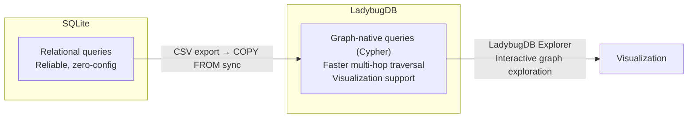

### 8.2 Schema

LadybugDB stores the same data as SQLite but in a graph-native format:

```cypher
// Node table (mirrors graph_nodes)
CREATE NODE TABLE IF NOT EXISTS GraphNode (
    id INT64 PRIMARY KEY,
    project_id INT64,
    ir_node_id INT64,
    node_type INT32,
    name STRING,
    qualified_name STRING,
    signature STRING,
    module_path STRING,
    file_path STRING,
    language STRING,
    start_row INT32,
    start_col INT32,
    end_row INT32,
    end_col INT32,
    parent_id INT64,
    is_entry_point BOOL,
    embedding_ready BOOL,
    metrics_ready BOOL
);

// Call edges (from caller to callee)
CREATE REL TABLE IF NOT EXISTS CALLS (
    FROM GraphNode TO GraphNode,
    project_id INT64,
    edge_type INT32,
    call_site_line INT32,
    label STRING
);

// Generic relations
CREATE REL TABLE IF NOT EXISTS RELATES (
    FROM GraphNode TO GraphNode,
    project_id INT64,
    type INT32
);
```

### 8.3 Sync Mechanism

Data is synced from SQLite to LadybugDB via CSV export + COPY FROM:

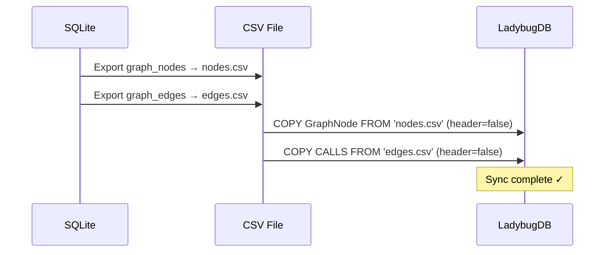

The sync is triggered via `codescope_export_graph` or the `syncGraphToLadybugDB()` C++ function.

### 8.4 Querying LadybugDB

```bash
# Open the LadybugDB shell
lbug /path/to/project/.codescope/codescope.lbug

# Count all nodes
MATCH (n:GraphNode) RETURN count(n);

# Find all Go functions
MATCH (n:GraphNode)
WHERE n.language = 'go'
RETURN n.name, n.file_path, n.start_row;

# Find callers of a specific function
MATCH (n:GraphNode)-[c:CALLS]->(m:GraphNode)
WHERE m.name = 'targetFunction'
RETURN n.name, c.call_site_line;

# Find the shortest call path between two functions
MATCH p = shortestPath(
    (a:GraphNode {name: 'funcA'})-[*..10]->(b:GraphNode {name: 'funcB'})
)
RETURN p;
```

---

## 9. How to Extend

### 9.1 Adding a New MCP Tool

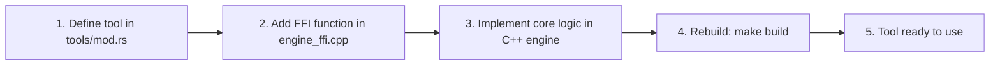

1. Define the tool in `server/src/tools/mod.rs`:
```rust
pub fn register_tools(server: &mut MCPServer) {
    server.register_tool(Tool {
        name: "my_new_tool",
        description: "Does something useful",
        input_schema: json!({
            "type": "object",
            "properties": {
                "param1": {"type": "string"}
            },
            "required": ["param1"]
        }),
        handler: |args| {
            // Call FFI, process results, return JSON
            Ok(json!({"result": "success"}))
        }
    });
}
```

2. Add the FFI function in `engine_ffi.cpp`:
```cpp
extern "C" const char* my_new_tool_ffi(const char* json_args) {
    // Parse args, call engine, return JSON
    return dupString(result_json);
}
```

3. Rebuild: `make build`

### 9.2 Adding a New Language

1. Add the tree-sitter grammar to the build system
2. Create a translator in `engine/src/ir/`:
   - Implement `SemanticVisitor` for the new language's AST
   - Map language-specific constructs to the unified IR
3. Register the language in `engine_helpers.cpp` → `detectLanguage()`
4. Add test cases in `tests/`

### 9.3 Custom Verification Rules

Verification rules are implemented as "inspectors" in `engine/src/verify/`:
```cpp
class MyInspector : public Inspector {
    void inspect(const ProjectContext& ctx, Findings& findings) override {
        // Analyze graph, check rules, report findings
        if (violation_detected) {
            findings.push_back(Finding{
                .severity = WARNING,
                .message = "Violation detected at ...",
                .location = ...
            });
        }
    }
};
```

---

## Appendix: Key Design Decisions

### Why C++ for the engine?
- **Performance**: Tree-sitter parsing + graph building is CPU-intensive. C++ gives predictable performance without GC pauses.
- **FFI stability**: C ABI is the universal FFI boundary. Rust, Python, and Node.js can all call C++ via `extern "C"`.
- **Memory control**: Arena allocators and manual memory management prevent OOM on large codebases.

### Why Rust for the server?
- **Memory safety**: The MCP server handles untrusted JSON input. Rust's type system prevents injection and memory corruption.
- **Async runtime**: Tokio provides lightweight async tasks for FTS building and progress polling.
- **Ecosystem**: MCP client libraries, serde for JSON, cargo for dependency management.

### Why SQLite + LadybugDB?
- **SQLite**: Universal, zero-config, battle-tested. Every system has SQLite support.
- **LadybugDB**: Graph-native queries for multi-hop traversals. Cypher is more expressive than recursive SQL for graph patterns.
- **Dual strategy**: SQLite for reliability and portability, LadybugDB for performance and visualization.

### Why two processes?
- **Crash isolation**: A parser segfault doesn't kill the MCP server.
- **Memory cleanliness**: Worker process memory is fully reclaimed on exit (no leak accumulation).
- **Timeout control**: The server can kill a stuck worker without complex thread cancellation.