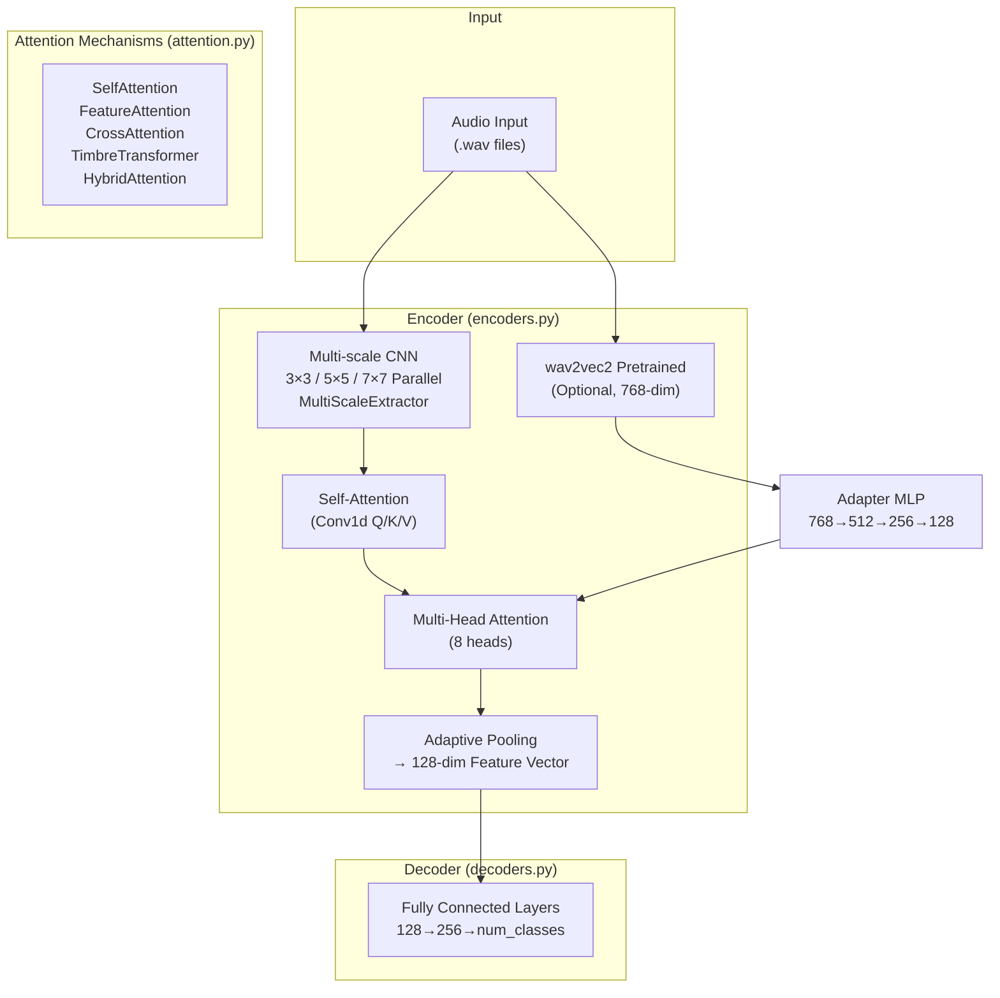

# InstrumentTimbre Model Architecture Analysis

> Project: Timbre Recognition/Conversion Model Based on ARES
> Indexing Time: 0.94s | 142 .py files | Date: 2026-07-06

---

## 1. Index Log

```
Start Time: Monday, July 6, 2026 20:59:53

worker: project=0 starting index_project dir=～/code/AIproject/music_ai/InstrumentTimbre lang=
BATCH [0..99] of 142 (100 files)
BATCH [0..99] done, total indexed: 100
BATCH [100..141] of 142 (42 files)
BATCH [100..141] done, total indexed: 142
POST_BUILD: symbol graph...
buildGraph: 142 files | file_list=3ms delete=1ms rf=0ms r2n=54ms
  nodes=46ms edges=92ms calls=0ms total=199ms
{"ok":true,"files_indexed":142,"workers":14,
  "time_parse_ms":21,"time_sqlite_ms":234,
  "time_buildgraph_ms":199,"time_fts_ms":92,"time_vector_ms":0,
  "discovery":{"seen_dirs":296747,"seen_files":293437,
    "skipped_dirs":3270,"skipped_files":0,
    "skipped_suffix":293213,"candidate_files":142}}

End Time: Monday, July 6, 2026 20:59:54
Total Time: 0.94s
```

### About the ./data Directory

The `.gitignore` already contains a `data/` rule, which FilterPolicy reads and automatically skips. From the discovery statistics:
- **293,437 files scanned** (of which 293,213 were filtered by suffix — the majority being audio data under data/)
- **142 candidate files** (only .py source code)
- Clean indexing phase with no noise

---

## 2. Model Architecture Overview



---

## 3. Core Components

### 3.1 Encoder (`models/encoders.py`)

**InstrumentTimbreEncoder** — Main encoder that converts audio to 128-dimensional timbre feature vectors.

#### Dual-Path Architecture

| Path | Input | Processing | Output Dimension |
|------|-------|------------|------------------|
| **wav2vec2** (optional) | Raw audio | `torchaudio Wav2Vec2Base → Adapter MLP(768→512→256→128)` | 128 |
| **Multi-scale CNN** (default) | Spectrogram | `Conv2d 3×3 / 5×5 / 7×7 parallel → Concatenate → Self-Attention → 8-head attention → Pooling` | 128 |

```python
class InstrumentTimbreEncoder(nn.Module):
    def __init__(self, input_channels=1, output_dim=128, use_pretrained=False):
        self.multi_scale_extractor = nn.ModuleDict({
            'scale_3': nn.Conv2d(input_channels, 64, 3, padding=1),   # 3×3 convolution
            'scale_5': nn.Conv2d(input_channels, 64, 5, padding=2),   # 5×5 convolution
            'scale_7': nn.Conv2d(input_channels, 64, 7, padding=3),   # 7×7 convolution
        })
        # Followed by: residual connection → Self-Attention → multi-head attention → adaptive pooling → 128-dim
```

### 3.2 Decoder (`models/decoders.py`)

| Decoder | Architecture | Purpose |
|---------|--------------|---------|
| InstrumentTimbreDecoder | `Linear(128, 256) → ReLU → Dropout → Linear(256, num_classes)` | Basic classification |
| EnhancedTimbreDecoder | Multi-layer MLP + LayerNorm + GELU + Dropout | High-quality classification |

### 3.3 Attention Mechanisms (`models/attention.py`)

| Module | Principle | Input→Output |
|--------|-----------|--------------|
| **SelfAttention** | Conv1d Q/K/V projection → dot-product attention → residual connection | `[B,C,L] → [B,C,L]` |
| **FeatureAttention** | Fully-connected layer attention weights | `[B,D] → [B,D]` |
| **CrossAttention** | Cross-attention between two sequences | `[B,C,L1],[B,C,L2] → [B,C,L2]` |
| **TimbreTransformer** | Transformer encoder + LayerNorm | `[B,D,L] → [B,D,L]` |
| **HybridAttention** | Self + Cross hybrid | Combined |

SelfAttention implementation details:
```python
class SelfAttention(nn.Module):
    def __init__(self, in_channels):
        self.query = Conv1d(in_channels, in_channels//8, 1)   # Q projection
        self.key   = Conv1d(in_channels, in_channels//8, 1)   # K projection
        self.value = Conv1d(in_channels, in_channels, 1)      # V projection
        self.gamma = Parameter(torch.zeros(1))                 # Learnable residual weight

    def forward(self, x):
        energy = bmm(proj_query.permute(0,2,1), proj_key)     # [B,L,L] attention matrix
        attention = softmax(energy)
        out = bmm(proj_value, attention.permute(0,2,1))
        return self.gamma * out + x                            # Weighted residual
```

---

## 4. Technology Stack

| Component | Purpose |
|-----------|---------|
| PyTorch | Deep learning framework |
| torchaudio | Audio loading + wav2vec2 pretrained models |
| librosa | Audio feature extraction (MFCC, spectrogram, etc.) |
| wav2vec2 | Self-supervised pretrained speech model (optional) |

## 5. Architecture Features

1. **Dual-Path Encoding**: wav2vec2 pretrained + multi-scale CNN parallel extraction, fused into 128-dimensional timbre vectors
2. **Multi-Scale Features**: 3×3 / 5×5 / 7×7 CNN kernels in parallel to capture acoustic features at different granularities
3. **Attention Mechanisms**: Self-Attention via Conv1d + 8-head multi-head attention + optional Transformer
4. **Residual Connections**: Each layer has dimension-adaptive residual connections (`ResidualConnection`)
5. **GELU Activation**: Replaces traditional ReLU for more stable training
6. **LayerNorm**: Replaces BatchNorm, suitable for variable-length audio inputs
7. **Output**: 128-dimensional timbre feature vectors for classification, similarity matching, or timbre conversion