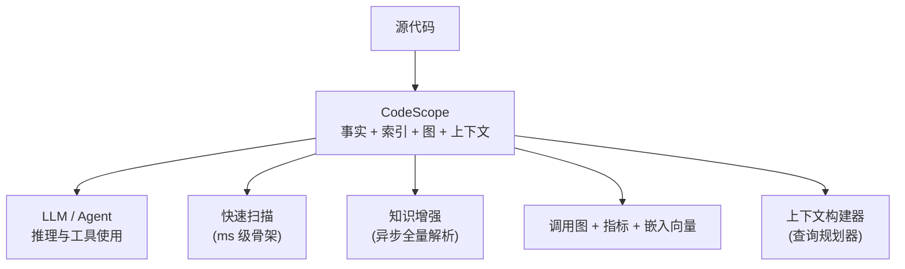
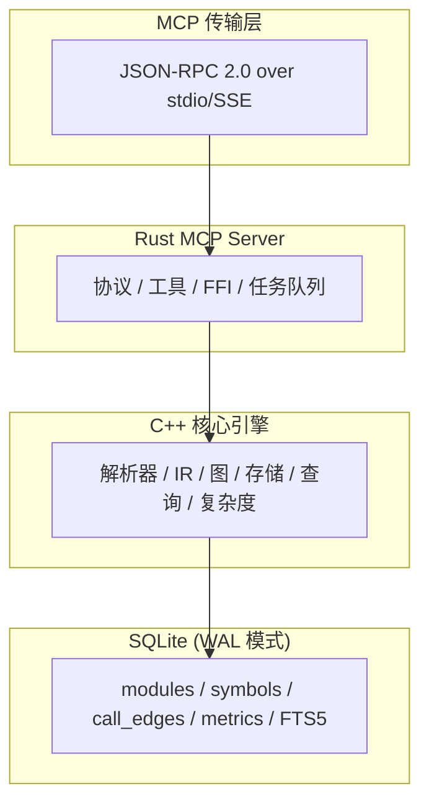
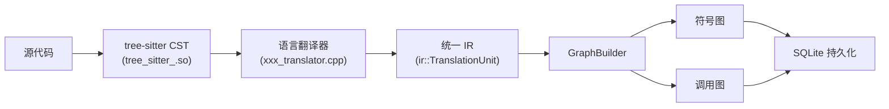

# CodeScope 架构文档

**版本**：0.2.0  
**更新日期**：2026-07-04

---

## 1. 系统概述

CodeScope 是一个基于 MCP（Model Context Protocol）协议的代码理解服务，它充当 AI 的**项目知识层**。AI 不再读取原始源文件，而是通过查询 CodeScope 的结构化知识库——事实、索引、图和上下文——来理解代码的结构、行为和关系。



---

## 2. 架构分层



### 2.1 Rust MCP Server

Rust 服务端负责 MCP 协议协商、工具注册以及与 C++ 引擎的 FFI 桥接。

**核心模块：**

| 模块 | 文件 | 职责 |
|------|------|------|
| `mcp/protocol` | `protocol.rs` | JSON-RPC 2.0 类型、MCP 工具定义 |
| `mcp/server` | `server.rs` | 请求分发、工具路由 |
| `mcp/transport` | `transport.rs` | stdin/stdout MCP 传输 |
| `ffi` | `mod.rs` | C FFI 绑定 + Tokio 后台任务 |
| `tools` | `mod.rs` | MCP 工具列表与执行 |

**工具调度流程：**

```
LLM → tools/call → server.rs:handle_call_tool()
    → tools::execute(project_id, name, args)
    → ffi::scan_project() / ffi::find_symbol() / ...
    → unsafe extern "C" → C++ 引擎
```

### 2.2 C++ 核心引擎

C++ 引擎是计算核心——负责解析、索引、图构建和查询。

**核心模块：**

| 模块 | 目录 | 职责 |
|------|------|------|
| Parser | `parser/` | tree-sitter 语法加载和 CST 解析 |
| IR | `ir/` | 统一 AST IR + 翻译器框架 |
| Graph | `graph/` | 调用图和符号依赖图构建 |
| Store | `store/` | SQLite 持久化层（schema + CRUD） |
| Query | `query/` | 图查询引擎、向量搜索、影响分析 |

**翻译管线：**



---

## 3. 两阶段设计

### Phase A：骨架索引（ms 级）

```
scan_project("/project/foo")
    ↓
遍历目录树
    ↓
加载 .gitignore 规则
    ↓
对每个源文件：
    detectLanguage() → 扩展名映射到语言
    detectDecl()     → 逐行声明检测
    extractName()    → 符号名提取
    ↓
写入：
    modules 表
    symbols 表     （analysis_state = SCANNED）
    entry_points 表
    symbol_status 表（is_stub, ready flags = 0）
    ↓
✓ AI 毫秒级可用
```

**各语言精度（严格模式）：**

| 语言 | 精确率 | 召回率 |
|------|--------|--------|
| Go | ~97% | ~96% |
| Python | ~98% | ~95% |
| C/C++（严格） | ~85% | ~90% |
| Rust | ~90% | ~90% |

### Phase B：知识增强（异步）

```
enhance_project（后台 Tokio 任务）
    ↓
对每个未增强的文件：
    tree-sitter 全量解析
    ↓
构建调用图 → call_edges 表
    ↓
计算复杂度 → metrics 表
    ↓
生成嵌入向量 → search_index + embeddings
    ↓
设置 analysis_state 标志：CALLGRAPH | METRICS | EMBEDDING
```

**性能基准：**

| 项目 | 快速扫描 | 增强阶段 | 符号数 | 调用边 |
|------|---------|---------|--------|--------|
| CodeScope（自扫描） | 32 ms | — | 2,902 | — |
| SQLite | 89 ms | — | 6,921 | — |
| Linux kernel/sched | 45 ms | 291 ms | 4,913 | 4,800 |
| Linux kernel/（核心） | 360 ms | 27 s | 40,335 | 45,573 |
| Linux fs/ | 1.8 s | — | 120,602 | — |
| goagent | 300 ms | — | 13,852 | — |

**平均吞吐量：约 100,000 符号/秒**

---

## 4. 数据库 Schema

单个 SQLite 文件（WAL 模式）中的 11 张表。

### 事实表（Phase A 写入）

| 表 | 说明 | 关键字段 |
|------|-------------|------------|
| `modules` | 目录模块树 | `id`, `parent_id`, `name`, `path`, `file_count` |
| `symbols` | 符号声明 | `id`, `project_id`, `module_id`, `kind`, `name`, `signature`, `language`, `file_path`, `line`, `column` |
| `entry_points` | 入口点符号 | `symbol_id`, `project_id`, `kind`（main/probe/initcall） |
| `call_edges` | 函数调用边 | `caller_symbol_id`, `callee_symbol_id`, `line`, `col` |
| `dependency_edges` | 模块依赖 | `source_module_id`, `target_module_id`, `external_name`, `kind` |

### 状态和索引表（Phase B 写入）

| 表 | 说明 | 关键字段 |
|------|-------------|------------|
| `symbol_status` | 每个符号的分析进度 | `callgraph_ready`, `metrics_ready`, `embedding_ready`, `is_stub` |
| `metrics` | 复杂度指标 | `owner_type`, `owner_id`, `cyclomatic`, `cognitive`, `lines` |
| `search_index` | FTS5 全文索引 | `title`, `summary`, `body` |
| `embeddings` | vec0 向量嵌入 | `symbol_id`, `vector[384]` |
| `index_tasks` | 后台任务跟踪 | `task_type`, `status`, `progress`, `error` |
| `file_scan_state` | 文件修改跟踪 | `file_mtime`, `file_size` |

### 触发器

```sql
CREATE TRIGGER trg_symbols_delete AFTER DELETE ON symbols
    DELETE FROM search_index WHERE symbol_id = old.id;
```

---

## 5. MCP 工具

共 16 个工具，按功能分类：

### 骨架扫描（Phase A）

| 工具 | 说明 |
|------|------|
| `codescope_scan` / `scan_project` | 快速扫描项目目录（ms 级） |
| `codescope_find_symbol` / `find_symbol` | 按名称查找符号 |
| `codescope_module_tree` / `get_module_tree` | 获取层级模块树 |
| `codescope_get_entry_points` / `get_entry_points` | 获取入口点 |

### 知识增强（Phase B）

| 工具 | 说明 |
|------|------|
| `codescope_enhance` / `enhance_project` | 后台全量增强 |
| `get_enhancement_status` | 检查增强进度 |

### 搜索与调用图

| 工具 | 说明 |
|------|------|
| `codescope_search` / `search` | 统一 FTS / 语义自适应搜索 |
| `codescope_get_callers` / `find_callers` | 查找调用者（自适应） |
| `codescope_get_callees` / `find_callees` | 查找被调用者（自适应） |
| `codescope_trace` | **两函数间 BFS 最短调用路径** |

### 项目分析

| 工具 | 说明 |
|------|------|
| `codescope_overview` / `project_overview` | 项目全貌 |
| `codescope_build_context` | **主力工具**：智能上下文组装 |
| `codescope_capabilities` | 标准化能力报告 |

### 旧版（已弃用，保留兼容）

`find_definition`, `get_callers`, `get_callees`, `search_code` 等。

---

## 6. 多语言支持

通过**三层架构**支持 8 种语言：

```
Layer 1: 快速扫描器 — 逐行模式匹配
    detectLanguage() — 扩展名 → 语言
    detectDecl()     — 语言感知关键字匹配
    extractName()    — 语言感知名称提取

Layer 2: 解析器 — tree-sitter 语法加载
    registerLanguage(name, so_path) → dlopen + dlsym
    parse() → CST

Layer 3: IR 翻译器 — CST → 统一 IR
    createTranslator(language) → Translator 子类
    translate() → ir::TranslationUnit
```

**当前支持：**

| 语言 | 语法 .so | 翻译器 | 快速扫描 |
|------|----------|--------|---------|
| Python | tree-sitter-python.so | python_translator.cpp | ✅ |
| C | tree-sitter-c.so | c_translator.cpp | ✅ |
| C++ | tree-sitter-cpp.so | cpp_translator.cpp | ✅ |
| Go | tree-sitter-go.so | go_translator.cpp | ✅ |
| Rust | tree-sitter-rust.so | rust_translator.cpp | ✅ |
| JavaScript | tree-sitter-javascript.so | javascript_translator.cpp | ✅ |
| TypeScript | tree-sitter-typescript.so | typescript_translator.cpp | ✅ |
| Java | tree-sitter-java.so | java_translator.cpp | ✅ |
| **Swift** | **tree-sitter-swift.so** | **—** | **✅ (快速扫描)** |

### Swift 编译器分析

| 指标 | 数值 |
|------|------|
| 目录 | `include/swift`（C++ 头文件） |
| 扫描时间 | **421 ms** |
| 符号数 | **25,860** |
| 模块数 | 59 |
| 语言 | c（Swift 编译器 C++ 实现） |
| 全量扫描预估（22,272 文件） | **20-35 秒**（Fast Scan） |
| 全量增强预估 | **5-15 分钟** |
| 日志 | `runtimelog/scan_swift.log`（18 KB） |

### Swift-C 互操作（5 层）

```
1. @_silgen_name     — 直接绑定 C 符号（Attr.h:691）
2. @_cdecl           — Swift 函数以 C ABI 导出（Attr.h:748）
3. @convention(c)    — C 函数指针类型（FrontendOptions.h:358）
4. UnsafePointer     — 手动内存管理（StandardTypesMangling.def:44）
5. AutoreleasingUnsafeMutablePointer — ObjC 桥接（StandardTypesMangling.def:31）
```

### Linux 内核调度器

```
快速扫描：  kernel/sched/ — 45 ms, 4,913 符号
增强阶段：  kernel/sched/ — 291 ms, 4,800 条调用边
全量内核：  kernel/      — 360 ms, 40,335 符号
```

**父子进程资源处理（写时复制 COW）：**
```
copy_process(kernel/fork.c:1994)
  → copy_mm(kernel/fork.c:1568)
    → dup_mm(kernel/fork.c:1527)
```

**防止抢占：**
```
preempt_count() — 每进程计数器；>0 时禁止抢占
__schedule()    — 仅在 preempt_count == 0 时切换
```

### USB 驱动子系统

```
快速扫描：  drivers/usb/ — 351 ms, 37,286 符号
模块：      40 个子目录（host, gadget, serial, storage, typec...）
入口点：    usb_register_driver()
```

---

## 8. 构建系统

### C++ 引擎

```bash
cd engine/build
cmake .. -DBUILD_TESTS=ON
make -j$(sysctl -n hw.ncpu)
```

**编译器：** C++23, Clang 17+  
**依赖：** sqlite3, tree-sitter, dl  
**编译缓存：** ccache（自动检测）

### Rust 服务器

```bash
cd server
cargo build --release
```

**版本：** 2024  
**关键依赖：** serde, serde_json, tokio, once_cell

### 语法文件

```bash
cd grammars && bash build.sh
```

使用 npm 安装的 tree-sitter 包，通过 gcc 编译为 .so。

---

## 9. 许可证

Apache 2.0
