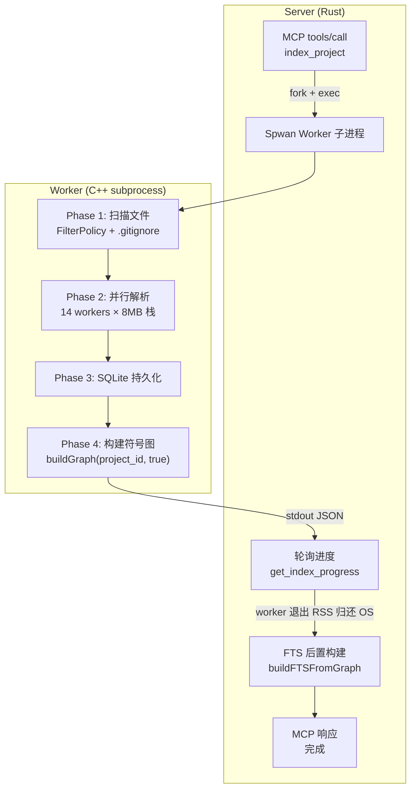
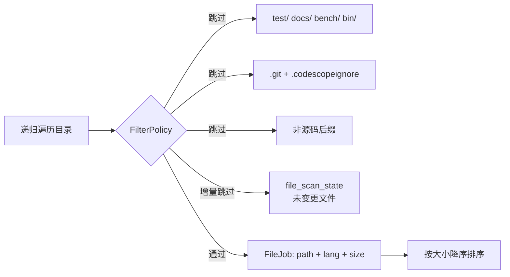
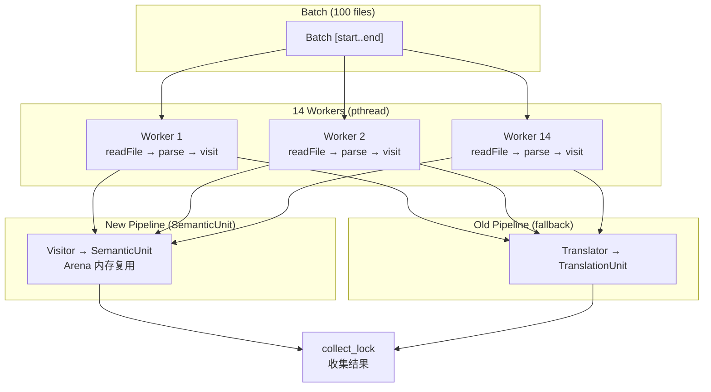
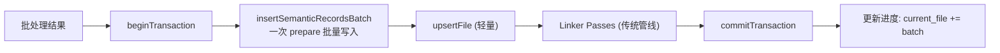
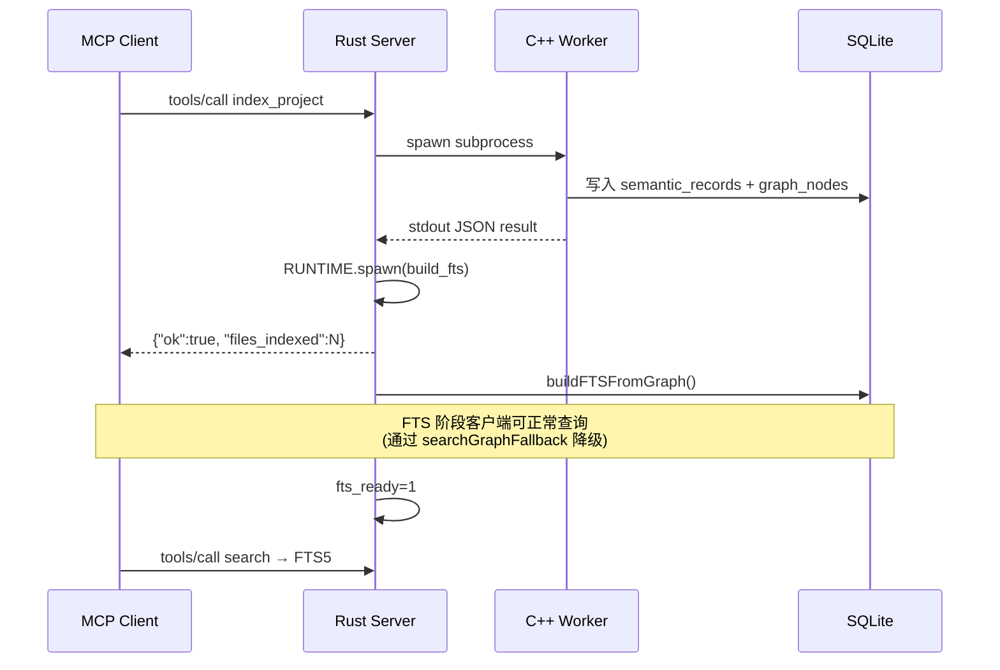
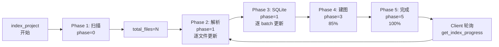

# CodeScope 架构文档

**版本**：0.2.0  
**更新日期**：2026-07-06

---

## 1. 系统概述

CodeScope 是一个基于 MCP（Model Context Protocol）协议的代码理解服务。它通过多阶段管线解析源代码，构建调用图和符号依赖图，持久化到 SQLite，并通过 MCP 工具暴露查询能力。

### 整体架构

```mermaid
flowchart LR
    subgraph "Client (AtomGit IDE / CLI)"
        client["MCP Client<br/>tools/list → tools/call"]
    end
    subgraph "CodeScope Server (Rust)"
        server["MCP Server<br/>(JSON-RPC 2.0 + stdio)"]
        ffi["FFI Bridge<br/>Rust ↔ C++"]
        worker_spawn["Worker Spawner<br/>子进程隔离"]
    end
    subgraph "Worker Subprocess (C++)"
        worker["Worker<br/>index_project()"]
        progress["Progress Tracking<br/>store::IndexProgress"]
        parser["Parser + Translator<br/>14 threads"]
        graph["GraphBuilder<br/>buildFTSFromGraph"]
    end
    subgraph "Storage"
        db["SQLite DB<br/>.codescope/codescope.db"]
    end

    client <-->|MCP JSON-RPC| server
    server -->| spawn_worker | worker_spawn
    worker_spawn -->|子进程 stdout JSON | worker
    worker -->|写入| db
    worker -->|更新| progress
    server -->|轮询 get_index_progress| ffi
    ffi -->|读取| progress
    server -->|RUNTIME.spawn| graph
    server -->|MCP Response| client
```

---

## 2. 索引流程

### 2.1 完整索引管线



### 2.2 Phase 1: 文件收集



### 2.3 Phase 2: 并行解析



### 2.4 Phase 3: SQLite 持久化



### 2.5 Phase 4: 后置处理


---

## 3. 组件

### 3.1 Rust MCP Server

| 模块 | 职责 |
|------|------|
| `mcp/` | JSON-RPC 2.0 协议 + stdio 传输 |
| `ffi/` | C++ FFI 桥接 + Tokio RUNTIME |
| `tools/` | MCP 工具注册与路由 |
| `main.rs` | Server/CLI/Worker 三模式入口 |

### 3.2 C++ 引擎

| 文件 | 行数 | 职责 |
|------|:----:|------|
| `engine.cpp` | 49 | 入口 + 全局变量 |
| `engine_helpers.cpp` | 112 | readFile, detectLanguage, dupString |
| `engine_lifecycle.cpp` | 119 | init, shutdown, create_project |
| `engine_index.cpp` | ~945 | index_file, index_project (含进度追踪) |
| `engine_scanner.cpp` | 1,180 | 快速扫描器 |
| `engine_queries.cpp` | 1,019 | 查询/增强/调用链/上下文 + FTS 降级 |
| `engine_ffi.cpp` | ~660 | FFI 函数 + build_fts + get_index_progress |
| `filter_policy.cpp` | — | 目录/文件/后缀过滤 + .gitignore 逐级匹配 |
| `store/store.cpp` | ~3,060 | SQLite 存储 + FTS + 进度管理 + 增量索引 |

### 3.3 FTS 后置构建



---

## 4. 查询性能基准

| 查询 | 平均延迟 | 说明 |
|------|:--------:|------|
| `get_graph_stats` | **<1 ms** | 纯 SQL COUNT |
| `get_hotspots` | **<2 ms** | SQL JOIN + GROUP BY |
| `find_callers` / `find_callees` | **<1 ms** | 索引覆盖的 JOIN |
| `search`（FTS） | **<5 ms** | FTS5 全文搜索 |
| `search`（graph fallback） | **<10 ms** | LIKE 降级搜索 |
| `get_module_tree` | **<1 ms** | 轻量查询 |
| `get_entry_points` | **<1 ms** | 索引查询 |
| `get_communities` | **50-500 ms** | 全图 Label Propagation |
| `get_index_progress` | **<1 ms** | 原子读全局变量 |

---

## 5. 索引进度追踪



| 字段 | 说明 |
|------|------|
| `project_id` | 项目 ID |
| `total_files` | 总文件数 |
| `current_file` | 已处理文件数 |
| `phase` | 0=扫描 1=解析 2=链接 3=建图 4=建FTS 5=完成 |
| `percent` | 0-100 百分比 |
| `current_file_path` | 当前处理文件路径 |
| `error` | 错误信息（如有） |

---

## 6. 构建

```bash
make build      # 编译引擎 + 服务器
make test       # 运行全部测试
make clean      # 清理
```

### 依赖

- **编译器**: C++23, Clang 17+
- **运行时**: tree-sitter (`.so`), sqlite-vec (`vec0.dylib`)
- **构建**: cmake 3.30+, Rust 2024, npm

---

## 7. 许可证

Apache 2.0
