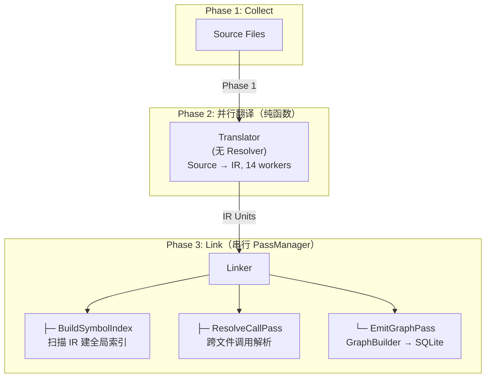

# CodeScope 架构文档

**版本**：0.2.0  
**更新日期**：2026-07-05

---

## 1. 系统概述

CodeScope 是一个基于 MCP（Model Context Protocol）协议的代码理解服务。它通过多阶段管线解析源代码，构建调用图和符号依赖图，持久化到 SQLite，并通过 MCP 工具暴露查询能力。

### 四层管线



---

## 2. 组件

### 2.1 Rust MCP Server

| 模块 | 职责 |
|------|------|
| `mcp/` | JSON-RPC 2.0 协议 + stdio 传输 |
| `ffi/` | C++ FFI 桥接 |
| `tools/` | 16 个 MCP 工具注册与路由 |

### 2.2 C++ 引擎分拆

`engine.cpp` 已拆分为 6 个独立文件：

| 文件 | 行数 | 职责 |
|------|:----:|------|
| `engine.cpp` | 49 | 入口 + 全局变量 |
| `engine_helpers.cpp` | 112 | readFile, detectLanguage, dupString |
| `engine_lifecycle.cpp` | 119 | init, shutdown, create_project |
| `engine_index.cpp` | 525 | index_file, index_project |
| `engine_scanner.cpp` | 1,180 | 快速扫描器 |
| `engine_queries.cpp` | 1,019 | 查询/增强/调用链/上下文 |
| `engine_ffi.cpp` | 622 | 定义/引用/邻居/DSL/复杂度 |

### 2.3 Linker 模块（新增）

Linker 运行串行 Pass 管线，所有 Pass 共享一个完整的 `ProjectSymbolIndex`：

| Pass | 职责 |
|------|------|
| `BuildSymbolIndexPass` | 从所有 IR 的 all_nodes 扫一次建索引（几毫秒） |
| `ResolveCallPass` | 对每个 CallExpr 查全局索引，优先 `.c`/`.cpp` 定义 |
| `EmitGraphPass` | GraphBuilder → 持久化到 SQLite |

---

## 3. 性能基准

### 全量解析

| 项目 | 文件数 | 节点 | 函数 | CALLS | ★跨文件 | 耗时 |
|------|:-----:|:----:|:----:|:-----:|:------:|:----:|
| CodeScope | 47 | 12K | 3.8K | 23K | 23 | 3s |
| goagent | 2,651 | 155K | 49K | 56K | 49K | 30s |
| **Linux 内核** | **64,694** | **12M** | **3.8M** | **3.7M** | **1.5M** | **3min 07s** |

### 跨文件解析能力

跨文件解析占比因语言而异：

| 项目 | 跨文件比例 | 说明 |
|------|:---------:|------|
| CodeScope (C++) | ~0.1% | 大部分调用通过 `g_store->method()` 指针方式 |
| goagent (Go) | **86%** | Go 天然跨包调用 |
| Linux 内核 (C) | **40%** | 头文件声明 + `.c` 实现 |

### 安装

```bash
bash install.sh
```

一键安装 tree-sitter 语法、sqlite-vec、编译引擎 + 服务器。

---

## 4. 构建

```bash
make build      # 编译引擎 + 服务器
make test       # 运行全部测试（17 个）
make clean      # 清理
```

### 依赖

- **编译器**: C++23, Clang 17+
- **运行时**: tree-sitter (`.so`), sqlite-vec (`vec0.dylib`)
- **构建**: cmake 3.30+, Rust 2024, npm

---

## 5. 许可证

Apache 2.0
