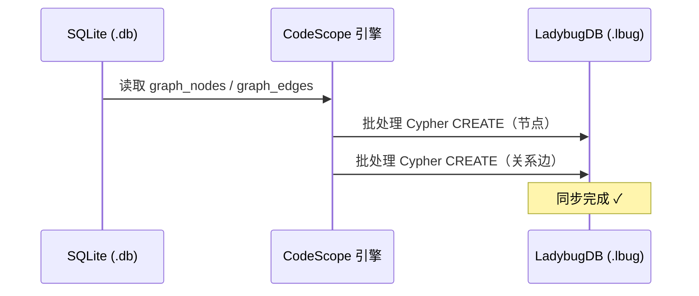
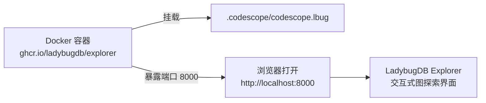
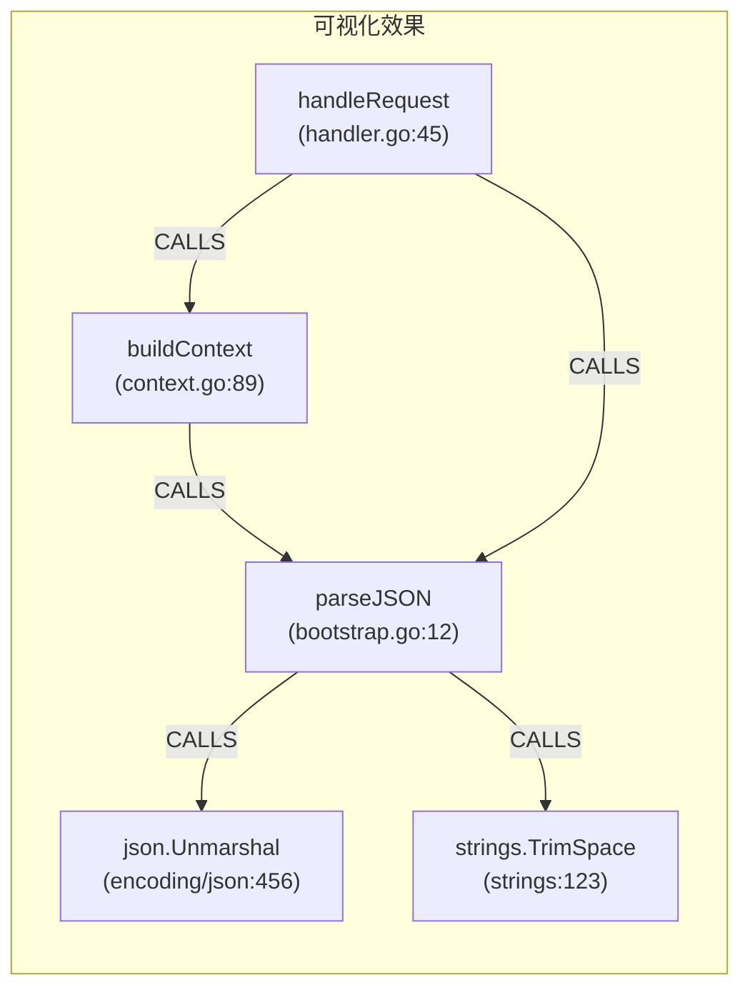
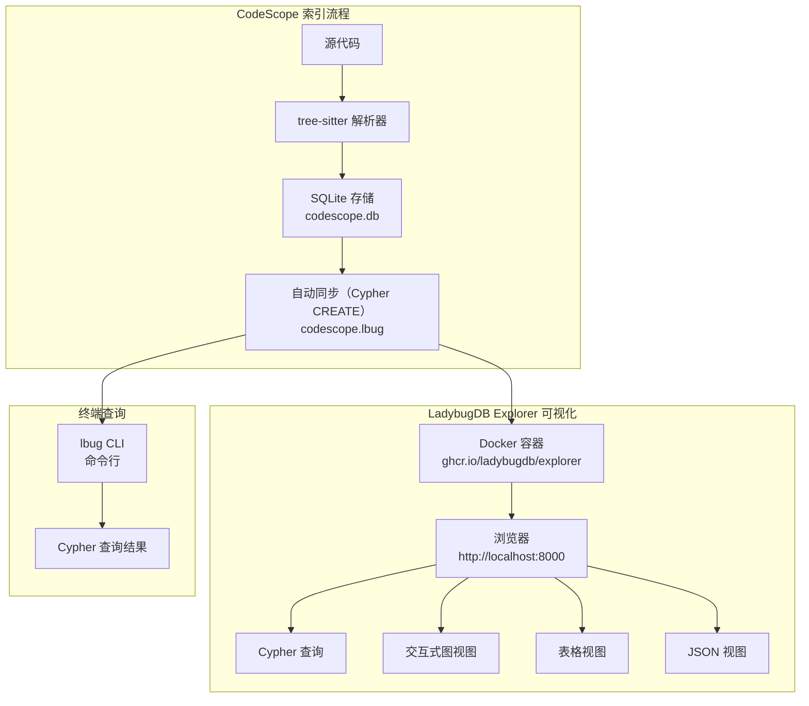

# CodeScope 与 LadybugDB Explorer 可视化指南

> **最后更新**: 2026-07-20

本指南介绍如何使用 [LadybugDB Explorer](https://docs.ladybugdb.com/visualization/lbug-explorer/) 对 CodeScope 的代码图数据进行交互式可视化探索。

---

## 前提条件

- **Docker**：LadybugDB Explorer 以 Docker 容器运行。[安装 Docker](https://docs.docker.com/get-docker/)
- **CodeScope 数据**：项目需要先完成索引（通过 `codescope index_project`），这会生成 `.codescope/codescope.lbug` 文件

---

## 快速开始

### 步骤1: 确认 LadybugDB 文件存在

```bash
ls -la .codescope/codescope.lbug
```

如果文件不存在或大小为 0，重新索引项目：

```bash
codescope index_project
```

### 步骤2: 从 SQLite 同步数据到 LadybugDB

从 SQLite 到 LadybugDB 的同步是**自动完成的**。当你运行 `codescope index_project` 时，引擎会自动使用批处理的 Cypher `CREATE` 语句将图数据从 SQLite 同步到 LadybugDB。无需任何手动步骤。

> **注意**：引擎使用 Cypher `CREATE` 而非 `COPY FROM`，因为内嵌的 LadybugDB 0.18.2 中的 `COPY FROM`（CSV 批量导入）存在已知缺陷，会以 `state=1` 错误失败。Cypher `CREATE` 是可靠的替代方案。



#### 故障排查

如果索引后 `.lbug` 文件为空，请确认引擎已使用 `HAS_LADYBUG` 编译（检查构建输出中是否有 `LadybugDB: found at ...`）。引擎使用 Cypher `CREATE` 作为 `COPY FROM` 的可靠替代方案，后者在 LadybugDB 0.18.2 中存在已知问题。

### 步骤3: 启动 LadybugDB Explorer

```bash
docker run -p 8000:8000 \
  -v "$(pwd)/.codescope:/database" \
  -e LBUG_FILE=codescope.lbug \
  --rm ghcr.io/ladybugdb/explorer:latest
```

### 步骤4: 在浏览器中打开

访问 [http://localhost:8000](http://localhost:8000)



---

## 使用示例

### 1. 浏览所有符号

在 Query 面板中运行：

```cypher
MATCH (n:GraphNode) RETURN n.name, n.language, n.file_path LIMIT 50;
```

点击 **Graph** 视图，以交互式图的形式查看节点。

### 2. 查找所有 Go 函数

```cypher
MATCH (n:GraphNode)
WHERE n.language = 'go'
RETURN n.name, n.file_path, n.start_row
ORDER BY n.name;
```

### 3. 可视化调用关系

```cypher
MATCH (n:GraphNode)-[c:CALLS]->(m:GraphNode)
RETURN n.name, c.call_site_line, m.name
LIMIT 100;
```

切换到 **Graph** 视图，查看调用关系的交互式网络图。



### 4. 查找特定函数的调用者

```cypher
MATCH (caller:GraphNode)-[c:CALLS]->(callee:GraphNode)
WHERE callee.name = 'targetFunction'
RETURN caller.name, caller.file_path, c.call_site_line;
```

### 5. 查找被调用最多的函数

```cypher
MATCH (caller:GraphNode)-[c:CALLS]->(callee:GraphNode)
RETURN callee.name, count(c) AS call_count
ORDER BY call_count DESC
LIMIT 20;
```

### 6. 查找热点函数（高入度 + 高出度）

```cypher
MATCH (caller:GraphNode)-[c:CALLS]->(callee:GraphNode)
WITH callee, count(c) AS incoming
MATCH (callee)-[c2:CALLS]->(other:GraphNode)
WITH callee, incoming, count(c2) AS outgoing
RETURN callee.name, incoming, outgoing
ORDER BY incoming DESC, outgoing DESC
LIMIT 20;
```

### 7. 两个函数之间的最短调用路径

```cypher
MATCH p = shortestPath(
    (a:GraphNode {name: 'funcA'})-[*..10]->(b:GraphNode {name: 'funcB'})
)
RETURN p;
```

---

## Schema 参考

### GraphNode（节点表）

| 列名 | 类型 | 说明 |
|------|------|------|
| `id` | INT64 | 主键（对应 SQLite graph_nodes.id） |
| `project_id` | INT64 | 项目标识符 |
| `ir_node_id` | INT64 | 内部 IR 节点引用 |
| `node_type` | INT32 | 0=函数, 1=类, 2=变量, 3=类型, ... |
| `name` | STRING | 符号名称 |
| `qualified_name` | STRING | 完全限定名（如 `pkg.FuncName`） |
| `signature` | STRING | 函数签名（参数 + 返回值类型） |
| `module_path` | STRING | 模块/包路径 |
| `file_path` | STRING | 源文件路径 |
| `language` | STRING | 编程语言 |
| `start_row` | INT32 | 源文件中的起始行 |
| `start_col` | INT32 | 起始列 |
| `end_row` | INT32 | 结束行 |
| `end_col` | INT32 | 结束列 |
| `parent_id` | INT64 | 父节点 ID（用于包含关系） |
| `is_entry_point` | BOOL | 是否为入口点（main, init 等） |
| `embedding_ready` | BOOL | 向量嵌入是否已计算 |
| `metrics_ready` | BOOL | 指标是否已计算 |

### CALLS（关系表）

| 列名 | 类型 | 说明 |
|------|------|------|
| `FROM` | GraphNode | 调用者节点 |
| `TO` | GraphNode | 被调用者节点 |
| `project_id` | INT64 | 项目标识符 |
| `edge_type` | INT32 | 3=调用, 1=包含, 2=引用 |
| `call_site_line` | INT32 | 调用点所在行号 |
| `label` | STRING | 可选标签 |

### RELATES（关系表）

| 列名 | 类型 | 说明 |
|------|------|------|
| `FROM` | GraphNode | 源节点 |
| `TO` | GraphNode | 目标节点 |
| `project_id` | INT64 | 项目标识符 |
| `type` | INT32 | 关系类型 |

---

## 数据流总览



---

## 小贴士

### 性能建议

- 对于大图（10 万+ 节点），使用 `LIMIT` 避免浏览器过载
- 在 `WHERE` 子句中使用索引属性（`name`、`language`、`file_path`）加速查询
- Explorer 在浏览器中运行——所有计算在服务端执行

### 导出数据

从查询面板的结果视图可以将结果导出为 JSON 或 CSV。

### 只读模式

以只读模式启动（防止意外修改）：

```bash
docker run -p 8000:8000 \
  -v "$(pwd)/.codescope:/database" \
  -e LBUG_FILE=codescope.lbug \
  -e MODE=READ_ONLY \
  --rm ghcr.io/ladybugdb/explorer:latest
```

### 故障排查

| 问题 | 解决方案 |
|------|----------|
| **"File not found" 错误** | 确保 `.lbug` 文件路径正确，Docker 挂载卷指向正确的目录 |
| **"Connection refused"** | 确认 Docker 正在运行（`docker ps` 检查），端口 8000 未被占用 |
| **查询结果为空** | 运行 `MATCH (n) RETURN count(n)` 验证是否有数据。如果为 0，重新执行同步步骤 |
| **查询缓慢** | 在查询中添加 `LIMIT`。对于大图，从 `LIMIT 50` 开始逐步增加 |