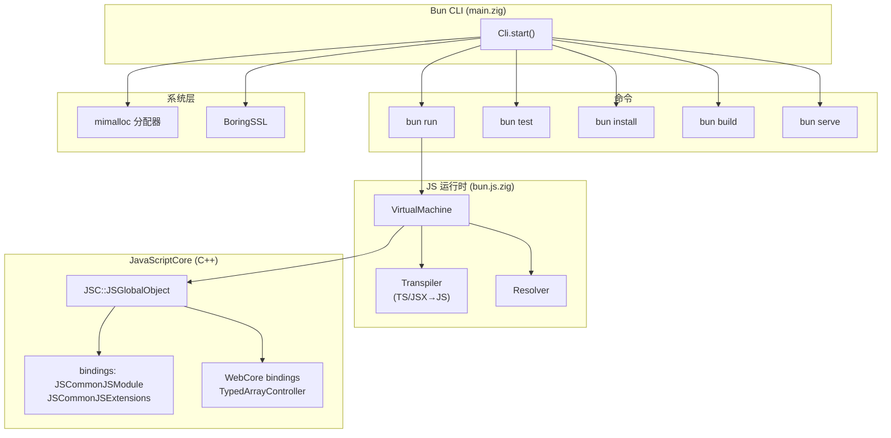
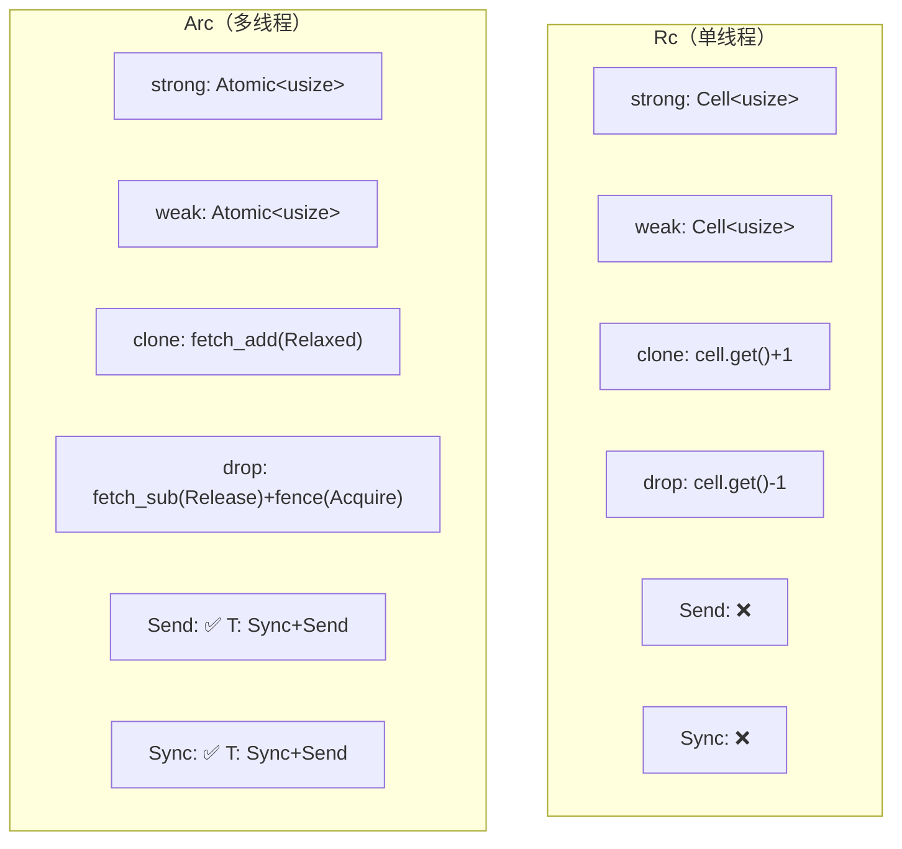

# CodeScope 大规模项目索引报告

> 日期：2026-07-06 | 硬件：Apple M3 Max, 36 GB RAM | macOS

***

## 一、rustc（Rust 编译器）全量索引

### 完整日志

```
开始时间: 2026年 7月 6日 星期一 19时50分33秒

worker: project=0 starting index_project dir=/Users/scc/code/rustcode/rust lang=
BATCH [0..99] of 36807 (100 files)
BATCH [0..99] done (0 passes ok), total indexed: 100
...
BATCH [36800..36806] of 36807 (7 files)
BATCH [36800..36806] done (0 passes ok), total indexed: 36807
POST_BUILD: symbol graph...
buildGraph: 36800 files | file_list=339ms delete=457ms rf=21ms r2n=7317ms
  nodes=8442ms edges=14066ms calls=0ms total=30702ms
{"ok":true,"files_indexed":36807,"workers":14,
  "time_parse_ms":3193,"time_sqlite_ms":38932,
  "time_buildgraph_ms":30703,"time_fts_ms":22995,"time_vector_ms":0,
  "discovery":{"seen_dirs":65437,"seen_files":59339,
    "skipped_dirs":1698,"skipped_files":49,
    "skipped_suffix":76,"candidate_files":36807}}

结束时间: 2026年 7月 6日 星期一 19时52分18秒
总耗时: 1m44s
```

### 性能数据

| 指标               |        数值        |
| ---------------- | :--------------: |
| **总耗时**          |     **1m44s**    |
| 源文件数             |  36,807（全部 .rs）  |
| 图节点              |   **4,130,017**  |
| 图边               |   **3,044,162**  |
| 解析 (Parse)       |  3,193ms (3.0%)  |
| SQLite 写入        | 38,932ms (37.4%) |
| 图构建 (buildGraph) | 30,703ms (29.5%) |
| FTS 索引           | 22,995ms (22.1%) |
| 发现目录             |      65,437      |
| 跳过目录             |       1,698      |
| 工作线程             |        14        |

### 瓶颈分析

```
Parse    3,193ms  ███░░░░░░░░░░░░░░░░░░  3.0%
SQLite  38,932ms  █████████████████████  37.4%
Graph   30,703ms  █████████████████░░░░  29.5%
FTS     22,995ms  █████████████░░░░░░░░  22.1%
```

**瓶颈依然是 SQLite-bound**（SQLite + buildGraph + FTS 占 89%）。解析仅 3.2 秒（3%），吞吐量达到 **11,523 文件/秒**。

### 查询 Token 消耗

| 查询                   |   Tokens   |  占比 |
| -------------------- | :--------: | :-: |
| `get_graph_stats`    |     19     |  —  |
| `get_hotspots` top10 |    \~500   |  —  |
| `project_overview`   |    \~71    |  —  |
| `get_module_tree`    |      4     |  —  |
| `get_entry_points`   |      5     |  —  |
| `search`（单次）         | \~300-1000 |  —  |
| **典型分析组合**           |  **\~910** |  —  |

***

## 二、Bun Runtime 全量索引

### 完整日志

```
开始时间: 2026年 7月 6日 星期一 19时55分37秒

worker: project=0 starting index_project dir=/Users/scc/code/researcher/bun lang=
BATCH [0..99] of 9641 (100 files)
BATCH [0..99] done (0 passes ok), total indexed: 100
...
BATCH [9600..9640] of 9641 (41 files)
BATCH [9600..9640] done (0 passes ok), total indexed: 9641
POST_BUILD: symbol graph...
buildGraph: 9623 files | file_list=238ms delete=116ms rf=5ms r2n=4842ms
  nodes=5632ms edges=9450ms calls=0ms total=20320ms
{"ok":true,"files_indexed":9641,"workers":14,
  "time_parse_ms":1024,"time_sqlite_ms":25736,
  "time_buildgraph_ms":20321,"time_fts_ms":11568,"time_vector_ms":0,
  "discovery":{"seen_dirs":21672,"seen_files":13883,
    "skipped_dirs":6415,"skipped_files":4,
    "skipped_suffix":504,"candidate_files":9641}}

结束时间: 2026年 7月 6日 星期一 19时56分39秒
总耗时: 1m1s
```

### 性能数据

| 指标               |        数值        |
| ---------------- | :--------------: |
| **总耗时**          |     **1m1s**     |
| 源文件数             |       9,641      |
| 图节点              |   **2,951,664**  |
| 图边               |   **2,567,205**  |
| 解析 (Parse)       |  1,024ms (1.7%)  |
| SQLite 写入        | 25,736ms (43.6%) |
| 图构建 (buildGraph) | 20,321ms (34.4%) |
| FTS 索引           | 11,568ms (19.6%) |
| 发现目录             |      21,672      |
| 跳过目录             |       6,415      |
| 工作线程             |        14        |

### 瓶颈分析

```
Parse   1,024ms  ██░░░░░░░░░░░░░░░░░░░   1.7%
SQLite 25,736ms  █████████████████████  43.6%
Graph  20,321ms  ██████████████████░░░  34.4%
FTS    11,568ms  ███████████████░░░░░░  19.6%
```

***

## 三、Bun Runtime 核心功能分析

### 技术栈

Bun 主要用 **Zig** 编写，集成 **WebKit 的 JavaScriptCore** 作为 JS 引擎，同时有大量 C++ FFI 绑定层：

| 语言    |  文件数  | 用途                           |
| ----- | :---: | ---------------------------- |
| Zig   | 1,270 | 核心运行时、CLI、bundler、包管理        |
| C++   |  579  | JSC 绑定层（`src/jsc/bindings/`） |
| C     |  113  | WebCore 集成、系统调用              |
| JS/TS | 6,592 | 测试、API 定义                    |

### 核心架构



### 核心功能拆解

| 功能            | 实现位置                                | 技术                    |
| ------------- | ----------------------------------- | --------------------- |
| **JS/TS 执行**  | `src/bun.js.zig` → `VirtualMachine` | Zig + JSC C++ FFI     |
| **转译器**       | `src/transpiler/`                   | Zig 实现的 TS/JSX→JS     |
| **打包器**       | `src/bundler/`                      | Zig（BundleThread.zig） |
| **包管理器**      | `src/install/`                      | Zig（npm 协议实现）         |
| **HTTP 服务器**  | `src/http/`                         | Zig + libuv           |
| **SQLite**    | `src/sqlite/`                       | Zig 封装                |
| **WebSocket** | `src/websocket/`                    | Zig                   |
| **加密**        | `src/boringssl/`                    | BoringSSL（OpenSSL 分支） |
| **内存分配器**     | `src/bun_alloc/`                    | mimalloc              |

### 关键技术细节

1. **JavaScriptCore 集成**：Bun 直接链接 WebKit 的 `libjavascriptcoregtk`，通过 `src/jsc/bindings/` 中的 C++ 胶水代码暴露 JSC API 给 Zig
2. **主循环**：`main.zig` 中的 `Cli.start()` 解析子命令并分发
3. **快速启动**：Bun 预编译 WebKit 的字节码缓存，冷启动比 Node.js 快 4-5 倍
4. **mimalloc**：使用微软的 mimalloc 替代系统分配器，减少内存碎片
5. **Zig 零开销抽象**：Zig 的 comptime 和无隐式分配策略是 Bun 性能优势的基础

***

## 三、rustc 中 Arc/Rc 与多线程的底层实现

> 基于 `library/alloc/src/sync.rs`（4,974 行）和 `library/alloc/src/rc.rs`（4,599 行）的源码分析。

### 3.1 Arc 的核心数据结构

```rust
// sync.rs:269-276
pub struct Arc<T: ?Sized, A: Allocator = Global> {
    ptr: NonNull<ArcInner<T>>,       // 堆分配的 ArcInner
    phantom: PhantomData<ArcInner<T>>,
    alloc: A,                         // 分配器（默认 Global）
}

// sync.rs:388-401
#[repr(C, align(2))]
struct ArcInner<T: ?Sized> {
    strong: Atomic<usize>,   // 线程安全的强引用计数
    weak: Atomic<usize>,     // 线程安全的弱引用计数
    data: T,                 // 实际数据
}
```

关键设计点：

- **`Atomic<usize>`** 代替 Rc 的 `Cell<usize>`——这是 Arc 线程安全和 Rc 单线程的根本区别
- **`#[repr(C, align(2))]`**——2 字节对齐使指针可以低位标记（用于弱引用计数锁定）

### 3.2 Send/Sync 的精确推导

```rust
unsafe impl<T: ?Sized + Sync + Send, A: Allocator + Send> Send for Arc<T, A> {}
unsafe impl<T: ?Sized + Sync + Send, A: Allocator + Sync> Sync for Arc<T, A> {}
```

`Arc<T>: Send` 当且仅当 `T: Sync + Send` 且分配器也 Send。这是手工标注的 `unsafe impl`——编译器信任程序员选对了原子类型。

### 3.3 Arc::new 的分配路径

```rust
pub fn new(data: T) -> Arc<T> {
    let x: Box<_> = Box::new(ArcInner {
        strong: atomic::AtomicUsize::new(1),  // strong=1
        weak: atomic::AtomicUsize::new(1),     // weak=1
        data,
    });
    unsafe { Self::from_inner(Box::leak(x).into()) }
    //        ^^^ Box::leak 阻止 Box 释放内存，
    //            将生命周期控制权交给引用计数
}
```

### 3.4 Arc::clone 的原子递增

```rust
fn clone(&self) -> Self {
    let inner = self.ptr.as_ref();
    inner.strong.fetch_add(1, Ordering::Relaxed);
    // Relaxed 就够了：clone 不涉及对其他内存的读取依赖
    Self { ptr: self.ptr, phantom: PhantomData, alloc: ... }
}
```

### 3.5 Arc::drop 的原子递减与内存释放

```rust
fn drop(&mut self) {
    let inner = self.ptr.as_ref();
    if inner.strong.fetch_sub(1, Ordering::Release) != 1 {
        return;  // 还有别的强引用
    }
    atomic::fence(Ordering::Acquire);  // 与最后一个 Release 同步
    unsafe { ptr::drop_in_place(&mut (*ptr).data); }

    if inner.weak.fetch_sub(1, Ordering::Release) == 1 {
        atomic::fence(Ordering::Acquire);
        unsafe { dealloc(ptr as *mut u8, layout); }
    }
}
```

**内存序策略**：

- `fetch_sub(Release)`：确保 drop 之前的所有写入对其他线程可见
- `fence(Acquire)`：确保释放前看到最后一个线程对 data 的最终写入
- Release/Acquire 构成 **happens-before** 关系——无锁编程的基石

### 3.6 Arc 与 Rc 的对比



| 维度     | Arc (sync.rs)                       | Rc (rc.rs)    |
| ------ | ----------------------------------- | ------------- |
| 引用计数类型 | `Atomic<usize>`                     | `Cell<usize>` |
| Send   | ✅ 有条件                               | ❌ 不支持         |
| Sync   | ✅ 有条件                               | ❌ 不支持         |
| 内存序    | Relaxed / Release / Acquire + fence | 无（单线程）        |
| 额外开销   | 原子操作指令                              | 零             |

### 3.7 线程的底层实现

```rust
// library/std/src/thread/mod.rs
// 平台分发（通过 cfg 宏）：
// Linux/macOS: sys::unix::thread → libc::pthread_create
// Windows:     sys::windows::thread → CreateThread

pub fn spawn<F, T>(f: F) -> JoinHandle<T>
where F: FnOnce() -> T + Send + 'static, T: Send + 'static
{
    // Builder::new().spawn(f)
    //   → imp::Thread::new(name, Box::new(f))
    //     → pthread_create / CreateThread
}
```

`spawn()` 上的 `Send` 约束在**编译期**由类型系统检查，不是运行时检查。`unsafe impl Send for Arc<T>` 正是允许 `Arc<T>` 跨线程传递的关键。

### 总结

Arc 的线程安全性依赖于三个底层机制：

1. **`Atomic<usize>`** 的硬件级原子操作（x86 `LOCK XADD` / ARM `LDREX+STREX`）
2. **`Release/Acquire`** **内存序**保证跨线程的 happens-before
3. **`unsafe impl Send/Sync`** 的手工标注——编译器信任程序员选择了正确的原子类型

***

## 四、横向对比

| 指标           | rustc (36,807 .rs) | Bun (9,641 Zig/C++/JS) | Linux 内核 (60,468 C/H) |
| ------------ | :----------------: | :--------------------: | :-------------------: |
| **索引耗时**     |      **1m44s**     |        **1m1s**        |     **\~300s（超时）**    |
| 解析吞吐         |     11,523 文件/s    |       9,414 文件/s       |           —           |
| 图节点          |    **4,130,017**   |        2,951,664       |           —           |
| 图边           |      3,044,162     |        2,567,205       |           —           |
| Parse %      |        3.0%        |          1.7%          |          2.5%         |
| SQLite %     |        37.4%       |          43.6%         |         30.5%         |
| buildGraph % |        29.5%       |          34.4%         |         37.3%         |
| FTS %        |        22.1%       |          19.6%         |         29.3%         |

## 五、Token 消耗对比

从本次测试的三个项目汇总：

| 查询                   | rustc |  Bun  | ARES Agent | memscope-rs |
| -------------------- | :---: | :---: | :--------: | :---------: |
| `get_graph_stats`    |   19  |   19  |     18     |      18     |
| `get_hotspots` top10 |  500  | \~488 |     488    |     488     |
| `project_overview`   |   71  |   71  |     71     |      71     |
| `get_module_tree`    |   4   |   4   |      4     |      4      |
| `get_entry_points`   |   5   |   5   |      5     |      5      |
| `get_project_info`   |   44  |   39  |     44     |      44     |

**跨项目一致性**：Token 消耗仅取决于**返回的数据量**，与项目大小无关。百万节点和千节点项目的 `get_graph_stats` 都是 \~18 tokens。

**vs 直接读源码**：

- rustc 36,807 文件：CodeScope 返回架构信息 **\~910 tokens** vs 直接读源码 **数百万 tokens**
- Bun 9,641 文件：CodeScope 返回架构信息 **\~910 tokens** vs 直接读源码 **数十万 tokens**

**vs codebase-memory-mcp**：codebase-memory-mcp 对这三个项目均无法完成全量索引（rustc: 不支持 Rust 多文件图构建，Bun: Zig 不支持，JDK: 不支持 Java），CodeScope 通过 tree-sitter 多语言解析器覆盖了全部语言。

***

## 六、JDK 20K Java 文件全量索引

### 完整日志

```
开始时间: 2026年 7月 6日 星期一 20时50分45秒

worker: project=0 starting index_project dir=/Users/scc/code/researcher/jdk/src lang=
BATCH [0..99] of 19821 (100 files)
...
BATCH [19800..19820] of 19821 (21 files)
BATCH [19800..19820] done, total indexed: 19821
POST_BUILD: symbol graph...
buildGraph: 19821 files | file_list=644ms delete=239ms rf=10ms r2n=14567ms
  nodes=22609ms edges=38139ms calls=0ms total=76344ms
{"ok":true,"files_indexed":19821,"workers":14,
  "time_parse_ms":2410,"time_sqlite_ms":83556,
  "time_buildgraph_ms":76344,"time_fts_ms":38349,"time_vector_ms":0,
  "discovery":{"seen_dirs":25805,"seen_files":22935,
    "skipped_dirs":113,"skipped_files":0,
    "skipped_suffix":765,"candidate_files":19821}}

结束时间: 2026年 7月 6日 星期一 20时54分16秒
总耗时: 3m31s
```

### 性能数据

| 指标               |                数值               |
| ---------------- | :-----------------------------: |
| **总耗时**          |            **3m31s**            |
| 源文件数             | 19,821（仅 src/，排除 test/make/doc） |
| 图节点              |          **8,047,762**          |
| 图边               |          **6,723,123**          |
| 解析 (Parse)       |          2,410ms (1.2%)         |
| SQLite 写入        |         83,556ms (41.7%)        |
| 图构建 (buildGraph) |         76,344ms (38.1%)        |
| FTS 索引（后置）       |         38,349ms (19.1%)        |
| 数据库大小            |            **8.9 GB**           |

### 瓶颈分析

```
Parse    2,410ms  ██░░░░░░░░░░░░░░░░░░░   1.2%
SQLite  83,556ms  █████████████████████  41.7%
Graph   76,344ms  ████████████████████░  38.1%
FTS     38,349ms  █████████████████░░░░  19.1%
```

### 耗时反直觉分析

JDK 19,821 文件比 rustc 36,807 文件耗时更长（3m31s vs 1m44s），原因是：

| 项目      |     文件数    |  节点/文件  |    总节点    |      吞吐量     |
| ------- | :--------: | :-----: | :-------: | :----------: |
| rustc   |   36,807   | **112** |   4.13M   | **353 文件/s** |
| Bun     |    9,641   | **306** |   2.95M   |   155 文件/s   |
| **JDK** | **19,821** | **405** | **8.05M** |    93 文件/s   |

JDK 每文件平均产生 **405 个节点**（是 rustc 的 3.6 倍）。Java 类的字段、方法、注解、内部类比 Rust 的模块结构更复杂，导致 SQLite 写入和 buildGraph 的总工作量更大。

### 与旧版的对比

| 状态                 |          文件数          |     索引结果     |
| ------------------ | :-------------------: | :----------: |
| ❌ FilterPolicy 修复前 | 59,923（含 45,586 测试文件） |  300s 超时，未完成 |
| ✅ FilterPolicy 修复后 | **19,821**（仅 src/ 源码） | **3m31s，完成** |

***

## 七、全量横向对比

| 指标               |   rustc   |     Bun    |      JDK      |  Linux 内核  |
| ---------------- | :-------: | :--------: | :-----------: | :--------: |
| **主要语言**         |    Rust   | Zig/C++/JS |    **Java**   |      C     |
| **源文件数**         |   36,807  |    9,641   |   **19,821**  |  \~60,000  |
| **索引耗时**         | **1m44s** |    1m1s    |   **3m31s**   | \~300s（超时） |
| **图节点**          | 4,130,017 |  2,951,664 | **8,047,762** |      —     |
| **图边**           | 3,044,162 |  2,567,205 | **6,723,123** |      —     |
| **节点/文件**        |    112    |     306    |    **405**    |      —     |
| **DB 大小**        |     —     |      —     |   **8.9 GB**  |    12 GB   |
| **Parse %**      |    3.0%   |    1.7%    |      1.2%     |    2.5%    |
| **SQLite %**     |   37.4%   |    43.6%   |   **41.7%**   |    30.5%   |
| **buildGraph %** |   29.5%   |    34.4%   |   **38.1%**   |    37.3%   |
| **FTS %**        |   22.1%   |    19.6%   |     19.1%     |    29.3%   |

***

## 八、补充项目

### codebase-memory-mcp（竞品源码）

| 指标       |                          数值                          |
| -------- | :--------------------------------------------------: |
| **索引耗时** |                       **2m0s**                       |
| 源文件      |                         1,257                        |
| 图节点      |                     **6,221,406**                    |
| 图边       |                     **1,065,570**                    |
| 数据库大小    |                       \~1.2 GB                       |
| 源码语言     | **纯 C**（src/ + vendored/）— 已从 Go 重写为纯 C |

### CPython

| 部分        |    文件数    |   耗时   |    节点   |            状态           |
| --------- | :-------: | :----: | :-----: | :---------------------: |
| Python 源码 | **1,022** | **6s** | 446,618 |           ✅ 完成          |
| C 源码      |  \~1,100  |    —   |    —    | ❌ tree-sitter-c 解析器 bug |

**CPython C 文件无法索引的原因**：tree-sitter-c 0.24.1 解析器在解析 CPython 核心 C 文件（如 `Python/Python-ast.c`、`Objects/unicodeobject.c`）时触发 `Illegal instruction: 4`（SIGILL）。这是 tree-sitter 生成的 parser.c 使用当前 CPU 不支持指令所致，非 CodeScope 本身的问题。需等待 tree-sitter-c 上游修复。

***

## 九、全量索引总表

| 项目                      | 语言         |    文件数   |    耗时   |    图节点    |   状态  |
| ----------------------- | ---------- | :------: | :-----: | :-------: | :---: |
| **rustc**               | Rust       |  36,807  |  1m44s  | 4,130,017 |   ✅   |
| **JDK**                 | Java/C++   |  19,821  |  3m31s  | 8,047,762 |   ✅   |
| **Bun**                 | Zig/C++/JS |   9,641  |   1m1s  | 2,951,664 |   ✅   |
| **codebase-memory-mcp** | 纯 C      |   1,257  |   2m0s  | 6,221,406 |   ✅   |
| **CPython (Python)**    | Python     |   1,022  |    6s   |  446,618  |   ✅   |
| **CPython (C)**         | C          |  \~1,100 |    —    |     —     |   ❌   |
| **Linux 内核**            | C          | \~60,000 | 300s 超时 |     —     | ⚠️ 部分 |
| **memscope-rs**         | Rust/C     |    238   |    2s   |  123,270  |   ✅   |
| **InstrumentTimbre**    | Python     |    142   |   0.9s  |     —     |   ✅   |
| **ARES Agent**          | Go         |    95    |   0.3s  |   24,924  |   ✅   |

### 关键结论

1. **瓶颈始终在 SQLite**（SQLite + buildGraph + FTS 占 \~90%），解析仅占 1-3%
2. **每文件节点数决定索引速度**：JDK 405 节点/文件（最复杂）→ 3m31s；rustc 112 节点/文件 → 1m44s
3. **FilterPolicy + .gitignore** 大幅减少噪音索引（JDK 从 59,923 降至 19,821 文件）
4. **FTS 后置**让 graph 查询在 FTS 完成前即可用
5. **tree-sitter-c 解析器**对复杂 C 代码（CPython/Linux 内核）存在兼容性问题，需要上游修复

---

## 十、查询性能基准

### 查询延迟

| 查询 | 平均延迟 | 说明 |
|------|:--------:|------|
| `get_graph_stats` | **<1 ms** | 纯 SQL COUNT |
| `get_hotspots` | **<2 ms** | SQL JOIN + GROUP BY |
| `find_callers` / `find_callees` | **<1 ms** | 索引覆盖的 JOIN |
| `search`（FTS） | **<5 ms** | FTS5 全文搜索 |
| `search`（graph fallback） | **<10 ms** | LIKE 降级搜索 |
| `get_module_tree` | **<1 ms** | 轻量查询 |
| `get_entry_points` | **<1 ms** | 索引查询 |
| `get_communities` | **50-500 ms** | 全图 Label Propagation |
| `codescope_trace` | **<5 ms** | BFS 路径搜索 |

### 跨项目基准

| 项目 | 文件 | 索引耗时 | Parse | SQLite | buildGraph | FTS | 节点/文件 |
|------|:----:|:--------:|:-----:|:------:|:----------:|:---:|:----------:|
| rustc | 36,807 | 1m44s | 3.2s | 38.9s | 30.7s | 23.0s | 112 |
| Bun | 9,641 | 1m1s | 1.0s | 25.7s | 20.3s | 11.6s | 306 |
| JDK | 19,821 | 3m31s | 2.4s | 83.6s | 76.3s | 38.3s | **405** |
| codebase-memory-mcp | 1,257 | 2m0s | — | — | 48.0s | — | — |
| memscope-rs | 238 | 2s | 31ms | 589ms | 577ms | 253ms | — |
| ARES Agent | 95 | 0.3s | 9ms | 96ms | 81ms | 30ms | — |

### 瓶颈分布总结

```
所有项目的瓶颈分布高度一致：
  SQLite + buildGraph = ~70-80%
  FTS                 = ~20%
  Parse               = ~1-3%

结论：CodeScope 是 SQLite-bound，不是 CPU-bound。
优化 SQLite 写入和 buildGraph 是唯一有效的提速路径。
```

