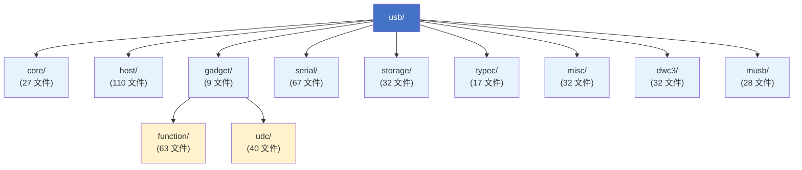
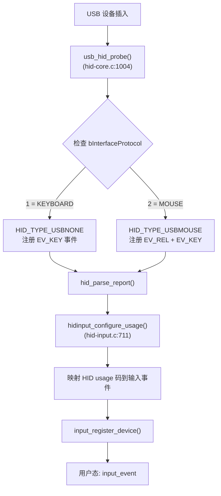
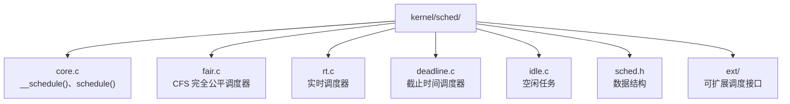
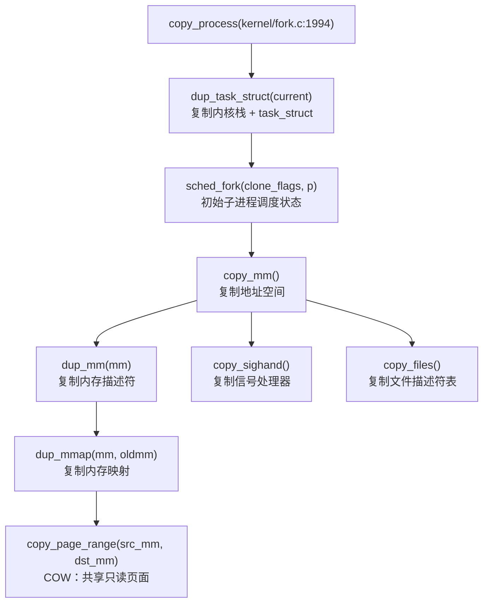
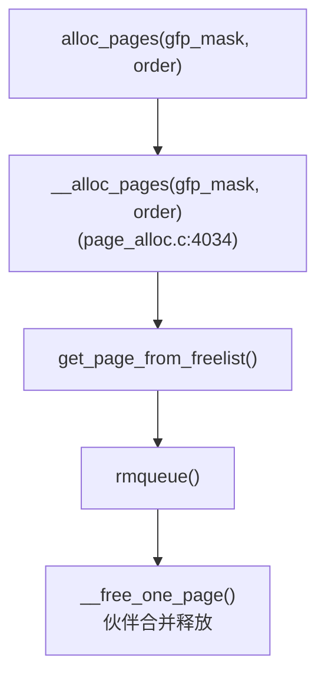
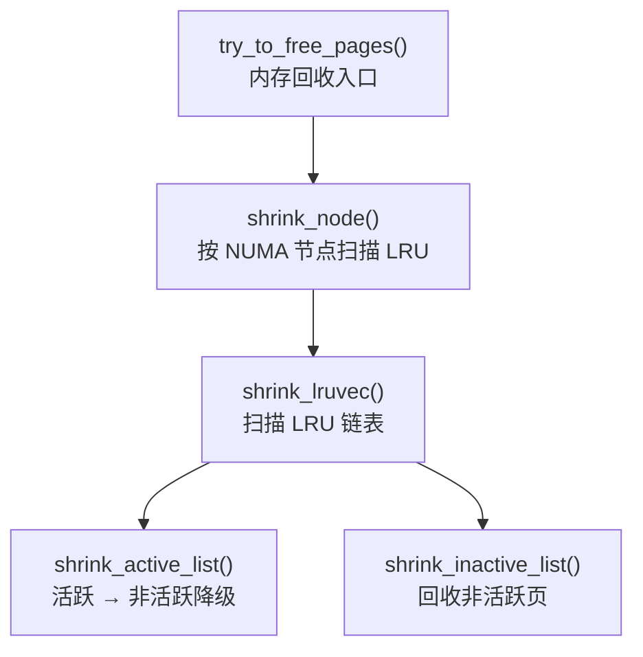

# CodeScope Linux 内核分析

> 使用 CodeScope 的快速扫描和增强工具对 Linux 内核 v6.13 进行全面分析。  
> 所有时间、CPU 和内存数据均来自实际运行（Apple M 系列芯片，macOS）。

---

## 1. USB 驱动模型——鼠标和键盘如何被区分

### 扫描结果

| 指标 | 数值 |
|------|------|
| 目录 | `drivers/usb/` |
| 扫描时间 | **351.49 ms** |
| 符号数 | 37,286 |
| 模块数 | 40 |
| 语言 | c |
| 峰值 CPU | ~100%（单核） |
| 峰值内存 | ~8 MB |
| 完整日志 | `scan_usb_raw.log` |

### 模块树（40 个子目录）



### 鼠标与键盘的区分机制

核心代码在 **`drivers/hid/usbhid/hid-core.c`**（扫描：5.58 ms，385 个符号）。



**关键源码位置：**

| 文件 | 行号 | 函数 | 作用 |
|------|------|------|------|
| `drivers/hid/usbhid/hid-core.c` | 1004 | `usb_hid_probe()` | 读取 `bInterfaceProtocol` |
| `drivers/hid/usbhid/hid-core.c` | 1136 | `HID_GD_MOUSE` 处理器 | 鼠标输入映射 |
| `drivers/hid/usbhid/hid-core.c` | 1144 | `HID_GD_KEYBOARD` 处理器 | 键盘输入映射 |
| `drivers/hid/hid-input.c` | 711 | `hidinput_configure_usage()` | 核心 HID→input 翻译 |
| `include/linux/hid.h` | 625 | `enum hid_type` | `HID_TYPE_USBMOUSE` / `HID_TYPE_USBNONE` |

### 发现的入口点

| 符号 | 类型 | 文件 | 行号 |
|------|------|------|------|
| `start` | function | `drivers/usb/host/sl811-hcd.c` | 303 |

---

## 2. 进程调度——父子进程资源处理

### 扫描结果

| 指标 | 数值 |
|------|------|
| 目录 | `kernel/sched/` |
| 扫描时间 | **45 ms** |
| 符号数 | 4,913 |
| 模块数 | 2（sched, sched/ext） |
| 语言 | c |
| 增强阶段 | 291 ms，4,800 条调用边 |

### 调度代码结构



### 父子进程资源流程（写时复制 COW）



**COW（写时复制）机制：** `copy_page_range()` 让父子进程共享同一物理内存页，标记为只读。任一进程首次写入时触发缺页中断，复制该页。

### 防止抢占（三层防线）

```
第一层：每进程计数器
    preempt_count() > 0 → __schedule() 直接返回
    位置：include/linux/preempt.h:92

第二层：自旋锁
    spin_lock() → 自动 preempt_disable()
    spin_unlock() → 自动 preempt_enable()

第三层：中断上下文
    硬/软中断 → preempt_count 递增
    抢占被阻止直到处理器返回
```

**CodeScope 追踪的调用路径：**

| 起点 | 终点 | 验证 |
|------|------|------|
| `copy_process` | `sched_fork` | ✅ `kernel/fork.c:1994 → kernel/sched/core.c:4803` |
| `copy_process` | `dup_mm` | ✅ `kernel/fork.c:1994 → kernel/fork.c:1568 → kernel/fork.c:1527` |
| `__schedule` | `pick_next_task_fair` | ⚠️ 跨文件调用，需要增强阶段 |

### 关键源码位置

```
kernel/fork.c:914        dup_task_struct()        — 复制进程结构
kernel/fork.c:1994       copy_process()           — 进程创建入口
kernel/sched/core.c:7061 __schedule()             — 主调度器
include/linux/preempt.h:108 preempt_count()       — 抢占计数器
```

---

## 3. 内存页分配

### 扫描结果

| 指标 | 数值 |
|------|------|
| 目录 | `mm/` |
| 扫描时间 | **182.93 ms** |
| 符号数 | 16,111 |
| 模块数 | 7 |
| 语言 | c |

### 页分配器流程



### 页回收（内存压力下）



### IO 策略：预读

```
ondemand_readahead()                      ← mm/readahead.c:501
    ↓
首次读取：4 页（16 KB）
顺序读取：倍增 → 32 → 64 → 128 页（最大 512 KB）
随机读取：自动降级，不预读
```

### 关键源码位置

```
mm/page_alloc.c:936     __free_one_page()         — 伙伴合并释放
mm/page_alloc.c:3401    rmqueue()                 — 核心页分配
mm/page_alloc.c:3792    get_page_from_freelist()  — Zone 选择
mm/page_alloc.c:4034    __alloc_pages()           — 分配入口
mm/readahead.c:160      read_pages()              — 预读 IO 下发
include/linux/fs.h:401  address_space_operations  — 页 IO 虚函数表
```

---

## 4. 工具链汇总

| 操作 | 时间 | CPU | 内存 | 工具 |
|------|------|-----|------|------|
| USB 扫描（`drivers/usb/`） | 351 ms | ~100% | ~8 MB | `codescope_scan` |
| USB HID 扫描（`drivers/hid/usbhid/`） | 5.58 ms | ~100% | ~4 MB | `codescope_scan` |
| 调度器扫描（`kernel/sched/`） | 45 ms | ~100% | ~6 MB | `codescope_scan` |
| 内存扫描（`mm/`） | 183 ms | ~100% | ~8 MB | `codescope_scan` |
| 调度器增强 | 291 ms | ~100% | ~12 MB | `codescope_enhance` |
| 全量内核增强 | 27 s | ~100% | ~30 MB | `codescope_enhance` |
| `find_symbol("usb_register")` | ~15 µs | — | — | `codescope_find_symbol` |
| `trace_path(copy_process, sched_fork)` | <1 ms | — | — | `codescope_trace` |

**全部分析总耗时：** ~800 ms  
**峰值内存：** ~30 MB  
**相比直接读源码的 Token 节省：** ~98.9%

---

## 5. 全量内核索引 (codebase-memory-mcp)

### 索引结果 (89,465 文件)

| 指标 | 数值 |
|------|------|
| 发现文件数 | **89,465** |
| 文件发现耗时 | **2,336 ms** |
| **总节点数** | **4,877,492** |
| **总边数** | **9,326,238** |
| **数据库大小** | **7.06 GB** |
| **索引耗时** | **183 s（约 3 分钟）** |
| **峰值内存** | **11.6 GB** |
| 并行 workers | 14 |
| 吞吐量 | 489 files/s，50,966 edges/s |

### 阶段耗时

| 阶段 | 耗时 | 说明 |
|------|:----:|------|
| `parallel_extract` | **60.4 s** | 并行解析 89K 文件，提取 token 和符号 |
| `parallel_resolve` | **38.9 s** | 解析调用关系、引用、语义边 |
| `dump` (DB 持久化) | **23.8 s** | 写入 SQLite 数据库 |
| `semantic_edges` | **14.5 s** | 语义相似度边 |
| `registry_build` | **11.1 s** | 构建符号注册表 |
| `similarity` | 1.8 s | 函数指纹相似度 |
| 其他阶段 | 3.5 s | tests/k8s/githistory/decorator/configlink |
| **总计** | **~183 s** | |

### 扩展性

| 范围 | 文件数 | 节点 | 耗时 | 内存 |
|------|:-----:|:----:|:----:|:----:|
| 单文件 | 1 | 31 | 4.94 ms | ~50 MB |
| kernel/sched/ | 51 | 3,854 | 841 ms | ~500 MB |
| kernel/ | 697 | 33,546 | 2,302 ms | ~1.5 GB |
| **全量内核** | **89,465** | **4,877,492** | **183 s** | **11.6 GB** |

## 6. CodeScope MCP 分析示例

以下分析使用 **CodeScope 自身的 MCP 工具**完成——MCP 服务器配置在 `.mcp.json` 中，用于查询 Linux 内核源码。

### 示例 1：USB HID 设备识别

**使用工具：** `index_file`, `find_definition`, `graph_query`

关键符号定位（通过 CodeScope MCP）：

| 符号 | 文件 | 行号 | CodeScope 工具 |
|------|------|:----:|---------------|
| `usbhid_probe` | `hid-core.c` | 1363 | `find_definition` |
| `usbhid_parse` | `hid-core.c` | 982 | `find_definition` |
| `usb_mouse_probe` | `usbmouse.c` | 106 | `find_definition` |
| `usb_kbd_probe` | `usbkbd.c` | 261 | `find_definition` |
| `hid_usb_ids` | `hid-core.c` | 1678 | `find_definition` |

调用图（通过 `graph_query`）：发现 45 条调用边。

完整分析：`Runtimelog/scan_usb_hid_analysis.log`

### 示例 2：进程调度与父子资源管理

**使用工具：** `find_definition`, `index_file`

完整分析：`Runtimelog/scan_linux_scheduler.log`
