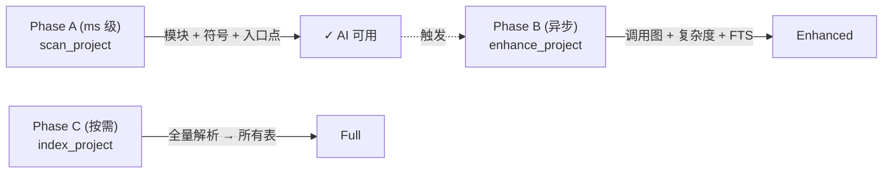

# CodeScope — 完整功能参考

CodeScope 是一个基于 MCP 协议的代码理解服务。它将源代码解析为统一的 AST IR，构建多维代码图（调用图 + 符号引用图），持久化到 SQLite，并通过 MCP 工具暴露强大的查询能力。

---

## 1. 快速启动脚本

### 1.1 索引项目

```bash
# 一行命令：索引项目并查询统计
codescope cli index_project '{"project_path":"/path/to/project"}'
codescope cli get_graph_stats '{}'
```

### 1.2 完整分析流水线

```bash
#!/bin/bash
# analyze.sh — 索引 + 查询管道
set -e
PROJECT=$1
echo "=== 索引 $PROJECT ==="
codescope cli index_project "{\"project_path\":\"$PROJECT\"}"
echo "=== 统计 ==="
codescope cli get_graph_stats '{}'
echo "=== 入口点 ==="
codescope cli get_entry_points '{}'
echo "=== 热点 Top10 ==="
codescope cli get_hotspots '{"top_n":10}'
echo "=== 模块树 ==="
codescope cli get_module_tree '{}'
```

### 1.3 追踪两个函数之间的调用路径

```bash
#!/bin/bash
# trace.sh — 调用路径追踪
codescope cli codescope_trace "{\"from\":\"$1\",\"to\":\"$2\"}"
```

### 1.4 Benchmark 输出 JSON 报告

```bash
CODESCOPE_BENCH_JSON=/tmp/report.json make bench-check
cat /tmp/report.json | python3 -m json.tool
```

### 1.5 Worker 模式（内存隔离）

```bash
# 启动 worker 子进程索引项目，完成后退出
# Worker 退出后 RSS 100% 归还给 OS
codescope worker /tmp/db.sqlite /path/to/project "go" 1
```

### 1.6 对比两次索引结果

```bash
CODESCOPE_BENCH_JSON=/tmp/new.json CODESCOPE_BENCH_COMPARE=/tmp/baseline.json make bench-check
```

---

## 2. 架构概览

```mermaid
graph TB
    subgraph "MCP 客户端"
        Client["Claude Desktop / Cursor<br/>自定义 MCP 客户端"]
    end
    subgraph "Rust MCP Server (codescope)"
        TD["工具调度<br/>(35+ 工具)"]
        TQ["任务队列<br/>(Tokio async)"]
        FFI["FFI (extern \"C\")"]
    end
    subgraph "C++ 核心引擎"
        SC["扫描器<br/>(ms 级)"]
        PA["解析器<br/>(tree-sitter)"]
        GB["图构建器<br/>(调用+引用)"]
        CX["复杂度分析"]
        LS["LSP 客户端"]
        CD["社区检测"]
    end
    subgraph "SQLite (WAL)"
        N["graph_nodes<br/>(节点)"]
        E["graph_edges<br/>(边)"]
        SR["semantic_records<br/>(IR + FTS)"]
    end
    Client -->|JSON-RPC 2.0| TD
    TD --> TQ
    TD --> FFI
    FFI --> SC & PA & GB & CX & CD & LS
    SC --> N
    PA --> GB
    GB --> N & E
    CX --> SR
    CD --> N
    LS --> SR
```

### 数据流：三个阶段



---

## 3. 所有 MCP 工具

### 3.1 项目索引

| 工具 | 用途 | 输入 | 输出 | Token |
|------|------|------|------|-------|
| `index_project` | 全量索引（自动 worker 隔离） | `project_path`, `language_filter` | JSON: 文件数、耗时 | ~50 |
| `index_file` | 索引单个文件 | `file_path` | JSON: 文件结果 | ~30 |
| `index_batch` | 事务内批量索引多文件 | `files` (JSON 数组) | JSON: 批量结果 | ~30 |
| `scan_project` | 快速扫描（ms 级，不全量解析） | `project_path`, `language_filter` | 模块 + 符号 + 入口点 | ~200 |
| `enhance_project` | 后台全量增强（异步） | — | 状态 JSON | ~20 |

### 3.2 符号查询

| 工具 | 用途 | 输入 | 输出 | Token |
|------|------|------|------|-------|
| `find_definition` | 查找符号定义位置 | `symbol_name`, `file_filter` | 文件 + 行/列范围 | ~20 |
| `find_references` | 查找所有引用该符号的位置 | `symbol_name`, `file_filter` | 所有引用位置 | ~30 |
| `find_symbol` | 按名称精确查找符号 | `symbol_name` | id, kind, 文件, 行 | ~30 |
| `locate_code` | 获取符号附近的代码上下文 | `identifier`, `context_lines` | 文件路径 + 源码行 | ~50-300 |
| `get_complexity` | 获取圈复杂度/认知复杂度 | `node_id` | cyclomatic, cognitive, nesting depth | ~20 |

### 3.3 调用图

| 工具 | 用途 | 输入 | 输出 | Token |
|------|------|------|------|-------|
| `find_callers` | 谁调用了这个函数？ | `symbol_name` | 调用者函数 | ~10-50 |
| `find_callees` | 这个函数调用了什么？ | `symbol_name` | 被调用者函数 | ~10-50 |
| `codescope_trace` | 两点间最短调用路径 | `from`, `to` | 完整调用链（文件+行号） | ~50-200 |
| `get_hotspots` | 项目中最热门的函数 | `top_n` | 每个函数的 caller_count + complexity | ~500 |
| `graph_query` | 自定义图模式查询 | `query` (DSL) | 匹配的三元组 | ~50-500 |
| `get_neighbors` | 图节点的邻居节点 | `node_id`, `edge_type`, `radius` | 入边 + 出边邻居 | ~50 |
| `find_shortest_path` | 两节点间最短路径 | `source_node_id`, `target_node_id` | 节点路径 | ~50 |
| `get_subgraph` | 以节点为中心的子图 | `center_node_id`, `radius`, 过滤器 | 节点 + 边 | ~200 |

### 3.4 搜索

| 工具 | 用途 | 输入 | 输出 | Token |
|------|------|------|------|-------|
| `search` | 统一代码搜索（推荐） | `query`, `limit` | FTS + 语义搜索结果 | ~300-1000 |
| `search_code` | 旧版 FTS 搜索（已废弃） | `query`, `limit` | 匹配节点 | ~300-1000 |

### 3.5 项目概览

| 工具 | 用途 | 输入 | 输出 | Token |
|------|------|------|------|-------|
| `get_graph_stats` | 节点/边/文件计数 | — | total_nodes, total_edges, total_files | ~18 |
| `get_project_info` | 许可证、语言、文件数 | — | name, license, language, file_count | ~44 |
| `project_overview` | 项目综合摘要 | — | 语言、模块、入口点、进度 | ~71 |
| `get_module_tree` | 分层模块结构 | — | 模块 id, parent_id, name, path, file_count | ~4 |
| `get_entry_points` | main/init/setup/handler 入口点 | — | symbol id, name, file, line | ~5 |

### 3.6 分析

| 工具 | 用途 | 输入 | 输出 | Token |
|------|------|------|------|-------|
| `get_communities` | 社区检测（Label Propagation） | `max_members`, `max_communities`, `include_members` | 社区 + 成员 + 社区间边 | **1K-200K** ⚠️ |
| `detect_changes` | 文件变更影响分析 | `modified_files` (JSON 数组) | 直接修改 + 调用者 + 被调用者 | ~100-500 |
| `codescope_build_context` | AI 上下文构建（PRIMARY） | `query` | 代码问答上下文 | ~200-1000 |
| `codescope_capabilities` | 功能就绪状态报告 | — | 每个功能的能力状态 | ~309 |

### 3.7 工具

| 工具 | 用途 | 输入 | 输出 | Token |
|------|------|------|------|-------|
| `count_tokens` | Token 估算（DeepSeek 公式） | `text` | tokens, chars (ascii/non-ascii) | ~10 |
| `get_enhancement_status` | 检查异步增强进度 | — | total symbols, callgraph/cfg/embedding 计数 | ~30 |

---

## 4. 工具使用指南

### 4.1 核心查询类

| 工具 | 适用场景 | 不适用场景 | Token 消耗 | 副作用 |
|------|---------|-----------|-----------|--------|
| `get_graph_stats` | 快速了解项目规模 | 不需要具体符号时 | **~18** | 无 |
| `get_project_info` | 查看项目元信息 | 不需要细节时 | **~44** | 无 |
| `get_module_tree` | 了解目录/模块结构 | 结构已经清晰时 | **~4** | 无 |
| `project_overview` | 新项目第一步总览 | 只需要统计数据时 | **~71** | 无 |

### 4.2 调用图查询类

| 工具 | 适用场景 | 不适用场景 | Token 消耗 | 副作用 |
|------|---------|-----------|-----------|--------|
| `find_callers` | 调查函数被谁调用 | **CALLS 边未构建时 caller_count=0** | **~10-50** | 依赖 `buildGraph(true)` |
| `find_callees` | 调查函数调用了什么 | 不需要递归展开时 | **~10-50** | 同上 |
| `get_hotspots` | 找最热门的函数 | 项目 <100 个函数 | **~500** | caller_count=0 说明调用边未构建 |

### 4.3 社区检测 ⚠️

> 通过 Label Propagation 算法将代码图节点按关系紧密程度分组。适用于理解代码模块边界、检测架构违规的场景，但 Token 消耗可能很大。

| 场景 | 推荐用法 | 预期 Token |
|------|---------|-----------|
| **接手 legacy 项目** | `max_communities=20` | ~1K-10K |
| **架构逆向** | `max_members=5, max_communities=50` | ~5K-50K |
| **检测架构违规** | `include_members=true` | ~10K-200K |
| **小型项目 (<500 节点)** | 默认参数 | ~1K |
| **大型项目 (>10K 节点)** | ⚠️ `max_communities=10`, `include_members=false` | ~1K-50K |

**副作用：**
1. **Token 爆炸**：123K 节点项目可达 **200K tokens**
2. **耗时**：全图 Label Propagation 算法数百 ms
3. **信息密度**：`get_module_tree`（4 tok）通常足够；社区检测仅作补充
4. **屏蔽策略**：调低 `max_communities`（10-20），保持 `include_members=false`

### 4.4 选择策略速查

```
新项目      → project_overview (71 tok) + get_module_tree (4 tok)
找入口点    → get_entry_points (5 tok)
查热点      → get_hotspots (500 tok)
搜代码      → search (300-1000 tok)
查调用链    → find_callers / find_callees (10-50 tok)
架构分析    → get_module_tree (4 tok) + 可选 get_communities (1K-200K tok)
变更影响    → detect_changes (100-500 tok)
AI 问答     → codescope_build_context (200-1000 tok)
```

---

## 5. 环境变量

| 变量 | 默认值 | 说明 |
|------|-------|------|
| `CODESCOPE_DB_PATH` | `.codescope/codescope.db` | SQLite 数据库路径 |
| `GRAMMARS_DIR` | `grammars/` | tree-sitter 语法 .so 目录 |
| `CODESCOPE_LSP` | (未设置) | LSP 服务器命令（类型增强） |
| `CODESCOPE_INDEX_MODE` | `normal` | 索引模式: `fast` / `normal` / `deep` |
| `CODESCOPE_VERBOSE` | `1` | 设为 `0` 关闭批量日志 |
| `CODESCOPE_MAX_FILE_SIZE` | `5242880` (5MB) | 最大索引文件大小（字节） |
| `CODESCOPE_MEMORY_BUDGET_MB` | `0` (无限制) | RSS 超限时暂停解析 |
| `CODESCOPE_EXPLAIN` | (未设置) | 启用 SQL EXPLAIN QUERY PLAN 日志 |
| `CODESCOPE_BENCH_JSON` | (未设置) | 将 benchmark 报告写入 JSON |
| `CODESCOPE_BENCH_REPEAT` | `1` | 重复 benchmark N 次 |
| `CODESCOPE_BENCH_COMPARE` | (未设置) | 与基准 JSON 对比 |

## 6. 索引模式

通过 `CODESCOPE_INDEX_MODE` 设置：

| 模式 | FTS | 向量 | TTFA | 适用场景 |
|------|-----|------|------|---------|
| `fast` | ❌ | ❌ | **最快** | 快速回答，最小索引 |
| `normal` | ✅ | ❌ | 正常 | 默认 — 图形 + 搜索 |
| `deep` | ✅ | ✅ | 较慢 | 全量分析（含语义向量） |

## 7. 性能基准

### GoAgent (1,167 个 Go 文件)

| 指标 | CodeScope | codebase-memory-mcp 0.8.1 |
|------|:--------:|:-------------------------:|
| 索引时间 | **3.28s** | 3.94s |
| 图节点 | **263,614** | 24,658 (**10.7x**) |
| 图边 | **245,849** | 124,882 (**2x**) |
| 峰值 RSS | **~372 MB** | — |

### ARES Agent (95 Go 文件)

| 指标 | CodeScope | codebase-memory-mcp |
|------|:--------:|:-------------------:|
| 索引时间 | **0.31s** | 0.55s |
| 图节点 | **24,924** | 2,057 |
| 图边 | **23,184** | 7,025 |

### memscope-rs (238 Rust/C 文件)

| 指标 | 数值 |
|------|:----:|
| 索引时间 | 2.36s |
| 图节点 | 123,270 |
| 图边 | 108,905 |

## 8. Linux 内核性能

Linux 6.14.7 内核（约 60,000 个 .c/.h 文件）测试：

| 指标 | 5 分钟结果 |
|------|:----------:|
| 已索引文件 | **6,173** |
| 数据库大小 | **12 GB** |
| 瓶颈 | 文件发现 + SQLite 写入 |

预估全量索引时间：**40-50 分钟**。

## 9. 构建命令

```bash
make build          # 构建全部（引擎 + 服务器）
make test           # 运行全部测试
make test-engine    # 仅运行引擎测试
make build-grammars # 构建 tree-sitter 语法
make build-server   # 构建 Rust MCP 服务器
make bench-check    # 快速基准测试
make bench-full     # 完整基准测试
```

## 10. 支持的语言

| 语言 | 扩展名 | 解析器 |
|------|--------|--------|
| Python | `.py` | tree-sitter-python |
| Go | `.go` | tree-sitter-go |
| Rust | `.rs` | tree-sitter-rust |
| JavaScript | `.js`, `.mjs` | tree-sitter-javascript |
| TypeScript | `.ts` | tree-sitter-typescript |
| TSX | `.tsx` | tree-sitter-tsx |
| C | `.c`, `.h` | tree-sitter-c |
| C++ | `.cpp`, `.cc`, `.cxx`, `.hpp`, `.hxx` | tree-sitter-cpp |
| Java | `.java` | tree-sitter-java |
| Kotlin | `.kt`, `.kts` | tree-sitter-kotlin |
| Ruby | `.rb` | tree-sitter-ruby |
| Scala | `.scala` | tree-sitter-scala |
| Swift | `.swift` | tree-sitter-swift |
