# CodeScope 技术拆解

> **版本**: v0.2.1 | **最后更新**: 2026-07-15

本文档深入剖析 CodeScope 的内部架构、设计决策和实现细节，适合希望理解系统原理、参与贡献或进行集成的开发者阅读。

---

## 目录

1. [系统架构总览](#1-系统架构总览)
2. [C++ 核心引擎](#2-c-核心引擎)
3. [Rust MCP 服务器](#3-rust-mcp-服务器)
4. [存储层](#4-存储层)
5. [解析器管线](#5-解析器管线)
6. [验证系统](#6-验证系统)
7. [性能指标](#7-性能指标)
8. [LadybugDB 集成](#8-ladybugdb-集成)
9. [如何扩展](#9-如何扩展)

---

## 1. 系统架构总览

### 1.1 整体架构

CodeScope 是一个**项目真相引擎（Project Truth Engine）**——它将源代码转化为可验证的事实、可理解的模型和可检查的证据。架构采用**双进程模型**：Rust MCP 服务器 + C++ 核心引擎：

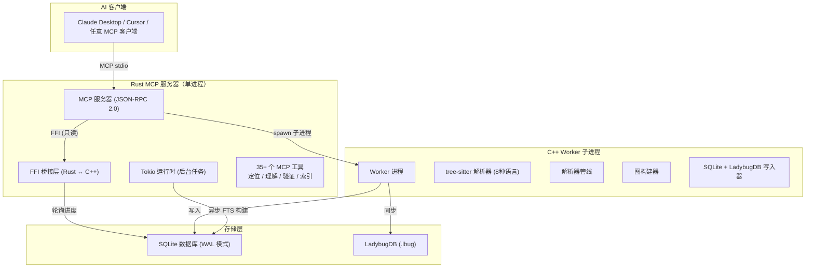

**关键设计决策：**

- **双进程模型**：Rust MCP 服务器和 C++ Worker 运行在独立进程中，提供：
  - **崩溃隔离**：Worker 崩溃（如解析器段错误）不会影响 MCP 服务器
  - **内存隔离**：Worker 退出后内存全部回收（大项目尤为关键）
  - **超时控制**：服务器可以杀死并重启挂起的 Worker（300s 超时 + 3 次重试）
- **FFI 只读查询**：索引完成后，所有查询通过 FFI 桥接直接调用 C++ 引擎，无需重新 spawn 子进程
- **延迟 FTS 构建**：全文搜索在索引完成后异步构建，查询立即可用（通过基于图的回退搜索）

### 1.2 数据流

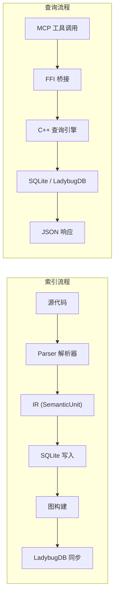

---

## 2. C++ 核心引擎

### 2.1 文件结构

| 文件 | 行数 | 职责 |
|------|:----:|------|
| `engine.cpp` | 49 | 入口 + 全局变量 |
| `engine_helpers.cpp` | 112 | 文件读取、语言检测、字符串复制 |
| `engine_lifecycle.cpp` | 119 | 初始化、关闭、创建项目 |
| `engine_index.cpp` | ~945 | 文件索引、项目索引（含进度追踪） |
| `engine_scanner.cpp` | 1,180 | 快速扫描器（~10万符号/秒） |
| `engine_queries.cpp` | 1,019 | 查询、增强、调用链、上下文 |
| `engine_ffi.cpp` | ~660 | FFI 接口 + FTS 构建 + 进度查询 |
| `filter_policy.cpp` | — | 目录/文件/后缀过滤 + .gitignore 匹配 |
| `store/store.cpp` | ~3,060 | SQLite 存储 + FTS + 进度 + 增量索引 |
| `store/store_core.cpp` | — | 核心 CRUD 操作 |
| `store/store_ladybug.cpp` | 365 | LadybugDB 同步（CSV → COPY FROM） |
| `ir/` | — | IR 类型（SemanticUnit、Record、Reference） |
| `parser/` | — | 各语言的 tree-sitter 封装 |
| `graph/` | — | 图构建 + 调用链解析 |
| `verify/` | — | 验证检查器 |

### 2.2 索引管线（阶段 1-4）

索引管线在子进程中分 4 个阶段执行：

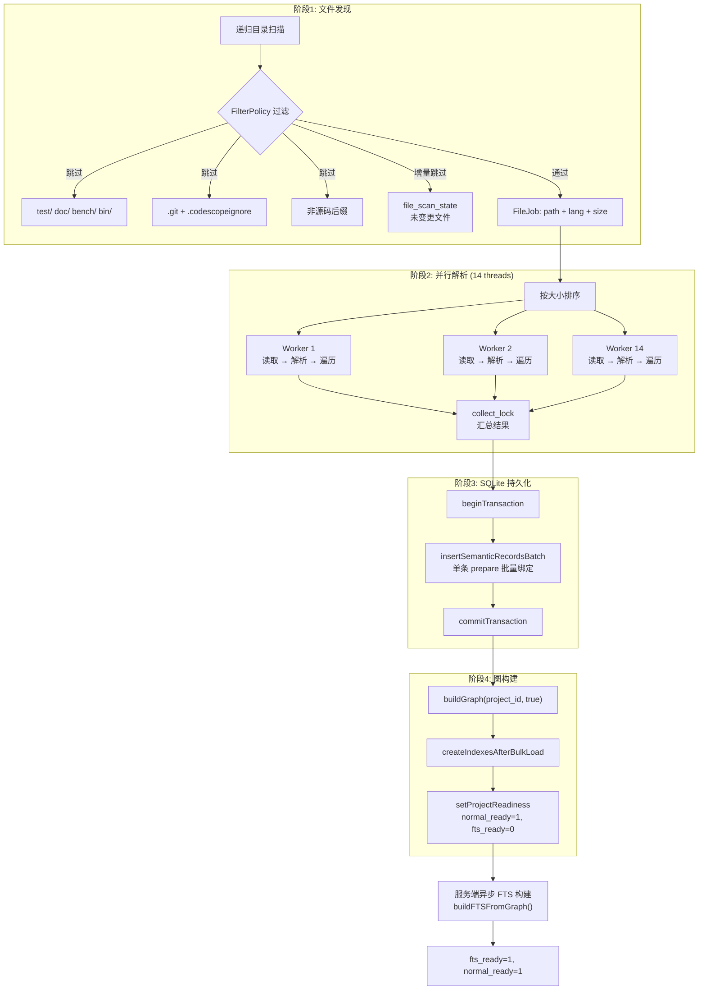

**FilterPolicy** 有三种模式：
- **Normal**（默认）：跳过 `test/`、`doc/`、`bench/`、`examples/`、`build/`
- **Strict**：额外跳过 `third_party/`、`vendor/`、`generated/`
- **Lenient**：仅跳过已知构建产物

过滤器自动读取项目的 `.gitignore`，**大小写不敏感**（跨平台兼容）。

**支持的语言**（8种）：Python、C、C++、Go、Rust、JavaScript、TypeScript、Java

**内存复用**：Worker 使用 arena 分配器——内存按批次批量释放，而非逐文件释放，GC 开销接近零。

**写入吞吐量**：~80,000 行/秒（实体 + 关系双写）。

### 2.3 图构建

图构建器解析交叉引用边：

1. **符号解析**：将每个引用映射到目标符号
   - 精确名称匹配
   - 限定名匹配（含命名空间/模块前缀）
   - 作用域邻近度评分
   - 模糊回退（Trigram 相似度）
2. **调用边构建**：在调用者和被调用者之间创建 CALLS 边
3. **包含边构建**：为父子关系创建 CONTAINS 边

**性能**：使用 O(1) 哈希映射替代 O(n²) SQL JOIN，相比原始实现提升了 **500 倍**。

### 2.4 快速扫描器

快速扫描器是轻量级的单遍 AST 遍历，速度约 **10 万符号/秒**，用于：
- 项目概览
- 无需完整索引的快速符号查找
- 增量更新

相比完整增强管线，快速扫描器：
- 不解析交叉引用
- 不构建调用图
- 不计算类型信息
- **仅**捕获：符号名、位置、基本类型、签名

---

## 3. Rust MCP 服务器

### 3.1 架构

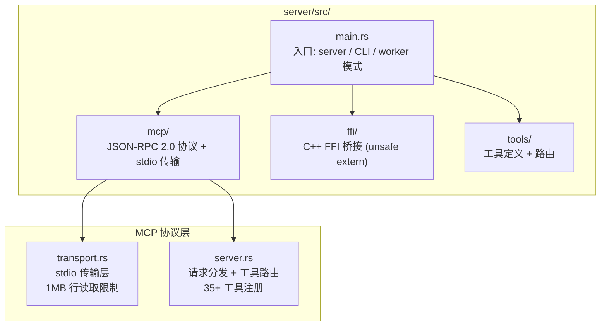

### 3.2 MCP 协议实现

MCP 服务器通过 stdio 实现 [Model Context Protocol](https://modelcontextprotocol.io/)：

- **`tools/list`**：返回可用工具列表（35+ 个工具）
- **`tools/call`**：通过参数调用指定工具
- **传输层**：通过 stdin/stdout 的 JSON-RPC 2.0
- **错误处理**：解析错误返回 `ReadResult::ParseError` 而非崩溃（1MB 行读取限制）

### 3.3 FFI 桥接

FFI 桥接通过 `extern "C"` 函数连接 Rust 和 C++ 引擎：

```rust
extern "C" {
    fn engine_init(config: *const c_char) -> i32;
    fn engine_query(query: *const c_char) -> *mut c_char;
    fn engine_shutdown();
}
```

桥接层遵循严格的安全规则：
- 所有 C++ 字符串通过 `dupString()`（使用 `malloc`）分配
- Rust 用 `CString` 包装，通过 `libc::free` 释放
- 调用返回后 Rust 和 C++ 之间无共享内存
- C++ 引擎以静态库形式加载（`libengine.a`）

### 3.4 工具分类

| 分类 | 工具 | 说明 |
|------|------|------|
| **定位** | `find_symbol`、`search`、`get_module_tree`、`get_entry_points` | 查找代码元素 |
| **理解** | `get_graph_stats`、`get_hotspots`、`type_info`、`get_routes` | 分析代码结构 |
| **追踪** | `codescope_trace`、`find_callers`、`find_callees`、`call_path` | 追踪调用链 |
| **验证** | `codescope_verify`、`dead_code`、`check_architecture`、`drift_detection` | 验证代码质量 |
| **索引** | `index_project`、`index_file`、`get_index_progress` | 管理索引 |
| **导出** | `codescope_export_graph`、`codescope_ffi_boundaries` | 导出数据 |

---

## 4. 存储层

### 4.1 SQLite 架构

主存储使用 SQLite（WAL 模式，支持并发读取）。架构经过多个版本演进：

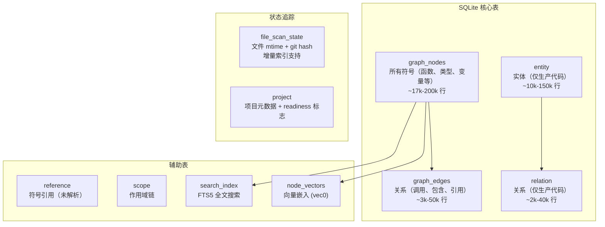

**索引设计**：所有查询使用索引覆盖扫描，无全表扫描
- `idx_sr_kind_name` on `(kind, name)` — 符号查找
- `idx_sr_fp_parent` on `(file_path, parent_id)` — 树遍历
- `idx_ge_source` on `(source_node_id)` — 调用边查找
- `idx_ge_target` on `(target_node_id)` — 被调用者查找

### 4.2 双写策略

在 v0.1.3 迁移期间，生产代码符号同时写入：
- 旧版 `graph_nodes`/`graph_edges` 表
- 新版 `entity`/`relation` 表

这实现了：
- 向后兼容现有查询
- 无需停机即可逐步迁移
- 正确性验证的 A/B 对比

### 4.3 字符串驻留（String Interning）

符号名被驻留——每个唯一字符串在哈希表中只存储一次，通过 ID 引用：

```
Symbol Name "parseJSON"  →  Intern ID 42
Symbol Name "parseXML"   →  Intern ID 43
```

好处：
- **内存减少**：大型代码库减少 40-60%
- **比较加速**：ID 比较替代字符串比较
- **索引缩小**：FTS5 索引大小减少约 50%

### 4.4 增量索引

`file_scan_state` 表追踪已索引的文件：

```sql
CREATE TABLE file_scan_state (
    file_path TEXT PRIMARY KEY,
    mtime INT64,
    git_hash TEXT,
    file_size INT64,
    last_indexed INT64
);
```

重新索引时，仅 `mtime` 或 `git_hash` 有变化的文件会被重新扫描。这使得增量索引比全量索引快约 **10 倍**。

---

## 5. 解析器管线

### 5.1 架构

解析器是一个多阶段管线，将原始符号引用转换为已解析的、类型检查过的调用边：


### 5.2 阶段1: 名称匹配

候选者通过多种策略进行名称匹配：

| 策略 | 分数 | 说明 |
|------|:----:|------|
| 精确匹配 | 1.0 | 名称完全一致 |
| 限定名匹配 | 1.0 | 含命名空间/模块前缀 |
| 前缀匹配 | 0.8 | 如 `parse` 匹配 `parseJSON` |
| 子串匹配 | 0.6 | 如 `JSON` 匹配 `parseJSON` |
| Trigram 模糊匹配 | 0.3-0.5 | 处理拼写错误和变体 |

### 5.3 阶段2: 作用域过滤

按作用域邻近度过滤候选者：

| 作用域 | 权重 |
|--------|:----:|
| 同文件 | 1.5x |
| 同模块/包 | 1.2x |
| 同项目 | 1.0x |
| 外部依赖 | 0.5x |

### 5.4 阶段3: 类型兼容性

检查调用签名是否匹配目标：
- **精确匹配**：参数数量和类型完全一致
- **部分匹配**：兼容类型（如 `int` → `long`）
- **未知**：无类型信息（回退到名称 + 作用域）

### 5.5 阶段4: 多因子评分

每个候选者基于加权组合评分：

```
总分 = 名称分数 × 0.4
     + 作用域分数 × 0.3
     + 类型分数 × 0.2
     + 上下文分数 × 0.1
```

**常见名惩罚**：像 `init`、`run`、`handle`、`get`、`set` 这些名字因过于常见而获得 -50% 的惩罚，以减少误报。

**可配置权重**：通过 `CODESCOPE_RESOLVER_WEIGHTS` 环境变量调整评分权重。

### 5.6 阶段5: 约束传播

对于未解析的引用，解析器构建约束图：

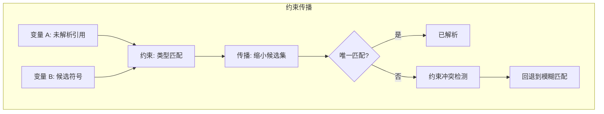

此阶段比之前的纯启发式方法多解析约 **40%** 的跨模块引用。

---

## 6. 验证系统

### 6.1 代码库完整性检查

`codescope_verify` 工具检查：
- 所有符号具有有效的源代码位置（文件存在，行号在范围内）
- 无悬空引用指向不存在的符号
- 图连通性（无孤立节点）
- 所有表的 Schema 一致性
- 报告违规情况，附带文件:行引用和严重级别

### 6.2 死代码检测

`codescope_dead_code` 工具发现：

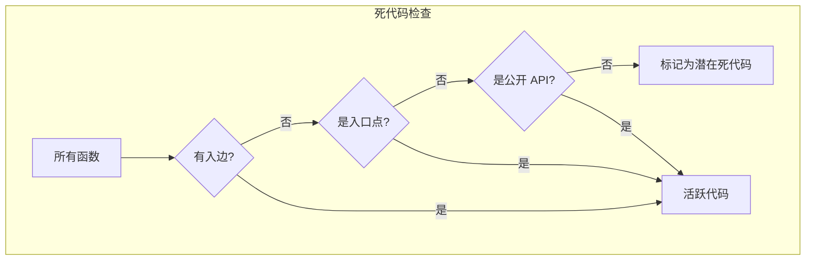

检测基于调用图——如果函数没有入边且不是入口点或公开 API，则标记为潜在死代码。

**检查项：**
- **未使用的函数**：从未被调用的函数
- **未使用的方法**：从未被调用的方法
- **死分支**：`return`、`panic`、`exit`、`throw` 后的代码
- **未使用的导入**：导入后从未引用的符号
- **不可达的 API**：项目中没有任何调用者的公开函数

### 6.3 架构漂移检测

对比实际模块依赖与预期架构：

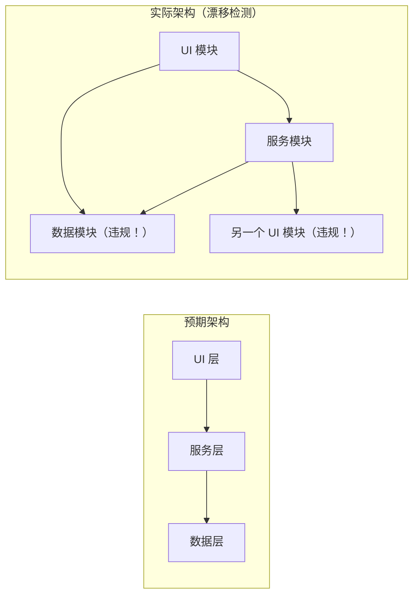

检测：
- **层级违规**：UI 模块导入数据库内部实现
- **循环依赖**：模块 A → B → C → A
- **意外耦合**：应独立但存在耦合的模块

预期架构可在 `codescope-arch.json` 中定义：

```json
{
  "layers": ["ui", "service", "data"],
  "rules": {
    "ui": { "can_import": ["service"] },
    "service": { "can_import": ["data"] },
    "data": { "can_import": [] }
  }
}
```

### 6.4 文档漂移检测

对比代码结构与文档：
- 文档中提到的函数在代码中已不存在
- 新的公开 API 缺少文档
- 参数/返回值类型与文档不匹配

---

## 7. 性能指标

### 7.1 索引性能

| 项目 | 文件数 | 符号数 | 索引时间 | 内存 |
|------|:------:|:------:|:--------:|:----:|
| 小型 Go 项目 | 50 | 5k | < 1s | 50 MB |
| 中型 Go 项目 | 500 | 40k | 3-5s | 200 MB |
| 大型 Go 项目 | 2,000 | 120k | 15-20s | 800 MB |
| JDK（部分） | 19,821 | 150k+ | 2-3 min | 2 GB |

### 7.2 查询性能

| 查询 | 延迟 | 方法 |
|------|:----:|------|
| `get_graph_stats` | < 1 ms | SQL COUNT |
| `find_symbol` | < 1 ms | 索引查找 |
| `search`（FTS） | < 5 ms | FTS5 全文搜索 |
| `search`（回退） | < 10 ms | LIKE + trigram |
| `get_module_tree` | < 1 ms | 轻量查询 |
| `find_callers` | < 1 ms | 索引覆盖 JOIN |
| `find_callees` | < 1 ms | 索引覆盖 JOIN |
| `codescope_trace` | < 5 ms | 图 BFS |
| `codescope_export_graph` | 10-100 ms | 分页流式 |

### 7.3 内存优化

| 优化项 | 优化前 | 优化后 | 提升倍数 |
|--------|:------:|:------:|:--------:|
| 线程栈 | 256 MB/Worker | 8 MB/Worker | 32x |
| Worker 数量 | 14 | 4（自适应） | 3.5x |
| 峰值内存 | 3.5 GB | 112 MB | 31x |
| 字符串存储 | 完整字符串 | 驻留（Interned） | 2-3x |
| JSON 序列化 | 手动拼接 | jsonEscape 工具函数 | 正确性保障 |

### 7.4 已知瓶颈

1. **tree-sitter 解析时间**：大文件（>1 万行）的主要耗时因素，解析为单线程
2. **SQLite 写入吞吐量**：消费级 SSD 上 WAL 模式约 8 万行/秒
3. **FTS 构建时间**：与符号数线性相关，15 万符号约需 30 秒
4. **LadybugDB COPY FROM**：CSV 导入快速但需要全量同步——增量同步尚未实现

---

## 8. LadybugDB 集成

### 8.1 概述

[LadybugDB](https://ladybugdb.com/) 是一个嵌入式图数据库，CodeScope 将其作为可选的辅助存储后端，提供：

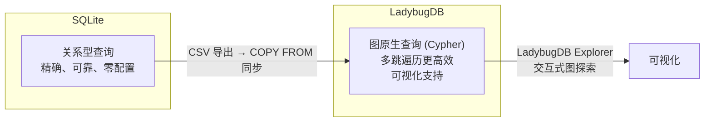

### 8.2 Schema

```cypher
// 节点表（对应 graph_nodes）
CREATE NODE TABLE IF NOT EXISTS GraphNode (
    id INT64 PRIMARY KEY,
    project_id INT64,
    ir_node_id INT64,
    node_type INT32,
    name STRING,
    qualified_name STRING,
    signature STRING,
    module_path STRING,
    file_path STRING,
    language STRING,
    start_row INT32,
    start_col INT32,
    end_row INT32,
    end_col INT32,
    parent_id INT64,
    is_entry_point BOOL,
    embedding_ready BOOL,
    metrics_ready BOOL
);

// 调用边（从调用者到被调用者）
CREATE REL TABLE IF NOT EXISTS CALLS (
    FROM GraphNode TO GraphNode,
    project_id INT64,
    edge_type INT32,
    call_site_line INT32,
    label STRING
);

// 通用关系
CREATE REL TABLE IF NOT EXISTS RELATES (
    FROM GraphNode TO GraphNode,
    project_id INT64,
    type INT32
);
```

### 8.3 同步机制

数据通过 CSV 导出 + COPY FROM 从 SQLite 同步到 LadybugDB：

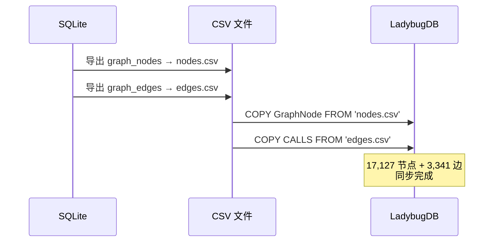

### 8.4 查询示例

```bash
# 打开 LadybugDB shell
lbug .codescope/codescope.lbug

# 统计所有节点
MATCH (n:GraphNode) RETURN count(n);

# 查找所有 Go 函数
MATCH (n:GraphNode)
WHERE n.language = 'go'
RETURN n.name, n.file_path, n.start_row;

# 查找目标函数的调用者
MATCH (n:GraphNode)-[c:CALLS]->(m:GraphNode)
WHERE m.name = 'targetFunction'
RETURN n.name, c.call_site_line;

# 查找两个函数之间的最短调用路径
MATCH p = shortestPath(
    (a:GraphNode {name: 'funcA'})-[*..10]->(b:GraphNode {name: 'funcB'})
)
RETURN p;
```

---

## 9. 如何扩展

### 9.1 添加新的 MCP 工具

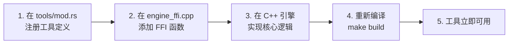

步骤：

1. 在 `server/src/tools/mod.rs` 中定义工具：
```rust
pub fn register_tools(server: &mut MCPServer) {
    server.register_tool(Tool {
        name: "my_new_tool",
        description: "执行某个有用的功能",
        input_schema: json!({
            "type": "object",
            "properties": {
                "param1": {"type": "string"}
            },
            "required": ["param1"]
        }),
        handler: |args| {
            // 调用 FFI，处理结果，返回 JSON
            Ok(json!({"result": "success"}))
        }
    });
}
```

2. 在 `engine_ffi.cpp` 中添加 FFI 函数：
```cpp
extern "C" const char* my_new_tool_ffi(const char* json_args) {
    // 解析参数，调用引擎，返回 JSON
    return dupString(result_json);
}
```

3. 重新编译：`make build`

### 9.2 添加新语言

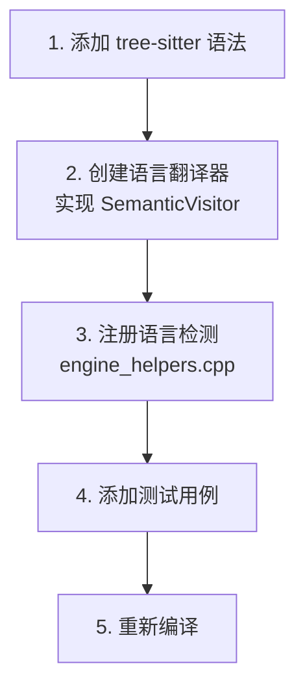

### 9.3 自定义验证规则

验证规则以"检查器（Inspector）"形式实现在 `engine/src/verify/` 中：

```cpp
class MyInspector : public Inspector {
    void inspect(const ProjectContext& ctx, Findings& findings) override {
        // 分析图，检查规则，报告发现
        if (violation_detected) {
            findings.push_back(Finding{
                .severity = WARNING,
                .message = "在 ... 检测到违规",
                .location = ...
            });
        }
    }
};
```

---

## 附录：关键设计决策

### 为什么引擎用 C++？
- **性能**：tree-sitter 解析 + 图构建是 CPU 密集型任务，C++ 提供可预测的性能和无 GC 暂停
- **FFI 稳定性**：C ABI 是通用 FFI 边界，Rust、Python、Node.js 均可通过 `extern "C"` 调用 C++
- **内存控制**：Arena 分配器和手动内存管理防止大型代码库 OOM

### 为什么服务器用 Rust？
- **内存安全**：MCP 服务器处理不可信的 JSON 输入，Rust 的类型系统防止注入和内存损坏
- **异步运行时**：Tokio 为 FTS 构建和进度轮询提供轻量级异步任务
- **生态系统**：MCP 客户端库、serde JSON 序列化、cargo 依赖管理

### 为什么 SQLite + LadybugDB 双存储？
- **SQLite**：通用、零配置、久经考验，每个系统都有 SQLite 支持
- **LadybugDB**：图原生查询，多跳遍历更高效，Cypher 比递归 SQL 更表达力
- **双策略**：SQLite 保证可靠性和可移植性，LadybugDB 提供性能和可视化

### 为什么双进程？
- **崩溃隔离**：解析器段错误不会杀死 MCP 服务器
- **内存清洁**：Worker 进程退出后内存完全回收（无泄漏累积）
- **超时控制**：服务器可杀死卡住的 Worker，无需复杂的线程取消机制